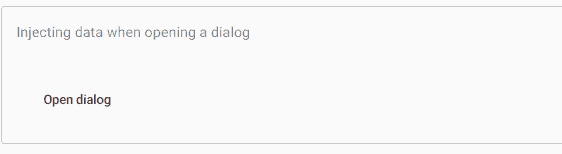
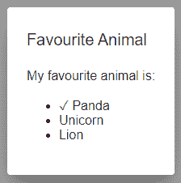
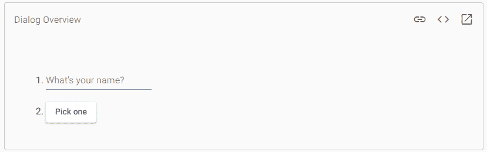

# AngularMaterial对话框

> 原文：<https://www.javatpoint.com/angular-material-dialog>

**MatDialog** 服务用于打开包含内容设计、样式和动画的对话框。MatDialogRef 提供了一个打开对话框的句柄。

```

let dialogRef = dialog.open(UserProfileComponent, {
  height: '400px',
  width: '600px',
});

```

它用于关闭对话框并接收关闭对话框的通知。对话结束后，任何通知观察站都将完成。

```

dialogRef.afterClosed().subscribe(result => {
  console.log(`Dialog result: ${result}`); // Pizza!
});

dialogRef.close('Pizza!');

```

由 MatDialog 创建的组件可以注入 MatDialogRef 并关闭包含它们的对话框。关闭时可以提供一个可选的结果值。结果被转发作为进一步的观察。

```

@Component({/* ... */})
export class YourDialog {
  constructor(public dialogRef: MatDialogRef) { }
  closeDialog() {
    this.dialogRef.close('Pizza!');
  }
} 
```

## 通过入口组件配置对话内容

MatDialog 在运行时安装组件，但是 Angular 编译器需要额外的信息来创建您的对话框组件所需的组件。

要将任何组件加载到对话框中，您应该将组件类包含在计算机列表中的**模块**定义中。因此，Angular 编译器知道如何为 NgModule 创建一个组件。

```

@NgModule({
  imports: [
// ...
    MatDialogModule
  ],
  declarations: [
    AppComponent,
    ExampleDialogComponent
  ],
  entryComponents: [
    ExampleDialogComponent
  ],
  bootstrap: [AppComponent]
})
export class AppModule {}

```

## 指定全局配置默认值

通过为根模块中的**mat _ dialog _ default _ options**提供一个 **MatDialogConfig** 实例来指定默认对话框选项。

```

@NgModule({
  providers: [
    {provide: MAT_DIALOG_DEFAULT_OPTIONS, useValue: {hasBackdrop: false}}
  ]
})

```

如果您使用的是模板对话框( **TemplateRef** )，模板中的数据将可用:

```

<ng-template let-data>
  Hello, {{data.name}}
</ng-template>

```

**app.component.html**

```

<buttonmat-button (click)="openDialog()">Open dialog</button>

```

**app.component.ts**

```

import {Component, Inject} from'@angular/core';
import {MatDialog, MAT_DIALOG_DATA} from'@angular/material/dialog';
exportinterface DialogData {
animal: 'panda' | 'unicorn' | 'lion';
}
/**
 * @title Injecting data when opening a dialog
 */
@Component({
selector: 'dialog-data-example',
templateUrl: 'dialog-data-example.html',
})
exportclassDialogDataExample{
constructor(public dialog: MatDialog) {}

openDialog() {
this.dialog.open(DialogDataExampleDialog, {
data: {
animal: 'panda'
      }
    });
  }
}

@Component({
selector: 'dialog-data-example-dialog',
templateUrl: 'dialog-data-example-dialog.html',
})
exportclassDialogDataExampleDialog{
constructor(@Inject(MAT_DIALOG_DATA) public data: DialogData) {}
}

```

**dialog-data-example-dialog.html**

```

<h1mat-dialog-title>Favourite Animal</h1>
<divmat-dialog-content>
  My favourite animal is:
<ul>
<li>
<span *ngIf="data.animal === 'panda'">?</span> Panda
</li>
<li>
<span *ngIf="data.animal === 'unicorn'">?</span> Unicorn
</li>
<li>
<span *ngIf="data.animal === 'lion'">?</span> Lion
</li>
</ul>
</div>

```

**输出:**



当我们单击打开对话框按钮时，它会显示以下对话框。



### 对话内容

一些指令可用于简化对话框内容:

| 名字 | 描述 |
| <mat-dialog-title></mat-dialog-title> | 对话框标题应用于标题元素(例如

# 、

## )

 |
| <mat-dialog-content></mat-dialog-content> | 它是对话框的主要可滚动内容。 |
| <mat-dialog-actions></mat-dialog-actions> | 对话框底部操作按钮的容器。 |

例如:

```

<h2 mat-dialog-title>Delete all elements?</h2>
<mat-dialog-content>It will delete all elements that are on the page and cannot be undone.</mat-dialog-content>
<mat-dialog-actions>
<button mat-button mat-dialog-close>Cancel</button>
<!-- The mat-dialog-close directive accepts a value as a result for the dialog.>
<button mat-button [mat-dialog-close]="true">Delete</button>
</mat-dialog-actions>

```

一旦对话框打开，对话框的焦点就在表格元素上。我们可以用 tab 索引属性控制元素。

```

<button mat-button tabindex="-1">Not Tabbable</button>

```

### 易接近

默认情况下，每个对话框在父元素上都有一个角色=“dialog”。打开时，可以通过 MatDialogConfig 将角色更改为 alertdialog。

aria-label、aria-label by 和 aria 所描述的属性都可以通过 **MatDialogConfig** 设置到对话框元素中。每个对话框都是通过**咏叹调**设置的标签。

内容对话框使用焦点陷阱来防止用户跳转到背景元素。一旦对话框关闭，它将在对话框打开之前聚焦在焦点元素上。

### 焦点管理

对话框中的第一个表格元素将在打开时获得焦点。在对话框元素中的跳转将集中在对话框元素上，当跳转到达序列的末尾时，返回到第一个管状元素。

### 焦点恢复

对话侧重于对话开始时的要点。预居中元素不在 **DOM** 中，如**菜单项**。在 **MatDialogRef** 上观察后，您可以手动关注订阅。

```

const dialogRef = this.dialog.open(DialogFromMenuExampleDialog, {restoreFocus: false});
dialogRef.afterClosed().subscribe(() => this.menuTrigger.focus());

```

## 键盘交互

默认情况下，按下退出键将关闭对话框。当这种行为可以通过禁用选项关闭时，用户通常应该避免这样做，因为它破坏了屏幕阅读器用户的预期交互模式。我们来看一个例子。

**app.component.html**

```

<ol>
<li>
<mat-form-field>
<mat-label>What's your name?</mat-label>
<inputmatInput [(ngModel)]="name">
</mat-form-field>
</li>
<li>
<buttonmat-raised-button (click)="openDialog()">Pick one</button>
</li>
<li *ngIf="animal">
    You chose: <i>{{animal}}</i>
</li>
</ol>

```

**app.component.ts**

```

import {Component, Inject} from'@angular/core';
import {MatDialog, MatDialogRef, MAT_DIALOG_DATA} from'@angular/material/dialog';

exportinterface DialogData {
animal: string;
  name: string;
}

/**
 * @title Dialog Overview
 */
@Component({
selector: 'dialog-overview-example',
templateUrl: 'dialog-overview-example.html',
})
exportclassDialogOverviewExample{

animal: string;
  name: string;

constructor(public dialog: MatDialog) {}

  openDialog(): void {
const dialogRef = this.dialog.open(DialogOverviewExampleDialog, {
width: '250px',
data: {name: this.name, animal: this.animal}
    });

    dialogRef.afterClosed().subscribe(result => {
console.log('The dialog was closed');
this.animal = result;
    });
  }

}

@Component({
selector: 'dialog-overview-example-dialog',
templateUrl: 'dialog-overview-example-dialog.html',
})
exportclassDialogOverviewExampleDialog{

constructor(
public dialogRef: MatDialogRef,
@Inject(MAT_DIALOG_DATA) public data: DialogData) {}

  onNoClick(): void {
this.dialogRef.close();
  }

} 
```

**dialog-overview-example-dialog.html**

```

<h1mat-dialog-title>Hi {{data.name}}</h1>
<divmat-dialog-content>
<p>What's your favorite animal?</p>
<mat-form-field>
<mat-label>Favorite Animal</mat-label>
<inputmatInput [(ngModel)]="data.animal">
</mat-form-field>
</div>
<divmat-dialog-actions>
<buttonmat-button (click)="onNoClick()">No Thanks</button>
<buttonmat-button [mat-dialog-close]="data.animal"cdkFocusInitial>Ok</button>
</div>

```

**输出:**



* * *