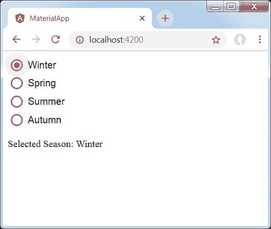

# AngularMaterial单选按钮

> 原文：<https://www.javatpoint.com/angular-material-radio-button>

< **mat-radiobutton** >用于< **输入 type="radio"** >以增强基于Material设计的造型。它提供了与 **<相同的功能，输入类型为【无线电】>**[AngularMaterial](https://www.javatpoint.com/angular-material)设计**造型**和**动画**。

## 单选按钮标签

单选按钮标签作为<mat-radiobutton>元素的内容提供。如果不希望标签出现在单选按钮旁边，可以使用区域标签来指定适当的标签。</mat-radiobutton>

## 无线电小组

单选按钮应该放在<mat-radio-group>内，除非 **DOM** 结构使得这不可能实现(例如，表格单元格内的单选按钮)。单选按钮组中的不同单选按钮将继承组名。</mat-radio-group>

**与@angular/forms 一起使用**

<mat-radio-group>兼容 **@angular/forms** ，支持 **ReactiveFormsModule** 。</mat-radio-group>

**可达性**

<mat-radio-button>使用内部<input type="radio">提供无障碍体验。该内部单选按钮接收焦点，并自动标记为<mat-radio-button>元素的文本内容。</mat-radio-button></mat-radio-button>

单选按钮组必须通过区域标签或区域标签栏被赋予一个有意义的标签。

**默认颜色配置**

单选按钮的默认颜色通过使用**MAT _ RAdio _ DEFAULT _ OPTIONS**提供程序进行全局配置。

```

providers: [{
    provide: MAT_RADIO_DEFAULT_OPTIONS,
    useValue: { color: 'accent' },
}]

```

### 示例:1

**app.component.html**

```

<mat-radio-group aria-label="Select an option">
  <mat-radio-button value="1">Option 1</mat-radio-button>
  <mat-radio-button value="2">Option 2</mat-radio-button>
</mat-radio-group>

```

**app.component.ts**

```

import {Component} from '@angular/core';
/**
 * @title Basic radios
 */
@Component({
  selector: 'radio-overview-example',
  templateUrl: 'radio-overview-example.html',
  styleUrls: ['radio-overview-example.css'],
})
export class RadioOverviewExample {}

```

**app.component.css**

```

.mat-radio-button ~ .mat-radio-button {
  margin-left: 16px;
}

```

**输出:**


如果出现同名单选按钮，则一次只能选择一个。

### 例 2:

**app.module.ts**

```

import { AppComponent } from 'app.component';
import {FormsModule, ReactiveFormsModule} from '@angular/forms';
import {BrowserAnimationsModule} from '@angular/platform-browser/animations';
import {MatRadioModule} from '@angular/material'
import { BrowserModule } from '@angular/platform-browser';
import { NgModule } from '@angular/core';
@NgModule({
   declarations: [
      AppComponent
   ],
   imports: [
      BrowserModule,
      BrowserAnimationsModule,
      MatRadioModule,
      FormsModule,
      ReactiveFormsModule
   ],
   providers: [],
   bootstrap: [AppComponent]
})
export class AppModule { }

```

下面是修改后的 **CSS** 文件 **app.component.css** 。

```

.tp-radio-group {
   display: inline-flex;
   flex-direction: column;
}
.tp-radio-button {
   margin: 5px;
}
.tp-selected-value {
   margin: 15px 0;
}

```

**app.component.ts**

```

import { Validators } from "@angular/forms";
import { FormControl } from "@angular/forms";
import { Component } from '@angular/core';
@Component({
   selector: 'app-root',
   templateUrl: './app.component.html',
   styleUrls: ['./app.component.css']
})
export class AppComponent {
   title = 'materialApp'; 
   favoriteSeason: string;
   seasons: string[] = ['Winter', 'Spring', 'Summer', 'Autumn'];
}

```

**app.component.ts**

```

import { Validators } from "@angular/forms";
import { FormControl } from "@angular/forms";
import { Component } from '@angular/core';
@Component({
   selector: 'app-root',
   templateUrl: './app.component.html',
   styleUrls: ['./app.component.css']
})
export class AppComponent {
   title = 'materialApp'; 
   favoriteSeason: string;
   seasons: string[] = ['Winter', 'Spring', 'Summer', 'Autumn'];
}

```

下面是 HTML 主机文件**app.component.html**。

```

<mat-radio-group class = "tp-radio-group" [(ngModel)] = "favoriteSeason">
   <mat-radio-button class = "tp-radio-button"
      *ngFor = "let season of seasons" [value] = "season">
      {{season}}
   </mat-radio-button>
</mat-radio-group>
<div class = "tp-selected-value">
   Selected Season: {{favoriteSeason}}
</div>

```

**输出:**



**说明:**

首先，我们使用与**模型**绑定的 **mat-radio-group** 创建了一个单选按钮组。然后，我们使用**垫单选按钮**添加了单选按钮。

* * *