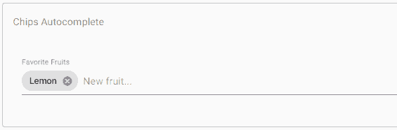

# 角状Material碎片

> 原文：<https://www.javatpoint.com/angular-material-chips>

md-chips 是一种Angular指令，用作称为芯片的特殊组件。它用于表示一小组信息，例如联系人、标签等。自定义模板可用于呈现芯片的内容。这可以通过将包含自定义内容的 md-chip-template 元素指定为 md-chip 来实现。<mat-chip-list>显示单个、键盘可访问的芯片值列表。</mat-chip-list>

```
<mat-chip-list aria-label="Fish selection">
  <mat-chip>One fish</mat-chip>
  <mat-chip>Two fish</mat-chip>
  <mat-chip color="primary" selected>Primary fish</mat-chip>
  <mat-chip color="accent" selected>Accent fish</mat-chip>
</mat-chip-list>

```

### 未定型的芯片

默认情况下，内容设计风格在<mat-chip>中实现。对于任何风格的芯片，不要使用<mat-basic-chip>。我们可以通过实现 CSS 来优化芯片外观。</mat-basic-chip></mat-chip>

<mat-basic-chip>除了 mat-chip 类外，还获取 mat-basic-chip CSS 类。</mat-basic-chip>

### 选择

通过所选属性选择芯片。通过选择<mat-chip-list>上的选择，可以将其禁用。</mat-chip-list>

每当选择的状态改变时，通过事件(选择改变)发出 chipselectionchange。

### 禁用的芯片

通过在芯片上实现禁用属性，将禁用单个芯片。禁用时，芯片既不可选也不明显。

### 芯片输入

MatChipInput 指令将与芯片列表一起使用，以简化两个组件之间的交互。该指令在<mat-form-field>内将芯片特定行为添加到输入元素，以添加和移除芯片。带匹配输入的<input>将被放置在芯片列表元素的内部或外部。</mat-form-field>

芯片列表元素中的芯片输入示例。

app.component.html

```
<mat-form-field class="example-chip-list">
  <mat-label>Favorite Fruits</mat-label>
  <mat-chip-list #chipList aria-label="Fruit selection">
    <mat-chip *ngFor="let fruit of fruits" [selectable]="selectable"
             [removable]="removable" (removed)="remove(fruit)">
      {{fruit.name}}
      <mat-icon matChipRemove *ngIf="removable">cancel</mat-icon>
    </mat-chip>
    <input placeholder="New fruit..."
           [matChipInputFor]="chipList"
           [matChipInputSeparatorKeyCodes]="separatorKeysCodes"
           [matChipInputAddOnBlur]="addOnBlur"
           (matChipInputTokenEnd)="add($event)">
  </mat-chip-list>
</mat-form-field>

```

**app.component.ts**

```
import {COMMA, ENTER} from '@angular/cdk/keycodes';
import {Component} from '@angular/core';
import {MatChipInputEvent} from '@angular/material/chips';
export interface Fruit {
  name: string;
}
/**
 * @title Chips with input
 */
@Component({
  selector: 'chips-input-example',
  templateUrl: 'chips-input-example.html',
  styleUrls: ['chips-input-example.css'],
})
export class ChipsInputExample {
  visible = true;
  selectable = true;
  removable = true;
  addOnBlur = true;
  readonly separatorKeysCodes: number[] = [ENTER, COMMA];
  fruits: Fruit[] = [
    {name: 'Lemon'},
    {name: 'Lime'},
    {name: 'Apple'},
  ];
  add(event: MatChipInputEvent): void {
    const input = event.input;
    const value = event.value;
    // Add our fruit
    if ((value || '').trim()) {
      this.fruits.push({name: value.trim()});
    }
    // Reset the input value
    if (input) {
      input.value = '';
    }
  }
  remove(fruit: Fruit): void {
    const index = this.fruits.indexOf(fruit);

    if (index >= 0) {
      this.fruits.splice(index, 1);
    }
  }
}

```

**app.component.css**

```
.example-chip-list {
  width: 100%;
}

```

**输出:**


放置在芯片列表元素之外的芯片输入示例。

```
<mat-form-field>
  <mat-chip-list #chipList>
    <mat-chip>Chip 1</mat-chip>
    <mat-chip>Chip 2</mat-chip>
  </mat-chip-list>
  <input [matChipInputFor]="chipList">
</mat-form-field>

```

芯片输入的一个例子，自动完成放在芯片列表元素中。

**app.component.html**

```
mport {COMMA, ENTER} from '@angular/cdk/keycodes';
import {Component, ElementRef, ViewChild} from '@angular/core';
import {FormControl} from '@angular/forms';
import {MatAutocompleteSelectedEvent, MatAutocomplete} from '@angular/material/autocomplete';
import {MatChipInputEvent} from '@angular/material/chips';
import {Observable} from 'rxjs';
import {map, startWith} from 'rxjs/operators';
/**
 * @title Chips Autocomplete
 */
@Component({
  selector: 'chips-autocomplete-example',
  templateUrl: 'chips-autocomplete-example.html',
  styleUrls: ['chips-autocomplete-example.css'],
})
export class ChipsAutocompleteExample {
  visible = true;
  selectable = true;
  removable = true;
  separatorKeysCodes: number[] = [ENTER, COMMA];
  fruitCtrl = new FormControl();
  filteredFruits: Observable;
  fruits: string[] = ['Lemon'];
  allFruits: string[] = ['Apple', 'Lemon', 'Lime', 'Orange', 'Strawberry'];
  @ViewChild('fruitInput') fruitInput: ElementRef<htmlinputelement>;
  @ViewChild('auto') matAutocomplete: MatAutocomplete;
  constructor() {
    this.filteredFruits = this.fruitCtrl.valueChanges.pipe(
        startWith(null),
        map((fruit: string | null) => fruit ? this._filter(fruit) : this.allFruits.slice()));
  }
  add(event: MatChipInputEvent): void {
    const input = event.input;
    const value = event.value;
    // Add our fruit
    if ((value || '').trim()) {
      this.fruits.push(value.trim());
    }
    // Reset the input value
    if (input) {
      input.value = '';
    }
    this.fruitCtrl.setValue(null);
  }
  remove(fruit: string): void {
    const index = this.fruits.indexOf(fruit);
    if (index >= 0) {
      this.fruits.splice(index, 1);
    }
  }
  selected(event: MatAutocompleteSelectedEvent): void {
    this.fruits.push(event.option.viewValue);
    this.fruitInput.nativeElement.value = '';
    this.fruitCtrl.setValue(null);
  }
  private _filter(value: string): string[] {
    const filterValue = value.toLowerCase();
    return this.allFruits.filter(fruit => fruit.toLowerCase().indexOf(filterValue) === 0);
  }
}</htmlinputelement> 
```

**app.component.css**

```
.example-chip-list {
  width: 100%;
}

```

**输出:**



### 键盘交互

用户可以使用箭头键移动芯片，并使用空格选择/取消选择它们。单击还会关注芯片，确保键盘导航在适当的芯片上开始。

### 方向

如果希望列表中的芯片垂直堆叠，而不是水平堆叠，可以应用 t-chip-list-stackedclass，以及 artaria-orientation = "垂直"属性:

```
<mat-chip-list class="mat-chip-list-stacked" aria-label="Color selection">
  <mat-chip *ngFor="let chip of availableColors" selected [color]="chip.color">
    {{chip.name}}
  </mat-chip>
</mat-chip-list>

```

### 指定全局配置默认值

芯片模块的默认选项可以使用标记来指定。

```
@NgModule({
  providers: [
    {
      provide: MAT_CHIPS_DEFAULT_OPTIONS,
      useValue: {
        separatorKeyCodes: [ENTER, COMMA]
      }
    }
  ]
})

```

### 主题

使用颜色属性可以改变<mat-chip>的选定颜色。默认情况下，芯片根据当前主题(亮或暗)使用中性背景颜色。它可以更改为“主要”、“重音”或“警告”。</mat-chip>

### 易接近

筹码列表的行为就像一个角色=“列表框”，每个筹码都有一个角色=“选项”。芯片输入必须包含一个占位符，或者通过区域标签或区域标记被赋予一个有意义的标签。

* * *