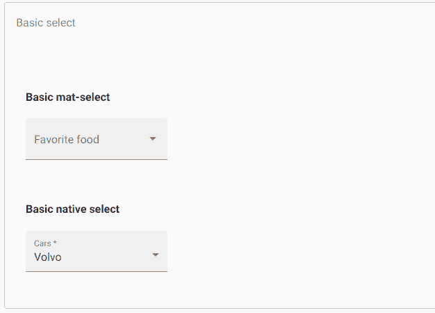
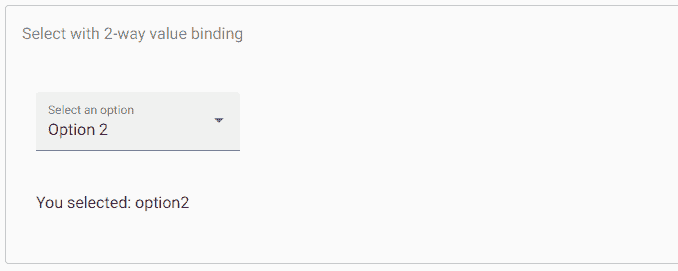
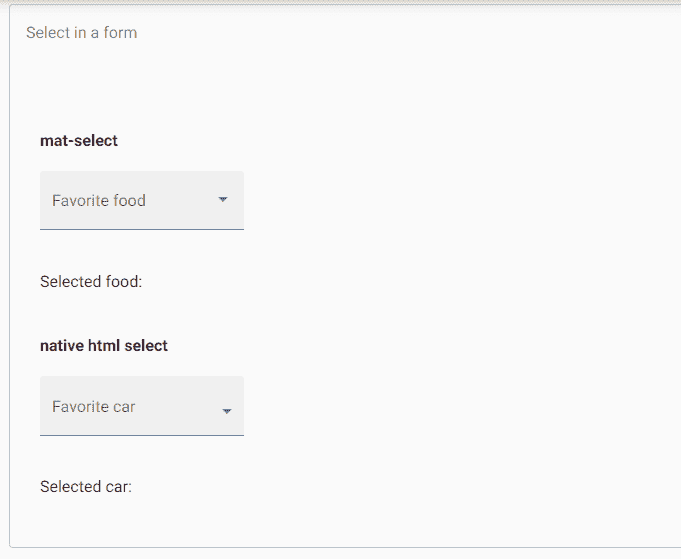
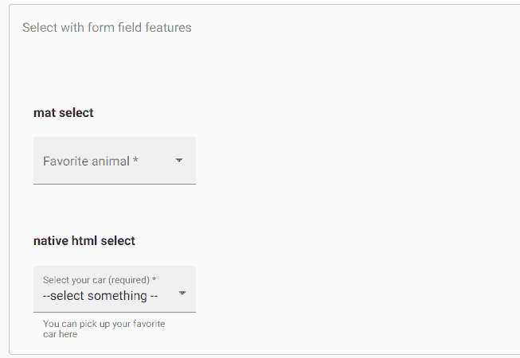
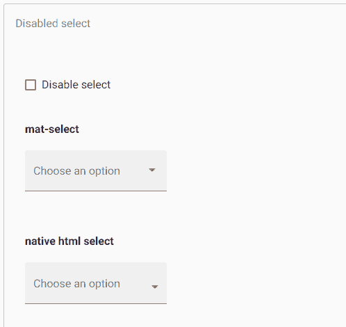
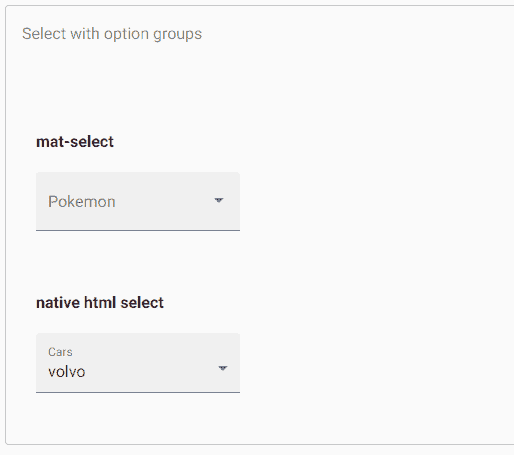
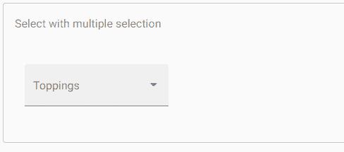
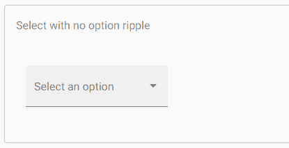
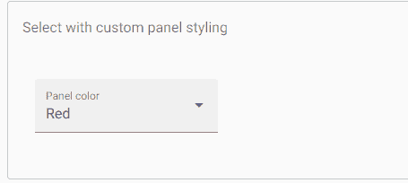
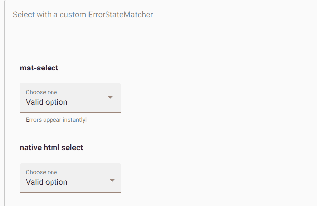

# 角度材料选择

> 原文：<https://www.javatpoint.com/angular-material-select>

<mat-select>是用于从一组选项中选择一个值的表单控件。与原<select>元素相同。我们将进一步讨论材料设计想象中的选择。</select></mat-select>

要添加选择选项，请将<mat-select>元素添加到<mat-select>中。Angular 内容支持在原生<select>元素中使用。将 matNativeControl 属性添加到</select>元素，以便在 **< mat-form-field >** 中使用父选择。</mat-select></mat-select>

**app.component.html**

```
<h4>Basic mat-select</h4>
<mat-form-field appearance="fill">
  <mat-label>Favorite food</mat-label>
  <mat-select>
    <mat-option *ngFor="let food of foods" [value]="food.value">
      {{food.viewValue}}
    </mat-option>
  </mat-select>
</mat-form-field>
<h4>Basic native select</h4>
<mat-form-field appearance="fill">
  <mat-label>Cars</mat-label>
  <select matNativeControl required>
    <option value="volvo">Volvo</option>
    <option value="saab">Saab</option>
    <option value="mercedes">Mercedes</option>
    <option value="audi">Audi</option>
  </select>
</mat-form-field>

```

**app.component.ts**

```
import {Component} from '@angular/core';

interface Food {
  value: string;
  viewValue: string;
}

/**
 * @title Basic select
 */
@Component({
  selector: 'select-overview-example',
  templateUrl: 'select-overview-example.html',
})
export class SelectOverviewExample {
  foods: Food[] = [
    {value: 'steak-0', viewValue: 'Steak'},
    {value: 'pizza-1', viewValue: 'Pizza'},
    {value: 'tacos-2', viewValue: 'Tacos'}
  ];
}

```

**输出:**



## 获取和设置选择值

<mat-select>支持双向绑定到值属性，不需要角度形式。</mat-select>

**app.component.html**

```
<mat-form-field appearance="fill">
  <mat-label>Select an option</mat-label>
  <mat-select [(value)]="selected">
    <mat-option>None</mat-option>
    <mat-option value="option1">Option 1</mat-option>
    <mat-option value="option2">Option 2</mat-option>
    <mat-option value="option3">Option 3</mat-option>
  </mat-select>
</mat-form-field>
<p>You selected: {{selected}}</p>

```

**app.component.ts**

```
import {Component} from '@angular/core';
/** @title Select with 2-way value binding */
@Component({
  selector: 'select-value-binding-example',
  templateUrl: 'select-value-binding-example.html',
})
export class SelectValueBindingExample {
  selected = 'option2';

```

**输出:**



<mat-select>和<select>都支持 forms module(n model)和 reactiveforms module(form control、FormGroup 等)。).</select></mat-select>

**app.component.html**

```
<form>
  <h4>mat-select</h4>
  <mat-form-field appearance="fill">
    <mat-label>Favorite food</mat-label>
    <mat-select [(ngModel)]="selectedValue" name="food">
      <mat-option *ngFor="let food of foods" [value]="food.value">
        {{food.viewValue}}
      </mat-option>
    </mat-select>
  </mat-form-field>
  <p> Selected food: {{selectedValue}} </p>
  <h4>native html select</h4>
  <mat-form-field appearance="fill">
    <mat-label>Favorite car</mat-label>
    <select matNativeControl [(ngModel)]="selectedCar" name="car">
      <option value="" selected></option>
      <option *ngFor="let car of cars" [value]="car.value">
        {{car.viewValue}}
      </option>
    </select>
  </mat-form-field>
  <p> Selected car: {{selectedCar}} </p>
</form>

```

**app.component.ts**

```
import {Component} from '@angular/core';

interface Food {
  value: string;
  viewValue: string;
}

interface Car {
  value: string;
  viewValue: string;
}

/**
 * @title Select in a form
 */
@Component({
  selector: 'select-form-example',
  templateUrl: 'select-form-example.html',
})
export class SelectFormExample {
  selectedValue: string;
  selectedCar: string;

  foods: Food[] = [
    {value: 'steak-0', viewValue: 'Steak'},
    {value: 'pizza-1', viewValue: 'Pizza'},
    {value: 'tacos-2', viewValue: 'Tacos'}
  ];

  cars: Car[] = [
    {value: 'volvo', viewValue: 'Volvo'},
    {value: 'saab', viewValue: 'Saab'},
    {value: 'mercedes', viewValue: 'Mercedes'}
  ];
}

```

**输出:**



## 表单域功能

有许多<mat-form-field>功能同时用于<select>和。它包括错误消息、前缀、提示文本和后缀。</select></mat-form-field>

app.component.html

```
<h5>mat select</h5>
<mat-form-field appearance="fill">
  <mat-label>Favorite animal</mat-label>
  <mat-select [formControl]="animalControl" required>
    <mat-option>--</mat-option>
    <mat-option *ngFor="let animal of animals" [value]="animal">
      {{animal.name}}
    </mat-option>
  </mat-select>
  <mat-error *ngIf="animalControl.hasError('required')">Please choose an animal</mat-error>
  <mat-hint>{{animalControl.value?.sound}}</mat-hint>
</mat-form-field>
<h4>native html select</h4>
<mat-form-field appearance="fill">
  <mat-label>Select your car (required)</mat-label>
  <select matNativeControl required [formControl]="selectFormControl">
    <option label="--select something --"></option>
    <option value="saab">Saab</option>
    <option value="mercedes">Mercedes</option>
    <option value="audi">Audi</option>
  </select>
  <mat-error *ngIf="selectFormControl.hasError('required')">
    This field is required
  </mat-error>
  <mat-hint>You can pick up your favorite car here</mat-hint>
</mat-form-field>

```

**app.component.ts**

```
import {Component} from '@angular/core';
import {FormControl, Validators} from '@angular/forms';

interface Animal {
  name: string;
  sound: string;
}

/** @title Select with form field features */
@Component({
  selector: 'select-hint-error-example',
  templateUrl: 'select-hint-error-example.html',
})
export class SelectHintErrorExample {
  animalControl = new FormControl('', Validators.required);
  selectFormControl = new FormControl('', Validators.required);
  animals: Animal[] = [
    {name: 'Dog', sound: 'Woof!'},
    {name: 'Cat', sound: 'Meow!'},
    {name: 'Cow', sound: 'Moo!'},
    {name: 'Fox', sound: 'Wa-pa-pa-pa-pa-pa-pow!'},
  ];
}

```

**输出:**



## 要设置静态占位符

当<mat-form-field>标签浮动或<mat-select>标签为空时，显示占位符。它用于向用户提供关于他们选择的价值的附加指示。占位符通过在<mat-select>元素上设置占位符属性来指定。在某些情况下，<mat-form-field>使用占位符作为标签。</mat-form-field></mat-select></mat-select></mat-form-field>

## 禁用选择或单独选项

我们可以通过使用<select>或以及<option>或元素上的禁用属性来禁用整个选择或选择中的单个选项。</option></select>

**app.component.html**

```
<p>
  <mat-checkbox [formControl]="disableSelect">Disable select</mat-checkbox>
</p>
<h4>mat-select</h4>
<mat-form-field appearance="fill">
  <mat-label>Choose an option</mat-label>
  <mat-select [disabled]="disableSelect.value">
    <mat-option value="option1">Option 1</mat-option>
    <mat-option value="option2" disabled>Option 2 (disabled)</mat-option>
    <mat-option value="option3">Option 3</mat-option>
  </mat-select>
</mat-form-field>

<h4>native html select</h4>
<mat-form-field appearance="fill">
  <mat-label>Choose an option</mat-label>
  <select matNativeControl [disabled]="disableSelect.value">
    <option value="" selected></option>
    <option value="volvo">Volvo</option>
    <option value="saab" disabled>Saab</option>
    <option value="mercedes">Mercedes</option>
    <option value="audi">Audi</option>
  </select>
</mat-form-field>

```

**app.component.ts**

```
import {Component} from '@angular/core';
import {FormControl} from '@angular/forms';

/** @title Disabled select */
@Component({
  selector: 'select-disabled-example',
  templateUrl: 'select-disabled-example.html',
})
export class SelectDisabledExample {
  disableSelect = new FormControl(false);
}

```

**输出:**



## 创建选项组

<mat-optgroup>元素用于将常用选项分组在一个子标题下。组名将使用<mat-optgroup>的标签属性设置。与单个<mat-options>元素一样，通过设置禁用属性可以禁用或启用整个<mat-optgroup>。</mat-optgroup></mat-options></mat-optgroup></mat-optgroup>

**app.component.html**

```
<h4>mat-select</h4>
<mat-form-field appearance="fill">
  <mat-label>Pokemon</mat-label>
  <mat-select [formControl]="pokemonControl">
    <mat-option>-- None --</mat-option>
    <mat-optgroup *ngFor="let group of pokemonGroups" [label]="group.name"
                  [disabled]="group.disabled">
      <mat-option *ngFor="let pokemon of group.pokemon" [value]="pokemon.value">
        {{pokemon.viewValue}}
      </mat-option>
    </mat-optgroup>
  </mat-select>
</mat-form-field>

<h4>native html select</h4>
<mat-form-field appearance="fill">
  <mat-label>Cars</mat-label>
  <select matNativeControl>
    <optgroup label="Swedish Cars">
      <option value="volvo">volvo</option>
      <option value="saab">Saab</option>
    </optgroup>
    <optgroup label="German Cars">
      <option value="mercedes">Mercedes</option>
      <option value="audi">Audi</option>
    </optgroup>
  </select>
</mat-form-field>

```

**app.component.ts**

```
import {Component} from '@angular/core';
import {FormControl} from '@angular/forms';

interface Pokemon {
  value: string;
  viewValue: string;
}

interface PokemonGroup {
  disabled?: boolean;
  name: string;
  pokemon: Pokemon[];
}

/** @title Select with option groups */
@Component({
  selector: 'select-optgroup-example',
  templateUrl: 'select-optgroup-example.html',
})
export class SelectOptgroupExample {
  pokemonControl = new FormControl();
  pokemonGroups: PokemonGroup[] = [
    {
      name: 'Grass',
      pokemon: [
        {value: 'bulbasaur-0', viewValue: 'Bulbasaur'},
        {value: 'oddish-1', viewValue: 'Oddish'},
        {value: 'bellsprout-2', viewValue: 'Bellsprout'}
      ]
    },
    {
      name: 'Water',
      pokemon: [
        {value: 'squirtle-3', viewValue: 'Squirtle'},
        {value: 'psyduck-4', viewValue: 'Psyduck'},
        {value: 'horsea-5', viewValue: 'Horsea'}
      ]
    },
    {
      name: 'Fire',
      disabled: true,
      pokemon: [
        {value: 'charmander-6', viewValue: 'Charmander'},
        {value: 'vulpix-7', viewValue: 'Vulpix'},
        {value: 'flareon-8', viewValue: 'Flareon'}
      ]
    },
    {
      name: 'Psychic',
      pokemon: [
        {value: 'mew-9', viewValue: 'Mew'},
        {value: 'mewtwo-10', viewValue: 'Mewtwo'},
      ]
    }
  ];
}

```

**输出:**



## 多重选择

<mat-select>默认为单选模式，但可以通过设置其他属性来配置为允许不同的类别。在多选模式下使用<mat-select>时，其值将是所有选定值的排序列表，而不是单个值。</mat-select></mat-select>

**app.component.html**

```
<mat-form-field appearance="fill">
  <mat-label>Toppings</mat-label>
  <mat-select [formControl]="toppings" multiple>
    <mat-option *ngFor="let topping of toppingList" [value]="topping">{{topping}}</mat-option>
  </mat-select>
</mat-form-field>

```

**app.component.ts**

```
import {Component} from '@angular/core';
import {FormControl} from '@angular/forms';

/** @title Select with multiple selection */
@Component({
  selector: 'select-multiple-example',
  templateUrl: 'select-multiple-example.html',
})
export class SelectMultipleExample {
  toppings = new FormControl();
  toppingList: string[] = ['Extra cheese', 'Mushroom', 'Onion', 'Pepperoni', 'Sausage', 'Tomato'];
}

```

**输出:**



## 自定义触发器标签

如果必须在<mat-select>内显示自定义触发器标签，可以使用<mat-select-trigger>元素。</mat-select-trigger></mat-select>

### 禁用涟漪效应

当用户点击<mat-option>时，波纹动画显示。它可以通过<mat-select>上的 disableRipple 属性禁用。</mat-select></mat-option>

**app.component.html**

```
<mat-form-field appearance="fill">
  <mat-label>Select an option</mat-label>
  <mat-select disableRipple>
    <mat-option value="1">Option 1</mat-option>
    <mat-option value="2">Option 2</mat-option>
    <mat-option value="3">Option 3</mat-option>
  </mat-select>
</mat-form-field>

```

**app.component.ts**

```
import {Component} from '@angular/core';
/** @title Select with no option ripple */
@Component({
  selector: 'select-no-ripple-example',
  templateUrl: 'select-no-ripple-example.html',
})
export class SelectNoRippleExample {}

```

**输出:**



## 向下拉面板添加自定义样式

为了设置下拉面板的样式，<mat-select>有一个面板类属性，用于向下拉面板应用额外的 CSS 类。</mat-select>

**app.component.html**

```
<mat-form-field appearance="fill">
  <mat-label>Panel color</mat-label>
  <mat-select [formControl]="panelColor"
              panelClass="example-panel-{{panelColor.value}}">
    <mat-option value="red">Red</mat-option>
    <mat-option value="green">Green</mat-option>
    <mat-option value="blue">Blue</mat-option>
  </mat-select>
</mat-form-field>

```

**app.component.ts**

```
import {Component, ViewEncapsulation} from '@angular/core';
import {FormControl} from '@angular/forms';

/**
 * @title Select with custom panel styling
 */
@Component({
  selector: 'select-panel-class-example',
  templateUrl: 'select-panel-class-example.html',
  styleUrls: ['select-panel-class-example.css'],
  // Encapsulation has to be disabled in order for the
  // component style to apply to the select panel.
  encapsulation: ViewEncapsulation.None,
})
export class SelectPanelClassExample {
  panelColor = new FormControl('red');
}

```

**app.component.css**

```
.example-panel-red.mat-select-panel {
  background: rgba(255, 0, 0, 0.5);
}

.example-panel-green.mat-select-panel {
  background: rgba(0, 255, 0, 0.5);
}

.example-panel-blue.mat-select-panel {
  background: rgba(0, 0, 255, 0.5);
}

```

**输出:**



## 显示错误信息时更改

<mat-form-field>允许我们将错误信息与<select>或相关联。默认情况下，当控件无效或用户与元素交互时，会出现错误消息。如果我们想覆盖这个行为，我们可以使用 errorStateMatcher 属性。属性采用 ErrorStateMatcher 对象的实例</select></mat-form-field>

**app.component.html**

```
<h4>mat-select</h4>
<mat-form-field appearance="fill">
  <mat-label>Choose one</mat-label>
  <mat-select [formControl]="selected" [errorStateMatcher]="matcher">
    <mat-option>Clear</mat-option>
    <mat-option value="valid">Valid option</mat-option>
    <mat-option value="invalid">Invalid option</mat-option>
  </mat-select>
  <mat-hint>Errors appear instantly!</mat-hint>
  <mat-error *ngIf="selected.hasError('required')">You must make a selection</mat-error>
  <mat-error *ngIf="selected.hasError('pattern') && !selected.hasError('required')">
    Your selection is invalid
  </mat-error>
</mat-form-field>
<h4>native html select</h4>
<mat-form-field class="demo-full-width" appearance="fill">
  <mat-label>Choose one</mat-label>
  <select matNativeControl [formControl]="nativeSelectFormControl" [errorStateMatcher]="matcher">
    <option value=""></option>
    <option value="valid" selected>Valid option</option>
    <option value="invalid">Invalid option</option>
  </select>
  <mat-error *ngIf="nativeSelectFormControl.hasError('required')">You must make a selection</mat-error>
  <mat-error *ngIf="nativeSelectFormControl.hasError('pattern') && !nativeSelectFormControl.hasError('required')">
    Your selection is invalid
  </mat-error>
</mat-form-field>

```

**app.component.ts**

```
import {Component} from '@angular/core';
import {FormControl, FormGroupDirective, NgForm, Validators} from '@angular/forms';
import {ErrorStateMatcher} from '@angular/material/core';

/** Error when invalid control is touched or submitted. */
export class MyErrorStateMatcher implements ErrorStateMatcher {
  isErrorState(control: FormControl | null, form: FormGroupDirective | NgForm | null): boolean {
    const isSubmitted = form && form.submitted;
    return !!(control && control.invalid && (control.dirty || control.touched || isSubmitted));
  }
}
/** @title Select with a custom ErrorStateMatcher */
@Component({
  selector: 'select-error-state-matcher-example',
  templateUrl: 'select-error-state-matcher-example.html',
})
export class SelectErrorStateMatcherExample {
  selected = new FormControl('valid', [
    Validators.required,
    Validators.pattern('valid'),
  ]);

  selectFormControl = new FormControl('valid', [
    Validators.required,
    Validators.pattern('valid'),
  ]);
  nativeSelectFormControl = new FormControl('valid', [
    Validators.required,
    Validators.pattern('valid'),
  ]);
  matcher = new MyErrorStateMatcher();
}

```

**输出:**



可以通过设置 ErrorStateMatcher 提供程序来指定全局错误条件匹配。它适用于所有输入。当输入无效时，ShowOnDirtyErrorStateMatcher 可用于显示全局可用的输入错误。

```
@NgModule({
  providers: [
    {provide: ErrorStateMatcher, useClass: ShowOnDirtyErrorStateMatcher}
  ]
})

```

## 键盘交互

**向下箭头**:关注下一个选项

**UP_ARROW:** 重点关注前一个选项

**输入**或空格:选择聚焦项目

### 易接近

<mat-select>组件有“组合框”，下拉面板有“列表框”，选择面板中的选项有“选项”。</mat-select>

原生的<select>提供了最好的可访问性，并且屏幕阅读器支持它。</select>

## 解决纷争

**错误:**初始化后不能改变多种选择模式

如果我们试图将动态值上的不同属性绑定到<mat-select>上，就会出现这种情况。</mat-select>

```
<mat-select *ngIf="isMultiple" multiple>
  ...
</mat-select>
<mat-select *ngIf="!isMultiple">
  ...
</mat-select>

```

**错误:值是多选模式下的数组**

当我们给<mat-select multiple="multiple">分配一个非空、未定义或数组的值时，就会出现这种情况。</mat-select>

**例如，** mySelect.value = 'option1 '。

* * *