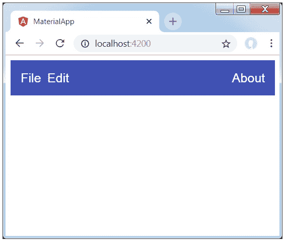
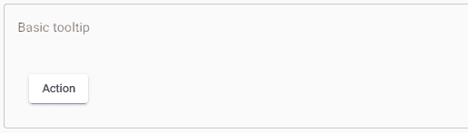
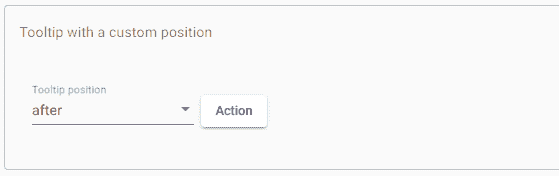
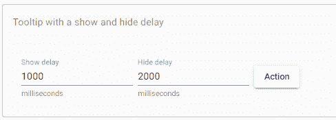
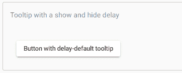
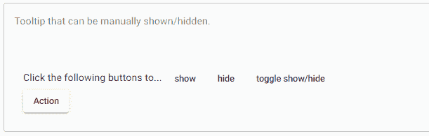

# AngularMaterial 工具栏和工具提示

> 原文：<https://www.javatpoint.com/angular-material-toolbar-and-tooltip>

**<工具栏>** 是一个 Angular 指令，用于创建一个工具栏来显示标题、标题或按钮的任何按钮动作。

**<垫工具栏> :** 代表主容器。

**<mat-工具栏-行> :** 在工具栏增加一行新行。

**工具栏示例:**

修改描述符**应用模块**

```
import { BrowserModule } from '@angular/platform-browser';
import { NgModule } from '@angular/core';
import { AppComponent } from './app.component';
import {BrowserAnimationsModule} from '@angular/platform-browser/animations';
import {MatToolbarModule} from '@angular/material'
import {FormsModule, ReactiveFormsModule} from '@angular/forms';
@NgModule({
   declarations: [
      AppComponent
   ],
   imports: [
      BrowserModule,
      BrowserAnimationsModule,
      MatToolbarModule,
      FormsModule,
      ReactiveFormsModule
   ],
   providers: [],
   bootstrap: [AppComponent]
})
export class AppModule { }

```

修改后的 CSS 文件内容 **app.component.css.**

```
.filler {
   flex: 1 1 auto;
}
.gap {
   margin-right: 10px;
}

```

修改了 HTML 宿主文件**app.component.html。**

```
<mat-toolbar color = "primary">
   <span class = "gap">File</span>
   <span>Edit</span>
   <span class = "filler"></span>
   <span>About</span>
</mat-toolbar>

```

**输出:**



**说明:**

首先，我们创建了一个带有完整页面的工具栏。然后添加标签。

## AngularMaterial 工具提示

“AngularMaterial”工具提示提供了一个文本标签，当用户长时间悬停或按下任何按钮或元素时，就会显示该标签。

**app.component.html**

```
<button mat-raised-button
        matTooltip="Info about the action"
        aria-label="Button that displays a tooltip when focused ">
  Action
</button>

```

**app.component.ts**

```
import {Component} from '@angular/core';
/**
 * @title Basic tooltip
 */
@Component({
  selector: 'tooltip-overview-example',
  templateUrl: 'tooltip-overview-example.html',
})
export class TooltipOverviewExample {}

```

**输出:**



### 配置

工具提示将显示在元素下方，但使用 matTooltipPosition 输入进行配置。工具提示显示在组件的上方、下方、左侧或右侧。

默认情况下，状态将为关闭。如果工具提示位于 RTL 布局方向的左/右切换位置，则使用前和后位置，而不是左和右。

| 位置 | 描述 |
| 超过 | 它显示在元素上方 |
| 在下面 | 它显示在元素下方 |
| 左边的 | 在元素左侧显示 |
| 正确 | 在元素右侧显示 |
| 以前 | 以从左到右的布局显示在左侧，以从右到左的布局显示在右侧 |
| 在...之后 | 在从左到右的布局中向右显示，在从右到左的布局中向左显示 |

**app.component.html**

```
<mat-form-field class="example-user-input">
  <mat-label>Tooltip position</mat-label>
  <mat-select [formControl]="position">
    <mat-option *ngFor="let positionOption of positionOptions" [value]="positionOption">
      {{positionOption}}
    </mat-option>
  </mat-select>
</mat-form-field>
<button mat-raised-button
        matTooltip="Info about the action"
        [matTooltipPosition]="position.value"
        aria-label="Button that displays a tooltip in various positions">
  Action
</button>

```

**app.component.ts**

```
import {Component} from '@angular/core';
import {FormControl} from '@angular/forms';
import {TooltipPosition} from '@angular/material/tooltip';
/**
 * @title Tooltip with a custom position
 */
@Component({
  selector: 'tooltip-position-example',
  templateUrl: 'tooltip-position-example.html',
  styleUrls: ['tooltip-position-example.css'],
})
export class TooltipPositionExample {
  positionOptions: TooltipPosition[] = ['after', 'before', 'above', 'below', 'left', 'right'];
  position = new FormControl(this.positionOptions[0]);
}

```

**app.component.css**

```
.example-user-input {
  margin-right: 8px;
}

```

**输出:**



### 展示和隐藏

默认情况下，当用户的鼠标悬停在工具提示的触发器元素上时，工具提示将立即显示，当用户退出鼠标时，工具提示将隐藏。

您可以使用输入**mattooltipushowdelay**和**mattooltiphideddelay**来提供以秒为单位的延迟，以便在显示或隐藏工具提示之前添加延迟。

**app.component.html**

```
<mat-form-field class="example-user-input">
  <mat-label>Show delay</mat-label>
  <input matInput type="number" [formControl]="showDelay"
         aria-label="Adds a delay between hovering over the button and displaying the tooltip">
  <mat-hint>milliseconds</mat-hint>
</mat-form-field>
<mat-form-field class="example-user-input">
  <mat-label>Hide delay</mat-label>
  <input matInput type="number" [formControl]="hideDelay"
         aria-label="Adds a delay between hovering away from the button and hiding the tooltip">
  <mat-hint>milliseconds</mat-hint>
</mat-form-field>
<button mat-raised-button matTooltip="Info about the action"
        [matTooltipShowDelay]="showDelay.value"
        [matTooltipHideDelay]="hideDelay.value"
        aria-label="Button that displays a tooltip with a customized delay in showing and hiding">
  Action
</button>

```

**app.component.ts**

```
import {Component} from '@angular/core';
import {FormControl} from '@angular/forms';

/**
 * @title Tooltip with a show and hide delay
 */
@Component({
  selector: 'tooltip-delay-example',
  templateUrl: 'tooltip-delay-example.html',
  styleUrls: ['tooltip-delay-example.css'],
})
export class TooltipDelayExample {
  showDelay = new FormControl(1000);
  hideDelay = new FormControl(2000);
}

```

**app.component.css**

```
.mat-form-field + .mat-form-field,
.mat-raised-button {
  margin-left: 8px;
}

```

**输出:**



### 更改默认延迟行为

您可以使用 MAT _ TOOLTIP _ DEFAULT _ OPTIONS 注入标记来配置/延迟应用程序的工具提示默认显示，并提供您的选项。

**app.component.html**

```
<button mat-raised-button
        matTooltip="By default, I delay"
        aria-label="Button which displays a tooltip has custom delays by a default config">
  Button with delay-default tooltip
</button>

```

**app.component.css**

```
import {Component} from '@angular/core';
import {MAT_TOOLTIP_DEFAULT_OPTIONS, MatTooltipDefaultOptions} from '@angular/material/tooltip';
export const myCustomTooltipDefaults: MatTooltipDefaultOptions = {
  showDelay: 1000,
  hideDelay: 1000,
  touchendHideDelay: 1000,
};

/**
 * @title Tooltip with the show and hide delay
 */
@Component({
  selector: 'tooltip-modified-defaults-example',
  templateUrl: 'tooltip-modified-defaults-example.html',
  providers: [
    {provide: MAT_TOOLTIP_DEFAULT_OPTIONS, useValue: myCustomTooltipDefaults}
  ],
})
export class TooltipModifiedDefaultsExample {}

```

**输出:**



### 手动调用 show()和 hide()

您可以显示和隐藏引导方法来调用工具提示来显示或隐藏工具提示，这些方法接受以毫秒为单位的数字来延迟更改显示。

**app.component.html**

```
<div>
  <span> Click the buttons to ...</span>
  <button mat-button
          (click)="tooltip.show()"
          aria-label="Show tooltip on the button at the end "
          class="example-action-button">
    show
  </button>
  <button mat-button
          (click)="tooltip.hide()"
          aria-label="Hide the tooltip at end of the section"
          class="example-action-button">
    hide
  </button>
  <button mat-button
          (click)="tooltip.toggle()"
          aria-label="Show/Hide tooltip on the button at the end "
          class="example-action-button">
    toggle show/hide
  </button>
</div>

<button mat-raised-button #tooltip="matTooltip"
        matTooltip="Info about the action"
        matTooltipPosition="right"
        aria-tooltip="Button that displays and hides a tooltip by other buttons">
</button>

```

**app.component.ts**

```
import {Component} from '@angular/core';
/**
 * @title Tooltip that can be manually shown/hidden.
 */
@Component({
  selector: 'tooltip-manual-example',
  styleUrls: ['tooltip-manual-example.css'],
  templateUrl: 'tooltip-manual-example.html',
})
export class TooltipManualExample {}

```

**app.component.css**

```
.example-action-button {
  margin-top: 16px;
}

```

**输出:**



**禁止工具提示显示**

设置 matTooltipDisabled 以禁用工具提示。当它被禁用时，它将不再显示。

### 易接近

当最终用户关注触发工具提示的元素时，它提供阅读工具提示内容所需的信息。

aria -by 引用的元素不仅仅是工具提示，而是 DOM 中工具提示的不可见副本。

如果工具提示只是通过点击、漏斗等手动显示。，应该对屏幕阅读器用户采取类似的操作。

* * *