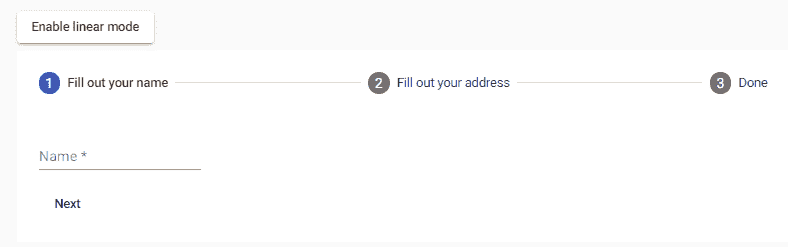
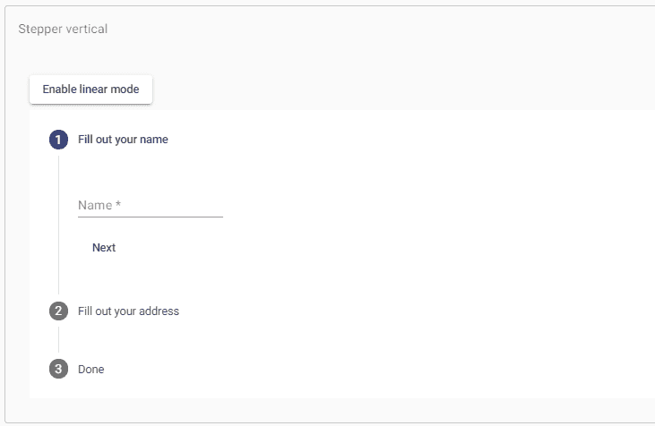
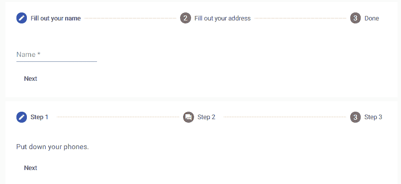
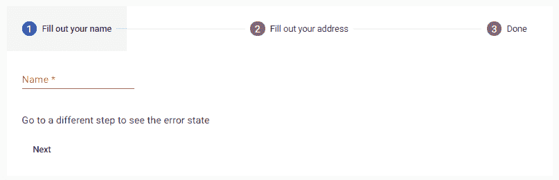
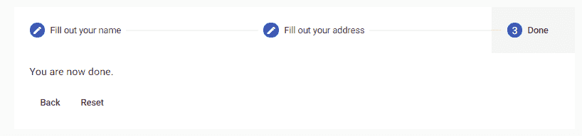

# AngularMaterial步进机

> 原文：<https://www.javatpoint.com/angular-material-stepper>

Angular内容步进器通过将内容分成逻辑步骤来提供类似向导的工作流程。

Material步进器负责 CDK 步进器基础上驱动步进工作流程的逻辑。Material步进器扩展了 CDK 步进器和Material设计风格。

### 步进器变体

有两个步进组件:垫水平步进器和垫垂直步进器。两者的用法相同。唯一的区别是步进器的方向。

**app.component.html**

```

<button mat-raised-button (click)="isLinear = !isLinear" id="toggle-linear">
  {{!isLinear ? 'Enable linear mode' : 'Disable linear mode'}}
</button>
<mat-horizontal-stepper [linear]="isLinear" #stepper>
  <mat-step [stepControl]="firstFormGroup">
    <form [formGroup]="firstFormGroup">
      <ng-template matStepLabel>Fill out your name</ng-template>
      <mat-form-field>
        <mat-label>Name</mat-label>
        <input matInput placeholder="Last name, First name" formControlName="firstCtrl" required>
      </mat-form-field>
      <div>
        <button mat-button matStepperNext>Next</button>
      </div>
    </form>
  </mat-step>
  <mat-step [stepControl]="secondFormGroup" label="Fill out your address">
    <form [formGroup]="secondFormGroup">
      <mat-form-field>
        <mat-label>Address</mat-label>
        <input matInput formControlName="secondCtrl" placeholder="Ex. 1 Main St, New York, NY"
               required>
      </mat-form-field>
      <div>
        <button mat-button matStepperPrevious>Back</button>
        <button mat-button matStepperNext>Next</button>
      </div>
    </form>
  </mat-step>
  <mat-step>
    <ng-template matStepLabel>Done</ng-template>
    <p>You are now done.</p>
    <div>
      <button mat-button matStepperPrevious>Back</button>
      <button mat-button (click)="stepper.reset()">Reset</button>
    </div>
  </mat-step>
</mat-horizontal-stepper>

```

**app.component.ts**

```

import {Component, OnInit} from '@angular/core';
import {FormBuilder, FormGroup, Validators} from '@angular/forms';

/**
 * @title Stepper overview
 */
@Component({
  selector: 'stepper-overview-example',
  templateUrl: 'stepper-overview-example.html',
  styleUrls: ['stepper-overview-example.css'],
})
export class StepperOverviewExample implements OnInit {
  isLinear = false;
  firstFormGroup: FormGroup;
  secondFormGroup: FormGroup;

  constructor(private _formBuilder: FormBuilder) {}

  ngOnInit() {
    this.firstFormGroup = this._formBuilder.group({
      firstCtrl: ['', Validators.required]
    });
    this.secondFormGroup = this._formBuilder.group({
      secondCtrl: ['', Validators.required]
    });
  }
}

```

**app.component.css**

```

.mat-stepper-horizontal {
  margin-top: 8px;
}

.mat-form-field {
  margin-top: 16px;
}

```

**输出:**



**app.component.html**

```

<button mat-raised-button (click)="isLinear = !isLinear" id="toggle-linear">
  {{!isLinear ? 'Enable linear mode' : 'Disable linear mode'}}
</button>
<mat-vertical-stepper [linear]="isLinear" #stepper>
  <mat-step [stepControl]="firstFormGroup">
    <form [formGroup]="firstFormGroup">
      <ng-template matStepLabel>Fill out your name</ng-template>
      <mat-form-field>
        <mat-label>Name</mat-label>
        <input matInput placeholder="Last name, First name" formControlName="firstCtrl" required>
      </mat-form-field>
      <div>
        <button mat-button matStepperNext>Next</button>
      </div>
    </form>
  </mat-step>
  <mat-step [stepControl]="secondFormGroup">
    <form [formGroup]="secondFormGroup">
      <ng-template matStepLabel>Fill out your address</ng-template>
      <mat-form-field>
        <mat-label>Address</mat-label>
        <input matInput formControlName="secondCtrl" placeholder="Ex. 1 Main St, New York, NY"
               required>
      </mat-form-field>
      <div>
        <button mat-button matStepperPrevious>Back</button>
        <button mat-button matStepperNext>Next</button>
      </div>
    </form>
  </mat-step>
  <mat-step>
    <ng-template matStepLabel>Done</ng-template>
    <p>You are now done.</p>
    <div>
      <button mat-button matStepperPrevious>Back</button>
      <button mat-button (click)="stepper.reset()">Reset</button>
    </div>
  </mat-step>
</mat-vertical-stepper>

```

**app.component.ts**

```

import {Component, OnInit} from '@angular/core';
import {FormBuilder, FormGroup, Validators} from '@angular/forms';

/**
 * @title Stepper vertical
 */
@Component({
  selector: 'stepper-vertical-example',
  templateUrl: 'stepper-vertical-example.html',
  styleUrls: ['stepper-vertical-example.css']
})
export class StepperVerticalExample implements OnInit {
  isLinear = false;
  firstFormGroup: FormGroup;
  secondFormGroup: FormGroup;

  constructor(private _formBuilder: FormBuilder) {}

  ngOnInit() {
    this.firstFormGroup = this._formBuilder.group({
      firstCtrl: ['', Validators.required]
    });
    this.secondFormGroup = this._formBuilder.group({
      secondCtrl: ['', Validators.required]
    });
  }
}

```

**app.component.css**

```

.mat-stepper-vertical {
  margin-top: 8px;
}

.mat-form-field {
  margin-top: 16px;
}

```

**输出:**



Mat-水平步进器选择器可以创建水平步进器，Mat-垂直步进器用于制作垂直步进器。步进组件放置在两个步进组件中的任何一个内。

### 标签

如果步骤的标签是文本，则使用标签属性。

```

<mat-step [stepControl]="secondFormGroup" label="Fill out the address">

```

对于更复杂的标签，添加一个带有 **matStepLabel** 指令的模板。

```

<ng-template matStepLabel>Fill out your name</ng-template>

```

### 标签位置

对于水平步进机，我们定义标签的位置。结束是默认值，而在下面，它将被放置在步骤图标下，而不是在其一侧。标签属性控制这种行为。

```

<mat-horizontal-stepper labelPosition="bottom" #stepper>

```

## 步进按钮

有两个按钮指令支持许多阶段之间的导航:matStepperPrepret 和 matStepperNext。

```

<button mat-button matStepperPrevious>Back</button>
<button mat-button matStepperNext>Next</button>

```

### 线性步进机

线性属性设置为 mat-水平步进器和 mat-垂直步进器，以创建一个线性步进器，要求用户在继续下面的步骤之前完成前面的步骤。对于每个 mat-step，step 控制功能将被设置为用于检查动作有效性的顶级控制。

以下是两种方法。一个为步进器使用一种形式，但是另一个为每个步骤使用不同的形式。

或者，如果您不想使用Angular，您可以在每一步传入 complete 属性，这将使用户无法继续，直到它变为 true。请注意，如果同时设置了绝对控制和相位控制，相位控制将优先。

```

<form [formGroup]="formGroup">
  <mat-horizontal-stepper formArrayName="formArray" linear>
    <mat-step formGroupName="0" [stepControl]="formArray.get([0])">
      ...
      <div>
        <button mat-button matStepperNext type="button">Next</button>
      </div>
    </mat-step>
    <mat-step formGroupName="1" [stepControl]="formArray.get([1])">
      ...
      <div>
        <button mat-button matStepperPrevious type="button">Back</button>
        <button mat-button matStepperNext type="button">Next</button>
      </div>
    </mat-step>
    ...
  </mat-horizontal-stepper>
</form>

```

### 对每个步骤使用不同的形式

```

<mat-vertical-stepper linear>
  <mat-step [stepControl]="formGroup1">
    <form [formGroup]="formGroup1">
      ...
    </form>
  </mat-step>
  <mat-step [stepControl]="formGroup2">
    <form [formGroup]="formGroup2">
      ...
    </form>
  </mat-step>
</mat-vertical-stepper>

```

## 步骤类型

### 可选步骤

如果不需要完成线性步进，则在步进上设置可选属性。

```

<mat-step [stepControl]="secondFormGroup" [optional]="isOptional">

```

### 可编辑步骤

默认情况下，这些步骤是可编辑的，这意味着用户可以返回到以前完成的操作并编辑他们的响应。

```

<mat-step [stepControl]="firstFormGroup" [editable]="isEditable">

```

### 已完成的步骤

默认情况下，如果阶段有效(在线性步进器的情况下)，并且用户已经与阶段交互，则阶段的绝对属性被校正。但是，用户也可以根据此默认完整行为的要求覆盖内置属性。

### 覆盖图标

默认情况下，步骤标题使用通过<mat-icon>元素从Material设计图标集中创建和制作的图标。如果您想提供多组图标，您可以通过为每个要覆盖的图标放置一个 MatsapperIcon 来实现。模板变量提供了各个阶段的指示值、活动值和替代值:</mat-icon>

```

<ng-template matStepperIcon="phone">
    <mat-icon>call_end</mat-icon>
  </ng-template>
  <ng-template matStepperIcon="chat">
    <mat-icon>forum</mat-icon>
  </ng-template>
</mat-horizontal-stepper>

```

请注意，在提供自定义图标时，您并不局限于使用 mat-icon 组件。

### 步骤状态

你可以在需要的时候设置一个台阶位置。默认地图赋予图标的位置。但是，可以用与上面相同的方式覆盖它。

```

<mat-horizontal-stepper>
  <mat-step label="Step 1" state="phone">
    <p>Put down your phones.</p>
    <div>
      <button mat-button matStepperNext>Next</button>
    </div>
  </mat-step>
  <mat-step label="Step 2" state="chat">
    <p>Socialize with each other.</p>
    <div>
      <button mat-button matStepperPrevious>Back</button>
      <button mat-button matStepperNext>Next</button>
    </div>
  </mat-step>
  <mat-step label="Step 3">
    <p>You're welcome.</p>
  </mat-step>

  <!-- Icon overrides. -->
  <ng-template matStepperIcon="phone">
    <mat-icon>call_end</mat-icon>
  </ng-template>
  <ng-template matStepperIcon="chat">
    <mat-icon>forum</mat-icon>
  </ng-template>
</mat-horizontal-stepper>

```

为了使用自定义步进状态，您应该将 displayDefaultIndicatorType 选项添加到全局默认步进器中，可以通过在应用程序的根模块中为 **STEPPER_GLOBAL_OPTIONS** 提供一个值来指定该选项。

```

@NgModule({
  providers: [
    {
      provide: STEPPER_GLOBAL_OPTIONS,
      useValue: { displayDefaultIndicatorType: false }
    }
  ]
})

```

**app.component.html**

```

<mat-horizontal-stepper #stepper>
  <mat-step [stepControl]="firstFormGroup">
    <form [formGroup]="firstFormGroup">
      <ng-template matStepLabel>Fill out your name</ng-template>
      <mat-form-field>
        <mat-label>Name</mat-label>
        <input matInput placeholder="Last name, First name" formControlName="firstCtrl" required>
      </mat-form-field>
      <div>
        <button mat-button matStepperNext>Next</button>
      </div>
    </form>
  </mat-step>
  <mat-step [stepControl]="secondFormGroup">
    <form [formGroup]="secondFormGroup">
      <ng-template matStepLabel>Fill out your address</ng-template>
      <mat-form-field>
        <mat-label>Address</mat-label>
        <input matInput formControlName="secondCtrl" placeholder="Ex. 1 Main St, New York, NY"
               required>
      </mat-form-field>
      <div>
        <button mat-button matStepperPrevious>Back</button>
        <button mat-button matStepperNext>Next</button>
      </div>
    </form>
  </mat-step>
  <mat-step>
    <ng-template matStepLabel>Done</ng-template>
    <p>You are now done.</p>
    <div>
      <button mat-button matStepperPrevious>Back</button>
      <button mat-button (click)="stepper.reset()">Reset</button>
    </div>
  </mat-step>
</mat-horizontal-stepper>

<mat-horizontal-stepper>
  <mat-step label="Step 1" state="phone">
    <p>Put down your phones.</p>
    <div>
      <button mat-button matStepperNext>Next</button>
    </div>
  </mat-step>
  <mat-step label="Step 2" state="chat">
    <p>Socialize with each other.</p>
    <div>
      <button mat-button matStepperPrevious>Back</button>
      <button mat-button matStepperNext>Next</button>
    </div>
  </mat-step>
  <mat-step label="Step 3">
    <p>You're welcome.</p>
  </mat-step>

  <!-- Icon overrides. -->
  <ng-template matStepperIcon="phone">
    <mat-icon>call_end</mat-icon>
  </ng-template>
  <ng-template matStepperIcon="chat">
    <mat-icon>forum</mat-icon>
  </ng-template>
</mat-horizontal-stepper>

```

**app.component.ts**

```

import {Component, OnInit} from '@angular/core';
import {FormBuilder, FormGroup, Validators} from '@angular/forms';
import {STEPPER_GLOBAL_OPTIONS} from '@angular/cdk/stepper';

/**
 * @title Stepper with customized states
 */
@Component({
  selector: 'stepper-states-example',
  templateUrl: 'stepper-states-example.html',
  styleUrls: ['stepper-states-example.css'],
  providers: [{
    provide: STEPPER_GLOBAL_OPTIONS, useValue: {displayDefaultIndicatorType: false}
  }]
})
export class StepperStatesExample implements OnInit {
  firstFormGroup: FormGroup;
  secondFormGroup: FormGroup;

  constructor(private _formBuilder: FormBuilder) {}

  ngOnInit() {
    this.firstFormGroup = this._formBuilder.group({
      firstCtrl: ['', Validators.required]
    });
    this.secondFormGroup = this._formBuilder.group({
      secondCtrl: ['', Validators.required]
    });
  }
}

```

**app.component.css**

```

.mat-stepper-horizontal {
  margin-top: 8px;
}

.mat-form-field {
  margin-top: 16px;
}

```

**输出:**



## 错误状态

如果您想在用户经过一个没有正确填充的步骤时显示错误。然后，您可以通过错误消息输入设置错误消息，并通过**步进器 _ 全局 _ 选项**注射标记中的显示错误选项配置步进器显示错误。

```

@NgModule({
  providers: [
    {
      provide: STEPPER_GLOBAL_OPTIONS,
      useValue: { showError: true }
    }
  ]
})

```

**app.component.html**

```

<mat-horizontal-stepper #stepper>
  <mat-step [stepControl]="firstFormGroup" errorMessage="Name is required.">
    <form [formGroup]="firstFormGroup">
      <ng-template matStepLabel>Fill out your name</ng-template>
      <mat-form-field>
        <mat-label>Name</mat-label>
        <input matInput placeholder="Last name, First name" formControlName="firstCtrl" required>
      </mat-form-field>
      <div>
        <p>Go to a different step to see the error state</p>
        <button mat-button matStepperNext>Next</button>
      </div>
    </form>
  </mat-step>
  <mat-step [stepControl]="secondFormGroup" errorMessage="Address is required.">
    <form [formGroup]="secondFormGroup">
      <ng-template matStepLabel>Fill out your address</ng-template>
      <mat-form-field>
        <mat-label>Address</mat-label>
        <input matInput placeholder="Ex. 1 Main St, New York, NY" formControlName="secondCtrl"
               required>
      </mat-form-field>
      <div>
        <p>Go to a different step to see the error state</p>
        <button mat-button matStepperPrevious>Back</button>
        <button mat-button matStepperNext>Next</button>
      </div>
    </form>
  </mat-step>
  <mat-step>
    <ng-template matStepLabel>Done</ng-template>
    <p>You are now done.</p>
    <div>
      <button mat-button matStepperPrevious>Back</button>
      <button mat-button (click)="stepper.reset()">Reset</button>
    </div>
  </mat-step>
</mat-horizontal-stepper>

```

**app.component.ts**

```

import {Component, OnInit} from '@angular/core';
import {FormBuilder, FormGroup, Validators} from '@angular/forms';
import {STEPPER_GLOBAL_OPTIONS} from '@angular/cdk/stepper';

/**
 * @title Stepper that displays errors in the steps
 */
@Component({
  selector: 'stepper-errors-example',
  templateUrl: 'stepper-errors-example.html',
  styleUrls: ['stepper-errors-example.css'],
  providers: [{
    provide: STEPPER_GLOBAL_OPTIONS, useValue: {showError: true}
  }]
})
export class StepperErrorsExample implements OnInit {
  firstFormGroup: FormGroup;
  secondFormGroup: FormGroup;

  constructor(private _formBuilder: FormBuilder) {}

  ngOnInit() {
    this.firstFormGroup = this._formBuilder.group({
      firstCtrl: ['', Validators.required]
    });
    this.secondFormGroup = this._formBuilder.group({
      secondCtrl: ['', Validators.required]
    });
  }
}

```

**app.component.css**

```

.mat-form-field {
  margin-top: 16px;
}

```

**输出:**




**键盘交互**

*   左箭头:它聚焦于上一步标题
*   右箭头:它主要关注以下步骤标题
*   主页:它主要关注第一步标题
*   结束:重点是最后一步标题
*   回车，空格:选择当前焦点所在的步骤
*   它是下一个可跳转的元素
*   SHIFT+TAB:它专注于前面的可跳转元素

## 本地化标签

消息的本地化是通过在根模块中提供一个带有翻译值的子类来完成的。

```

@NgModule({
  imports: [MatStepperModule],
  providers: [
    {provide: MatStepperIntl, useClass: MyIntl},
  ],
})
export class MyApp {}

```

### 易接近

出于可访问性的目的，步进器被视为选项卡式视图，因此默认情况下它被赋予 role =“tablist”。基于相位选择变化来设置步长标题的咏叹调选择特征和步长内容的咏叹调扩展质量。

区域标签或区域标签给步进机和每一步一个有意义的标签。

* * *