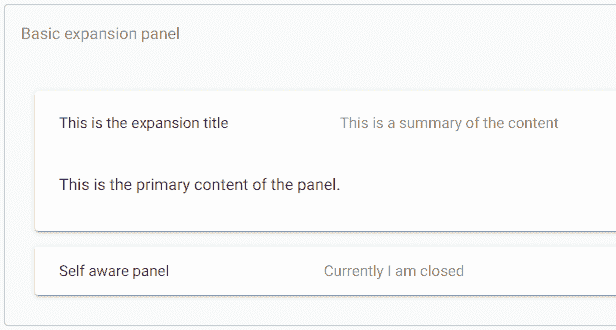
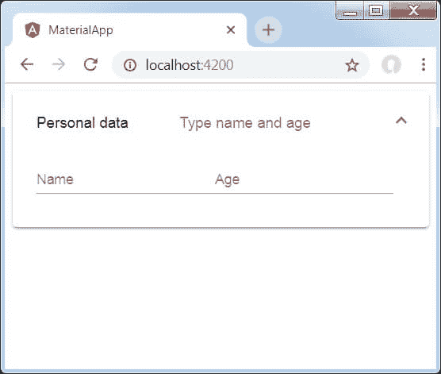

# 角形材料扩展面板

> 原文：<https://www.javatpoint.com/angular-material-expansion-panel>

<mat-expansion-panel>提供可扩展的摘要视图。</mat-expansion-panel>

角度指令 **<垫展开面板>** 用于创建可展开的详图 v/s 汇总视图。

*   **<垫-扩展-面板-表头>**—代表表头部分。包含面板摘要，并作为展开或折叠面板的控件。
*   **<垫子-面板-标题>**—代表面板标题。
*   **<mat-panel-description>**—代表面板摘要。
*   **<垫-动作-行>**—代表底部的动作面板。

**app.component.html**

```

<mat-accordion>
  <mat-expansion-panel hideToggle>
    <mat-expansion-panel-header>
      <mat-panel-title>
        This is the expansion title
      </mat-panel-title>
      <mat-panel-description>
        This is a summary of the content
      </mat-panel-description>
    </mat-expansion-panel-header>
    <p>This is the primary content of the panel.</p>
  </mat-expansion-panel>
  <mat-expansion-panel (opened)="panelOpenState = true"
                       (closed)="panelOpenState = false">
    <mat-expansion-panel-header>
      <mat-panel-title>
        Self aware panel
      </mat-panel-title>
      <mat-panel-description>
        Currently I am {{panelOpenState ? 'open' : 'closed'}}
      </mat-panel-description>
    </mat-expansion-panel-header>
    <p>I'm visible because I am open</p>
  </mat-expansion-panel>
</mat-accordion>

```

**app.component.ts**

```

import {Component} from '@angular/core';

/**
 * @title Basic expansion panel
 */
@Component({
  selector: 'expansion-overview-example',
  templateUrl: 'expansion-overview-example.html',
  styleUrls: ['expansion-overview-example.css'],
})
export class ExpansionOverviewExample {
  panelOpenState = false;
}

```

**app.component.css**

```

.mat-form-field + .mat-form-field {
  margin-left: 8px;
}

```

**输出:**



### 扩展面板内容

**表头**

<mat-expansion-panel-header>显示面板内容的摘要，并作为展开和折叠的控件。该标题可以选择性地包含一个<mat-panel-title>和一个<mat-panel-description>，它们格式化标题的内容以符合材料设计规范。</mat-panel-description></mat-panel-title></mat-expansion-panel-header>

```

<mat-expansion-panel hideToggle>
  <mat-expansion-panel-header>
    <mat-panel-title>
      This is the expansion title
    </mat-panel-title>
    <mat-panel-description>

```

这是对内容的总结

```

    </mat-panel-description>
  </mat-expansion-panel-header>
  <p>This is the primary content of the panel. </p>
</mat-expansion-panel>

```

默认情况下，扩展面板标题在标题末尾包含一个切换图标，以指示扩展状态。该图标可以通过 hideToggle 属性隐藏。

```

<mat-expansion-panel hideToggle>

```

### 操作栏

操作可以选择性地包含在面板的底部，仅当展开处于展开状态时才可见。

```

<mat-action-row>
  <button mat-button color="primary" (click)="nextStep()">Next</button>
</mat-action-row>

```

### 禁用面板

可以使用 disabled 属性禁用扩展面板。禁用的扩展面板不能由用户切换，但仍然可以通过编程方式进行操作。

```

<mat-expansion-panel disabled>

```

### 手风琴

多个扩展面板可以组合成一个手风琴。multi =“true”输入允许扩展状态彼此独立设置。当 multi =“false”(默认值)时，在给定时间只能展开一个面板:

```

<mat-accordion class="example-headers-align" multi>

```

### 惰性渲染

默认情况下，即使面板关闭，扩展面板内容也会被初始化。相反，要将初始化推迟到面板打开时，内容应该作为 ng 模板提供:

```

<mat-expansion-panel>
  <mat-expansion-panel-header>
    This is the expansion title
  </mat-expansion-panel-header>

  <ng-template matExpansionPanelContent>

```

**部分延期内容**

```

  </ng-template>
</mat-expansion-panel>

```

### 易接近

扩展面板旨在模拟原生

<details>和<summary>元素的体验。扩展面板标题有 role =“button”和属性 aria-controls，其值为扩展面板的 id。</summary></details>

扩展面板标题是按钮。用户可以使用键盘激活扩展面板标题，在扩展状态和折叠状态之间切换。因为标题充当一个按钮，额外的交互元素不应该放在标题里面。

### 示例:

以下是修改后的模块描述符 **app.module.ts** 的内容。

```

import { BrowserModule } from '@angular/platform-browser';
import { NgModule } from '@angular/core';
import { AppComponent } from './app.component';
import {BrowserAnimationsModule} from '@angular/platform-browser/animations';
import {MatExpansionModule, MatInputModule} from '@angular/material'
import {FormsModule, ReactiveFormsModule} from '@angular/forms';
@NgModule({
   declarations: [
      AppComponent
   ],
   imports: [
      BrowserModule,
      BrowserAnimationsModule,
      MatExpansionModule, MatInputModule,
      FormsModule,
      ReactiveFormsModule
   ],
   providers: [],
   bootstrap: [AppComponent]
})
export class AppModule { }

```

以下是修改后的 HTML 宿主文件**app.component.html**的内容。

```

<mat-expansion-panel>
   <mat-expansion-panel-header>
      <mat-panel-title>
         Personal data
      </mat-panel-title>
      <mat-panel-description>
         Type name and age
      </mat-panel-description>
   </mat-expansion-panel-header>
   <mat-form-field>
      <input matInput placeholder="Name">
   </mat-form-field>
   <mat-form-field>
      <input matInput placeholder="Age">
   </mat-form-field>
</mat-expansion-panel>

```

**输出:**



**详情**

首先，我们使用 mat-expansion-panel 创建了扩展面板。

然后，我们添加了标题、副标题和内容。

* * *