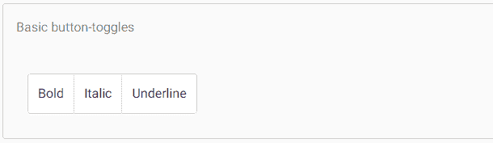
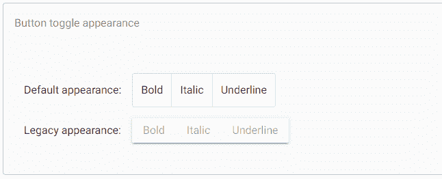
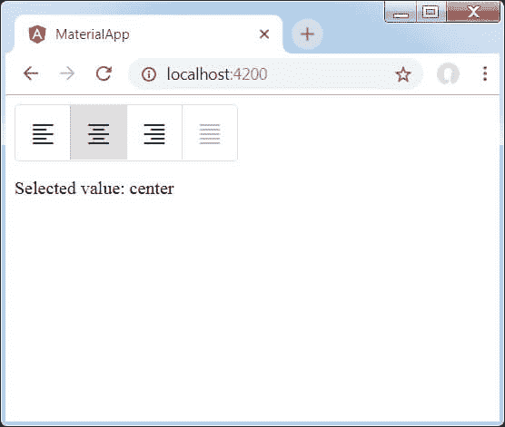

# AngularMaterial切换按钮

> 原文：<https://www.javatpoint.com/angular-material-toggle-button>

Angular指令 **<垫-按钮-切换>** 用于创建带有Material样式和动画的切换或**开/关**按钮。mat-button-切换按钮被配置为表现为单选按钮或复选框。它们是**<mat-button-toggle-group>**的一部分。

<mat-button-toggle>通过按钮的外观进行开/关切换。这些开关可以配置为单选按钮或复选框。虽然它们可以是独立的，但它们通常是 mat-button-toggle-group 的一部分。</mat-button-toggle>

**app.component.html**

```

<mat-button-toggle-group name="fontStyle" aria-label="Font Style">
  <mat-button-toggle value="bold">Bold</mat-button-toggle>
  <mat-button-toggle value="italic">Italic</mat-button-toggle>
  <mat-button-toggle value="underline">Underline</mat-button-toggle>
</mat-button-toggle-group>

```

**app.component.ts**

```

<mat-button-toggle-group name="fontStyle" aria-label="Font Style">
  <mat-button-toggle value="bold">Bold</mat-button-toggle>
  <mat-button-toggle value="italic">Italic</mat-button-toggle>
  <mat-button-toggle value="underline">Underline</mat-button-toggle>
</mat-button-toggle-group>

```

**输出:**



### 排他性选择与多重选择

默认情况下，mat-button-toggle-group 的行为类似于单选按钮组-只能选择一个项目。在这种模式下，mat-button-toggle-group 的值将反映所选按钮的值，并且支持 ngModel。

添加多个属性允许选择多个项目(复选框行为)。在此模式下，不使用切换的值，mat-button-toggle-group 没有值，并且不支持 ngModel。

### 出现

垫子按钮开关组和垫子按钮开关的外观将遵循最新的Material设计指南。如果需要，可以使用外观输入切换回遵循先前Material设计规范的外观。可以使用 MAT _ BUTTON _ TOGGLE _ DEFAULT _ OPTIONS 注入标记全局配置外观。

**app.component.html**

```

<p>
  Default appearance:
  <mat-button-toggle-group name="fontStyle" aria-label="Font Style">
    <mat-button-toggle value="bold">Bold</mat-button-toggle>
    <mat-button-toggle value="italic">Italic</mat-button-toggle>
    <mat-button-toggle value="underline">Underline</mat-button-toggle>
  </mat-button-toggle-group>
</p>
<p>
  Legacy appearance:
  <mat-button-toggle-group appearance="legacy" name="fontStyle" aria-label="Font Style">
    <mat-button-toggle value="bold">Bold</mat-button-toggle>
    <mat-button-toggle value="italic">Italic</mat-button-toggle>
    <mat-button-toggle value="underline">Underline</mat-button-toggle>
  </mat-button-toggle-group>
</p>

```

**app.component.ts**

```

import {Component} from '@angular/core';

/**
 * @title Button toggle appearance
 */
@Component({
  selector: 'button-toggle-appearance-example',
  templateUrl: 'button-toggle-appearance-example.html',
  styleUrls: ['button-toggle-appearance-example.css'],
})
export class ButtonToggleAppearanceExample {}

```

**app.component.css**

```

mat-button-toggle-group {
  margin-left: 12px;
}

```

**输出:**



### 与@angular/forms 一起使用

<mat-button-toggle-group>兼容@angular/forms，同时支持 FormsModule 和 ReactiveFormsModule。</mat-button-toggle-group>

### 易接近

按钮切换在内部使用带有 aria-pressed 的本机按钮元素来传达它们的切换状态。单个按钮周围的按钮切换组应用 role =“group”来传达单个切换之间的关联。

对于只包含图标的按钮开关，应该通过 aria-label 或 aria-label by 给每个按钮开关一个有意义的标签。

对于按钮切换组，应该通过 aria-label 或 aria-label by 给每个组一个有意义的标签。

### 方向

按钮开关可以通过添加垂直属性以垂直方向呈现。

### 示例:

以下是修改后的模块描述符 **app.module.ts** 的内容。

```

import { BrowserModule } from '@angular/platform-browser';
import { NgModule } from '@angular/core';
import { AppComponent } from './app.component';
import {BrowserAnimationsModule} from '@angular/platform-browser/animations';
import {MatButtonToggleModule, MatIconModule} from '@angular/material'
import {FormsModule, ReactiveFormsModule} from '@angular/forms';
@NgModule({
   declarations: [
      AppComponent
   ],
   imports: [
      BrowserModule,
      BrowserAnimationsModule,
      MatButtonToggleModule, MatIconModule,
      FormsModule,
      ReactiveFormsModule
   ],
   providers: [],
   bootstrap: [AppComponent]
})
export class AppModule { }

```

以下是修改后的 CSS 文件 **app.component.css** 的内容。

```

.tp-selected-value {
   margin: 15px 0;
}

```

以下是修改后的 HTML 宿主文件**app.component.html**的内容。

```

<mat-button-toggle-group #group = "matButtonToggleGroup">
   <mat-button-toggle value = "left">
      <mat-icon>format_align_left</mat-icon>
   </mat-button-toggle>
   <mat-button-toggle value = "center">
      <mat-icon>format_align_center</mat-icon>
   </mat-button-toggle>
   <mat-button-toggle value = "right">
      <mat-icon>format_align_right</mat-icon>
   </mat-button-toggle>
   <mat-button-toggle value = "justify" disabled>
      <mat-icon>format_align_justify</mat-icon>
   </mat-button-toggle>
</mat-button-toggle-group>
<div class = "tp-selected-value">Selected value: {{group.value}}</div>

```

**输出:**



**说明:**

首先，我们使用 mat-button-toggle-group 创建了一个切换按钮组。

然后，我们使用 mat-button-toggle 向组中添加了切换按钮。

* * *