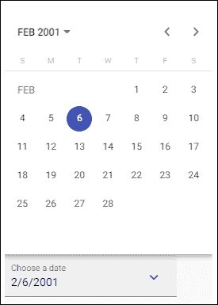
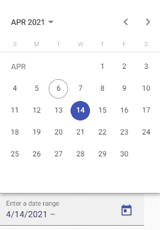
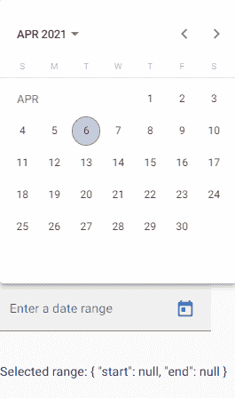
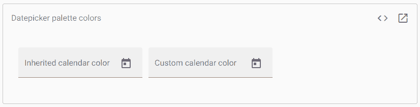
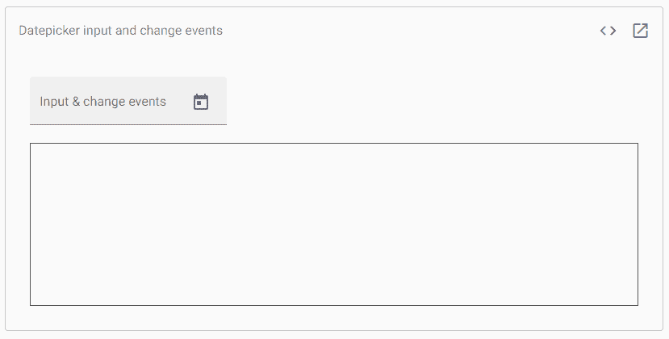
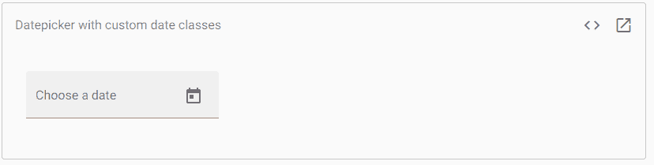
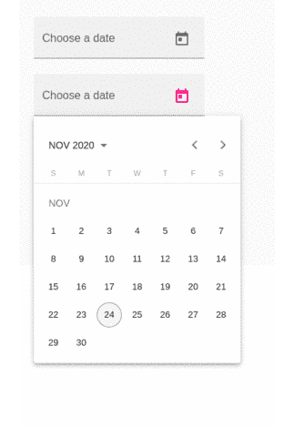
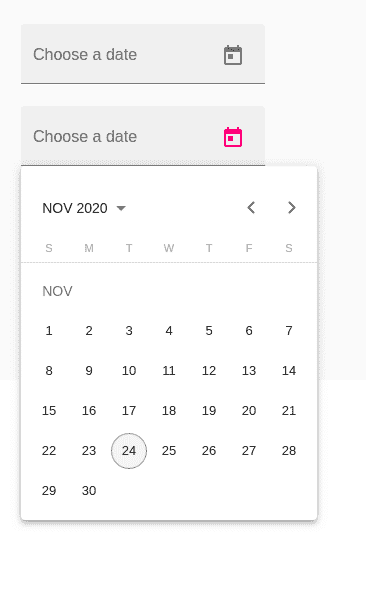
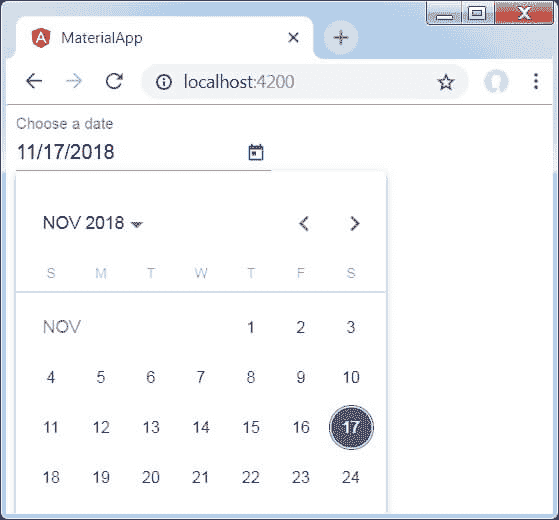

# AngularMaterial-日期选择器

> 原文：<https://www.javatpoint.com/angular-material-datepicker>

**日期选择器**允许用户通过文本输入输入日期或从日历中选择日期。它由文本输入和日历弹出窗口组成，日历弹出窗口与文本输入上的 matDatepicker 属性相关联。

有一个可选的日期选择器切换按钮，为用户提供了一种打开日期选择器弹出窗口的简单方法。

```

<input matInput [matDatepicker] ="picker">
<mat-datepicker-toggle matSuffix [for]="picker"></mat-datepicker-toggle>
<mat-datepicker #picker></mat-datepicker>

```

是 **<垫形场>** 的一部分输入，拨动开关可作为内容输入上的**前缀**或**后缀**。

```

<mat-form-field appearance="fill">
  <mat-label>Choose a date</mat-label>
  <input matInput [matDatepicker]="picker">
  <mat-datepicker-toggle matSuffix [for]="picker"></mat-datepicker-toggle>
  <mat-datepicker #picker></mat-datepicker>
</mat-form-field>

```

如果我们想自定义 mat-datepicker-toggle 中的图标，我们可以使用 matDatepickerToggleIcon 指令来实现。

**app.component.html**

```

<mat-form-field class="example-full-width" appearance="fill">
  <mat-label>Choose a date</mat-label>
  <input matInput [matDatepicker]="picker">
  <mat-datepicker-toggle matSuffix [for]="picker">
    <mat-icon matDatepickerToggleIcon>keyboard_arrow_down</mat-icon>
  </mat-datepicker-toggle>
  <mat-datepicker #picker></mat-datepicker>
</mat-form-field>

```

**app.component.ts**

```

import {Component} from '@angular/core';
/** @title Datepicker with custom icon */
@Component({
  selector: 'datepicker-custom-icon-example',
  templateUrl: 'datepicker-custom-icon-example.html',
})
export class DatepickerCustomIconExample {}

```

**输出:**



## 日期范围选择

如果我们想选择多种类型的日期，我们可以使用 mat-date-range-input 和 mat-date-range-picker 组件。它们协同工作，类似于 mat-datepicker 和必需的日期 picker 输入。

```

<mat-date-range-input>
  <input matStartDate placeholder="Start date">
  <input matEndDate placeholder="End date">
</mat-date-range-input>

```

mat-date-range 选择器用作选择组件日期的弹出面板。它的工作方式与**哑光日期选择器**相同，但允许用户多次选择:

```

<mat-date-range-picker #picker></mat-date-range-picker>

```

使用范围选择器属性连接范围选择器:

```

<mat-date-range-input [rangePicker]="picker">
  <input matStartDate placeholder="Start date">
  <input matEndDate placeholder="End date">
</mat-date-range-input>
<mat-date-range-picker #picker></mat-date-range-picker>

```



### 日期范围输入表单集成

哑光日期范围输入组件与表单图形指令一起使用，对来自 **@angular/forms** 的起始值和结束值进行求和，并将其作为一个组进行验证。

**app.component.html**

```

<mat-form-field appearance="fill">
  <mat-label>Enter a date range</mat-label>
  <mat-date-range-input [formGroup]="range" [rangePicker]="picker">
    <input matStartDate formControlName="start" placeholder="Start date">
    <input matEndDate formControlName="end" placeholder="End date">
  </mat-date-range-input>
  <mat-datepicker-toggle matSuffix [for]="picker"></mat-datepicker-toggle>
  <mat-date-range-picker #picker></mat-date-range-picker>
  <mat-error *ngIf="range.controls.start.hasError('matStartDateInvalid')">Invalid start date</mat-error>
  <mat-error *ngIf="range.controls.end.hasError('matEndDateInvalid')">Invalid end date</mat-error>
</mat-form-field>
<p>Selected range: {{range.value | json}}</p>

```

**app.component.ts**

```

import {Component} from '@angular/core';
import {FormGroup, FormControl} from '@angular/forms';
/** @title Date range picker forms integration */
@Component({
  selector: 'date-range-picker-forms-example',
  templateUrl: 'date-range-picker-forms-example.html',
})
export class DateRangePickerFormsExample {
  range = new FormGroup({
    start: new FormControl(),
    end: new FormControl()
  });
}

```

**输出:**



## 更改日期选择器颜色

日期选择器弹出式菜单继承了与无光表单字段相关联的调色板(**主颜色、**强调颜色或**警告颜色。如果我们想为弹出窗口指定不同的调色板，我们可以在 mat-datapic 上设置颜色属性。**

**app.component.html**

```

<mat-form-field color="accent" appearance="fill">
  <mat-label>Inherited calendar color</mat-label>
  <input matInput [matDatepicker]="picker1">
  <mat-datepicker-toggle matSuffix [for]="picker1"></mat-datepicker-toggle>
  <mat-datepicker #picker1></mat-datepicker>
</mat-form-field>
<mat-form-field color="accent" appearance="fill">
  <mat-label>Custom calendar color</mat-label>
  <input matInput [matDatepicker]="picker2">
  <mat-datepicker-toggle matSuffix [for]="picker2"></mat-datepicker-toggle>
  <mat-datepicker #picker2 color="primary"></mat-datepicker>
</mat-form-field>

```

**app.component.ts**

```

import {Component} from '@angular/core';
/** @title Datepicker palette colors */
@Component({
  selector: 'datepicker-color-example',
  templateUrl: 'datepicker-color-example.html',
  styleUrls: ['datepicker-color-example.css'],
})
export class DatepickerColorExample {}

```

**app.component.css**

```

mat-form-field {
  margin-right: 12px;
}

```

**输出:**



## 输入和更改事件

输入的基本(输入)和(改变)事件只会触发用户与输入元素的交互；当用户从日历弹出菜单中选择日期时，它们不会被触发。

**app.component.html**

```

<mat-form-field appearance="fill">
  <mat-label>Input & change events</mat-label>
  <input matInput [matDatepicker]="picker"
         (dateInput)="addEvent('input', $event)" (dateChange)="addEvent('change', $event)">
  <mat-datepicker-toggle matSuffix [for]="picker"></mat-datepicker-toggle>
  <mat-datepicker #picker></mat-datepicker>
</mat-form-field>

<div class="example-events">
  <div *ngFor="let e of events">{{e}}</div>
</div>

```

**app.component.ts**

```

import {Component} from '@angular/core';
import {MatDatepickerInputEvent} from '@angular/material/datepicker';

/** @title Datepicker input and change events */
@Component({
  selector: 'datepicker-events-example',
  templateUrl: 'datepicker-events-example.html',
  styleUrls: ['datepicker-events-example.css'],
})
export class DatepickerEventsExample {
  events: string[] = [];

  addEvent(type: string, event: MatDatepickerInputEvent) {
    this.events.push(`${type}: ${event.value}`);
  }
} 
```

**app.component.css**

```

.example-events {
  height: 200px;
  border: 1px solid #555;
  overflow: auto;
}

```

**输出:**



## 选择日期实现和日期格式设置

Datepicker 的构建与实现无关。它可以与不同日期的实现一起工作。然而，开发人员需要为 Datepicker 提供合适的片段，以配合他们选择的性能。确保这一点的最简单方法是导入提供的数据模块之一:

**进料数据模块**

| 日期类型 | 日期 |
| **支持的地区** | 在美国 |
| **依赖关系** | 没有人 |
| **从**进口 | @棱角分明/Material/内核 |

**MatMomentDateModule**

| 日期类型 | 瞬间 |
| **从**进口 | @Angular/Material力矩适配器 |

## 突出显示特定日期

如果我们想要将一个或多个 CSS 类应用于某些日历日期(例如，突出显示某个假日。它接受每个日历日期的函数，并将应用于任何返回的类。返回值将是 ngClass 获取的任何内容。

**app.component.html**

```

<mat-form-field class="example-full-width" appearance="fill">
  <mat-label>Choose a date</mat-label>
  <input matInput [matDatepicker]="picker">
  <mat-datepicker-toggle matSuffix [for]="picker"></mat-datepicker-toggle>
  <mat-datepicker [dateClass]="dateClass" #picker></mat-datepicker>
</mat-form-field>

```

**app.component.ts**

```

import {Component, ViewEncapsulation} from '@angular/core';
import {MatCalendarCellClassFunction} from '@angular/material/datepicker';

/** @title Datepicker with custom date classes */
@Component({
  selector: 'datepicker-date-class-example',
  templateUrl: 'datepicker-date-class-example.html',
  styleUrls: ['datepicker-date-class-example.css'],
  encapsulation: ViewEncapsulation.None,
})
export class DatepickerDateClassExample {
  dateClass: MatCalendarCellClassFunction = (cellDate, view) => {
    // Only highligh dates inside the month view.
    if (view === 'month') {
      const date = cellDate.getDate();

      // Highlight the 1st and 20th day of each month.
      return (date === 1 || date === 20) ? 'example-custom-date-class' : '';
    }

    return '';
  }
} 
```

**app.component.css**

```

.example-custom-date-class {
  background: orange;
  border-radius: 100%;
}

```

**输出:**



## 键盘交互

日期选择器支持以下键盘快捷键:

| 捷径 | 行动 |
| **ALT +向下箭头** | 它会打开日历弹出窗口 |
| **逃生** | 它关闭日历弹出窗口 |

### 在月视图中:

| 捷径 | 行动 |
| **向左箭头** | 转到前一天 |
| **向右箭头** | 转到第二天 |
| **向上箭头** | 转到前一周的同一天 |
| **向下箭头** | 下周去同一天 |
| **HOME** | 转到每月的第一天 |
| **结束** | 转到该月的最后一天 |
| **页面向上** | 转到上个月的同一天 |
| **ALT + PAGE_UP** | 去前一年的同一天 |
| **PAGE_DOWN** | 下个月的同一天去 |
| **ALT + PAGE_DOWN** | 明年去同一天 |
| **进入** | 选择当前日期 |

### 在年度视图中:

| 捷径 | 行动 |
| **向左箭头** | 转到上一个月 |
| **向右箭头** | 转到下个月 |
| **向上箭头** | 上升一排(回到四个月前) |
| **向下箭头** | 连续下去(向前四个月) |
| **HOME** | 转到一年的第一个月 |
| **结束** | 转到一年的最后一个月 |
| **页面向上** | 转到上一年的同一个月 |
| **ALT + PAGE_UP** | 回到十年前的同一个月 |
| **PAGE_DOWN** | 第二年去同一个月 |
| **ALT + PAGE_DOWN** | 十年后的同一个月 |
| **进入** | 选择当前月份 |

### 在多年视图中:

| 捷径 | 行动 |
| **向左箭头** | 转到上一年 |
| **向右箭头** | 去明年 |
| **向上箭头** | 上升一排(回到四年前) |
| **向下箭头** | 往下排(往前排四年) |
| **HOME** | 转到当前范围内的第一年 |
| **结束** | 转到当前范围内的最后一年 |
| **页面向上** | 回到 24 年前 |
| **ALT + PAGE_UP** | 回到 240 年前 |
| **PAGE_DOWN** | 往前走 24 年 |
| **ALT + PAGE_DOWN** | 往前走 240 年 |
| **进入** | 选择当前年份 |

Angular Content 是由 Angular 团队开发的 UI 组件库，用于为桌面和移动网络应用程序构建设计组件。要安装它，我们需要在我们的项目中安装 Angular，一旦你有了它，你可以输入下面的命令并下载它。

### 例 1:

**app.module.ts:**

```

import { NgModule } from '@angular/core';
import { BrowserModule } from 
    '@angular/platform-browser';
import { FormsModule } from '@angular/forms';
import { AppComponent } from './app.component';
import { BrowserAnimationsModule } from 
    '@angular/platform-browser/animations';
import { MatButtonModule } from 
    '@angular/material/button';
import { MatButtonToggleModule } from 
    '@angular/material/button-toggle';
import { MatDatepickerModule } from 
    '@angular/material/datepicker';
import { MatInputModule } from 
    '@angular/material/input';
import { MatFormFieldModule } from 
    '@angular/material/form-field';
import { MatNativeDateModule } from 
    '@angular/material/core';
@NgModule({
    imports: [BrowserModule,
        FormsModule,
        BrowserAnimationsModule
  MatButtonModule,
        MatButtonToggleModule,
        MatDatepickerModule,
        MatInputModule,
        MatFormFieldModule,
        MatNativeDateModule
    ],
    declarations: [AppComponent],
    bootstrap: [AppComponent]
})
export class AppModule { }

```

**app.component.html**

```

<mat-form-field appearance="fill">
    <mat-label>Choose a date</mat-label>
    <input matInput [matDatepicker]="picker1">
    <mat-datepicker-toggle matSuffix [for]="picker1">
    </mat-datepicker-toggle>
    <mat-datepicker #picker></mat-datepicker>
</mat-form-field>
<br>
  <mat-form-field color="accent" appearance="fill">
    <mat-label>Choose a date</mat-label>
    <input matInput [matDatepicker]="picker2">
    <mat-datepicker-toggle matSuffix [for]="picker2">
    </mat-datepicker-toggle>
    <mat-datepicker #picker2></mat-datepicker>
</mat-form-field>
<br>
<mat-form-field appearance="fill">
    <mat-label>Completely disabled</mat-label>
    <input matInput [matDatepicker]="picker3" disabled>
    <mat-datepicker-toggle matSuffix [for]="picker3">
    </mat-datepicker-toggle>
    <mat-datepicker #picker3></mat-datepicker>
</mat-form-field>
<br>
<mat-form-field appearance="fill">
    <mat-label>Popup disabled</mat-label>
    <input matInput [matDatepicker]="picker4">
    <mat-datepicker-toggle matSuffix [for]="picker4" 
        disabled>
    </mat-datepicker-toggle>
    <mat-datepicker #picker4></mat-datepicker>
</mat-form-field>

```

**输出:**



这是打开包含日历的弹出窗口的方式:



### 例 1:

修改模块描述符 **app.module.ts** 。

```

import { BrowserModule } from '@angular/platform-browser';
import { NgModule } from '@angular/core';
import { AppComponent } from './app.component';
import {BrowserAnimationsModule} from '@angular/platform-browser/animations';
import {MatDatepickerModule, MatInputModule,MatNativeDateModule} from '@angular/material';
import {FormsModule, ReactiveFormsModule} from '@angular/forms';
@NgModule({
   declarations: [
      AppComponent
   ],
   imports: [
      BrowserModule,
      BrowserAnimationsModule,
      MatDatepickerModule, MatInputModule,MatNativeDateModule,
      FormsModule,
      ReactiveFormsModule
   ],
   providers: [],
   bootstrap: [AppComponent]
})
export class AppModule { }

```

修改后的 HTML 宿主文件**app.component.html**。

```

<mat-form-field>
   <input matInput [matDatepicker] = "picker" placeholder = "Choose a date">
   <mat-datepicker-toggle matSuffix [for] = "picker"></mat-datepicker-toggle>
   <mat-datepicker #picker></mat-datepicker>
</mat-form-field>

```

**输出:**



## 说明

在前面的例子中，我们已经创建了一个输入框，并通过使用[ **matDatepicker** ]属性绑定了一个名为 **picker** 的日期选择器。之后，我们使用 mat-date picker 标签创建了一个名为 **picker** 的日期选择器。

* * *