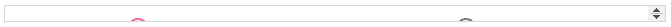

# 角度材料加工-工具栏

> 原文：<https://www.javatpoint.com/angular-material-fab-toolbar>

<md-fab-toolbar>是包含标题、标题或函数的 Angular 指令。</md-fab-toolbar>

它用于显示元素或按钮，以便快速使用功能。您可以使用带有触发器的工具栏。

在 Fab 工具栏中，md-open 属性用于控制程序。在工具栏中，我们必须使用工具栏的纵向来设置可见方向。该组件支持左侧选项。

### 属性

该表列出了 **md-Fab 工具栏**的属性描述。

| Sr.No | 参数 | 描述 |
| one | ***md 方向** | md 方向由工具栏项在触发器元素中出现的方向决定。它支持工具栏的左右方向。 |
| Two | **md-open** | md-open 控制可见或不可见的工具栏。 |

### 单行

工具栏位于应用程序的顶部，包含一行应用程序标题。

```

<mat-toolbar>
  <span>My Application</span>
</mat-toolbar>

```

### 多行

工具栏一次包含多行。要在角度内容中创建多行工具栏，需要在<垫工具栏>内放置 **<垫工具栏行>** 元素。

```

<mat-toolbar-row>
  <span>Custom Toolbar</span>
</mat-toolbar-row>

```

#### 注意:不支持将内容放在指定了多行的<mat-toolbar-row>之外。</mat-toolbar-row>

### 定位工具栏内容

工具栏不显示内容的状态。它将内容位置的全部权力交给了用户。

它是通过演示完成的:

```

<mat-toolbar-row>
  <span>Second Line</span>
  <span class="example-spacer"></span>
  <mat-icon class="example-icon" aria-hidden="false" aria-label="Example user verified icon">verified_user</mat-icon>
</mat-toolbar-row>
content_copy
.example-spacer {
  flex: 1 1 auto;
}

```

### 例子

它显示了 **md-fab-toolbar** 指令及其用途。

***am _ fab toolbar . html***

```

<html lang = "en">
   <head>
      <link rel = "stylesheet"
         href = "https://ajax.googleapis.com/ajax/libs/angular_material/1.0.0/angular-material.min.css">
      <script src = "https://ajax.googleapis.com/ajax/libs/angularjs/1.4.8/angular.min.js"></script>
      <script src = "https://ajax.googleapis.com/ajax/libs/angularjs/1.4.8/angular-animate.min.js"></script>
      <script src = "https://ajax.googleapis.com/ajax/libs/angularjs/1.4.8/angular-aria.min.js"></script>
      <script src = "https://ajax.googleapis.com/ajax/libs/angularjs/1.4.8/angular-messages.min.js"></script>
      <script src = "https://ajax.googleapis.com/ajax/libs/angular_material/1.0.0/angular-material.min.js"></script>
      <link rel = "stylesheet" href = "https://fonts.googleapis.com/icon?family=Material+Icons">
      <script language = "javascript">
         angular
            .module('firstApplication', ['ngMaterial'])
            .controller('toolbarController', toolbarController);

         function toolbarController ($scope) {
            $scope.isOpen = false;
            $scope.count = 0;
            $scope.selectedDirection = 'left';          
         }                 
      </script>      
   </head>

   <body ng-app = "firstApplication"> 
      <div id = "toolbarContainer" ng-controller = "toolbarController as ctrl" ng-cloak>
         <md-fab-toolbar md-open = "ctrl.isOpen" md-direction = "{{ctrl.selectedDirection}}"
            count = "ctrl.count">
            <md-fab-trigger class = "align-with-text">
               <md-button aria-label = "menu" class = "md-fab md-primary">
                  <md-icon class = "material-icons">menu</md-icon>
               </md-button>
            </md-fab-trigger>

            <md-toolbar>
               <md-fab-actions class = "md-toolbar-tools">

                  <md-button aria-label = "Add" class = "md-fab md-raised md-mini
                     md-accent">
                     <md-icon class = "material-icons" aria-label = "Add">add</md-icon>
                  </md-button>

                  <md-button aria-label = "Insert Link" class = "md-fab md-raised
                     md-mini md-accent">
                     <md-icon class = "material-icons" aria-label = "Insert Link">
                        insert_link</md-icon>
                  </md-button>

                  <md-button aria-label = "Edit" class = "md-fab md-raised md-mini
                     md-accent">
                     <md-icon class = "material-icons" aria-label = "Edit">
                        mode_edit</md-icon>
                  </md-button>

               </md-fab-actions>
            </md-toolbar>
         </md-fab-toolbar>

         <md-content class = "md-padding" layout = "column">
            <div layout = "row" layout-align = "space-around">
               <div layout = "column">
                  <b>Open/Closed</b>
                  <md-radio-group ng-model = "ctrl.isOpen">
                     <md-radio-button ng-value = "true">Open</md-radio-button>
                     <md-radio-button ng-value = "false">Closed</md-radio-button>
                  </md-radio-group>
               </div>

               <div layout = "column">
                  <b>Direction</b>
                  <md-radio-group ng-model = "ctrl.selectedDirection">
                     <md-radio-button ng-value = "'left'">Left</md-radio-button>
                     <md-radio-button ng-value = "'right'">Right</md-radio-button>
                  </md-radio-group>
               </div>

            </div>
         </md-content>
      </div>
   </body>
</html>

```

**输出:**



* * *