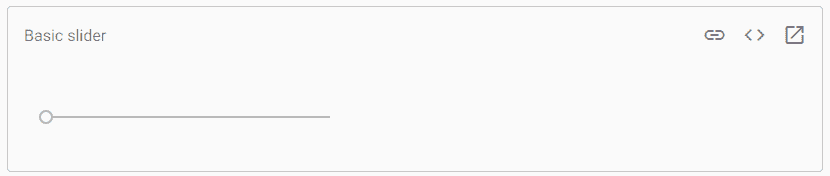
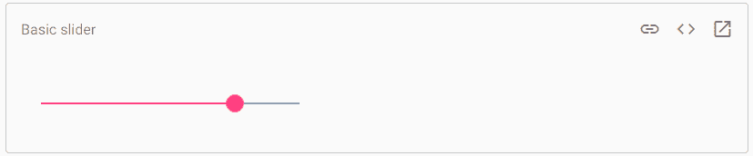
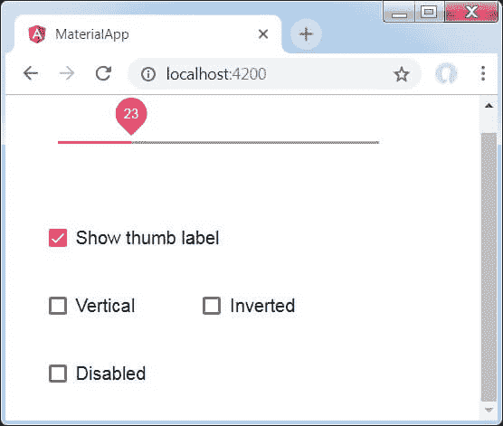

# 角度材质滑块

> 原文：<https://www.javatpoint.com/angular-material-slider>

**<垫滑块>** 是一个角度指令，用作增强的范围选择器，具有材质造型和动画功能。<垫滑块>允许通过**鼠标、触摸**或**键盘**从范围中选择值，它类似于 **<输入类型=“范围”>。** <当项目中需要滑块时，使用垫滑块>标签。

### 基本滑块

```

linkcodeopen_in_new

```

### 选择一个值

默认情况下，滑块的最小值为 **0** ，最大值为 **100** ，拇指以 **1** 为增量移动。

```

<Mat-slider min = "1" max = "5" step = "0.5" value = "1.5"> </ mat-slider>

```

### 方向

滑块的方向是水平的，最小值在左边，最大值在右边。垂直属性被添加到滑块，使其垂直，最小值和最大值在顶部。

```

<mat-slider vertical> </ mat-slider>

```

也可以使用反向特征，指定翻转用拇指移动的轴。在倒置的垂直滑块中，最小值在顶部，最大值在底部。

```

<mat-slider invert></mat-slider>

```

### 拇指标签

用户看不到滑块的选定值。但是将该值添加到 Thumb Lab 属性将链接到 Thumb。

材料设计规范仅对滑块使用 Thumb 实验室属性(tick interval =“1”)，以显示离散值。

```

<mat-slider thumbLabel tickInterval="1"></mat-slider>

```

格式化缩略图标签

缩略图标签中的值与模型的值相同。它很大，适合放在标签的最后。如果您必须控制显示值，则使用输入的**显示。**

### 带有自定义缩略图标签格式的滑块




滑块不会在拇指轨道上显示刻度线。它通过使用刻度间隔属性来启用。刻度间隔的值表示刻度之间的步数。

```

<mat-slider step="4" tickInterval="3"></mat-slider>

```

刻度间隔选择许多步骤，使刻度之间有 **30px** 的空间。

```

<mat-slider tickInterval="auto"></mat-slider>

```

滑块在轨道的开头和结尾显示一个刻度。

### 键盘交互

它有以下键盘绑定:

| 钥匙 | 行动 |
| **右箭头** | 它以单步方式递增滑块的值(以 RTL 为单位递减)。 |
| **向上箭头** | 它单步递增滑块的值。 |
| **左箭头** | 它以单步方式递减滑块的值(以 RTL 为增量)。 |
| **向下箭头** | 它将值递减一步。 |
| **向上翻页** | 它将滑块值增加十个步长。 |
| **向下翻页** | 它将滑块值递减十步。 |
| **结束** | 它将该值设置为最大可能值。 |

### 示例:

**app.module.ts**

```

import { AppComponent } from './app.component';
import {BrowserAnimationsModule} from '@angular/platform-browser/animations';
import {MatSliderModule, MatCheckboxModule} from '@angular/material'
import {FormsModule, ReactiveFormsModule} from '@angular/forms';
import { BrowserModule } from '@angular/platform-browser';
import { NgModule } from '@angular/core';

@NgModule({
   declarations: [
      AppComponent
   ],
   imports: [
      BrowserModule,
      BrowserAnimationsModule,
      MatSliderModule, MatCheckboxModule,
      FormsModule,
      ReactiveFormsModule
   ],
   providers: [],
   bootstrap: [AppComponent]
})
export class AppModule { }

```

**app.component.html**

```

<mat-slider
   class = "tp-margin"
   [disabled] = "disabled"
   [invert] = "invert"      
   [thumbLabel] = "thumbLabel"     
   [(ngModel)] = "value"
   [vertical] = "vertical">
</mat-slider>
<section class = "tp-section">
   <mat-checkbox class = "tp-margin" [(ngModel)] = "thumbLabel">Show thumb label</mat-checkbox>
</section>
<section class = "tp-section">
   <mat-checkbox class = "tp-margin" [(ngModel)] = "vertical">Vertical</mat-checkbox>
   <mat-checkbox class = "tp-margin" [(ngModel)] = "invert">Inverted</mat-checkbox>
</section>
<section class = "tp-section">
   <mat-checkbox class = "tp-margin" [(ngModel)] = "disabled">Disabled</mat-checkbox>
</section>

```

**app.component.css**

```

.tp-section {
   display: flex;
   align-content: center;
   align-items: center;
   height: 60px;
}
.tp-margin {
   margin: 30px;
}

.mat-slider-horizontal {
   width: 300px;
}
.mat-slider-vertical {
   height: 300px;
}

```

**app.component.ts**

```

import { Component } from '@angular/core';
@Component({
   selector: 'app-root',
   templateUrl: './app.component.html',
   styleUrls: ['./app.component.css']
})
export class AppComponent {
   title = 'materialApp'; 
   disabled = false;
   invert = false;
   thumbLabel = false;
   value = 0;
   vertical = false;
}

```

**输出:**



**说明:**

我们使用 mat-checkbox 创建了四个复选框，并将它们与带有变量的 NgModel 绑定。它用于自定义滑块。

然后，我们创建了滑块，并在**中用变量展示了它的属性。ts** 文件。

* * *