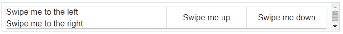
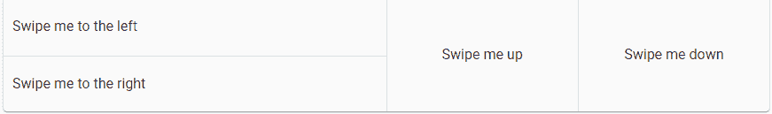

# AngularMaterial-滑动

> 原文：<https://www.javatpoint.com/angular-material-swipe>

AngularMaterial滑动功能是用于移动设备的Angular指令。UX 模式仅用于移动设备，不能制作响应站点。要在桌面上启动滑动手势，您可以在滑动功能的帮助下单击、按住并向右、向左、向上或向下拖动。

以下说明用于处理刷卡。

*   **MD-向下扫动**:用于确定任意元素向下扫动时的自定义行为。
*   **MD-上扫**:用于元素上扫时生成自定义行为。
*   **MD-swipe-left**:MD-swipe-left 是一个Angular指令，用于指定向左滑动元素时的自定义行为。
*   **MD-向右滑动**:指定元素向右滑动时的自定义行为。

### 例 1:

该示例显示了 **md-swipe-** *的使用，并使用了 swipe 组件。

***am_swipes.html***

```

<html lang = "en">
   <head>
      <link rel = "stylesheet"
         href = "https://ajax.googleapis.com/ajax/libs/angular_material/1.0.0/angular-material.min.css">
      <script src = "https://ajax.googleapis.com/ajax/libs/angularjs/1.4.8/angular.min.js"></script>
      <script src = "https://ajax.googleapis.com/ajax/libs/angularjs/1.4.8/angular-animate.min.js"></script>
      <script src = "https://ajax.googleapis.com/ajax/libs/angularjs/1.4.8/angular-aria.min.js"></script>
      <script src = "https://ajax.googleapis.com/ajax/libs/angularjs/1.4.8/angular-messages.min.js"></script>
      <script src = "https://ajax.googleapis.com/ajax/libs/angular_material/1.0.0/angular-material.min.js"></script>
      <link rel = "stylesheet" href = "https://fonts.googleapis.com/icon?family=Material+Icons">

      <style>
         .swipeContainer .demo-swipe {
            padding: 20px 10px; 			
         }

         .swipeContainer .no-select {
            -webkit-touch-callout: none;
            -webkit-user-select: none;
            -khtml-user-select: none;
            -moz-user-select: none;
            -ms-user-select: none;
            user-select: none; 
         }
      </style>

      <script language = "javascript">
         angular
            .module('firstApplication', ['ngMaterial'])
            .controller('swipeController', swipeController);

         function swipeController ($scope) {
            $scope.onSwipeLeft = function(ev) {
               alert('Swiped Left!');
            };

            $scope.onSwipeRight = function(ev) {
               alert('Swiped Right!');
            };

            $scope.onSwipeUp = function(ev) {
               alert('Swiped Up!');
            };

            $scope.onSwipeDown = function(ev) {
               alert('Swiped Down!');
            };
         }	  
      </script>      
   </head>

   <body ng-app = "firstApplication"> 
      <md-card>
         <div id = "swipeContainer" ng-controller = "swipeController as ctrl"
            layout = "row" ng-cloak>
            <div flex>
               <div class = "demo-swipe" md-swipe-left = "onSwipeLeft()">
                  <span class = "no-select">Swipe me to the left</span>
                  <md-icon md-font-icon = "android" aria-label = "android"></md-icon>
               </div>

               <md-divider></md-divider>
               <div class = "demo-swipe" md-swipe-right = "onSwipeRight()">
                  <span class = "no-select">Swipe me to the right</span>
               </div>
            </div>

            <md-divider></md-divider>
            <div flex layout = "row">
               <div flex layout = "row" layout-align = "center center"
                  class = "demo-swipe" md-swipe-up = "onSwipeUp()">
                  <span class = "no-select">Swipe me up</span>
               </div>

               <md-divider></md-divider>
               <div flex layout = "row" layout-align = "center center"
                  class = "demo-swipe" md-swipe-down = "onSwipeDown()">
                  <span class = "no-select">Swipe me down</span>
               </div>
            </div>

         </div>
      </md-card>
   </body>
</html>

```

**输出:**



### 例 2:

**app.component.html**

```

</div> 
<md-divider></md-divider>
<div class="demo-swipe>
md-swipe-right="onSwipeRight()"> 
<span class="no-select">Swipe me to the right</span> 
</div> </div>
<md-divider></md-divider>
<div flex layout="row"> 
<div flex layout="row" 
layout-align="center center" 
class="demo-swipe" 
md-swipe-up="onSwipeUp()"> 
<span class="no-select">Swipe me up</span> 
</div> <md-divider></md-divider> 
<div flex layout="row" 
layout-align="center center" 
class="demo-swipe" 
md-swipe-down="onSwipeDown()"> 
<span class="no-select">Swipe me down</span> </div> 
</div> 
</div>

```

**app.component.ts**

```

angular.module('demoSwipe', ['ngMaterial']) .controller('demoSwipeCtrl', function($scope) { $scope.onSwipeLeft = function(ev) 
{ alert('You swiped left!!'); }; 
$scope.onSwipeRight = function(ev) 
{ alert('You swiped right!!'); }; 
$scope.onSwipeUp = function(ev) 
{ alert('You swiped up!!'); }; 
$scope.onSwipeDown = function(ev) 
{ alert('You swiped down!!');
 }; 
});

```

**app.component.css**

```

.swipedemoBasicUsage 
.demo-swipe { padding: 20px 10px; } 
.swipedemoBasicUsage 
.no-select { -webkit-touch-callout: none; 
-webkit-user-select: none; 
-khtml-user-select: none; 
-moz-user-select: none; 
-ms-user-select: none; user-select: none; }

```

**输出:**



* * *