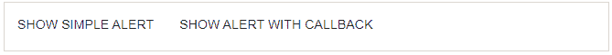
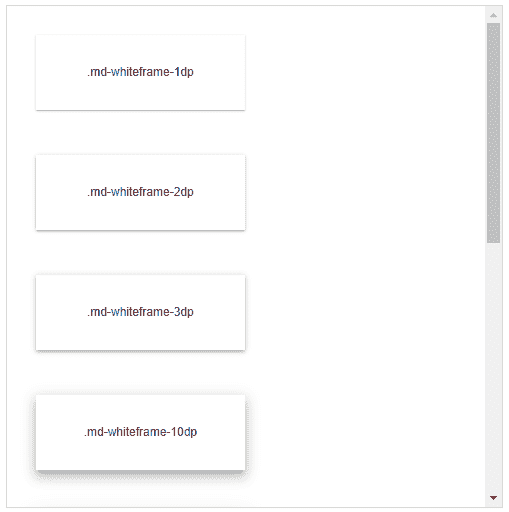

# AngularMaterial祝酒/白框

> 原文：<https://www.javatpoint.com/angular-material-toasts-or-whiteframe>

Angular Material 为用户提供了许多显示隐藏警报的独特方式。 **$ mdToast** 服务用于显示吐司并提供一个单词吐司。

### 示例:

这个例子展示了祝酒词的用法。

***am _ toast . html***

```

<html lang = "en">
   <head>
      <link rel = "stylesheet"
         href = "https://ajax.googleapis.com/ajax/libs/angular_material/1.0.0/angular-material.min.css">
      <script src = "https://ajax.googleapis.com/ajax/libs/angularjs/1.4.8/angular.min.js"></script>
      <script src = "https://ajax.googleapis.com/ajax/libs/angularjs/1.4.8/angular-animate.min.js"></script>
      <script src = "https://ajax.googleapis.com/ajax/libs/angularjs/1.4.8/angular-aria.min.js"></script>
      <script src = "https://ajax.googleapis.com/ajax/libs/angularjs/1.4.8/angular-messages.min.js"></script>
      <script src = "https://ajax.googleapis.com/ajax/libs/angular_material/1.0.0/angular-material.min.js"></script>
      <link rel = "stylesheet" href = "https://fonts.googleapis.com/icon?family=Material+Icons">

      <script language = "javascript">
         angular
            .module('firstApplication', ['ngMaterial'])
            .controller('toastController', toastController);
         function toastController ($scope, $mdToast, $document) { 
            $scope.showToast1 = function() {
               $mdToast.show (
                  $mdToast.simple()
                  .textContent('Hello World!')                       
                  .hideDelay(3000)
               );
            };

            $scope.showToast2 = function() {
               var toast = $mdToast.simple()
                  .textContent('Hello World!')
                  .action('OK')
                  .highlightAction(false);                     

               $mdToast.show(toast).then(function(response) {
                  if ( response == 'ok' ) {
                     alert('You clicked \'OK\'.');
                  }
               });			   
            }
         }	  
      </script>      
   </head>

   <body ng-app = "firstApplication"> 
      <div id = "toastContainer" ng-controller = "toastController as ctrl"
         layout = "row" ng-cloak>
         <md-button ng-click = "showToast1()">Show Simple Alert</md-button>
         <md-button ng-click = "showToast2()">Show Alert with callback</md-button>
      </div>
   </body>
</html>

```

**输出:**



## 白色框架

有一些特殊的类别用于以卡片的形式显示容器，例如在有角的Material中带有阴影的纸。

下表列出了各种类别及其描述。

### 例子

该示例显示了影子类。

***am _ white frames . htm***

现场演示

```

<html lang = "en">
   <head>
      <link rel = "stylesheet"
         href = "https://ajax.googleapis.com/ajax/libs/angular_material/1.0.0/angular-material.min.css">
      <script src = "https://ajax.googleapis.com/ajax/libs/angularjs/1.4.8/angular.min.js"></script>
      <script src = "https://ajax.googleapis.com/ajax/libs/angularjs/1.4.8/angular-animate.min.js"></script>
      <script src = "https://ajax.googleapis.com/ajax/libs/angularjs/1.4.8/angular-aria.min.js"></script>
      <script src = "https://ajax.googleapis.com/ajax/libs/angularjs/1.4.8/angular-messages.min.js"></script>
      <script src = "https://ajax.googleapis.com/ajax/libs/angular_material/1.0.0/angular-material.min.js"></script>
      <link rel = "stylesheet" href = "https://fonts.googleapis.com/icon?family=Material+Icons">

      <style>
         .frameContainer md-whiteframe {
            background: #fff;
            margin: 30px;
            height: 100px; 
         }
      </style>

      <script language = "javascript">
         angular
            .module('firstApplication', ['ngMaterial'])
            .controller('frameController', frameController);

         function frameController ($scope) {               
         }	  
      </script>      
   </head>

   <body ng-app = "firstApplication"> 
      <div class = "frameContainer" ng-controller = "frameController as ctrl"
         layout = "row" layout-padding layout-wrap layout-fill
         style = "padding-bottom: 32px;" ng-cloak>
         <md-whiteframe class = "md-whiteframe-1dp" flex-sm = "45" flex-gt-sm = "35"
            flex-gt-md = "25" layout layout-align = "center center">
            <span>.md-whiteframe-1dp</span>
         </md-whiteframe>

         <md-whiteframe class = "md-whiteframe-2dp" flex-sm = "45" flex-gt-sm = "35"
            flex-gt-md = "25" layout layout-align = "center center">
            <span>.md-whiteframe-2dp</span>
         </md-whiteframe>

         <md-whiteframe class = "md-whiteframe-3dp" flex-sm = "45" flex-gt-sm = "35"
            flex-gt-md = "25" layout layout-align = "center center">
            <span>.md-whiteframe-3dp</span>
         </md-whiteframe>

         <md-whiteframe class = "md-whiteframe-10dp" flex-sm = "45" flex-gt-sm = "35"
            flex-gt-md = "25" layout layout-align = "center center">
            <span>.md-whiteframe-10dp</span>
         </md-whiteframe>

         <md-whiteframe class = "md-whiteframe-15dp" flex-sm = "45" flex-gt-sm = "35"
            flex-gt-md = "25" layout layout-align = "center center">
            <span>.md-whiteframe-15dp</span>
         </md-whiteframe>

         <md-whiteframe class = "md-whiteframe-20dp" flex-sm = "45" flex-gt-sm = "35"
            flex-gt-md = "25" layout layout-align = "center center">
            <span>.md-whiteframe-20dp</span>
         </md-whiteframe>

         <md-whiteframe class = "md-whiteframe-22dp" flex-sm = "45" flex-gt-sm = "35"
            flex-gt-md = "25" layout layout-align = "center center">
            <span>.md-whiteframe-22dp</span>
         </md-whiteframe>

         <md-whiteframe class = "md-whiteframe-23dp" flex-sm = "45" flex-gt-sm = "35"
            flex-gt-md = "25" layout layout-align = "center center">
            <span>.md-whiteframe-23dp</span>
         </md-whiteframe>

         <md-whiteframe class = "md-whiteframe-24dp" flex-sm = "45" flex-gt-sm = "35"
            flex-gt-md = "25" layout layout-align = "center center">
            <span>.md-whiteframe-24dp</span>
         </md-whiteframe>
      </div>
   </body>
</html>

```

**输出:**



* * *