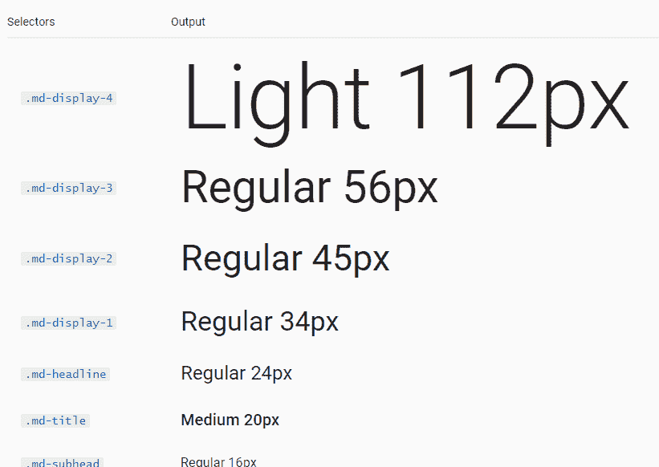

# 有角度的材料排版

> 原文：<https://www.javatpoint.com/angular-material-typography>

### 什么是排版？

排版是一种排列文本的方式，在显示时清晰、易读、有吸引力。有角材料的类型基于从[材料](https://material.io/archive/guidelines/style/typography.html)设计图像中导出的指导方针，并在排版级别内组织。每个级别都有大小、行高和字体粗细。

CSS 类是为排版而提供的。您可以使用它们在整个应用程序中创建视觉一致性。

等级如下:

| 名字 | CSS 类 | 描述 |
| 显示器-4 | 。mat-显示-4 | 它是页面顶部的一个大的、一次性的标题。 |
| 显示器-3 | 。mat-display-3 | 它是页面顶部的大型一次性标题(例如英雄标题)。 |
| 显示器-2 | 。mat-显示-2 | 它也是页面顶部的一个大的封闭的标题(像:英雄标题)。 |
| 显示器-1 | 。mat-显示-1 | 这是页面顶部较大的页眉。 |
| 头条新闻 | 。mat-h1，。草席头条 | 是

# 标签对应的部分。

 |
| 标题 | .mat-h2， .mat-title | 它对应于

## 标签。

 |
| 副标题-2 | 。mat-h3，。mat-副标题-2 | 它对应于

### 标签。

 |
| 副标题-1 | 。mat-h4，。mat-副标题-1 | 它是对应于

#### 标签的部分。

 |
| body-1 | 。垫体，。垫体-1 | 它是基础正文。 |
| body-2 | 。垫体结实。垫体 2 | 它有更粗的正文。 |
| 标题 | 。小垫子。字幕 | 它是较小的正文和提示文本。 |
| 按钮 | 它用于组件中。 | 纽扣和锚。 |
| 投入 | 它用于组件中。 | 表单输入字段。 |

排版被收集到排版配置中，用于生成 [**CSS**](https://www.javatpoint.com/css-tutorial) 。

首先包含 **300、400** 和 **500** 权重的 Roboto 字体开始。您可以从谷歌字体中包含它:

```

<link rel="preconnect" href="https://fonts.gstatic.com">
<link href="https://fonts.googleapis.com/css2?family=Roboto:wght@300;400;500&display=swap" rel="stylesheet">

```

您可以将适当的 CSS 类添加到要设置样式的元素中:

```

<h1 class="mat-display-1">Jackdaws love my big sphinx of quartz</h1>
<h2 class="mat-h2">the quick brown fox jumps over the lazy dog</h2>

```

角度内容没有实现任何全局 CSS。为了更广泛地应用库的排版样式，您可以利用 mat-排版 CSS 类。这个类将设置后代根元素的样式。

```

<!-- By default, Angular Material applies no global styles to native elements. -->
<h1>The header is unstyled</h1>

<!-- Applying the mat-tyography class adds styles for native elements. -->
<section class="mat-typography">
  <h1>This header will be styled</h1>
</section>

```

### 用户化

字体定制是基于 sass 的角度内容主题的扩展。

```

@import '~@angular/material/theming';
// Define a custom typography config that overrides the font-family as well as the
// `headlines` and `body-1` levels.
$custom-typography: mat-typography-config(
  $font-family: 'Roboto, monospace',
  $headline: mat-typography-level(32px, 48px, 700),
  $body-1: mat-typography-level(16px, 24px, 500)
);

```

根据示例，类型配置是使用**mat-排版-配置**功能、字体系列和所描述的排版级别创建的。排版级别由**哑光排版级别**功能定义，需要行高和字体粗细。字体系列用引号括起来。

当自定义排版的定义被创建时，它被不同的 sass 混合使用来生成样式。

```

// Override typography CSS classes 
@include mat-base-typography($custom-typography);
// Override typography for a specific components.
@include mat-checkbox-typography($custom-typography);
// Override typography for all Angular Material, including the mat-base-typography
@include angular-material-typography ($custom-typography);

```

如果使用内容主题化，您可以将排版配置传递给哑光核心:

```

// Override the typography in the core CSS.
@include mat-core($custom-typography);

```

### 自定义 CSS 中的内容排版

角度内容包括排版实用程序和功能，您可以使用它们来定制组件:-

*   **mat-font-size ($ config，$ level)** -它根据提供的配置和级别获取字体大小。
*   **mat-font-family($ config)**-它根据提供的配置获取字体系列。
*   **垫线高度($ config，$ level)** -它根据提供的配置和级别获得线高度。
*   **mat-font-weight ($ config，$ level)** -它根据给定的配置和级别获取字体权重。
*   **mat-排版-级别到样式($ config，$ level)** -它配置了对象和一个排版级别，并输出一个短手 CSS 字体声明。

```

@import '~@angular/material/theming';
// Create a configuration with the default typography levels.
$config: mat-typography-config();
// Header uses only the Material `font-size` and `font-family`.
.unicorn-header {
  font-size: mat-font-size($config, headline);
  font-family: mat-font-family($config);
}
// Custom uses all of the typography styles from the `title` level.
.unicorn-title {
  @include mat-typography-level-to-styles($config, title);
}

```

### 通用排版

[AngularJS](https://www.javatpoint.com/angularjs-tutorial) 材质为组件使用 Roboto 字体。

AngularJS 内容不会加载 Roboto 字体。开发人员负责加载应用程序中使用的所有字体。

```

<link rel="stylesheet" href="https://fonts.googleapis.com/css?family=Roboto:300,400,500,700,400italic">

```

### 标题样式

您应该使用样式类为 [< h1 > < h6 >标题标签](https://www.javatpoint.com/html-heading)设置样式:

```

<h1 class="md-display-3">Headline</h1>
<h2 class="md-display-1">Headline</h2>
<h3 class="md-headline">Headline</h3>
Base font size is 10px for easy units (1.2rem = 12px). Body font size is 14px. 
sp = scalable pixels.

```

**输出:**



* * *