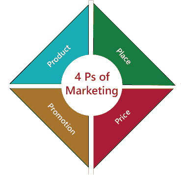
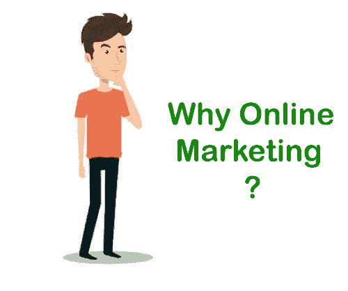
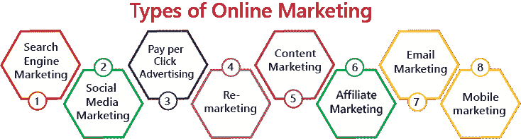
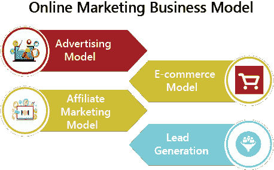
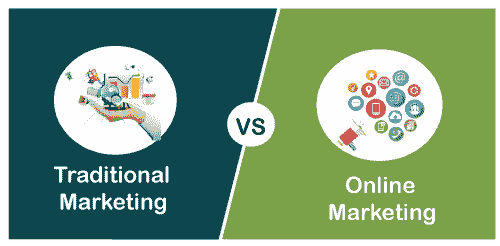

# 在线营销

> 原文：<https://www.javatpoint.com/online-marketing>

市场营销是根据客户的要求，向客户传达、理解、创造和交付相关产品的过程。

营销有两种类型-

1.  传统营销(线下营销)
2.  在线营销

营销完全依赖于 4 Ps。这四个 Ps 是:

### 1.产品

产品是营销的根本。产品可以是任何有形的，也可以是营销人员为满足顾客需求而提供的无形商品或服务。

**注:**有形产品是那些具有**物理存在**的产品，这意味着我们可以触摸、感觉或闻到这些产品。

**示例:**车辆、小工具等。

**无形产品**是那些**没有实体存在的产品**意味着我们不能触摸、感觉或闻到这些产品。

**例:**旅游、保险、计算机软件、医疗保健等。

### 2.地方

Place 是营销人员在客户面前展示产品的平台，客户可以根据自己的需求购买这些产品。

### 3.价格

价格是营销中最重要的 Ps 之一。价格是影响顾客的主要因素。它是客户为特定产品或服务向营销人员支付的费用。产品的价格取决于品牌和产品的可用性。

### 4.促进

促销是用来提供产品信息的方法。推广包括各种传播活动、广告站点、社交媒体营销、电子邮件营销、视频营销、品牌宣传等，让客户了解产品。

现在，在学习网络营销之前，我们首先需要了解传统营销。

## 什么是传统营销？

传统营销是一种帮助营销人员使用各种线下广告和促销方法接触目标客户的营销类型。

传统营销包括以下 5 大类-

1.  印刷(杂志、报纸、卡片等))
2.  广播(电视、广播等。)
3.  电话(电话营销、短信营销等。)
4.  直邮(目录、明信片等))
5.  室外(过滤器、广告牌等。)

在我们的在线营销教程中，我们将讨论以下主题-

*   [什么是网络营销？](#What)
*   [网络营销术语](#Terminology)
*   [为什么是网络营销？](#Why)
*   [网络营销类型](#Types)
*   [线上营销优势](#Advantages)
*   [网络营销的劣势](#Disadvantages)
*   [线上营销商业模式](#Business)
*   [传统营销与网络营销的区别](#Difference)

## 什么是在线营销？

网络营销又称**网络营销**、**数字营销**、**互联网营销**、**搜索引擎营销**。它是基于网络的营销，通过互联网提供各种工具来推广产品和服务，以达到目标客户。

在线营销包括以下内容来接触目标客户-

*   脸书、Instagram 和推特等社交媒体网站。
*   博客
*   付费和免费弹出广告
*   电子邮件营销
*   亚马逊、Flipkart 等网购网站。
*   内容广告

简而言之，我们可以说，在线营销是一门使用互联网或手机网络等各种数字网络向客户销售产品和服务的艺术。

## 在线营销术语

以下是我们在网络营销中常用的术语-

### 广告客户

广告商也被称为**商家**或**零售商**。广告商可以是为目标受众做广告的个人或组织。

### 旗帜

横幅基于图形图像并显示在网页上。

下表显示了横幅的大小、样式和 Gif 重量-

| 没有。 | 大小 | 风格 | Gif 重量 |
| 1. | 468 × 60 | 全横幅 | 20 KB |
| 2. | 728 × 90 | 排行榜 | 25 KB |
| 3. | 336 × 280 | 平方 | 25 KB |
| 4. | 160 × 600 | 摩天大楼 | 20 KB |
| 5. | 120 × 600 | 小摩天大楼 | 20 KB |
| 6. | 240 × 400 | 肥胖的摩天大楼 | 25 KB |
| 7. | 234 × 60 | 半横幅 | 15 KB |
| 8. | 180 × 150 | 矩形的 | 15 KB |
| 9. | 125 × 125 | 方形按钮 | 15 KB |
| 10. | 88 × 31 | 纽扣 | 10 KB |

### 出版者

出版商负责印刷和发布广告。

### 出价

出价是广告商愿意为广告上的每次点击支付的最高价格。

### 黑帽战术

黑帽战术是用来增加搜索结果中的页面排名和网站排名。好的黑帽战术包括使用私有链接网络的关键字填充隐形。

### 白帽战术

白帽战术用于提高我们在搜索引擎结果页面上的搜索排名，也使我们的网站易于导航。

### 面包屑导航

面包屑导航是网页的一部分，用户使用它来跟踪他们的位置，从当前查看的页面到他们网站的主页。使用面包屑导航的优点是它增加了用户在网站上的体验。

### 点击率

在在线营销中，点击率是用我们广告的点击量除以印象数来衡量的。

以下公式用于测量点击率。

Click Through Rate (CTR) = Clicks / Impressions %

**每次收购成本(CPA)**

每次收购的成本也称为**每次行动的成本**。它用于衡量在活动中获得一个付费客户的总成本。

我们可以使用以下公式计算注册会计师-

**每次点击成本(CPC)**

每次点击成本也称为**每次点击付费(PPC)。**是我们在 PPC 营销平台上每次点击所支付的费用。一些 PPC 平台包括**谷歌广告词**或**必应**广告(广告)。

CPC 的计算公式如下-

**每英里成本(CPM)**

每英里成本也称为每千成本。是网络营销中最常用的术语。CPM 用于衡量广告商为一千次点击支付的成本。

**如果这个然后比(IFTTT)**

它是 2011 年推出的条件编程语句。使用 IFTTT，我们可以打开或关闭一个小程序，它也允许我们创建自己的小程序。

**关键绩效指标**

关键绩效指标用于衡量组织的有效性。

**SEO(SEO)**

SEO是通过搜索引擎上的有机、免费或自然的搜索结果来获取和增加我们网站的质量和流量的过程。

一些常见的搜索引擎是**谷歌**、**雅虎**、**必应**。

**网页索引**

网站索引是为单个网站、网站集合和 HTML 文档集合创建索引的过程。

#### 注:索引一词是指根据项目的名称和主题对项目进行的系统排列。

使用网络索引的最大优势是，它可以帮助客户在互联网上轻松找到想要的内容。

**跟踪**

跟踪是网络营销中最常用的词。这是一个通过收集信息来衡量在线广告效果的过程。

**质量评分(QS)**

质量分数被组织用来**分析广告**的有效性。

它根据广告质量和登录页面体验来分析广告的有效性。

**付费搜索广告**

付费搜索广告也称为**点击付费(PPC)广告**。这是一个广告过程，在这个过程中，广告商为每次点击广告付费。

**入站链接**

入站链路也称为**黑色链路**。它是第三方网页上的一种超链接，实际上指向您网站上的网页。

## 为什么是网络营销？

使用网络营销有以下原因-

1.  在线营销提供了与客户互动的双向交流媒介。如果客户面临任何与产品相关的问题，他或她可以打电话、聊天或发送电子邮件给相关组织来解决他们的疑问。
2.  有效的在线营销总是使我们能够定制受众的体验，并帮助我们在正确的时间接触客户。
3.  它帮助我们根据客户的社会经济地位、兴趣和爱好来锁定客户。
4.  在线营销对其受众是 24 *7 可用的，这意味着我们的业务对受众是 24*7(全天候)可见的。
5.  在线营销能够并行运行多个在线业务，这就是它能够同时处理数百万客户的原因。
6.  它帮助我们与目标受众建立持久的关系。

## 网络营销的类型

有以下不同类型的在线营销-

### 1.搜索引擎营销

搜索引擎营销是网络营销中最重要的类型。它通过在谷歌、必应或雅虎等搜索引擎上购买广告来帮助我们增加在线营销增长。

搜索引擎营销取决于以下因素-

1.  了解目标受众。
2.  选择正确的关键字来定位客户。
3.  创造引人注目的广告。
4.  选择显示广告的图形位置。

### 2.社交媒体营销(SMM)

社交媒体营销是利用各种社交媒体平台，如脸书、Instagram、YouTube、领英和推特，提高我们企业的品牌知名度、关系和网站流量的过程。

社交媒体营销有以下五大支柱-

*   战略
*   规划和出版
*   倾听和参与
*   分析和报告
*   广告

### 3.点击付费广告

顾客和广告商都使用点击付费广告。它通过提供各种服务来帮助客户接触目标客户，包括搜索广告、展示广告、社交媒体广告、移动广告、谷歌运输广告、关键词发现和网站流量。

### 4.再行销

再销售用于在互联网上推广特定产品。

有以下不同类型的再婚

**视频评论-** 用于在 YouTube 上展示广告。

**搜索评论-** 用于当用户已经访问你的网站进行特定服务时，在搜索引擎顶部显示结果。

**展示再营销-** 用于在谷歌展示广告网络内展示广告。

**动态再评论-** 用来展示我们之前访客的广告，有产品或服务。

**社交媒体再营销-** 社交媒体营销利用脸书、YouTube、LinkedIn 等各种社交媒体平台，向目标受众投放广告。

**客户列表再营销-** 在谷歌广告词再营销和社交媒体营销中都有使用

### 5.内容营销

内容营销是创建、发布相关内容并将其分发给目标客户以吸引、获取和吸引他们的过程。内容营销包括信息图表、网页、播客、视频、书籍和博客，以了解和吸引客户对产品的关注。

### 6.关联营销

关联营销是最受欢迎的在线赚钱方式。加盟营销人员推销来自许多不同公司的各种产品来赚取佣金。

### 7.电子邮件营销

如今，电子邮件营销成为最重要的在线营销之一。这是一种高效的在线营销策略，包含特定产品、折扣优惠、免费广告和交易的信息，以建立与客户的关系。使用电子邮件营销的主要优势是，它允许我们以灵活且经济高效的方式接触新客户。

### 8.移动营销

移动营销是使用手机、智能手机、电子书、平板电脑等移动设备促进业务发展的过程。根据一项调查，移动营销行业从 2008 年的 1.6 亿美元增长到 2013 年的 31 亿美元。

移动营销包括以下内容-

*   基于位置的服务
*   增强现实
*   2D 广播公司
*   全球定位系统信息

## 网络营销的优势

在数字时代，没有网络营销，营销是不完整的。它帮助大大小小的组织利用在线广告发展业务。

在线营销的优势列表如下-

### 1.提供 24*7 营销服务

在线营销每周 7 天、每天 24 小时为客户提供服务。因此，它节省了顾客在购物时花费的时间。

### 2.遍及全球

在线营销使我们能够与全球新的营销人员和客户互动。

### 3.大量客户

在线营销处理大量的在线客户。在线营销人员使用各种社交媒体平台(如脸书、YouTube、推特和 Instagram)接触目标受众。营销人员不断向客户发送与特定品牌、产品相关的信息，并基于他们的兴趣。

### 4.更高质量的网站流量

在线营销使用社交媒体营销和付费广告策略来获得更高质量的网站流量。正如我们所知，更高质量的流量等于更高的金钱。

### 5.长久的关系

在线营销用于与目标客户建立持久的关系。通过在线营销，营销人员可以使用电子邮件轻松与客户沟通，并且能够向他们发送与产品品牌、折扣优惠和特殊活动的特殊优惠相关的电子邮件。

### 6.更广泛的选择

更广泛的选择是在线营销的最大优势之一。在线营销允许客户在同一个地方看到各种各样的产品，这有助于客户快速满足他们的要求。

### 7.提高消费者满意度

使用在线营销，客户只需点击一个按钮，就可以轻松获得关于产品、产品功能和服务的信息。因此，它有助于客户做出更好、更快的决策。

### 8.社交媒体平台

社交媒体平台为组织接触目标客户提供了一种强大的方式。营销人员利用社交媒体平台发布各种图像、文本、音频和视频内容，以吸引客户并发展业务**。**

## 网络营销的弊端

网络营销有以下缺点-

1.  在线营销需要更有技能和知识的员工。
2.  在在线营销中，客户的投诉和反馈通过社交媒体网站对受众可见。
3.  在线营销不如传统营销安全。
4.  这完全取决于互联网连接，所以如果你没有高速互联网连接，那么你就无法在网上购买产品和服务。

## 在线营销商业模式

在线营销关注以下商业模式-

### 1.广告模式

广告模式利用各种广告媒介来达到目标客户。

一些最常见的广告模式有:每次点击成本(CPC)或每次点击付费(PPC)、每次行动成本(CPA)或每次获取成本、每次行动价值(VPA)、每次印象成本(CPI)、共享 CPM 和点击率(CTR)

### 2.电子商务模式

电子商务又称**电子商务**或**互联网商务**。它是使用互联网连接销售和购买商品以及服务的过程。一些热门的电商平台有 **Shopify** 、**woodcommerce**、 **BigCommerce** 、 **Magento** 、 **Wix** 、 **Squarespace** 。

有以下类型的电子商务模式-

*   企业对消费者(B2C)
*   企业对企业(B2B)
*   消费者对消费者(C2C)
*   消费者对企业(C2B)

### 3.加盟营销模式

加盟营销是最成功的在线营销商业模式之一。它是通过使用博客、社交媒体平台和网站来引用服务和产品的过程。每当有人通过与他们的推荐相关联的唯一链接进行购买时，会员都会获得佣金。

加盟营销模式取决于以下几点-

*   品牌(广告商/商家)
*   附属机构(出版商、合作伙伴)
*   附属网络
*   软件即服务(SaaS)平台
*   代理
*   顾客

### 4.潜在顾客生成模型

销售线索生成模型用于描述营销过程。销售线索生成模型可帮助您回答以下问题-

*   我们的目标受众是谁？
*   我们的观众想要什么？
*   我们遗漏了哪些关键词？
*   什么关键词把观众带到了我们的网站？

有以下几种线索-

*   营销合格销售线索(MQL)
*   销售合格销售线索
*   产品合格铅(PQL)
*   服务合格销售线索

## 传统营销与网络营销的区别

下表显示了传统营销和在线营销的区别-

| 传统营销 | 在线营销 |
| 它不适用于 24*7。 | 24*7 都有。 |
| 它比在线营销更安全。 | 它不如传统营销安全。 |
| 它包括印刷媒体、广播媒体、直邮和电话营销。 | 它包括网站、社交网站、内容营销、横幅广告、谷歌广告和视频营销。 |
| 很难衡量。 | 使用谷歌分析是可以衡量的。 |
| 它可以同时瞄准有限的受众。 | 它可以同时瞄准数百万观众。 |
| 不利于品牌建设。 | 在品牌建设方面更有效。 |
| 它从顾客那里获得的特定产品的反馈较少。 | 它从顾客那里获得了更多关于特定产品的反馈。 |
| 单一或很少的流动渠道。 | 多种流动渠道。 |
| 购买产品不需要互联网连接。 | 购买产品需要互联网连接。 |

* * *