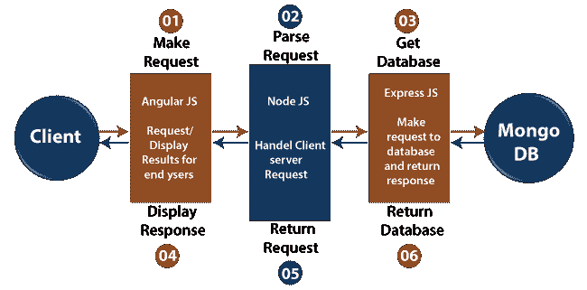

# 均值栈的体系结构

> 原文：<https://www.javatpoint.com/architecture-of-mean-stack>

MEAN.js 旨在构建一个健壮的框架，帮助开发人员在使用流行的 JavaScript 组件时使用更好的实践，构建一个健壮的框架来支持日常开发需求，并通过连接到 [MongoDB](https://www.javatpoint.com/mongodb-tutorial) 、 [Express.js](https://www.javatpoint.com/expressjs-tutorial) 、 [Node.js](https://www.javatpoint.com/nodejs-tutorial) 、 [AngularJS](https://www.javatpoint.com/angularjs-tutorial) 框架来解决常见问题。对于后端和前端，**MEAN 栈**非常简单易用。有几种技术在客户端和服务器端执行时使用不同的语言。在 MEAN 技术中，我们只对客户端和服务器端使用一种语言。

为了构建一个应用程序，MEAN 栈包括以下四个构建块，如下所示:

### MongoDB

MongoDB 是一个文档数据库，其中的数据存储在灵活的、类似 JSON 的文档中。

### Express.js

Express.js 是 Node.js 的一个 web 应用框架，一个灵活的 **Node.js** web 应用框架用来使开发过程变得容易，被称为 **Express.js** 。

### 安古斯

AngularJS 是一个用 [JavaScript](https://www.javatpoint.com/javascript-tutorial) 编写的 web 前端框架。使用 AngularJS，我们可以用 MVC (MVC 代表模型视图控制器)的方式创建单个页面和动态应用程序。

### Node.js

Node.js 是一个服务器端平台，用于设计 web 应用程序，如单页应用程序、视频流站点和其他 web 应用程序。它为我们提供了丰富的各种 JavaScript 模块库。

*   AngularJS 是一种用 JavaScript 编写的客户端语言。因此，首先客户端请求由它处理。
*   之后，请求进入服务器(Node.js)，即阶段 2。Node.js 是一种用 JavaScript 编写的服务器端语言。
*   之后，ExpressJS 向数据库发出请求，并将其视为第 3 阶段。
*   获得请求后，MongoDB 检索数据并将响应返回给 ExpressJS。
*   一个响应从 Express.js 发送回 Node.js，然后由 Node.js 转发到 AngularJS 显示结果。

## 均值栈体系结构的特点

均值堆栈体系结构有以下特点:

1.  MEAN 堆栈架构最重要的特性之一是开发人员用 JavaScript 将整个代码从客户端写到服务器端。
2.  MEAN 栈架构支持 MVC，即模型视图控制器架构。
3.  均值组件是免费的和开源的。
4.  它理解灵活，使用方便。
5.  它帮助开发者根据需求进行定制。
6.  它使用 JSON 进行数据传输，拥有大量的 node.js 模块库。

* * *