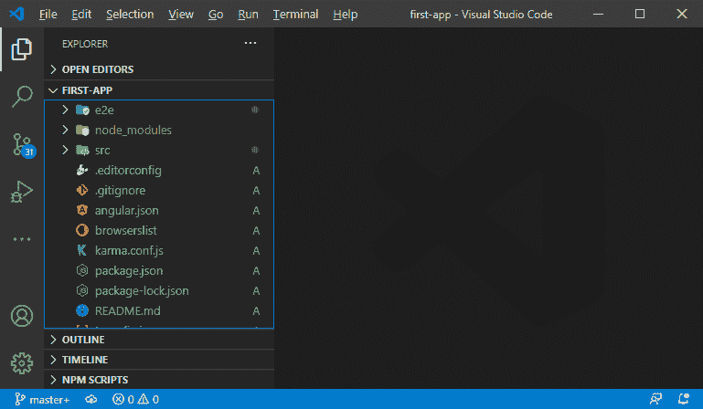
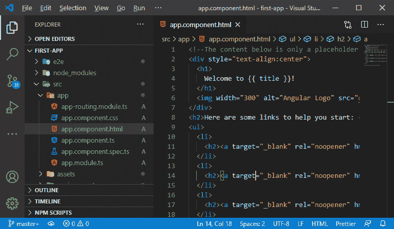
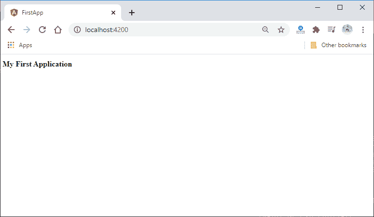
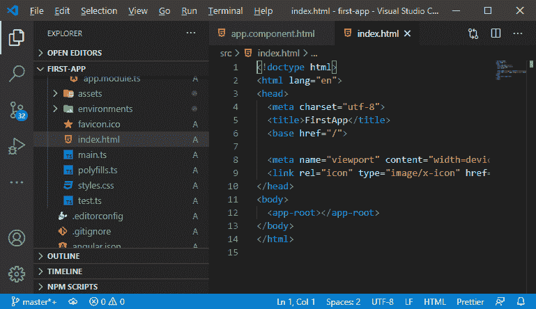
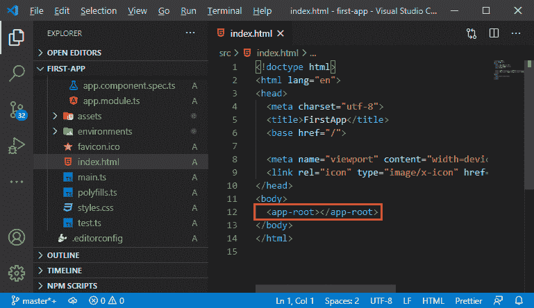
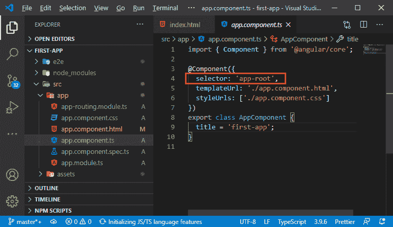
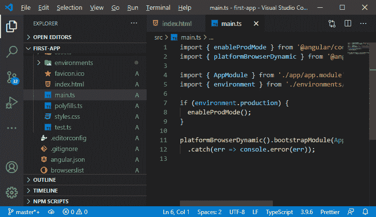
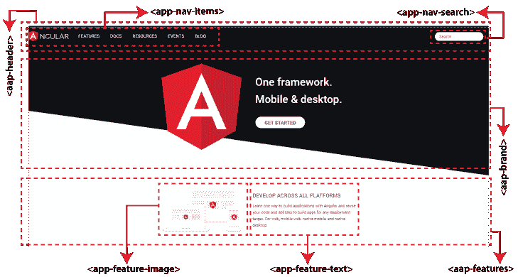

# 探索平均堆栈项目结构

> 原文：<https://www.javatpoint.com/exploring-the-mean-stack-project-structure>

在前面的部分中，我们设置了 MEAN 堆栈组件，安装了 angular CLI，创建了一个 Angular 项目，并安装了 IDE 来对 Angular 项目进行更改。现在，在这一节中，我们将探讨 MEAN 堆栈项目结构。

在 **Visual Studio Code** 中安装了所需的扩展后，我们的项目将如下图所示:



我们将在项目中看到一堆子文件夹和文件。这些文件大部分完全是为了配置，不用担心。

1.  **json** 文件很有趣，因为这个文件包含了项目的所有依赖项和开发专用依赖项。稍后我们将在那里添加一些 MongoDB 依赖项。
2.  我们还将获得用于配置 Typescript 编译的文件，我们不需要为此担心。
3.  我们还会得到用于 Angular CLI 的 **json** 文件，我们也不需要担心这个。
4.  **e2e** 文件夹用于端到端测试，**节点 _ 模块**存储所有在 **json** 中列出的依赖项。
5.  在 **src** 文件夹中，我们的角度应用程序存在于其中。在这里，我们将获得更多的配置文件和一个**应用程序**
6.  在 **-app** 文件夹中，我们将写下我们 Angular 应用的会议。Angular 使用我们稍后将讨论的组件。我们将通过由这些组件组成用户界面来创建整个应用程序。

**app.component.html**文件包含默认应用程序的代码，看起来像:



我们删除这段完整的代码，并编写下面一行代码。一旦我们替换了代码，页面就会自动重新编译并重新加载。要求我们的 ng 服务器在我们的机器上运行。

```

<h1> My First Application </h1>

```



我们创建了一个**单页应用程序**，并且看到在**index.html**中的单页出现在**应用程序**文件夹中。



这个**index.html**档现在由 ng 发球。这个文件不包含太多内容，因为我们的构建工作流会注入脚本导入。

如果我们回到我们的应用程序，我们可以看到我们在页面上看到的是**app.component.html**文件的内容。在这个文件中，我们将构建我们的组件或 html 元素。在**index.html**文件中，我们在正文部分看到一个 html 元素。它不是默认的 [html](https://www.javatpoint.com/html-tutorial) 元素；这是我们的定制组件。



最后，它会检测这个应用程序根元素，并将其与我们组件的内容进行交换。



还有其他必要的文件名 **app.module.ts** 。这个文件对角度很重要。Angular 在应用程序中思考，应用程序被分成模块。

在这个项目中，有一个模块，这个模块定义了我们应用程序的构建块。组件不是[角度](https://www.javatpoint.com/angularjs-tutorial)应用的唯一但可能是最重要的构件。在 **app.module.ts** 文件中，会有一个 **ngModule** ，其中声明了我们的 **AppComponent** 。这是与 angular 配准的。所以，现在 angular 意识到了 **AppComponent** 。仅这一项就只能让我们在另一个角度分量中使用分量选择器，而不能在**index.html**文件中使用。这也可以通过将其添加到引导阵列来实现。

还有一个文件名 **main.ts** 文件。首先执行该文件。



### 角度分量

Angular 认为在**“组件”**。这些组件是我们在使用 angular 时必须了解的重要内容之一。本质上，我们组成了这些组件的整个页面。我们用这些组件构建我们的应用程序，因为这样做的优点是我们的用户界面小，易于维护和管理构建块。我们甚至可以重用它，因为有些组件在一个页面上出现不止一次。



在下一节中，我们将学习 Angular 前端，并通过实现来了解它的所有基础知识。

* * *