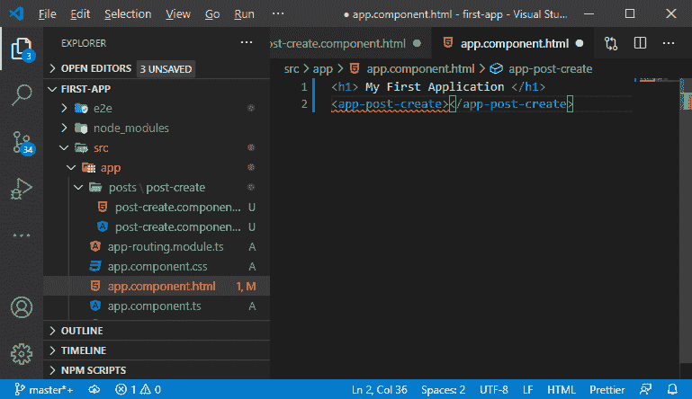

# 在平均堆栈中添加新组件

> 原文：<https://www.javatpoint.com/adding-new-component-in-mean-stack>

在前一节中，我们了解了 MEAN 堆栈的项目结构。现在，我们知道了项目中所有可用的文件和文件夹。在本节中，我们将使用相同的项目，并构建一个应用程序，用户可以在其中创建帖子，阅读他人的帖子，编辑他们的旧帖子，等等。

#### 注意:我们当然不想只在一个组件中处理所有的逻辑，因为那样会很快爆炸。

### 创建新组件

我们将通过转到应用程序文件夹来创建一个新组件。在这个文件夹中，我们管理我们的 angular app。我们将使用以下步骤来创建新组件:

1)我们将在 app 文件夹中创建一个子文件夹，我们通常在其中放置新的组件或组件块，以保持我们的代码有条不紊。我们将创建一个名为**“帖子**”的新子文件夹，只需在应用文件夹上点击鼠标右键。


这个子文件夹将保存所有与帖子相关的组件，每个组件通常由多个文件组成。

2)现在，我们将创建另一个子文件夹，用于组织其中单个组件的文件。您也可以使用更扁平的文件夹结构，并且您不需要使用那么多文件夹，这取决于您。在我们的项目中，我们将采用子文件夹的方式。


3)现在，在这个文件夹中，我们将创建**一个后 create.component.ts** 我们可以给这个文件起任何名字，但是要包含它是 angular 中的一个约定。组件文件中的组件。ts 是一个扩展，因为我们使用 typescript。


4)我们可以在 [typescript](https://www.javatpoint.com/typescript-tutorial) 文件中定义 html 模板，但是由于我们有一个更复杂的模板。所以，最好创建一个单独的文件。我们将创建一个 html 文件名**post-create.component.html**。


5)在我们的 typescript 文件中，我们通过简单地创建一个新类来创建一个组件。类是一种类型脚本特性，在最新的 [JavaScript](https://www.javatpoint.com/javascript-tutorial) 版本中也有。它允许我们为一个对象创建一个蓝图。但是，我们永远不会自己创建那个组件对象。我们只是把它交给 angular，angular 会实例化它，创建它，并使用它。

我们只能定义这样一个组件看起来是什么样子，这包括它的名称。

```

import { Component } from '@angular/core';

@Component({
  selector: 'app-post-create',
  templateUrl: './post-create.component.html',
})
export class PostCreateComponent {

}

```

在上面的代码中，

1.  我们在代码的底部创建了一个 PostCreateComponent 类。
2.  我们通过添加装饰器 **(@Component())** 把它变成了一个组件。这是因为棱角分明可以理解它是什么。
3.  组件装饰器以 JavaScript 对象的形式进行一些配置。因此，我们将模板定义为对象。本质上，我们在代码中传递了模板的 URL。
4.  我们还在组件中添加了一个选择器。选择器允许我们使用该组件。


6)我们还想给模板添加一些东西。我们将在我们的**post-create.component.html**中编写 html 代码


7)现在，我们将在 app.component.html 文件中使用它。我们将转到该文件，并使用选择器调用我们的组件。



8)如果我们保存它并运行我们的应用程序，我们将看到一个空白屏幕。它将向我们显示一条错误消息“app-post-create 不是已知元素”。如果我们想使用它，我们必须显式注册一个组件。我们将在 app.module.ts 文件中执行此操作。因此，我们将导入我们的组件，并将其添加到声明中，如下所示:

```

import { PostCreateComponent } from './posts/post-create/post-create.component';
declarations: [
    AppComponent,
    PostCreateComponent
  ],

```


现在，我们保存它，可以在浏览器中看到“post create 组件”。


* * *