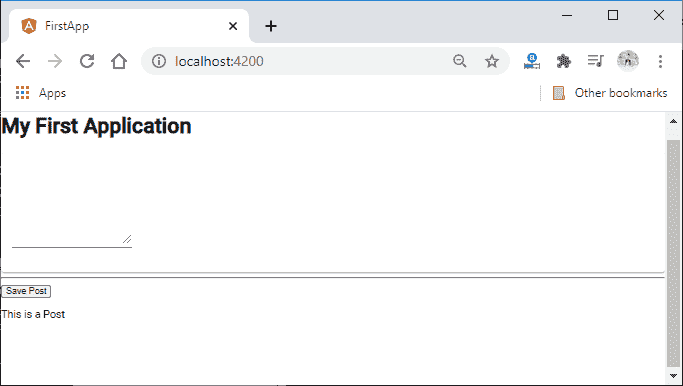
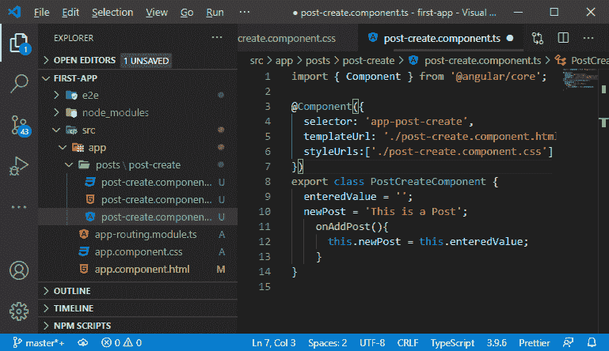

# 在平均堆叠中安装角形材料

> 原文：<https://www.javatpoint.com/installing-angular-material-in-mean-stack>

在前一节中，我们学习了如何创建用户界面，并从用户界面内容中获取用户输入。现在，是时候开发我们正在构建的真实应用程序了。我们想设计一个漂亮的应用程序。我们可以自己写所有的 CSS 样式，从头开始写一切。但是我们正在使用MEAN 栈，我们希望专注于MEAN 栈组件，而不是样式。

我们将使用 **[Angular](https://www.javatpoint.com/angularjs-tutorial) Material** ，这是由 Angular 团队的部分成员创建的包。有角材质给我们提供了一组预建的有角组件。它不像 bootstrap 那样是一个造型包。它附带了几个角度分量，可以在我们的应用中丢弃。


如果我们看 material.angular.io 上的组件部分，我们会看到一堆预构建的组件，它们应该会为我们提供构建一个好的应用程序所需的一切。


现在，我们将通过安装它来将其添加到我们的项目中。我们将打开命令提示符，并使用以下 npm 命令进行安装:

```

npm install - save @angular/material

```

这是添加它的一种方式。现在，如果我们使用的是最新的 CLI 版本，那么我们对此有不同的命令:

```

ng add @abgular/material

```

这个命令不仅安装了材料包，还配置了我们的项目来包含它。


现在，我们将回到我们的项目，要使用这样的输入元素，我们需要解锁它，因为默认情况下，单个材质提供的组件在我们的应用程序中都不可用。这样做是为了节省空间，我们不需要导入不使用的东西。因此，我们将从我们的 **app.module.ts** 文件中的角度材质导入 **MatInputModule** ，并且我们还将它添加到导入数组中。它将解锁所有与输入相关的组件。

```

import { MatInputModule } from '@angular/material';  
imports: [
    BrowserModule,
    AppRoutingModule,
    FormsModule,
    MatInputModule,
    BrowserAnimationsModule
  ],

```


#### 注意:如果我们使用的是 8 版角形材质包，这种添加角形材质组件的方式才是正确的。如果我们使用的是版本 9 或更高版本的角形材质，则可以通过以下方式导入材质组件模块:

```

import { MatInputModule } from '@angular/material/input'; 

```

现在，我们将回到我们的 post-create.component.html 档案。在文本区域，我们将简单地通过以下方式将**匹配**添加到文本区域:

```

<textarea matInput rows = "6" [(ngModel)] = "enteredValue"></textarea>

```

这一行在文本区域没有任何区别，因为这些输入组件只与另一个组件一起工作。我们必须按照以下方式将这条线包装成 **<垫形场></垫形场>** :

```

<mat-form-field>
  <textarea matInput rows = "6" [(ngModel)] = "enteredValue"></textarea>
</mat-form-field>

```

如果我们运行它，它将看起来像:


它还不漂亮，但我们会把它变成一个更漂亮的组件。所以，我们将使用角度材料框架中的另一个组件，即 MatCardModule。

```

import { MatCardModule } from '@angular/material'
  imports: [
    MatCardModule,
  ],

```

之后，我们用 **<垫卡></垫卡>** 包裹我们的 **<垫场</垫场>:**

```

<mat-card>
  <mat-form-field>
    <textarea matInput rows = "6" [(ngModel)] = "enteredValue"></textarea>
  </mat-form-field>
</mat-card>

```

现在，我们运行它，它看起来像:



现在，我们将通过添加一些自定义样式来限制宽度。我们将创建一个新文件**post-create . component . CSS**，并通过 typescript 文件导入该文件。




现在，我们将按照以下方式在那里编写自己的 **[CSS](https://www.javatpoint.com/css-tutorial)** 代码:

```

mat-card{
  width: 80%;
  margin: auto;
}

```

现在，我们将保存并运行它。运行后，我们的浏览器屏幕将如下所示:


现在，我们可以在这里看到卡片，而且更好一点。我们对文本区也不满意。因此，我们还将按照以下方式为此编写样式表代码:

```

mat-form-field,
textarea{
  width: 100%;
}

```


现在，我们将像处理文本区域一样处理按钮的样式。我们还将使用角形材质提供的按钮。我们将通过从角度材质导入 **app.module.ts** 文件中的“导入”数组来添加 **MatButtonModule** 。

```

import {MatButtonModule} from '@angular/material/button';
imports: [
    BrowserModule,
    AppRoutingModule,
    FormsModule,
    MatInputModule,
    MatCardModule,
    MatButtonModule,
    BrowserAnimationsModule
  ],

```

现在，我们将通过添加以下代码行在我们的**post-create.component.html**文件中使用它:

```

<button mat-raised-button (click) = "onAddPost()" > Save Post </button>

```

我们使用了**垫起按钮**，但是您可以使用任何类型的按钮在有角的材料中。我们还可以给它添加一个颜色属性。我们通过以下方式为其设置原色:

```

<button mat-raised-button color = "primary" (click) = "onAddPost()" > Save Post </button>

```

现在，我们将保存它并在浏览器上运行它，看到我们的应用程序带有一个样式按钮，如下所示:


在下一节中，我们将学习如何使用 angular 创建工具栏。

* * *