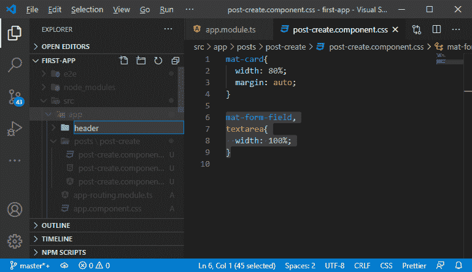
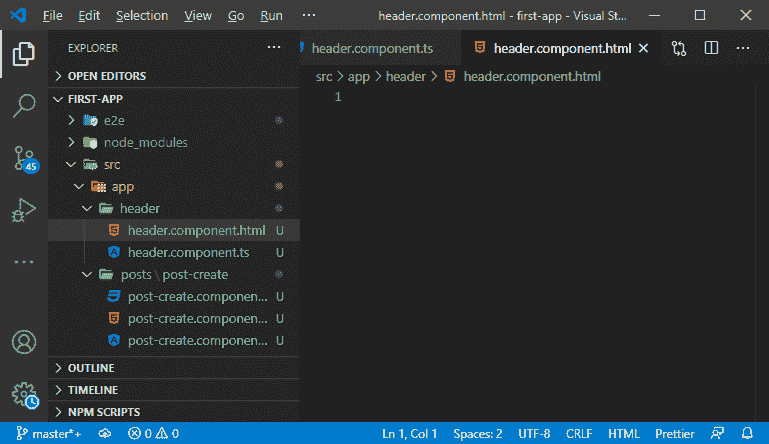
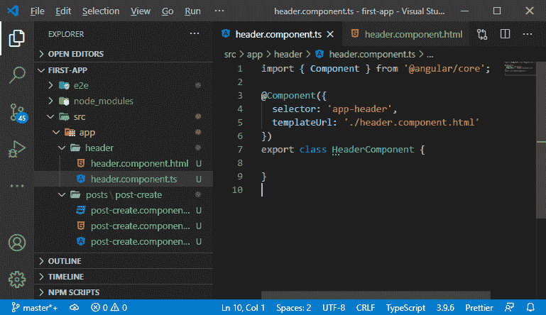
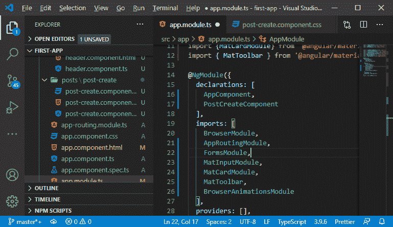
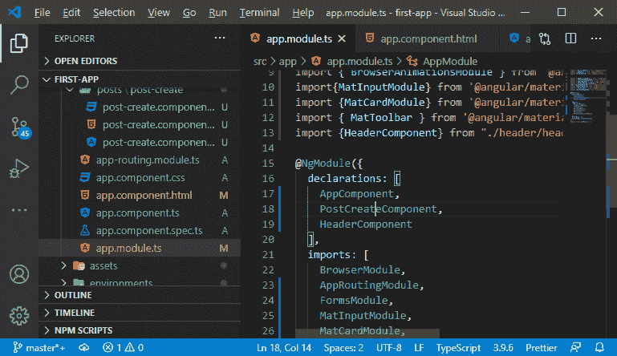
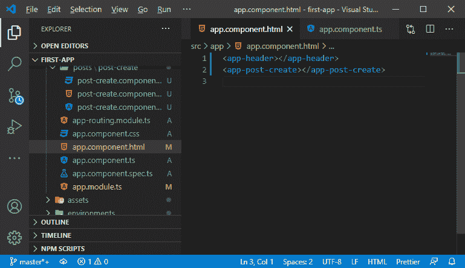
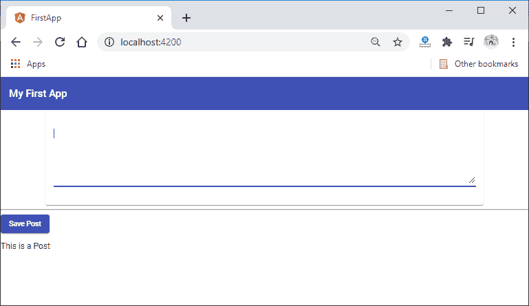
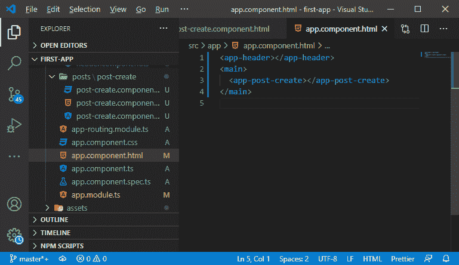
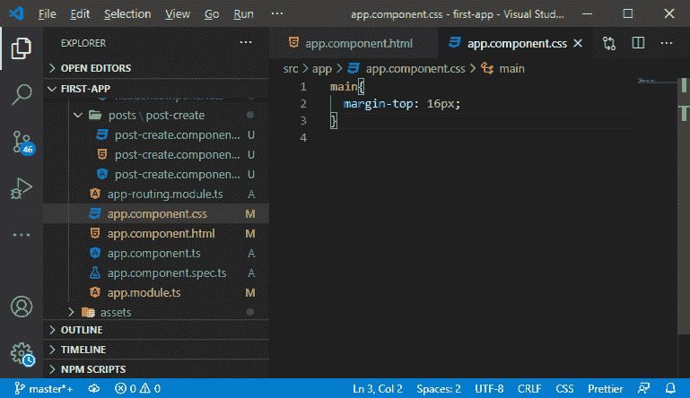
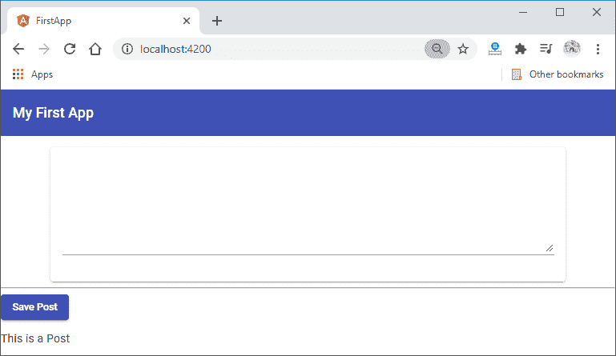

# 使用MEAN 栈创建工具栏

> 原文：<https://www.javatpoint.com/creating-a-toolbar-using-mean-stack>

在教程的这一部分，我们将学习如何在应用程序中使用 MEAN 栈和角度材质组件创建工具栏。我们应该知道，每个应用程序都有某种报头。

为此，我们将创建一个新组件。我们将在应用程序文件夹中创建一个新文件夹，并赋予它名称头。



在这个文件夹中，我们将创建我们的 **header.component.ts** 和**header.component.html**文件，就像我们创建 **post-create.component.ts** 和**post-create.component.html**文件一样。



在 **header.component.ts** 文件中，我们将创建类 **HeaderComponent** 并导出类头组件。我们还将从 **@angular/core** 导入**@组件**装饰器。我们将添加选择器和 templateUrl，并用以下方式对这个完整的文件进行编码:

```

import { Component } from '@angular/core';
@Component({
  selector: 'app-header',
  templateUrl: './header.component.html'
})
export class HeaderComponent {
}

```



在 html 文件中，我们将使用 angular/material 组件框架中的另一个组件。我们将解锁 **MatToolbarModule** ，方法是将其导入并将其添加到 **app.module.ts** 文件的导入数组中。

```

import { MatToolbarModule } from '@angular/material/toolbar'
  imports: [
    BrowserModule,
    AppRoutingModule,
    FormsModule,
    MatInputModule,
    MatCardModule,
    MatToolbarModule,
    BrowserAnimationsModule
  ],

```



现在，我们将在应用程序中使用材质设计工具栏。因此，我们将在我们的**头文件中添加以下代码行:**

```

<mat-toolbar>My First App</mat-toolbar>

```

我们也可以给它设置颜色。我们将颜色设置为**原色**，因为浅灰色看起来不太好。

```

<mat-toolbar color= "primary"> My Message </mat-toolbar>

```

标题组件尚未使用。为了使用它，我们需要通过 app.module.ts 文件中的声明来解锁它。因此，我们将通过以下方式导入组件，从而在声明中添加组件:

```

import {HeaderComponent} from "./header/header.component";
  declarations: [
    AppComponent,
    PostCreateComponent,
    HeaderComponent
  ],

```



现在，我们可以使用头部组件。我们将通过添加以下代码行将其添加到我们的**app.component.html**文件中:

```

<app-header></app-header>

```



我们将保存所有文件，并运行它们到 ng 服务。在本地主机上运行后，我们会在浏览器上看到一个工具栏，如下所示:



卡片直接放在工具栏的边缘，为了改变它，我们用主元素以下面的方式包装我们的主要内容:

```

<app-header></app-header>
<main>
  <app-post-create></app-post-create>
</main>

```



现在，我们将通过以下方式在 app.component.css 文件中编写 [CSS](https://www.javatpoint.com/css-tutorial) 代码来对该组件进行样式化:

```

main{
  margin-top: 16px;
}

```



我们将保存并运行它，应用程序将如下所示:



在下一节中，我们将学习导航。我们将在其中添加导航，使其成为一个有吸引力的应用程序。

* * *