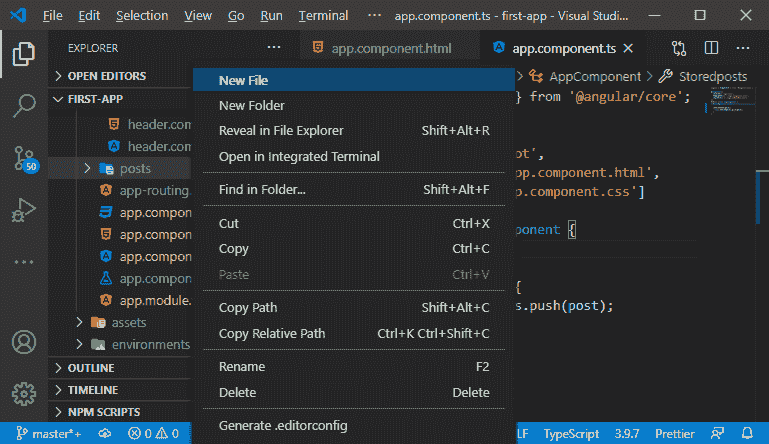
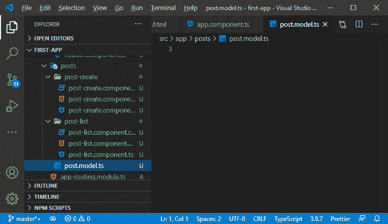
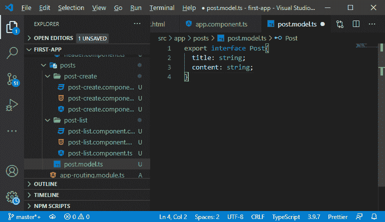
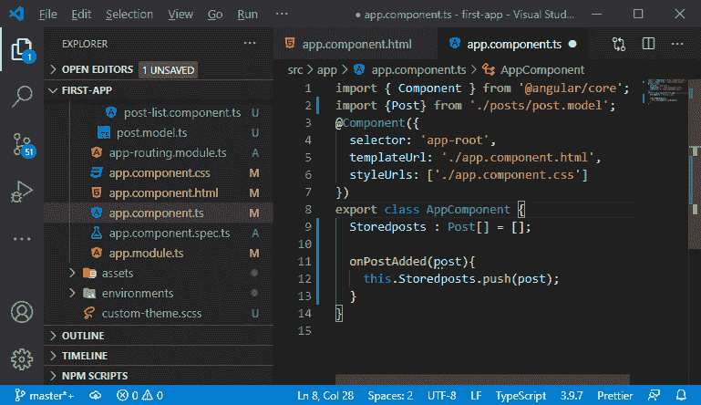
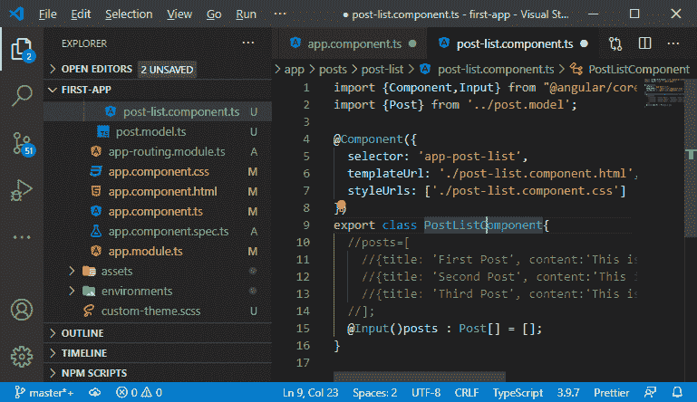
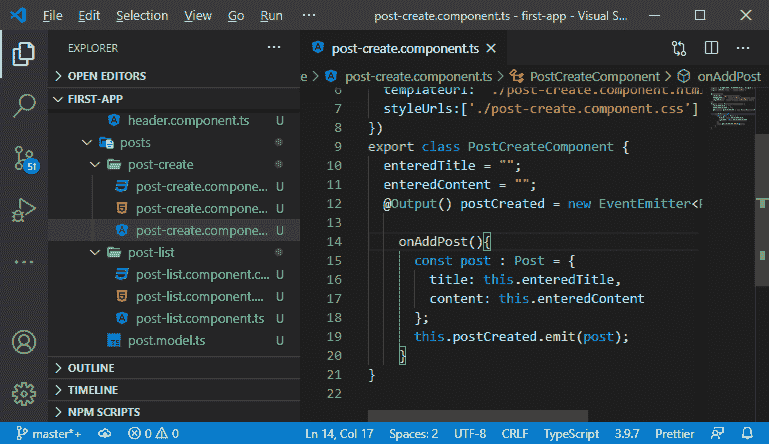

# 在 MEAN 栈中创建模型

> 原文：<https://www.javatpoint.com/creating-a-model-in-mean-stack>

在前一节中，我们学习了属性和事件绑定。我们得到一个工作链，在这里我们添加一个新的帖子，并将其输出到扩展面板中。在本节中，我们将优化我们的代码。

在我们的代码中，我们在不同的地方使用帖子。我们确保它们具有相同的结构、标题和内容，这是在我们创建它们时完成的。我们在输出它们时依赖这种结构。

在 **app.component.ts** 文件中，我们有一个数组，我们可以在这里存储任何东西。我们可以在这个数组中存储一个数字。几周或几个月后，如果我们回到我们的应用程序，我们可能很难立即弄清楚我们存储在那里的是哪种数据，是内容后数据还是描述后数据。现在，为了有意义，我们将创建一些模型，这些模型是蓝图或对比，定义了一个帖子在我们的角度应用程序中的外观。我们将按照以下步骤在应用程序中创建模型:

1)我们将在我们的**帖子**文件夹中创建一个新文件，而不是一个文件夹，并将其命名为**模型。这个文件将用于为我们的帖子创建一个模型。**




2)在这个文件中，我们将使用另一个名为接口的 typescript 特性。接口就像一个定义对象外观的类。接口不能被实例化，它更像一个契约。我们用它来创建我们自己的类型，迫使某个对象看起来像这样。

我们为接口定义了它应该有的字段和方法。我们定义了一个标题字段和一个内容字段，内容字段的类型应该是 string，这个接口的编码方式如下:

```

export interface Post{
  title: string;
  content: string;
}

```

它明确定义了帖子在我们的应用程序中的外观。在上面的代码行中，我们使用了导出，因为我们也将在其他组件中使用它。



3)现在，我们将返回到我们的 **component.ts** 文件，并从 **post.model.ts** 文件导入**Post**界面。现在，我们将创建类型为 **Post** 的 **Storedpost** 数组，只需添加一个冒号，然后按照以下方式 post []:

```

import {Post} from './posts/post.model';
Storedposts : Post[] = [];

```



4)我们也将回到我们的**帖子列表. component.ts** 文件，这里我们也对帖子列表做同样的事情。我们将按照以下方式制作**岗位**类型的岗位列表:

```

import {Post} from '../post.model';
@Input()posts : Post[] = [];

```



5)我们还将返回到我们的 **post-create.component.ts** 文件，并导入 **post** 。当<sup>我们</sup>创建一个帖子，那么它应该是**帖子**类型。因此，我们将使类型**的恒定岗位属性成为岗位**。我们还需要在发射器中定义 Post 类型，因为我们需要定义将要发射的数据是 Post 类型的。所以，这个完整的东西是用以下方式编码的:

```

import {Post} from '../post.model';
export class PostCreateComponent {
  enteredTitle = "";
  enteredContent = "";
  @Output() postCreated = new EventEmitter();

    onAddPost(){
      const post : Post = {
        title: this.enteredTitle,
        content: this.enteredContent
      };
      this.postCreated.emit(post);
    }
} 
```



在下一节中，我们将了解表单以及如何在应用程序中添加表单。

* * *