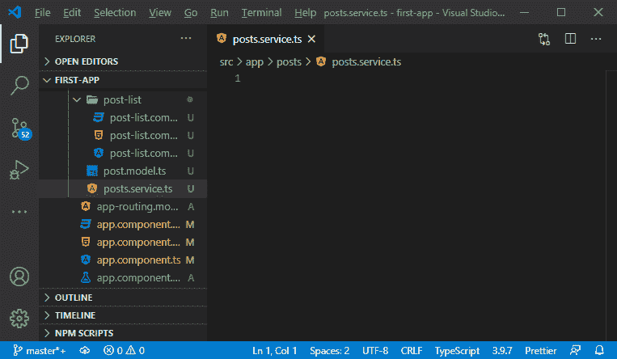
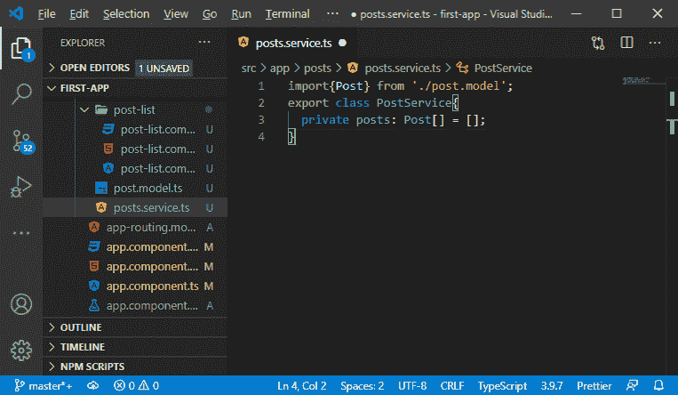
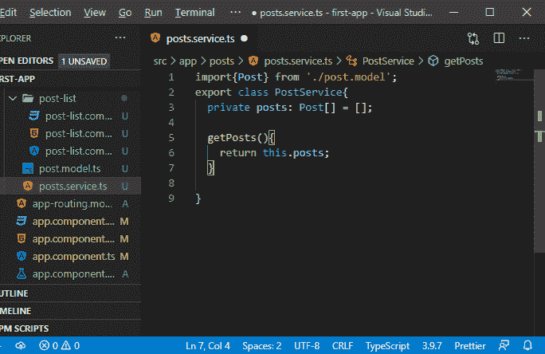
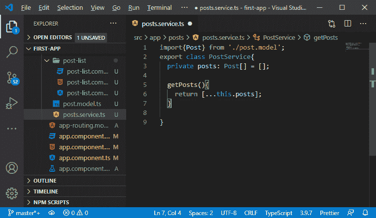
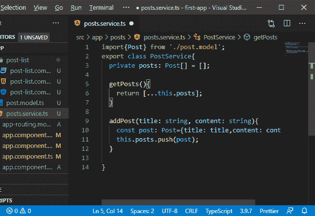
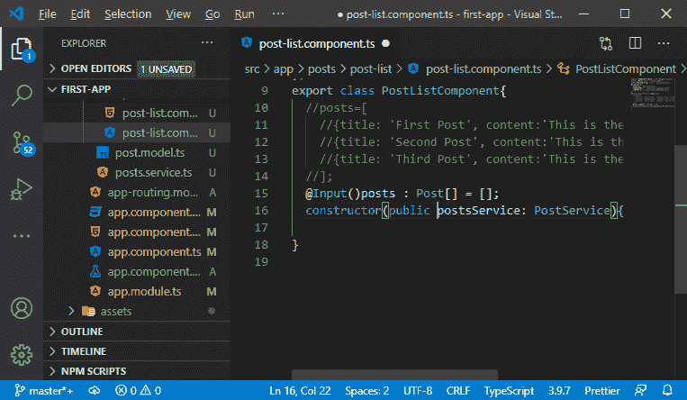
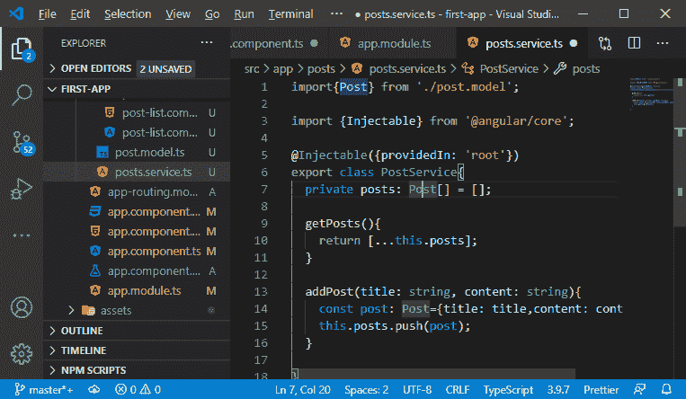

# 平均栈中的服务

> 原文：<https://www.javatpoint.com/service-in-mean-stack>

在前一节中，我们学习了表单以及如何在应用程序中使用它们。在这一节中，我们将学习如何从后创建组件到后列表组件获取新帖子。

之前，

1.  我们有一系列的属性和事件绑定。
2.  我们在创建后组件中发布了我们的帖子。
3.  我们将这个帖子传递给它的父组件。
4.  从父组件，我们将其传递给后列表组件。

这很好。但是在更大的应用中，它变得越来越典型。这样做的原因是因为我们有更长的属性和事件绑定链来获得从组件 X 到 Y、Y 到 Z 等等的元素。

这不是我们想要建立的。因此，我们将使用另一种方式在组件之间传递数据，即**服务**。服务是由 angular 注入组件的类。服务能够集中一些任务，并提供从不同组件内部对数据的简单访问，而无需属性和事件绑定。我们将使用以下步骤向应用程序中添加服务:

1)我们将在**帖子**文件夹中创建新文件，并将其命名为 **service.ts** 。我们将以创建**post . model . ts**文件的相同方式创建该文件。



2)在这个文件中，我们将创建一个服务类，它是一个 typescript 类。我们使用 export 关键字创建这个类，因为我们将这个类用于不同的组件。在这个类中，我们必须添加一个帖子列表，因此我们将创建一个类型为**帖子**的**帖子**数组，如下所示:

```

import{Post} from './post.model';
export class PostService{
  private posts: Post[] = [];
}

```

**帖子属性**是私有的，因为我们不希望有人从外部更改。



3)现在，我们将创建一个名为**getpost**的新方法。这个方法将帮助我们检索帖子。在这个方法中，我们将像这样返回帖子:

```

  getPosts(){
    return this.posts;
  }

```



4)我们不想返回原始数组，因为数组和对象在 JavaScript 和 typescript 中都是引用类型。引用类型是这样一种类型，如果我们试图复制它，它就不会被复制。内存中的对象将保持不变。我们只是复制了地址，所以指针指向那个对象，而不是值。因此，为了制作它的真实副本，我们将使用 spread 运算符，它是下一代 JavaScript 特性，具体如下:

```

  getPosts(){
    return [...this.posts];
  }

```

在上面的代码中，我们添加了方括号来创建一个新的数组，这三个点用于获取 posts 数组的所有元素，并将它们添加到这个新数组中。



5)我们还创建了 **addPost()** 方法，这个方法将帮助我们在数组中添加一个 Post。在这种方法中，我们可以传递一篇文章，也可以传递一个标题和一个内容。之后，我们将创建一个类型为 post 的新帖子。它是一个有标题和内容属性的 JavaScript 对象。我们定义了属性，并将这个新创建的帖子推送到**帖子**数组中，如下所示:

```

addPost(title: string, content: string){
    const post: Post={title: title, content: content};
    this.posts.push(post);
}

```



我们将在**后列表组件**和**后创建组件**中使用它们。通过使用这个，我们可以在不传递带有属性和事件绑定的数据的情况下获取和添加帖子。我们可以通过在后创建和后列表组件中使用该服务来做到这一点。我们将该服务与一个名为依赖注入的特性结合使用。

6)因此，我们将转到我们的帖子列表组件，并创建一个构造函数。每当 angular 创建此组件的实例时，都会调用此构造函数。Angular 有一个复杂的依赖注入系统，它能够发现我们想要什么，并确实给我们。因此，我们必须在构造函数中将服务定义为一个参数，如下所示:

```

import{PostService} from '../posts.service';

constructor(postService: PostService){

}

```

在上面的代码中， **postService** 是一个参数， **PostService** 是该参数的类型，用来提示它实际上应该给我们什么。

7)现在，我们需要一个属性来存储服务的实例。我们可以创建一个新的属性来存储服务的实例，也可以将构造函数的 **postService** 参数公开。

**通过创建新属性:**

```

  postsService : PostService;
  constructor(postsService: PostService){
    this.postsService = postsService;
  }

```

**通过将 postsService 变量公之于众:**

```

constructor(public postsService: PostService){}

```



8) Angular 目前无法满足这一要求，因为它不知道邮政服务。这背后的原因是它没有扫描我们所有的文件。所以，要让 angular 知道，我们有两种方法:

1.通过转到 app.module.ts 文件并在那里添加 postService。我们将在**提供程序**数组中添加邮政服务，如下所示:

```

import {PostService} from './posts/posts.service';
  providers: [],
  bootstrap: [AppComponent, PostService]

```

2.我们将转到邮政服务，并向其中添加一个@ injectable 参数。这种注射剂也是从@angular/core 进口的。在括号之间，我们传递了一个 JavaScript 对象，以如下方式进行配置:

```

import {Injectable} from '@angular/core';

@Injectable({providedIn: 'root'})

```



在下一节中，我们将学习如何调用 getPosts 和 addPost 函数，并将快速查看界面。

* * *