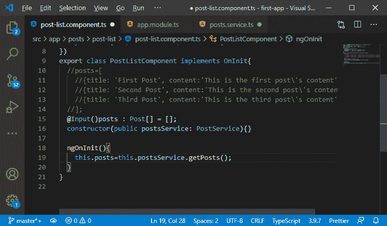
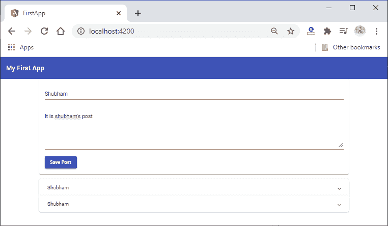
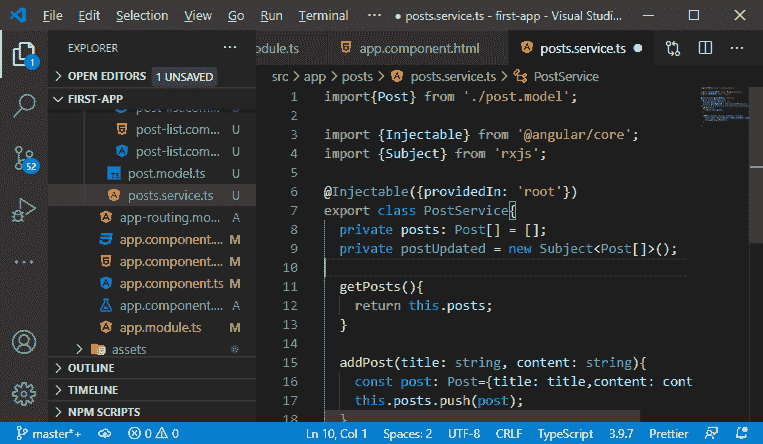

# MEAN 栈中的生命周期挂钩

> 原文：<https://www.javatpoint.com/lifecycle-hooks-in-mean-stack>

在前一节中，我们了解了服务，以及我们如何让 angular 了解服务。我们在 postService 类中创建了 getPosts 和 addPost 函数。现在，在这一节中，我们将学习如何调用 getPosts 和 addPost 函数。我们还将看一下界面。

Angular 提供了生命周期挂钩，当 angular 创建组件时，它将自动执行生命周期挂钩。 **onInit** 是我们在应用程序中使用的生命周期挂钩之一。

onInit 是一个接口类。因此，我们将实现它，并且我们还重写它的抽象方法，即 ngOnInit()方法。Angular 在创建这个组件时会自动为我们执行这个方法。我们将通过以下方式实现这一点:

```

import {Component,Input, OnInit} from "@angular/core";
export class PostListComponent implements OnInit{
  @Input()posts : Post[] = [];
  constructor(public postsService: PostService){}
  ngOnInit(){    
  }
}

```


2)现在，我们将在 **ngOnInit()** 中调用 getPosts 函数，我们使用**postservice**属性以下列方式调用 getPosts()函数:

```

  ngOnInit(){
    this.posts=this.postsService.getPosts();
  }

```



3)现在，我们将调用 addPost()函数或方法。我们将返回到我们的后期创建. component.ts 文件。我们将使用构造函数将这个文件与我们的服务连接起来，就像我们在 **post-list.component.ts** 文件中所做的那样。现在，我们不使用发射器和输出。我们从代码中删除这两个函数，并以下列方式调用 addPost(0)函数:

```

import{PostService} from '../posts.service';
export class PostCreateComponent {
  enteredTitle = "";
  enteredContent = "";

   constructor(public postsService: PostService){}

    onAddPost( form: NgForm){
      if(form.invalid){
        return;
      }
      this.postsService.addPost(form.value.title, form.value.content )
    }
}

```


4)现在，我们需要从文件中删除一些代码，因为我们现在使用的是服务，而不是事件绑定。我们将@Input()从 **post-list.component.ts** 中移除，我们将返回到我们的**post . service . ts**文件，在该文件中，我们无法获取帖子的副本，因此我们需要用以下返回语句替换 getPosts 返回语句:

```

return this.posts;

```


我们也从**app.component.html**文件中移除绑定。我们也将其从 **app.component.ts 文件**中删除。


我们保存所有更改，并在服务器上运行我们的应用程序。它的工作方式与处理属性和事件绑定的方式相同。



还有另一种复制帖子的方法，以避免在任何获取我们帖子的组件中对帖子进行不必要的操作。我们将使用事件驱动的方法，在这种方法中，我们积极地向组件推送关于新帖子的信息。为此，我们可以使用事件发射器，但它意味着要与那个 **@output** 装饰器结合使用。取而代之的是，我们将使用 **Rxjs** 包提供的另一个功能，即**主题**。

**Rxjs** 是关于可观察性的，也是一个更难理解的概念。这个包是关于对象的，帮助我们在组件之间传递数据。这个特征不是角度的一部分，而是核心的依赖。我们将使用以下步骤在我们的应用程序中使用此功能:

1)我们需要从**rjs**导入**主题**我们可以说**主题**是一个事件发射器，但是它不同，因为它是为了更广泛的使用。

```

import {Subject} from 'rxjs';

```


2)我们将创建此主体作为私有财产。我们将使用与发射器相同的语法。我们将创建**主题**的实例，并将其传递给该属性。我们还将通过以下方式传递帖子列表作为有效负载:

```

  private postUpdated = new Subject(); 
```



3)我们不只是想更新帖子；我们也想释放新的价值。我们将使用 next 而不是 emit，并通过以下方式传递我们想要发出的新值:

```

this.postUpdated.next([...this.posts]);

```

**[…this.post]** 创建了一个新的数组，其中包含复制的帖子元素。


4)现在，我们想听主题，因为每当我们添加帖子时，它都会发出声音。我们将**后期更新后的**属性创建为私有，因此我们不能直接访问它来防止其他组件用它发出数据。因此，我们将添加一个新的方法**getpostpupdatelistener()，**并且在这个函数中，我们将添加以下代码行:

```

getPostUpdateListenetr(){
        return this.postUpdated.asObservable();
}

```

这个 return 语句用于返回一个我们可以监听的对象。

5)现在，我们将回到我们的**帖子列表。组件。ts** 我们仍然会在开始时获取帖子列表，即使它现在保证是空的。但是在这里，我们还将通过以下方式为该主题设置一个侦听器:

```

this.postsService.getPostUpdateListenetr().subscribe();

```

**subscribe()** 功能用于此处的订阅。subscribe 函数有三个参数，即第一个参数是每当发出新数据时执行的函数，**第二个参数是每当发出错误时调用的函数，第三个参数是每当可观测值完成时调用的函数，或者不再有可预期的值。所以，我们在这里只传递第一个参数，因为两者都不是必须的。**

```

this.postsService.getPostUpdateListenetr().
subscribe((posts: Post[])=>{
      this.posts = posts; 
});

```

6)现在，我们将把订阅存储在订阅类型的新属性中。我们将从 **rxjs** 导入订阅，创建属性，并将订阅以以下方式存储在其中:

```

import {Subscription} from 'rxjs';
private PostSub: Subscription;
this.PostSub=this.postsService.getPostUpdateListenetr().
subscribe((posts: Post[])=>{
this.posts = posts; 
});

```


7)现在，每当这个组件被销毁时，我们都需要取消订阅。还有一个生命周期挂钩，即 **OnDestroy** 。我们将实现这一点，这将迫使我们添加另一个方法，即 **ngOnDestroy** 。每当要移除此组件时，都会调用此方法。我们将以下面的方式添加这个钩子和方法:

```

export class PostListComponent implements OnInit, OnDestroy {
….
….
ngOnDestroy(){
    this.PostSub.unsubscribe();
  }
}

```

这将删除订阅并防止内存泄漏。

当我们保存它并在网络服务器上运行它时，它会工作得很好。


* * ***