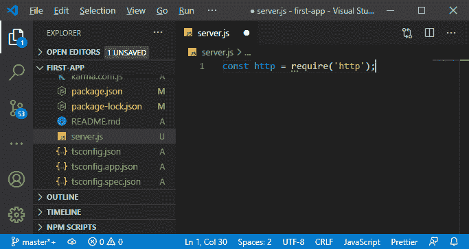

# 在MEAN 栈中添加节点后端

> 原文：<https://www.javatpoint.com/adding-the-node-backend-in-mean-stack>

在前一节中，我们学习了将应用程序与节点服务器连接的方法，并介绍了理论部分。在本节中，我们将把我们的应用程序与节点后端连接起来。

我们现在将通过以下方式构建一个完全独立的后端:

1)我们可以在新项目的新文件夹中执行此操作。但是我们将在同一个文件夹中进行，这样文件之间的切换对我们来说就越来越容易。

**节点:**节点代码实际上与我们的角度代码无关。

所以，我们将把它放在一个单独的文件夹中。我们将在我们的源文件夹旁边创建一个新文件夹，并给它一个名称**后端**。名字完全由我们决定，可以是我们想要的任何名字。


2)我们将创建一个单独的 [JavaScript](https://www.javatpoint.com/javascript-tutorial) 文件，这将是我们的服务器，因为这对 nodejs 很重要。与 [PHP](https://www.javatpoint.com/php-tutorial) 不同，我们需要一个单独的服务器软件，比如 Apache 或 [Nginx](https://www.javatpoint.com/nginx-tutorial) ，对于 nodejs，我们也用 [nodejs](https://www.javatpoint.com/nodejs-tutorial) 创建服务器。意思是我们自己写。我们将在根文件夹中创建此文件。通过在根文件夹中添加这个文件，我们将更容易执行。


现在，这个 server.js 文件可以用 nodejs 执行。

3)现在，我们将打开一个新的终端，用节点执行这个 **server.js** 文件。当我们运行这个时，控制台上不会发生任何事情，因为它是一个空白文件。因此，我们将编写以下代码来测试 server.js 文件是否正在运行:

```

console.log( 'Hello' );

```


console 语句是节点的服务器端代码，因此它不监听任何请求。我们可以执行任何带有节点的 JavaScript 文件，除了那些试图访问 DOM 中某些内容的文件。这背后的原因是 nodejs 是服务器端运行时，没有 DOM。

4)现在，我们把这个文件变成一个服务器。首先，我们需要导入一个包，即 nodejs 提供的 **http 包**。nodejs 中导入包的语法与前面的不同。在 nodejs 中，我们需要创建一个变量，并通过以下方式导入带有必需关键字的包:



我们在 **package.json** 文件中找不到这个包，因为这是一个默认的 nodejs 包，它和 nodejs 一起安装在我们的系统中。

5)现在，我们将使用 **http** 包创建一个新的服务器。http 包有一个 **createServer()** 方法，该方法将请求侦听器作为参数。这是一个将为每个传入请求执行的功能，而不用担心该请求的目标路径。

我们通过**中的 [ES6](https://www.javatpoint.com/es6) 箭头功能创建服务器**功能。该函数将接收两个参数，即**请求**和**响应**对象，由 nodejs 传入。这些对象提供了允许我们处理请求和响应的数据和实用方法。

```

http.createServer(( req, res ) => { 

});

```


在这个函数中，我们将对请求做任何我们想做的事情。

6)回应最有意思理解。响应有几个方法，如发出、获取头和获取头等。end 方法是用于结束响应流写入的方法之一。在这个函数中，我们可以添加一些将以文本形式发送的内容。

```

res.end('This is my first response');

```


7)现在，服务器已创建，但尚未处于活动状态。我们需要将该服务器存储在一个新的常量中，因为我们不会更改**服务器**的值。我们将调用服务器的 **listen()** 函数，在这个函数中，我们需要传递一个端口号。该端口在开发期间将为 3000，设置方式如下:

```

const server = http.createServer((req, res)=>{
  res.end('This is my first response');
});

server.listen(3000);

```


我们可以使用该端口或托管提供商的默认端口。我们托管这个是因为这个托管提供商通常会给我们一个端口号，我们希望在生产期间托管我们的应用程序。

因此，我们将使用 **process.env.PORT** 访问环境变量，如果没有设置，则使用 3000。环境变量是动态注入的变量，它们总是在 **process.env** 上被访问，这是 nodejs 的一个特性。环境变量可以由运行这些应用程序的运行时注入。

```

server.listen(process.env.PORT || 3000);

```


现在，如果保存它并在 localhost 3000 上运行，我们将看到如下浏览器:


仅仅用 nodejs 编写所有的代码是非常困难的。为了解决这个困难，我们将添加快递后端。因此，在下一节中，我们将学习如何添加快递后端。

* * *