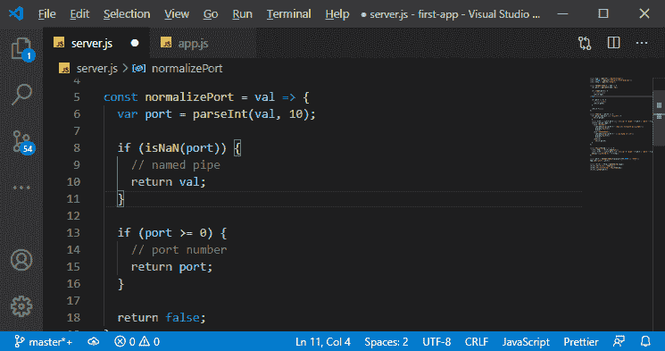
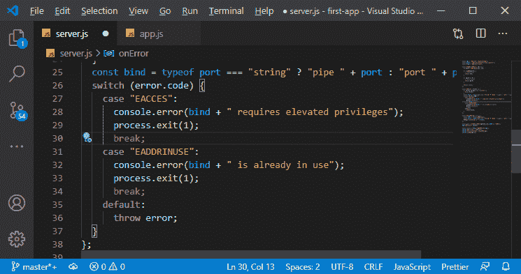
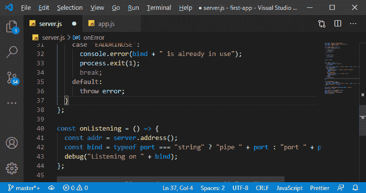
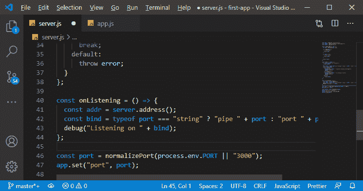
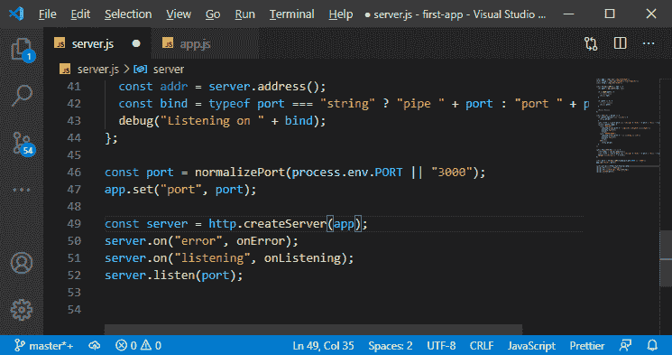
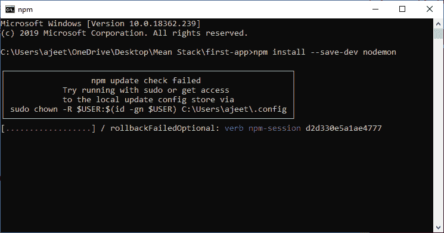
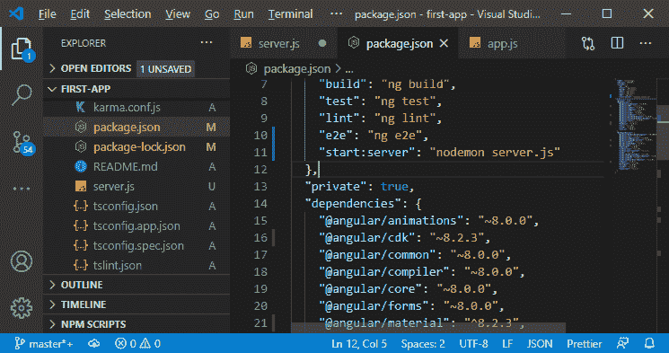
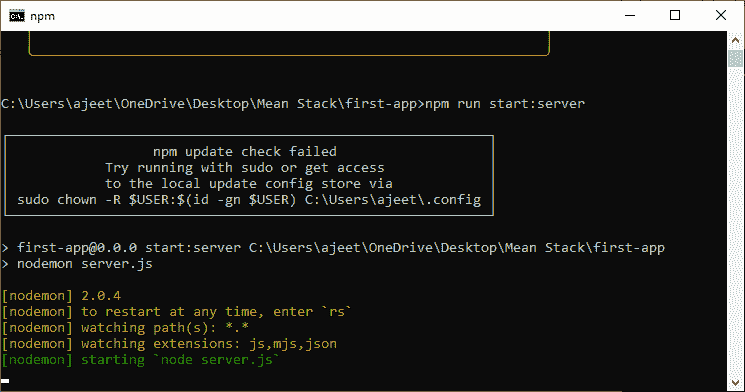
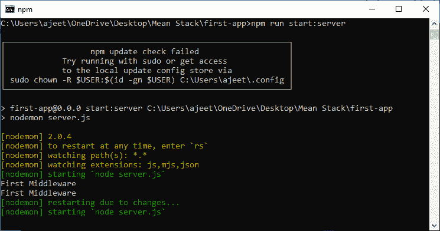

# 在平均堆栈中添加服务器. js 错误处理

> 原文：<https://www.javatpoint.com/adding-error-handling-in-server-js-in-mean-stack>

在前一节中，我们学习了如何添加节点和表达后端。我们设置了基本节点和快速应用程序。现在，我们将通过简单地添加一些错误处理和更好的输出来改进我们的 server.js 文件。我们将在我们的 **server.js** 文件中添加以下几行代码:

1)我们将创建一个**归一化端口**函数。这个函数将是一个更复杂的函数，它确保当我们试图设置一个端口时，当我们通过一个环境变量接收它时，它是一个有效的数字。该功能将被编码为:

```

const normalizePort = val => {
  var port = parseInt(val, 10);

  if (isNaN(port)) {
    // named pipe
    return val;
  }

  if (port >= 0) {
    // port number
    return port;
  }

  return false;
};

```

在上面的代码中，我们将我们的端口解析成一个整数。如果端口号不合法，它会返回 **val** ，即我们传递给函数的原始端口。如果端口大于或等于零，它将返回我们已经解析过的端口。



2)之后，我们将创建 **onError** 函数。该功能将检查发生了哪种类型的错误，记录不同的内容，并优雅地从我们的 [nodejs](https://www.javatpoint.com/nodejs-tutorial) 服务器退出。该功能将以下列方式编码:

```

const onError = error => {
  if (error.syscall !== "listen") {
    throw error;
  }
  const bind = typeof port === "string" ? "pipe " + port : "port " + port;
  switch (error.code) {
    case "EACCES":
      console.error(bind + " requires elevated privileges");
      process.exit(1);
      break;
    case "EADDRINUSE":
      console.error( bind + " is already in use" );
      process.exit(1 );
      break;
    default:
      throw error;
  }
};

```

上面的代码检查了系统调用，并显示了端口的错误，如特权提升、已经在使用等。



3)我们将创建另一个箭头函数，就像 onError 一样。在这个函数中，我们实际上只是记录我们正在监听传入的请求。这个函数很难理解，将按照以下方式进行编码:

```

const onListening = () => {
  const addr = server.address();
  const bind = typeof port === "string" ? "pipe " + port : "port " + port;
  debug( " Listening on " + bind);
};

```



4)然后，我们将通过调用 **normalizePort** 函数来设置端口。在这个函数中，我们将 3000 作为一个字符串传递，因为我们从 process.env.PORT 接收的值将是一个字符串。

```

const port = normalizePort(process.env.PORT || "3000");
app.set("port", port);

```



5)我们将设置节点服务器并将其附加到监听器。首先，我们将为出现错误时可能调用的错误附加服务器。我们还将服务器与监听器连接起来，以便无论何时开始监听，我们都会像下面这样启动服务器:

```

const server = http.createServer(app);
server.on("error", onError);
server.on("listening", onListening);
server.listen(port);

```



6)现在，我们还没有退出服务器，我们需要退出并重新启动它才能看到它的运行。经常退出并重启服务器是很烦人的，为此，我们将安装一个额外的包。这个包使它更容易，并在开发过程中使用。我们将使用以下命令安装软件包:

```

npm install --save-dev nodemon

```



nodemon 代表节点监控。这是一个功能强大的包，可以监视我们的 nodejs 文件或 JavaScript 文件。如果我们在 [JavaScript](https://www.javatpoint.com/javascript-tutorial) 或者 nodejs 文件中更改，它会自动为我们重启节点服务器。

安装后，我们只需要使用它来运行我们的节点服务器。 **nodemon** 命令现在不会工作，因为我们还没有在机器上全局安装它。我们必须在这个项目范围内提供它，为此，我们需要在 **package.json** 文件的脚本部分编写一个脚本。我们将以以下方式注册新脚本:

```

"start:server": "nodemon server.js"

```



现在，我们将使用 npm 简单地运行脚本，如下所示:

```

npm run start:server

```



现在，如果我们更改代码，我们的节点服务器将像这样自动启动:



**下载完整项目(添加错误处理. zip)**

* * *