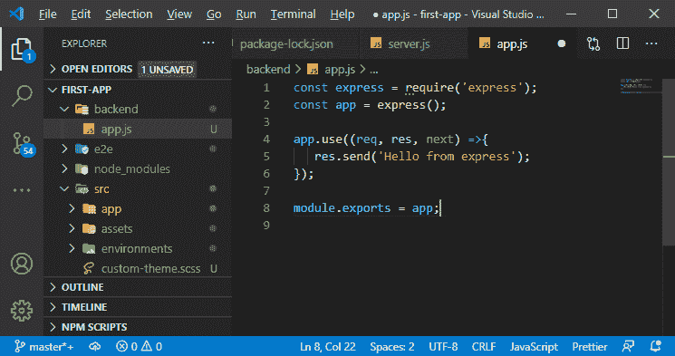
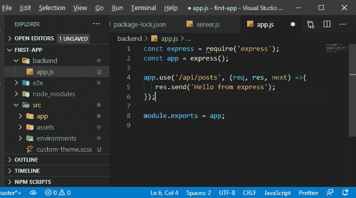
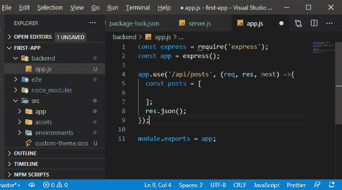
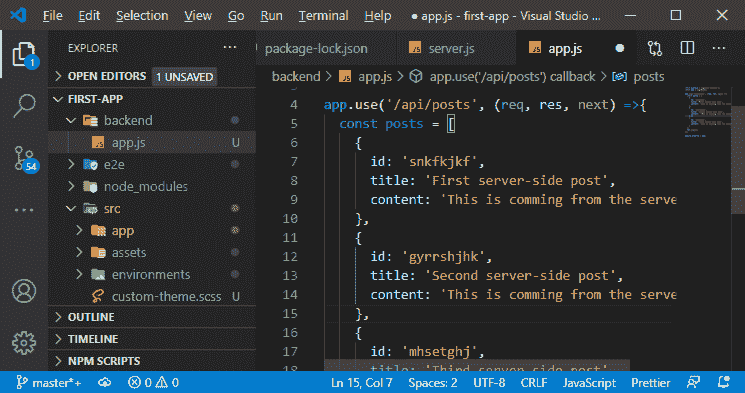
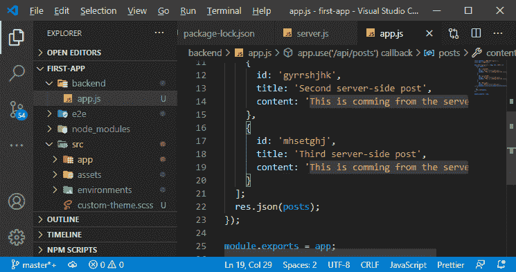
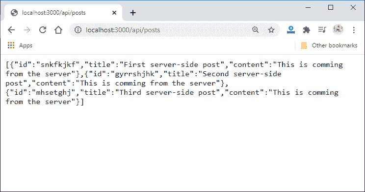
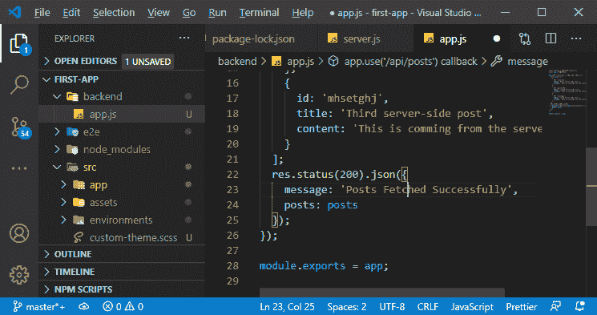
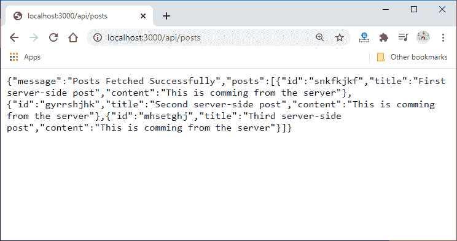

# 从 MEAN 栈中的节点后端获取数据

> 原文：<https://www.javatpoint.com/fetching-data-from-node-backend-in-mean-stack>

在前一节中，我们改进了 server.js 文件。我们添加了一些错误处理代码，并使用 nodemon 包来监控我们项目中的节点。在本节中，我们将学习如何获取帖子。我们将去我们的节点后端获取我们的帖子，即虚拟帖子，因为我们没有数据库。

我们将把所有其他代码添加到我们的快递应用程序中，因为这是一个工具，我们想用它来创建路线，让它变得更加容易。我们将使用以下步骤来获取帖子:

1)在第一步中，我们必须注册一个路径，因为当我们向该路径发送 get 请求时，我们可以获取帖子。为此，我们需要去掉之前创建的冗余中间件。



2)我们将在我们的**使用()**功能中使用中间件。因此，我们将在这里添加另一个参数。我们可以在其中添加尽可能多的参数。之前，我们添加了一个函数作为处理请求的参数。现在，我们将传递一个我们想要过滤掉的路径，作为一个参数。

```

app.use('/api/posts', (req, res, next) =>{
   res.send('Hello from express');
});

```

如果我们添加/post，这意味着只有以 localhost 3000/post 为目标的请求才会到达这个中间件，所有其他的请求都将作废，因为我们现在没有默认的错误处理程序。我们将路径命名为**/API/post**，以明确它是一个 rest API。



3)现在，我们必须瞄准这条路径才能到达代码。我们这里将返回 JSON 数据，所以我们将使用 **json()** 函数。该功能将以 [JSON](https://www.javatpoint.com/json-tutorial) 格式返回数据。我们将使用一个 [javascript](https://www.javatpoint.com/javascript-tutorial) 数组来设置虚拟数据，数组的格式与我们在前端使用的帖子的格式相同。

```

app.use('/api/posts', (req, res, next) =>{
  const posts = [

  ]; 
  res.json();
});

```



4)我们还将引入一个标识，因为如果我们从数据库中获取这些帖子，它们就会有一个标识。

#### 注意:后端代码和数据结构与前端模型完全分离。

我们可能会在后端存储一些不想传递给客户端的额外信息。我们不会将帖子定义为帖子数组中的模型，因为我们在这里没有使用 typescript。我们这样定义帖子:

```

  const posts = [
    {
      id: 'snkfkjkf', 
      title: 'First server-side post',
      content: 'This is comming from the server' 
    },
    {
      id: 'gyrrshjhk', 
      title: 'Second server-side post',
      content: 'This is commiing from the server' 
    },
    {
      id: 'mhsetghj', 
      title: 'Third server-side post',
      content: 'This is comming from the server' 
    }

```



5)现在，我们需要回复他们。我们可以简单地将对象数组传递给函数，如下所示:

```

res.json(posts);

```



现在，我们保存它并转到**localhost:3000/API/post**，我们将能够看到我们的 JSON 数据。



我们还可以发送回更复杂的对象，其中我们可能有一个保存消息的消息属性，然后是我们的 post 属性，它保存像这样的 post 数组:

```

  res.status(200).json({
    message: 'Posts Fetched Successfully',
    posts: posts
  });

```



在上面的代码中，我们添加了另一个方法**状态**，并传递了值 200 作为成功的参数。

现在，我们保存它并转到**localhost:3000/API/post**，我们将能够看到我们的 JSON 数据，其消息和 post 属性如下:



在下一节中，我们将学习如何在我们的应用程序中使用角度 HTTP 客户端。

* * *