# 在MEAN 栈中使用角度 HTTP 客户端

> 原文：<https://www.javatpoint.com/using-angular-http-client-in-mean-stack>

在前面的部分中，我们使用节点服务器后端获取了初始帖子。这部分将把我们的节点服务器连接到 angular 应用程序，并从那里获取帖子。使用 angular http 客户端不是那么容易。我们将使用 angular http 客户端通过以下方式从 [angular](https://www.javatpoint.com/angularjs-tutorial) 获取帖子:

1)进入**邮政**的 **getPosts()** 功能。ts 文件。在这个功能中，我们需要到达我们的后端，获取帖子，将它们存储在帖子中，然后启动我们的更新侦听器来通知任何对我们的应用程序感兴趣的人。

所以，在 getPosts()方法中，我们需要发送一个 [http](https://www.javatpoint.com/computer-network-http) 请求，使用 angular 发送 http 请求非常容易，因为它有一个内置的 http 客户端。现在，要使用 angular http 客户端，我们需要通过以下方式将其导入 **app.module.ts** 文件来解锁:

```

import{HttpClientModule} from '@angular/common/http';
  imports: [
    BrowserModule,
    HttpClientModule,
    AppRoutingModule,
    FormsModule,
],

```

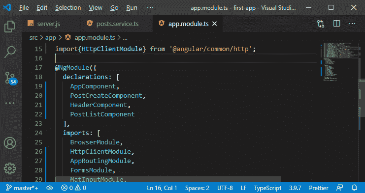

现在，我们可以在组件或服务中使用 http 客户端。

2)我们可以直接在我们的 **post-list.component.ts** 文件中使用它，但是我们希望将这个任务集中在我们的服务中。它与特定组件的模板或用户界面没有直接关系，我们可能也想在应用程序的其他部分使用它。因此，将这样的 http 调用集中在服务中是很有意义的。

我们需要将角度 http 客户端注入到服务中。重要的是要知道，我们不能仅仅通过使用构造函数将组件注入到服务中，也不能通过以下方式将事物注入到服务中:

```

import {HttpClient} from '@angular/common/http';
constructor(private http: HttpClient ){

}

```

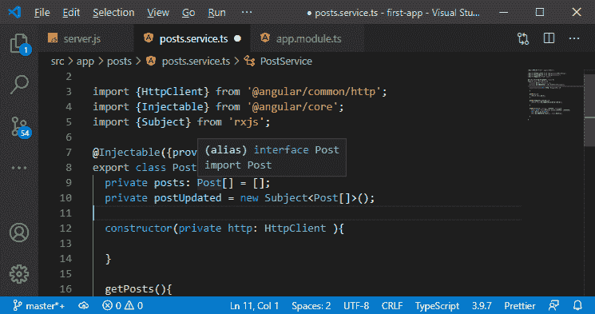

在上面的代码中，构造函数将 HttpClient 类型的私有变量作为参数。

3)现在，我们可以在我们的 **getPosts()** 函数中使用它。我们将从这里删除 return 语句，并使用本地 http 属性，该属性有几个方法。我们将使用 get 方法，并通过以下方式将目标路径传递给它:

```

getPosts(){
    this.http.get('http://localhost:3000/api/posts');
}

```

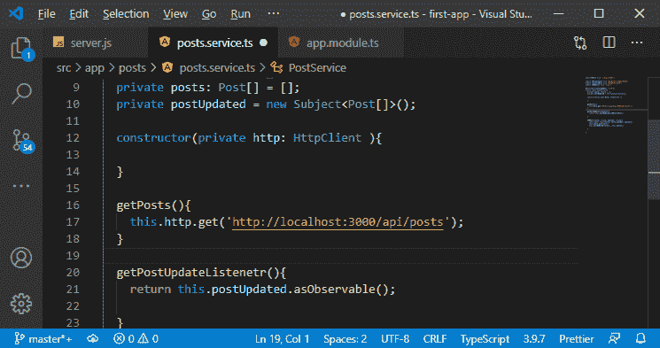

4)现在，它不会做任何事情，因为 http 客户端使用可观察的东西。它特别使用了一个不做任何事情甚至不会发送请求的可观察对象，如果我们因为对响应不感兴趣而不听它，那么为什么它会发送请求呢？

所以，我们需要听它，为此，我们需要使用 **subscribe()** 方法。我们将在那里传递三个参数，即第一个参数用于新数据，第二个参数用于错误，第三个参数在完成后传递。

我们对新数据感兴趣，这将是响应，我们可能还想添加错误处理。我们传递一个函数作为参数，每当我们得到一个响应时就执行这个参数。在这个函数中，我们已经回到了响应的主体，因为 angular http 客户端立即授予了对这个主体的访问权限。

```

  getPosts(){
    this.http.get('http://localhost:3000/api/posts')
    .subscribe(()=>{

    });
  }

```

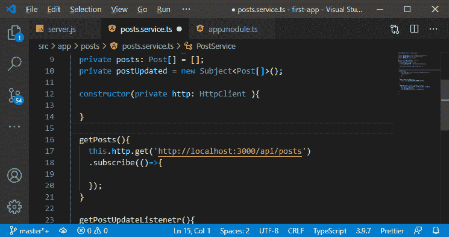

5)get 方法是一个泛型方法，我们必须明确指定我们将返回的值的类型。响应的主体将是具有消息属性和帖子属性的对象。因此，我们将以下列方式定义值的类型:

```

  getPosts(){
    this.http.get<{message: string, posts: Post[] }>('http://localhost:3000/api/posts')
    .subscribe(()=>{

    });
  }

```

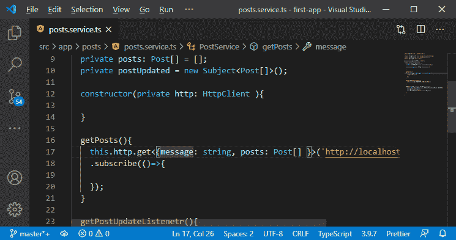

我们需要在这里添加一个重要的属性，即 ID，但是我们需要为此更改模型中帖子的定义。在后端，我们的帖子也有一个 ID，因此我们还需要通过以下方式向我们的前端模型添加一个 ID:

```

export interface Post{
  id: string;
  title: string;
  content: string;
}

```

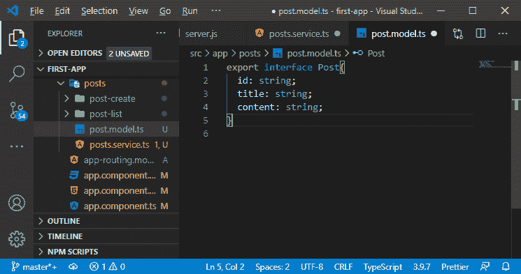

这些更改将在我们的 post.service.ts 文件中创建一个错误。当我们以下列方式创建新帖子时，我们需要定义 id:

```

const post: Post={id: null, title: title,content: content};

```

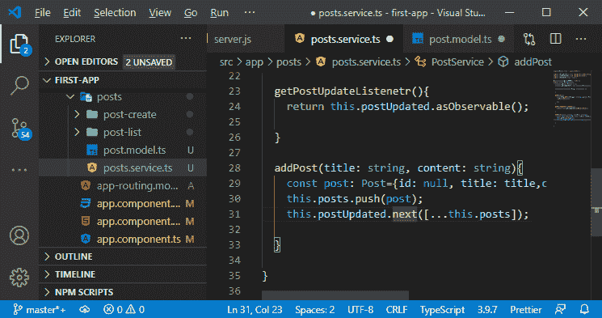

我们将 id 设置为空，因为我们没有 [ID](https://www.javatpoint.com/id) ，因为它还没有在服务器上生成。

6)在 subscribe 函数中，我们将把 subscribe()函数中的 PostData 作为参数传递。我们将获得[TypeScript](https://www.javatpoint.com/typescript-tutorial)支持和 IDE 支持，使用它，我们将获得我们的帖子数据，并以以下方式将其存储到我们的帖子变量中:

```

  getPosts(){
    this.http.get<{message: string, posts: Post[] }>('http://localhost:3000/api/posts')
    .subscribe((PostData)=>{
        this.posts = PostData.posts
    });
  }

```

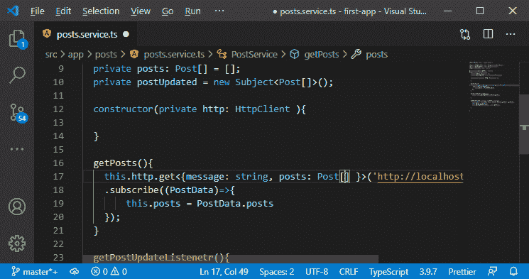

7)现在，我们需要将此更新通知我们的应用程序和我们应用程序的其他部分，因此我们将调用 postUpdated 的 next，在此功能中，我们将通过以下方式传递帖子的副本:

```

this.postUpdated.next([...this.posts]);

```

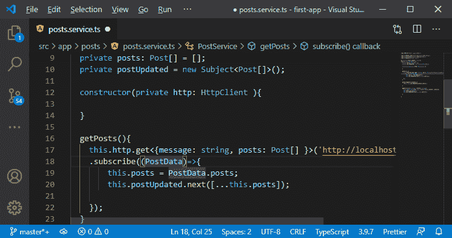

8)我们将在**后列表中看到一个错误。现在，我们的 getPosts()函数不返回任何东西，但是在 post-list 组件中，我们期望返回帖子。我们没有取回帖子，我们只是在帖子列表组件以下列方式加载时触发了 http 请求:**

```

this.postsService.getPosts();

```

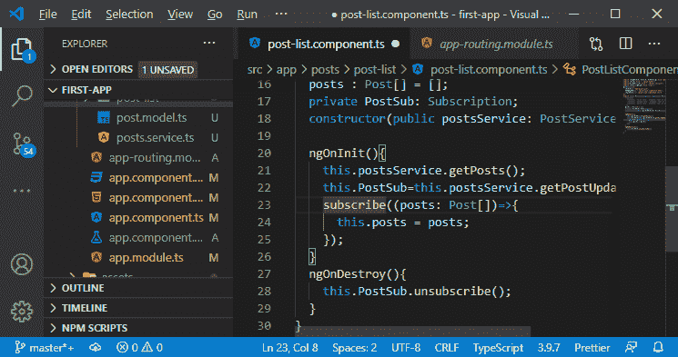

现在，如果我们保存它并在 localhost 4200 上运行，我们将无法在 angular 应用程序中看到服务器端的数据。

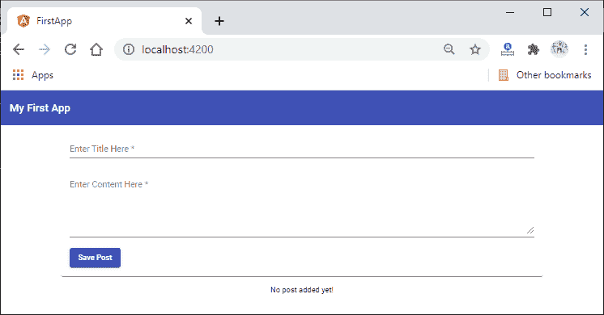

如果我们转到浏览器的开发工具，我们将看到以下错误:

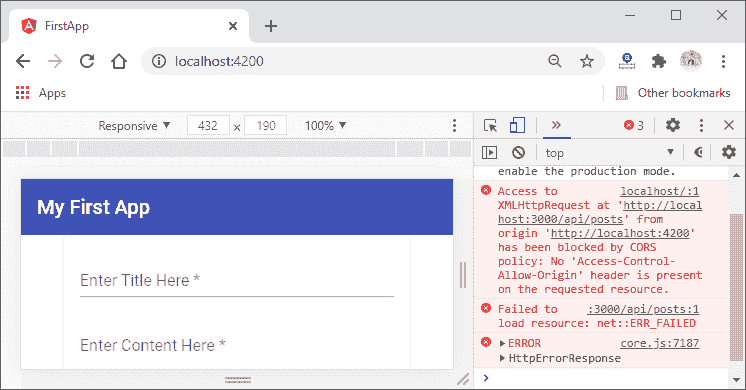

这是一个 [CORS](cors-in-mean-stack) 错误，因此我们无法在 angular 应用程序中看到我们的服务器端数据。我们将在下一节讨论 CORS 错误。

* * *