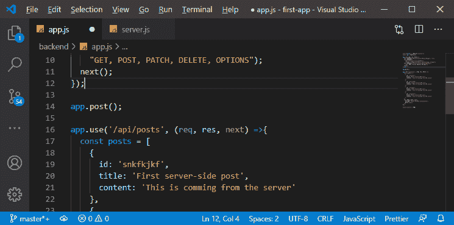
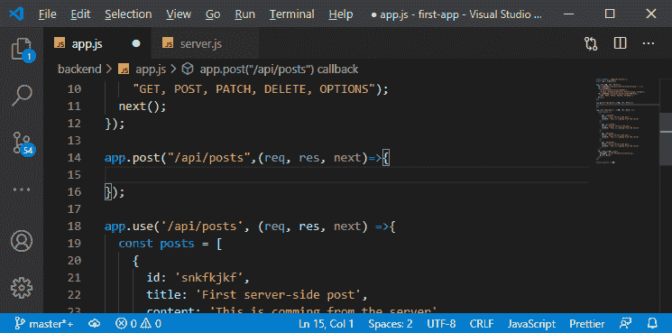
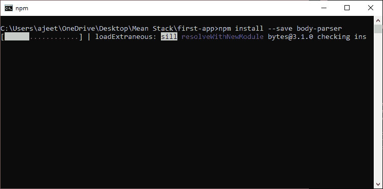
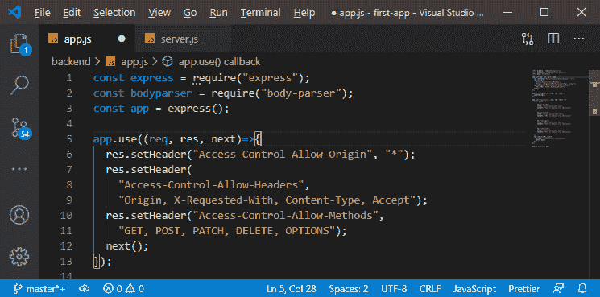
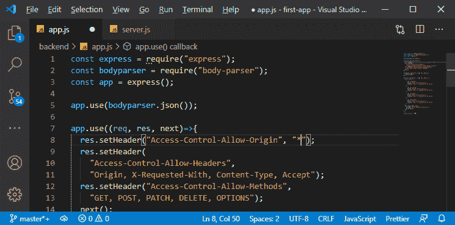
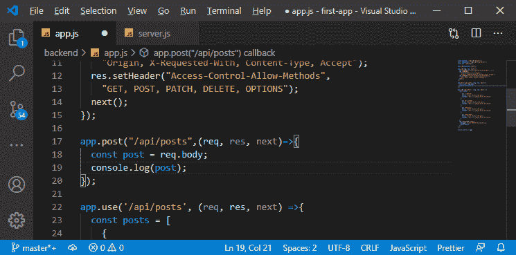
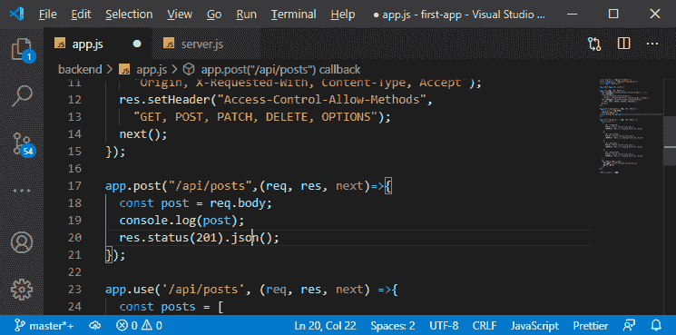
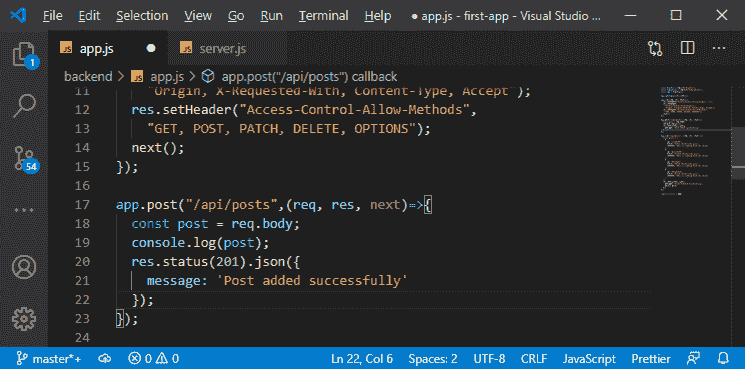

# 在MEAN 栈中添加后置后端点

> 原文：<https://www.javatpoint.com/adding-the-post-backend-point-in-mean-stack>

在前一节中，我们使用中间件添加了一些头来解决 CORS 错误。因此，能够发布新的服务器将会很棒，为此，我们需要允许请求定位/发布，但是这些请求应该是发布请求。我们正在使用中间件，这意味着我们服务器上或到达我们服务器的所有请求都将由该中间件处理，但是我们可以缩小范围。我们将通过以下方式为此添加一个后端点:

1)第一步，我们将使用 **app.post()** 代替使用 **app.use()** 功能。这个函数本质上将附加一个中间件，它的工作方式类似于我们上一个中间件。但是这个中间件将会为传入的 post 请求触发。同样，我们可以使用 **app.get()、app.put()** 等等来处理 get 和 put 请求。

```

app.post();

```



2)在这个函数中，我们将传递 post 请求来处理，然后我们得到我们的默认函数，它有请求、响应和 next，如下所示:

```

app.post("/api/posts",(req, res, next)=>{

});

```



3)在这个中间件中，我们将对 post 数据进行一些更改。我们还没有数据库，所以不能存储它们。目前，我们无法存储它们，因此无法处理和获取它们，但我们可以检查将数据发送到该路由是否可行。因此，我们将简单地用**控制台输出我们收到的帖子。**

```

app.post("/api/posts",(req, res, next)=>{
  console.log();
});

```

现在，我们如何访问随请求发送的帖子？我们的请求一直是一个空请求，我们没有添加任何数据，因为我们只处理 get 请求。但是，Post request 有一个主体，所以它们有数据附加在上面，我们需要提取这些数据。

现在，为了提取数据，我们需要安装一个额外的包，添加一个方便的中间件，我们将把它插入我们的快速应用程序。它将自动提取传入的请求数据，并将其作为新字段添加到请求对象中，以便于访问。我们将使用以下命令安装软件包:

```

npm install --save body-parser

```



这是一个可以作为快递中间件的节点快递包。Body 解析器就像它的名字一样。它解析传入的请求体，提取请求数据(因为这将是数据流)并将其转换为数据对象。

4)现在，我们将返回到我们的 app.js 文件，并通过以下方式在此导入这个新包:

```

const bodyparser = require("body-parser");

```

Zero



5)现在，我们将通过在我们的 [CORS](cors-in-mean-stack) 头前添加它作为额外的中间件来使用它，并发布请求。我们不会针对特定路径对其进行过滤；我们将对所有传入的请求执行此操作。我们这里不使用默认函数。我们将简单地传递 body-parser 并调用 json 方法，该方法将返回一个有效的 express 中间件，用于按照以下方式解析 JSON 数据:

```

app.use(bodyparser.json());

```



6)现在，我们将使用解析后的主体。在 **api.post()** 方法中，我们将通过以下方式访问请求体来提取我们的帖子:

```

app.post("/api/posts",(req, res, next)=>{
  const post = req.body;
  console.log(post);
});

```



7)我们仍然需要返回响应，因为它仍然是传入请求的端点。为了确保这个请求不会在客户端超时，我们需要返回一个响应。因此，我们将调用 response，然后设置一个状态代码，状态函数为 201。之后，我们将调用 json()以如下方式发回 json 数据:

```

  res.status(201).json();

```



8)现在，我们不需要发回数据。我们将通过以下方式发回确认消息:

```

res.status(201).json({
    message: 'Post added successfully'
  });

```



现在，我们有了设置，为了尝试它，我们需要将 angular 连接到这个 API 端点。因此，在下一节中，我们将学习如何将 angular 连接到 API 端点。

* * *