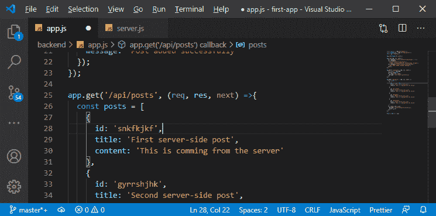
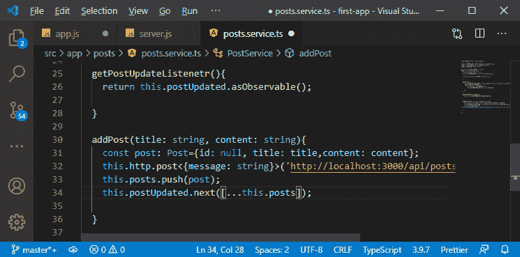
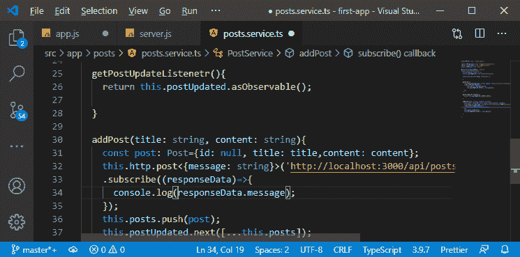
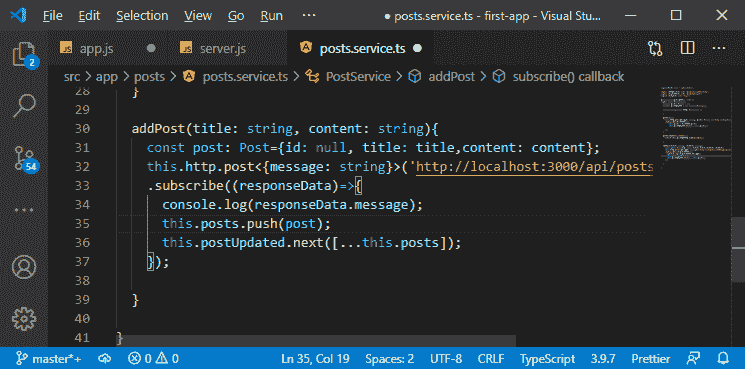
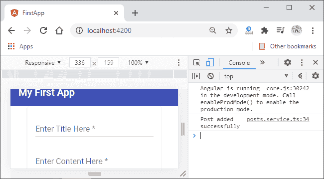
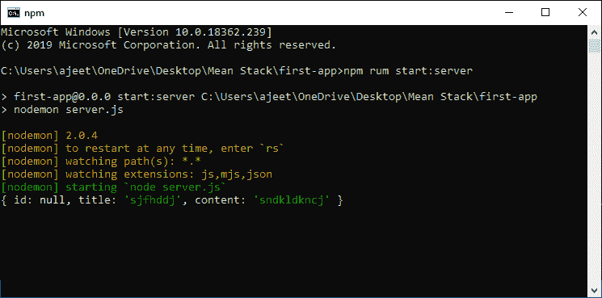

# 将角度连接到平MEAN 栈中的应用编程接口端点

> 原文：<https://www.javatpoint.com/connecting-angular-to-the-api-endpoint-in-mean-stack>

在前一节中，我们借助 **app.post()** 方法设置了 post 后端点，但是没有将 angular 连接到它。因此，在本节中，我们将把 angular 连接到 API 端点。我们将添加一些代码行，我们还需要为此替换一些代码，如下所示:

1)在我们的 post 中间件中，我们没有使用 next()函数。因此，post 请求不会到达最后一个中间件。为此，我们将调用 get 方法，而不是在最后一个中间件中使用()。

```

app.get('/api/posts', (req, res, next) =>{
….
….
});

```



2)我们将返回到我们的后创建. component.ts 文件。在这个文件中，我们已经触发了 addPost()方法，所以我们需要在这个方法中发送我们的请求。

我们将在 post . service . ts 文件中回到这个方法。我们会在发帖前发送我们的请求。我们将在这里使用 **http.post()** 方法，并传递与 get 请求相同的 url，但使用不同的 http 动词，如:

```

this.http.post('http://localhost:3000/api/posts');

```

post 请求也会得到一些数据，所以我们需要用泛型类型来定义它。我们知道我们将从它那里得到一条消息，它是字符串类型的。

```

this.http.post<{message: string}>('http://localhost:3000/api/posts');

```

我们还需要传递第二个参数，这就是我们要发布的数据，如下所示:

```

this.http.post<{message: string}>('http://localhost:3000/api/posts',post);

```



3)和以前一样，不订阅什么都不会发生。因此，我们将这样调用 subscribe 方法:

```

this.http.post<{message: string}>('http://localhost:3000/api/posts',post)
.subscribe();

```

subscribe 方法也有典型的处理程序。我们将通过以下方式处理成功案例并取回我的响应数据:

```

this.http.post<{message: string}>('http://localhost:3000/api/posts',post)
    .subscribe((responseData)=>{
      console.log(responseData.message);
    });

```



4)我们通过在末尾添加以下代码行来使用乐观更新:

```

this.posts.push(post);
this.postUpdated.next([...this.posts]);

```

但是，我们需要从乐观更新转变为只更新。我们将通过在 subscribe 方法中添加这两个调用来实现这一点，因为这将只异步执行一个我们得到成功响应的调用。

```

this.http.post<{message: string}>('http://localhost:3000/api/posts',post)
.subscribe((responseData)=>{
      console.log(responseData.message);
      this.posts.push(post);
      this.postUpdated.next([...this.posts]);
});

```



5)现在，我们将重新启动 ng 服务器和节点服务器。当我们在 angular 应用程序中添加新帖子时，我们将在服务器端日志中获得一条成功消息和一个帖子对象，如下所示:




**下载完整项目(将角度连接到应用编程接口端点)**

* * *