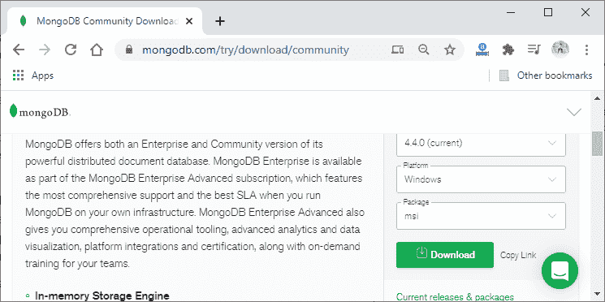

# 在平均堆栈中设置蒙古数据库

> 原文：<https://www.javatpoint.com/setup-mongodb-in-mean-stack>

在前一节中，我们了解了 MongoDB、SQL 和 NoSQL 之间的区别以及它的一些特性。在这一部分，我们将把 angular 连接到数据库，我们还将学习如何在 MEAN Stack 中设置 [MongoDB。](mongodb-in-mean-stack)

如果不向节点发送 http 请求，我们就无法将 angular 直接连接到数据库。我们将在服务器上拥有我们的 angular 应用程序和 MongoDB 数据库。我们将从 angular 应用程序直接向数据库发送查询，并超越我们的 node express 应用程序。从技术上讲，这是可能的，但这样做并不好，因为它非常不安全。

通过这样做，安全认证是不可能的。我们必须登录到数据库或验证数据库，这是通过我们必须存储在角度代码中的凭证来完成的。然后这个角度代码最终被编译成 JavaScript，并加载到浏览器中。

每个人都可以在浏览器中查看它，我们网页的每个用户都可以访问我们的 JavaScript 代码。因此，我们不应该在那里存储重要信息，尤其是证书。我们没有办法安全地储存这些。我们会公开凭据，这样就可以允许比我们希望的更多的内容。因此，我们的完整数据库将被公开，因此用户可能会做比我们希望他们做的更多的事情。

所以，将 angular 连接到 [MongoDB](https://www.javatpoint.com/mongodb-tutorial) 不是一个好主意。我们将向节点发送一个 http 请求，用户不能发送不同的请求，因为节点只接受我们定义它接受的请求，然后节点拥有所有的凭证。但是 nodejs 代码不能被我们的用户读取，因为它驻留在服务器上。

我们将使用以下步骤在[均值堆栈](https://www.javatpoint.com/mean-stack)中设置 MongoDB:

1)我们将转到[https://www.mongodb.com/try/download/community](https://www.mongodb.com/try/download/community)链接，为我们的 windows 操作系统下载。

2)我们将使用不同的解决方案，即云解决方案。这种云解决方案不需要我们花费任何成本，对于我们的目的来说完全足够。我们需要一个真正应用的付费解决方案，但如果我们自己托管服务器，也是如此。

这个云解决方案的名字叫做 MongoDB Atlas，它是一个云托管的 MongoDB 数据库，我们可以方便地使用。然后，我们可以从我们的 node express 应用程序中使用它，我们正在我们的机器上构建该应用程序，稍后将部署在真正的服务器上。

要使用它，我们需要登录。登录成功后，我们将看到如下浏览器:

3)我们将向下滚动页面，点击**创建集群**按钮创建集群。点击按钮后，我们会看到如下浏览器:

如果我们没有项目，我们需要创建一个。

我们将点击 **AWS** ，然后点击右下角的**创建集群**按钮。单击后，将创建集群，我们将看到浏览器为:

4)我们将点击**安全**的**数据库访问**选项，并通过点击**添加新数据库用户**来创建用户。当我们点击**添加新数据库用户**按钮时，我们将看到浏览器的如下屏幕:

5)我们将向下滚动页面并填写用户名和密码。我们可以通过点击**自动生成安全密码**来自动生成安全密码。我们还需要设置数据库用户权限，完成所有这些操作后，我们将点击页面右下角的**添加用户**按钮。

#### 注意:我们需要将密码存储在某个地方，因为在我们的编码部分需要它。

6)我们还需要为其添加一个 IP 地址。我们将转到页面的**网络访问**部分。在这里，我们将点击**添加 IP 地址**按钮添加一个 IP。当我们点击按钮时，我们将在浏览器上看到以下页面:

7)在这里，我们将简单地选择我们当前的 [IP](https://www.javatpoint.com/ip) 地址。请记住，如果我们在这个项目上工作几天，我们的 IP 地址可能会改变。所以，我们可能需要在这里更新它。添加当前 IP 地址后，我们只需点击**确认**按钮进行确认即可。

现在，我们将回到我们的项目。在我们的项目中，我们已经安装了一个帮助我们连接到后端数据库的包。

#### 注意:如果您面临任何连接问题，那么您可以更新或更改您的 IP 地址。

在下一节中，我们将了解**猫鼬**以及为什么我们需要在项目中使用它。

* * *