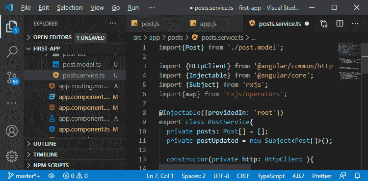
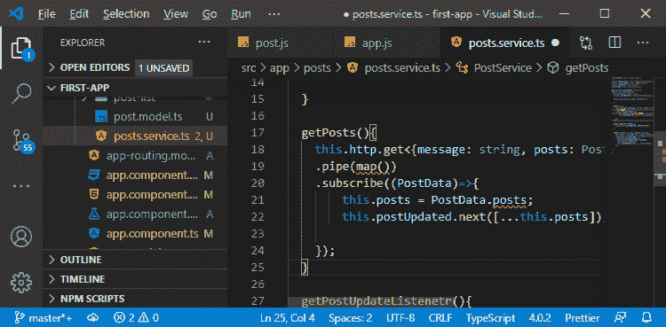
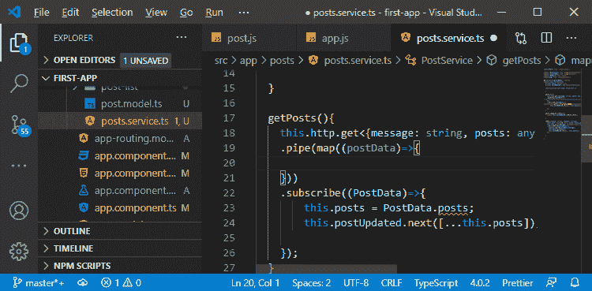
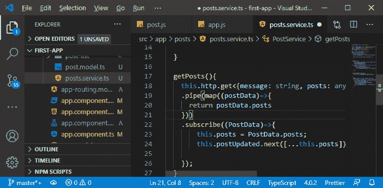
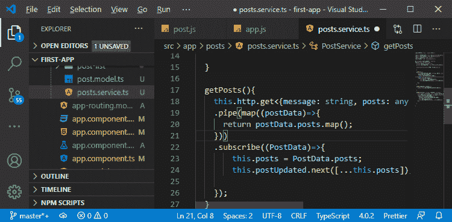
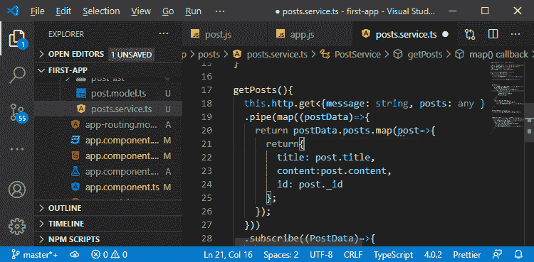
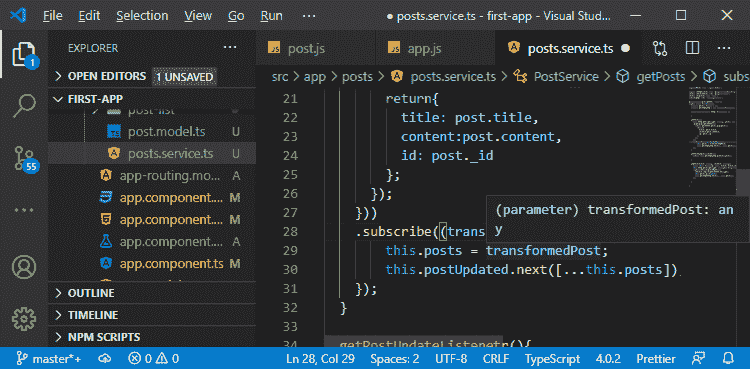
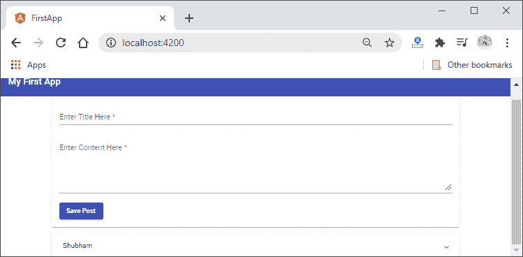

# 转换MEAN 栈中的响应数据

> 原文：<https://www.javatpoint.com/transforming-response-data-in-mean-stack>

在前一节中，我们学习了如何从数据库中获取数据。我们之前讨论了 map()函数，但是没有使用它。我们还没有使用前端的 ID。我们有一个以前讨论过的问题。我们期望在前端有一个不带下划线的 id，但是我们的后端数据有一个下划线。

因此，我们需要在前端存储正确数据的设置。我们可以在前端模型上简单地将 id 重命名为 _id，它会工作得很好，但是我们将转换从服务器返回的数据。我们将使用以下步骤来转换数据:

1)我们将回到我们的 **service.ts** 文件，在 getPosts()函数中，我们将使用另一个函数，即 **pipe()** 先于 **subscribe()** 方法。管道()函数允许我们添加这样的操作符。我们可以管理多个操作员。我们将导入操作符，以便在 pipe()方法中使用它。我们将使用地图操作符，因此我们将通过以下方式从[**【rxjs】**](https://www.javatpoint.com/rxjs)包中导入它:

```

import{map} from 'rxjs/operators';

```



map()方法允许我们将数组中的每个元素转换成一个新元素，并将它们全部存储回一个新数组中。

2)我们将使用管道函数，并通过以下方式传递映射运算符:

```

.pipe(map())

```



3)在 map 方法中，我们得到我们的 postData，然后我们将在该函数的主体中使用它做一些事情。该帖子数据不会是**{消息:字符串，帖子:帖子[]}** 它不会持有有效帖子，因为标识错误。我们将通过以下方式将帖子的类型设置为任意，而不是类型 post[]:

```

this.http.get('http://localhost:3000/api/posts')
    .pipe(map((postData)=>{

}))

```



4)在函数的主体部分，我们将返回帖子的数组，我们将通过以下方式从帖子数据中访问帖子来实现这一点:

```

return postData.posts

```



这将被 **rxjs** 包自动包装成一个可观测值，这样 subscribe 函数仍然订阅一个可观测值。

5)我们已经剥离了消息，但是我们还需要转换每个帖子，我们将使用正常的 javascript 方法来完成这项工作。这个 map()方法可以添加到任何数组中，我们将按以下方式使用它:

```

return postData.posts.map();

```



6)在 post 数组中，我们需要用新的 javascript 对象替换每个 post。我们将以以下方式替换它:

```

return postData.posts.map(post=>{
        return{
          title: post.title,
          content:post.content,
          id: post._id
    };
});

```



7)我们还需要更新我们的订阅代码。我们只是用 transformedPost 替换了 postData，并将其分配给 this.posts，方法如下:

```

.subscribe((transformedPost)=>{
        this.posts = transformedPost;
        this.postUpdated.next([...this.posts]);
});

```



现在，我们将保存它，并在 localhost:4200 上运行我们的 angular app。



在下一节中，我们将学习如何删除文档。我们将执行删除代码，为此，我们将使用每个扩展面板上的删除按钮。

* * *