# 从 MEAN 栈的数据库中删除文档

> 原文：<https://www.javatpoint.com/deleting-documents-from-database-in-mean-stack>

在我们前面的部分，我们转换了响应数据，但是我们没有证明这一点。这一节我们将证明响应数据确实被转换了，我们将学习如何在 [MEAN Stack](https://www.javatpoint.com/mean-stack) 中删除一个文档。我们将使删除按钮可行，并将其显示在每个扩展面板中。

我们将使用以下步骤来添加删除文档的新路径:

1)我们将返回到我们的 app.js 文件，我们将为 delete http 动词和带有 app.delete()的添加一个新的路由。我们将请求字符串放在这个函数中，它作为第一个参数到达 API posts。

以前，我们使用“/API/post”，但现在我们实际上需要在 url 中编码一条新信息。对于删除请求，我们将想要删除的东西的 ID 或其他标识符作为 url 的一部分发送。我们不在这里发送请求正文。

我们将通过以下方式添加冒号来添加动态路径段:

```

app.delete("/api/posts/:id");

```

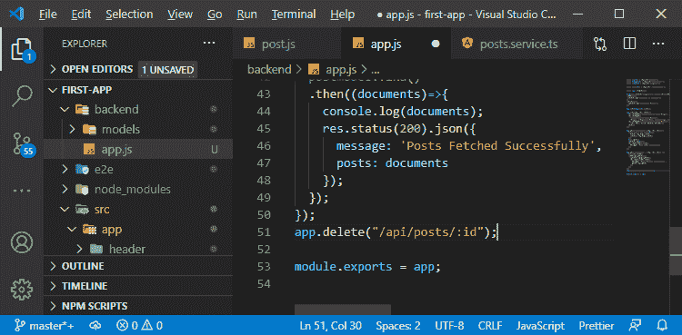

2)快递会提取 id。我们将把第二个函数传递给它，它将被所有传入的请求触发。在这个函数的主体部分，我们将简单地以如下方式显示 id:

```

app.delete("/api/posts/:id", (req, res, next)=>{
  console.log(req.params.id);
});

```

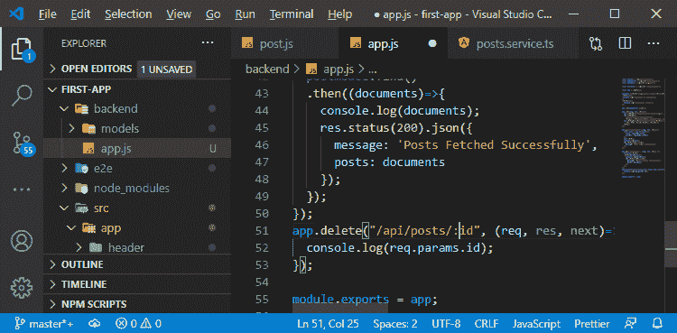

在上面的代码中，req.params 是由 nodejs 或 express 管理的属性，它允许我们访问所有编码的参数。

2)我们将返回状态代码 200 和 json 响应，其中我们以以下方式返回消息:

```

res.status(200).json({
    message:"Post deleted!"
  });

```

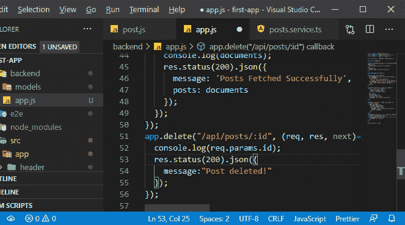

4)现在，我们将路线与角度联系起来。我们将返回到我们的**后列表. component.ts** 文件，在那里我们已经创建了 DELETE 按钮。我们将向它添加一个点击监听器，并调用 **onDelete()** 方法，并通过以下方式将 id 传递给它:

```

<button mat-button color= "warn"(click) = "onDelete(post.id)" > DELETE </button>

```

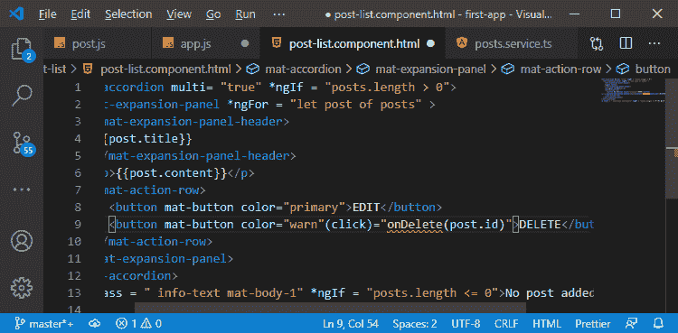

5)我们将返回到我们的 post-list.component.ts 文件来创建 onDelete()方法。我们将以下列方式进行:

```

onDelete(postId: string){

}

```

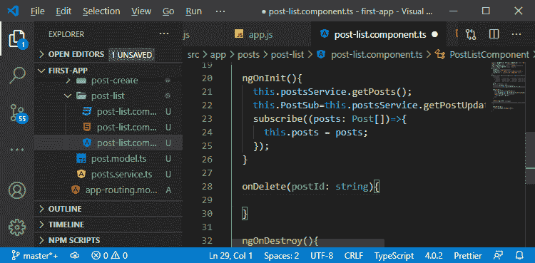

6)我们需要调用服务中的某个东西，它会发送删除请求。因此，我们将返回到我们的 **service.ts** 文件，在这个文件中，我们将创建 **deletePost()** 。在这个函数中，我们将使用 angular http 客户端发送删除请求。我们将以以下方式创建该函数:

```

deletePost(postId: string){
    this.http.delete("http://localhost:3000/api/posts/"+postId)
  }

```

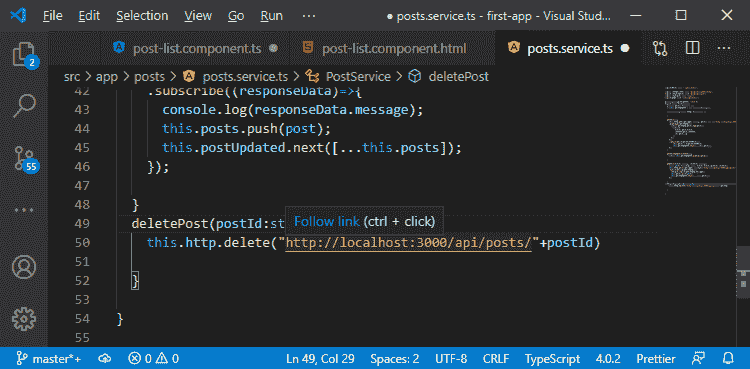

7)现在，我们需要订阅要发送的请求，这里我们将简单地用以下方式来控制台删除消息:

```

deletePost(postId:string){
    this.http.delete("http://localhost:3000/api/posts/"+postId)
    .subscribe(()=>{
        console.log("Deleted");
    });
  }

```

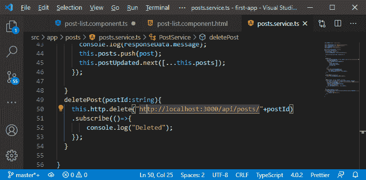

8)现在，我们将在 **post-list.component.ts** 中使用这个 deletePost()方法，因此，我们将返回到我们的组件，在 **onDelete()** 方法中，我们将以以下方式使用它:

```

onDelete(postId: string){
    this.postsService.deletePost(postId);
  }

```

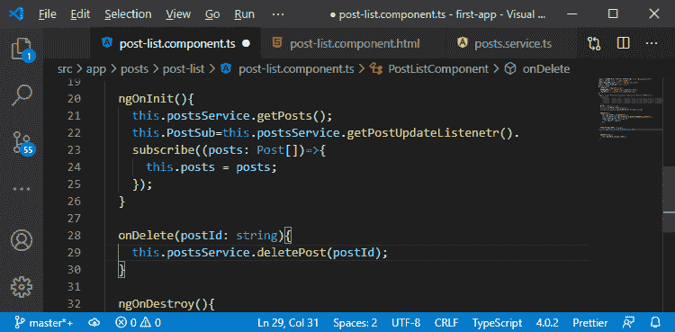

现在，我们没有更新前端的数组。所以，在点击 **DELETE** 按钮后，我们仍然会在前端看到帖子，但是它会发送请求，并且会看到**删除**消息作为响应。

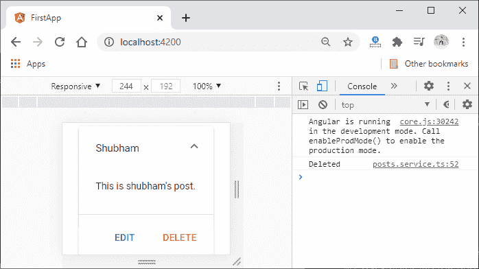

9)我们现在将使用猫鼬模型和 deleteOne()方法从后端删除一个项目。我们将返回到我们的 aap.js 文件以到达删除路径。我们将以下列方式使用模型和 deleteOne()方法:

```

postmodel.deleteOne();

```

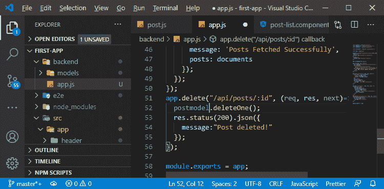

10)在这个函数中，我们会传递一个 [javascript 对象](https://www.javatpoint.com/javascript-objects)来缩小应该删除的内容。在这个对象中，我们传递 _id，然后附加一个 then 块，看看是否成功。在这个函数的主体中，我们将得到那个操作的结果。我们将对此结果进行控制台处理，并通过以下方式发送响应:

```

app.delete("/api/posts/:id", (req, res, next)=>{
  postmodel.deleteOne({_id:req.params.id}).then(result=>{
    console.log(result);
    res.status(200).json({
      message:"Post deleted!"
    });
  });
});

```

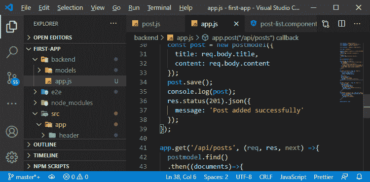

现在，我们保存代码并返回到我们的 angular 应用程序。我们将点击删除按钮，如果再次重新加载我们的 angular app，我们将不会在这里看到该帖子，因为它将从数据库中删除。

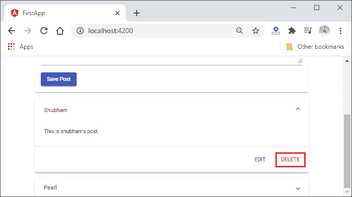
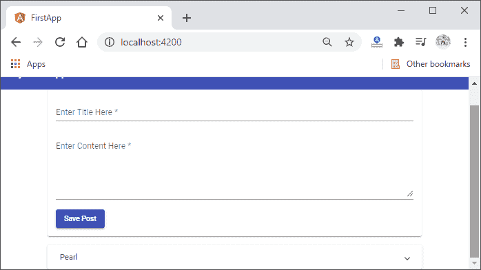
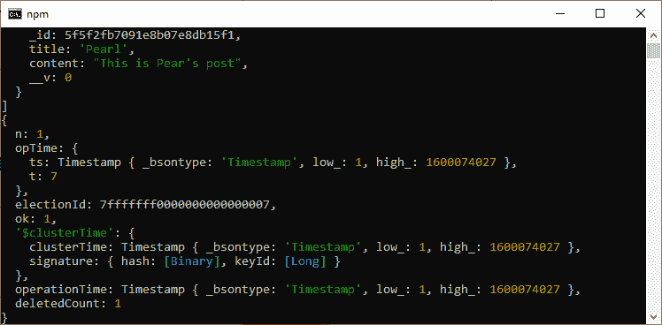

现在，我们能够从 mongodb 数据库中删除元素，但是缺少了一件事，即我们的前端 Ui 现在没有实时更新。

11)对于实时更新，我们将向我们应用的其余部分发送新的过期通知。因此，我们将返回到我们的 post . service . ts 文件，在 deletePost()方法中，我们将以如下方式用 postUpdated 语句替换 console 语句:

```

deletePost(postId:string){
    this.http.delete("http://localhost:3000/api/posts/"+postId)
    .subscribe(()=>{
        const updatedPosts = this.posts.filter();
    });
  }

```

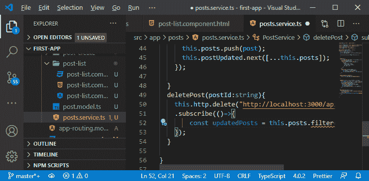

12)filter()函数允许我们只返回帖子数组的一个子集。我们将函数作为参数传递给过滤器函数。该函数将对数组中的每个帖子执行。如果它返回 true，post 元素将被保留，但是如果它返回 false，该元素将不会成为我们存储在更新的帖子中的新过滤帖子数组的一部分。因此，该函数将以如下方式编码:

```

.subscribe(()=>{
        const updatedPosts = this.posts.filter(post=>post.id!==postId);
        this.posts=updatedPosts;
        this.postUpdated.next([...this.posts]);
});

```

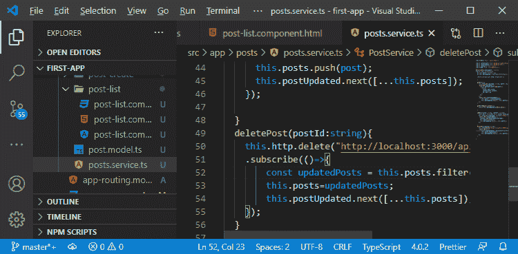

现在，当我们从这里删除一篇文章时，我们的前端用户界面将会更新。

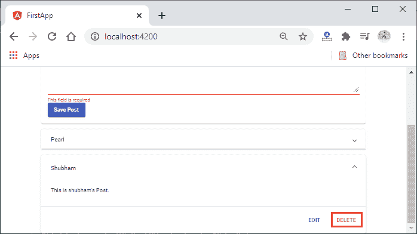
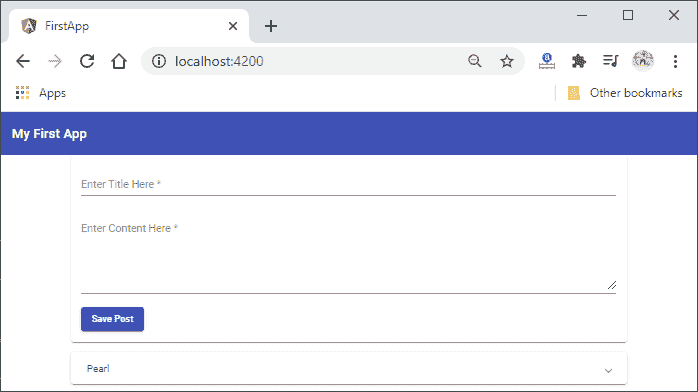

**下载完整项目(从数据库中删除文档)**

在下一节中，我们将学习如何添加带有 id 的帖子。

* * *