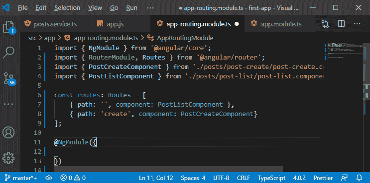
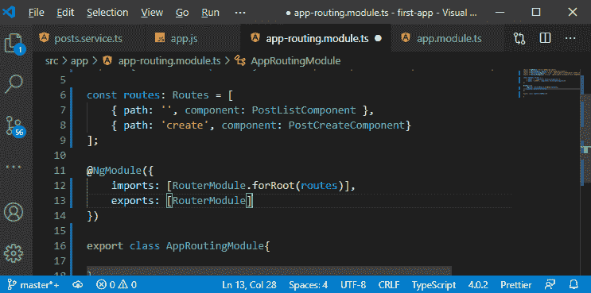

# 在MEAN 栈中添加路由

> 原文：<https://www.javatpoint.com/add-routing-in-mean-stack>

我们得到了我们的角度前端，我们得到了我们的节点快递后端，它也与我们的 MongoDB 数据库进行了对话。我们学习了所有的核心部分，并把它们联系起来。我们只是触及了它的表面，还有很多特性，比如身份验证和更好的错误处理，我们将在本模块的后面向您展示。我们将在前端做更多的工作。例如，我们还不能编辑我们的帖子，我们在一个页面上管理所有的东西，但是我们应该用 angular 渲染不同的页面。

在本模块的这一部分，我们将添加另一个页面来编辑帖子。为了创建一个多页应用程序，我们需要角路由器。我们可以在单独的页面上加载后期创建和后期列表组件。我们将使用以下步骤使我们的应用程序多页:

1)我们将在 angular 应用程序的根级别上添加一个新模块。我们将创建一个新文件，并命名为 **app-routing.module.ts** 。


2)在这个文件中，我们将导出一个名为 AppRoutingModule 的普通类。


现在，这变成了一个角度模块，角度模块是构建模块。Angular 分析找出我们的应用程序使用哪些功能，我们也可以在正常的 **app.module.ts** 文件中定义我们的路线。不要把所有东西都放入**app . module . ts**文件，而是把我们的逻辑拆分到多个文件中，这是一个很好的做法。我们将把所有的路由设置和路由配置放入一个单独的文件中，然后导入到我们的主 app.module 文件中。

3)现在，我们将使用 ngModule 装饰器来装饰这个类，因为它是一个角度模块。我们还将使用另一个角度特征，即 RouterModule，因此也将以以下方式导入:

```

import { NgModule } from '@angular/core';
import { RouterModule } from '@angular/router';

@NgModule({

})

export class AppRoutingModule{

}

```


**路由模块**使角路由器能够处理路由配置。没有**路由器模块**，我们就无法使用[棱角分明的](https://www.javatpoint.com/angularjs-tutorial)路由器。

4)现在，我们将创建一些路线。路线是 JavaScript 对象，我们在其中定义应用程序的哪个 [URL](https://www.javatpoint.com/url-full-form) 部分应该被呈现。我们创建一个常量，它属于 Routes 类型，我们还需要从**“@ angular/router”**中导入它。

这个常量保存了一个 [JavaScript 对象](https://www.javatpoint.com/javascript-objects)的数组，每个对象都有一定的结构。这个对象有一个路径属性，它定义了在我们的域之后，我们要加载某个页面的哪个部分，如果路径是空的，那么这仅仅意味着主页或根页面或起始页面。

因此，localhost:4200/将加载此页面，并且在对象中以以下方式设置路径:

```

import { RouterModule, Routes } from '@angular/router';

const routes: Routes = [
    { path: '' }
];

```


5)定义了路径之后，我们需要定义应该加载什么，我们想要加载 PostListComponent。我们将以以下方式定义组件:

```

{ path: '', component: PostListComponent }

```

同样，我们将为我们的后期创建组件创建一个路由对象，如下所示:

```

{path: 'create', component: PostCreateComponent}

```



6)现在，我们需要向角度路由器模块通知路线。我们通过以下方式将路由器模块导入角度模块:

```

imports: [RouterModule.forRoot(routes)]

```


7)现在，角度路由器知道我们的路线。我们还需要将其添加到我们的应用程序模块中，该模块是我们应用程序的主要模块，也是我们应用程序开始使用的模块。要将其添加到应用程序模块中，我们需要导出此已配置的路由模块。我们将通过以下方式导出:

```

exports: [RouterModule]

```



现在，我们可以在 app-routing 模块之外的路由器配置中使用这个路由器模块。

8)现在，我们将回到我们的应用模块，我们将在“imports”数组中添加我们的 **AppRoutingModule** ，我们的 IDE 将自动添加它，我们只需要确定它是否会被导入。


9)我们现在可以在我们的配置中使用 angular 路由器，我们通过标记 angular 应该加载活动路由的位置来做到这一点。所以，我们将回到我们的**component.html**文件，这里我们将摆脱**<app-post-create></app-post-create>**和**<app-post-list><app-post-list>**。我们将使用路由器加载它们。

我们将为角路由器添加一个钩子，在那里它呈现它的内容。该钩子将使用 **<路由器出口>** 指令以下列方式创建:

```

 <app-header></app-header>
<main>
  <router-outlet></router-outlet>
</main>

```


现在，如果保存它并返回到 localhost:4200，我们将转到路由列表页面:


现在，如果我们转到 localhost:4200/create route，我们将看到工具栏:


10)现在，我们缺少访问这些路由的链接，因为现在，我们可以手动硬编码 url。这并不是我们真正想要的导航，相反，如果我们的标题中有一个链接会更好。因此，我们将返回到我们的**component.html**文件，这里我们将用一个跨度来包装我们的消息，如:

```

<mat-toolbar color= "primary"> 
  <span>
    My First App
  </span>
</mat-toolbar>

```


我们还将添加一个无序列表，在其中我们以下列方式处理工具栏项目:

```

<mat-toolbar color= "primary"> 
  <span>
    <a routerLink = "/">
      My First App
    </a>
  </span>
  <ul>
    <li>
      <a routerLink = "/create"> New Post</a>
    </li>
  </ul>
</mat-toolbar>

```


在上面的代码中，我们使用了 routerLink 属性。角路由器将使用 routerLink，它将锚定标签转换为角路由器捕获点击的普通链接。它将停止发送 http 请求的默认行为，并为我们尝试访问的页面重新呈现页面。

现在，我们保存这个并重新启动应用程序来检查它是否正常工作。


一切都很顺利。在下一节中，我们将学习如何设计链接的样式，以获得更好的视觉效果。

**下载完整项目(添加路由. zip)**

* * *