# 均值堆栈中的样式链接

> 原文：<https://www.javatpoint.com/styling-links-in-mean-stack>

在前一节中，我们学习了如何添加路由。我们学到了很多关于路由的知识。在这一部分，我们将通过使我们的链接变得时尚来改善视觉效果。我们将通过以下步骤改善视觉效果:

1)在我们的头文件组件中，我们会新建一个文件，即 **component.css** 文件。我们将转到我们的 **header.component.ts** 文件，并通过以下方式将其连接到那个 [CSS](https://www.javatpoint.com/css-tutorial) 文件:

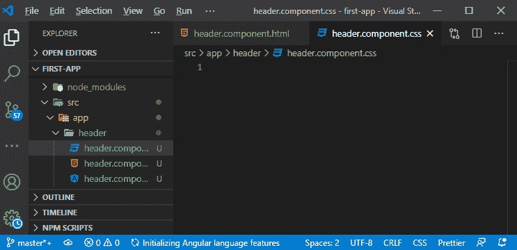

```

styleUrls:['./header.component.css']

```

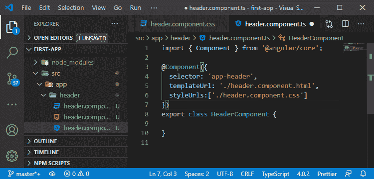

2)在这个文件中，我们可以为这个组件设置锚标签的样式。我们将通过使用文本装饰和颜色属性，以下列方式设置锚点标签的样式:

```

a{
  text-decoration: none;
  color: white;
}

```

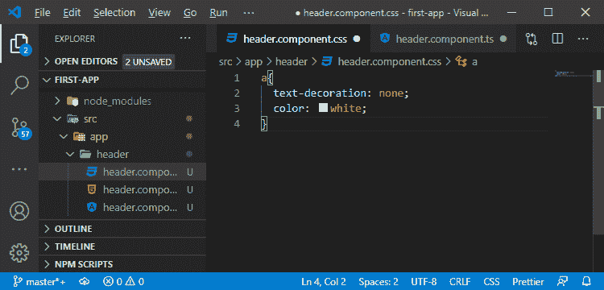

现在，如果我们保存它并返回到 localhost:4200，我们将看到更好的链接视觉效果，如:

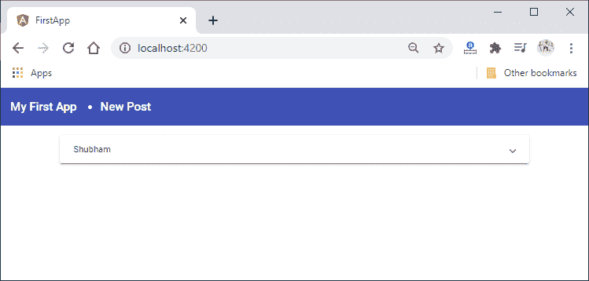

3)看起来不错，但是子弹点在**新帖**前面显示。它应该从这里被删除，我们将通过使用 CSS 代码为我们的无序列表执行以下操作:

```

ul{
  list-style: none;
  padding: 0;
  margin: 0;
}

```

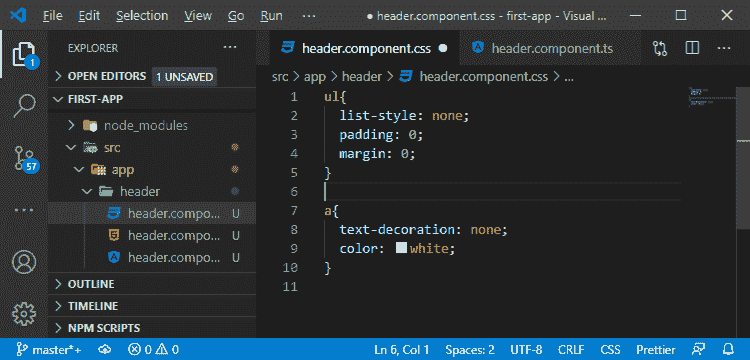

现在，我们回到应用程序，我们的 angular 应用程序看起来像:

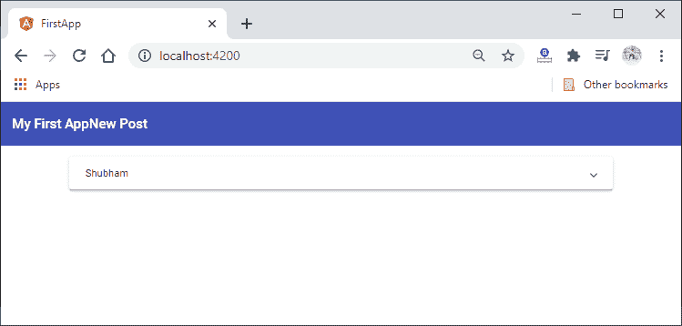

4)删除了要点，但现在**我的第一个 App** 和**新帖**直接挨着坐。首先，我们将返回到**component.html**文件，并通过以下方式将此**我的第一个应用程序**设为 Message:

```

<span>
    <a routerLink = "/">
      Message
    </a>
</span>

```

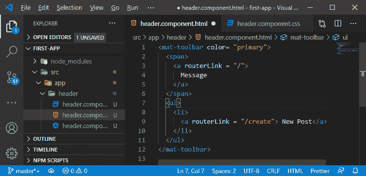

现在，为了在**消息**和**新帖子**之间留出一些空间，我们将返回到标题组件的 **html** 文件，并使用类创建另一个元素。你可以给这个类起任何名字，但是在我们这里它的名字是**“间隔**”。该元素将以下列方式添加:

```

<span class="spacer"></span>

```

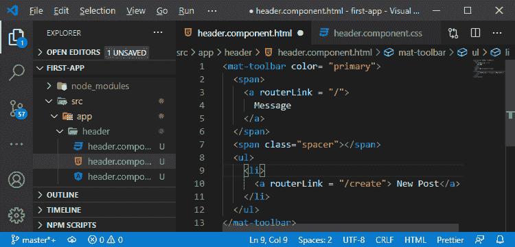

5)现在，我们将返回到这个组件的 **CSS** 文件，并设置我们的间隔类的样式。我们将以下列方式使用 **flex** 样式:

```

.spacer{
  flex: 1 1 auto;
}

```

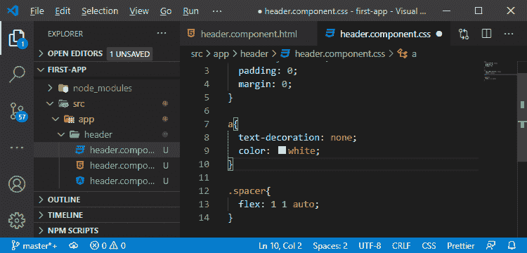

现在，我们回到应用程序，我们的 angular 应用程序看起来像:

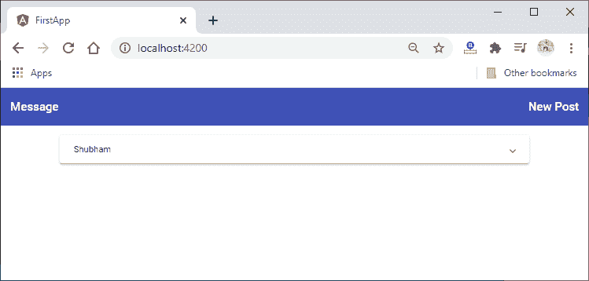

6)在最后一个按钮上做一些造型会很好。我们将不仅使用一个普通的锚点标签，还会以下列方式向其中添加 mat 按钮指令:

```

<a mat-button routerLink = "/create"> New Post</a>

```

我们得到了一个不错的悬停效果。

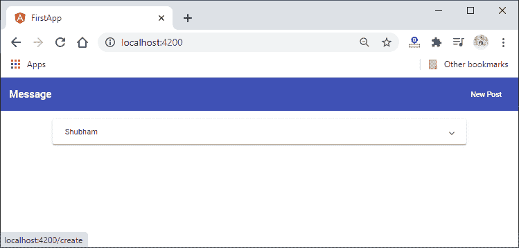

7)这种悬停效果相当整洁。我们将在这个锚标签中使用 routerLinkActive 指令。每当该指令检测到该链接指向的路由是当前活动路由时，它将为该链接分配一个新的 CSS 类。有角度的材质有几个辅助 CSS 类，我们可以像 mat-accent 一样使用。mat 强调将强调颜色应用于基础元素。我们将以下列方式使用它:

```

<a mat-button routerLink = "/create" routerLinkActive = "mat-accent"> New Post</a>

```

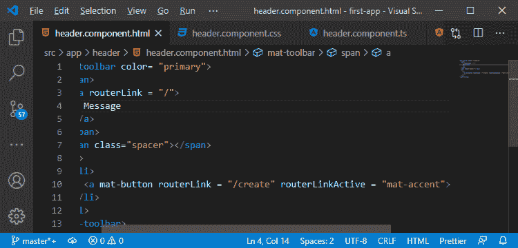

如果我们在页面上，它将被突出显示，但如果我们不在页面上，那么它不会像这样突出显示:

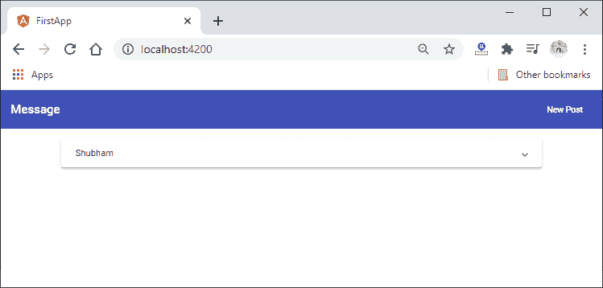
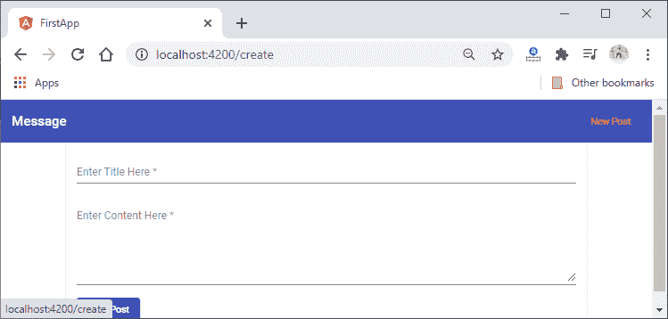

现在，它运行良好。在下一节中，我们将了解客户端 v/s 服务器端路由，并了解如何编辑我们的帖子。

**下载完整项目(造型链接. zip )**

* * *