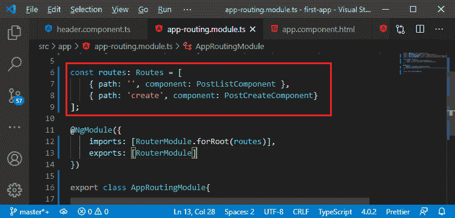
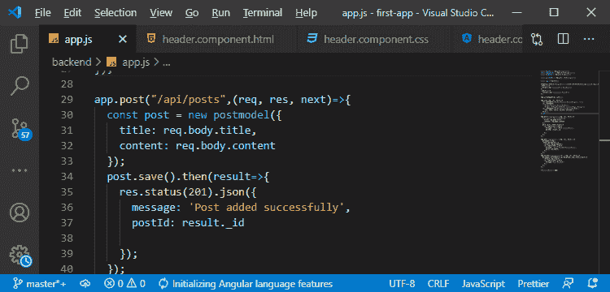

# 客户端 v/s 服务器端路由

> 原文：<https://www.javatpoint.com/client-side-vs-server-side-routing-in-mean-stack>

在前面的部分中，我们设计了我们的链接并添加了路线。在我们开始编辑帖子之前，有一件重要的事情我们想强调一下。我们在应用程序路由模块中定义了 angular 应用程序中的路由。

但是，我们在 **app.js** 文件的后端也有路由，这些路由没有连接。它们运行在不同的服务器上，所以我们的后端运行在 localhost:3000 上，因为这是我们定义的端口，它们做了不同的事情。

角路由器是一种工具，它能够解析我们应用程序的[网址](https://www.javatpoint.com/url-full-form)，然后通过 javascript 在屏幕上呈现不同的东西。它不加载不同的 html 页面。我们只有一个 html 页面，也就是 index.html 页面，但是它正在为我们访问的不同 URL 重新呈现该页面上的内容。

[Angular](https://www.javatpoint.com/angular-7-tutorial) ，其中客户端应用程序只知道 Angular 路由器中的路由。当我们稍后部署这个应用程序时，服务器知道这些路线，无论是我们的后端还是任何可能为我们的 angular 应用程序服务的服务器都不知道。我们将向您展示这意味着什么，以及我们如何在以后部署时让服务器意识到这一点。

如果我们将我们的 angular 应用程序与我们的 node 应用程序托管在同一个服务器上，我们将会看到一些需要记住的事情，但是有一点很重要，那就是我们不能在后端使用我们在 angular 中定义的路由，比如这个/create route，因为接下来会发生的是，服务器会解析和理解它们，因为我们在 **app.post()** 中定义了它们。它不会将页面解析为 angular 来查看。相反，它会做它做的事情，这可能不是它返回 index.html 文件。所以，这是非常抽象的，我们在部署我们的应用程序时会回到这一点，但是理解客户端路由和服务器端路由之间的区别很重要，客户端路由是关于读取网址并重新呈现页面的一部分，服务器端路由是关于引导传入的请求并发回不同的东西。

**示例:**

在服务器端路由中，当我们交换数据时，我们发送请求和响应，而在客户端情况下，我们不这样做。我们正在阅读网址，我们正在重新呈现页面。

* * *