# 将数据编辑到数据库平均堆栈中

> 原文：<https://www.javatpoint.com/edit-data-into-the-database-in-mean-stack>

在前一节中，我们了解了客户端路由和服务器端路由之间的区别。到目前为止，一切都很顺利。在这一节中，我们将讨论帖子的编辑部分。我们将学习如何使用[均值堆栈](https://www.javatpoint.com/mean-stack)使帖子可编辑。我们将使用以下步骤使帖子可编辑:

1)我们每个帖子增加了两个按钮，即**编辑**和**删除**。**删除**按钮工作正常，但是**编辑**按钮现在没有任何作用。我们希望当我们点击这个按钮时，我们将返回到新的帖子页面。它不应该是新的发布页面，但是它的形式应该与新的发布页面相同。因此，首先我们需要为加载创建后组件的创建一个路径。我们将通过编辑以下列方式访问它:

```

{ path: 'edit', component: PostCreateComponent}

```

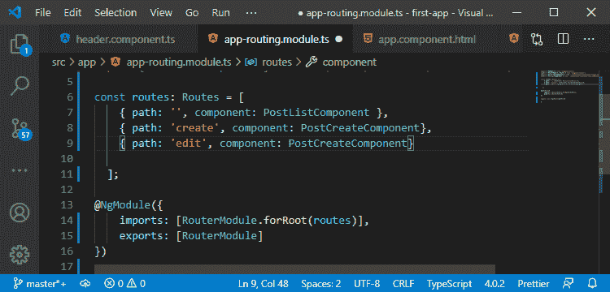

2)我们还需要告诉它我们要编辑哪个帖子，并且信息应该编码在 [URL](https://www.javatpoint.com/url-full-form) 中，因此我们将通过以下方式向该路径添加一个动态段:

```

{ path: 'edit/:postId', component: PostCreateComponent}

```

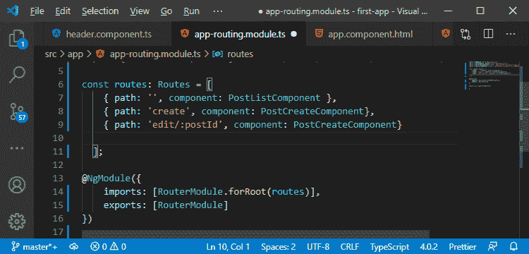

我们将重用创建后组件表单。我们必须确保当我们点击**“保存帖子”**时，因此当我们提交该帖子并调用 **onAddPost()** 时，我们需要区分是添加新帖子还是编辑现有帖子。

现在，我们的创建后组件将为两个不同的路径加载，我们必须确保我们处理这些不同的情况。棱角分明有助于我们做到这一点。我们可以通过路由器向加载的组件注入一些东西，这有助于我们识别一些路由信息，比如这条路由被加载的确切路径。

这将变得很重要，因为我们将知道，当我们提取帖子 id 时，我们处于编辑模式，如果我们不能提取，我们处于创建模式。

3)我们将返回到我们的后期创建组件，在 typescript 文件中，我们将注入**activated droute**。我们将通过以下方式将其与公共财产绑定并从 **@angular/router** 导入:

```

import { ActivatedRoute } from '@angular/router';
constructor(public postsService: PostService, public route:ActivatedRoute){}

```

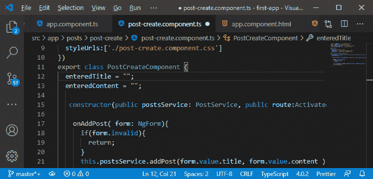

这个路由器包给了我们这个 ActivateRoute 对象，这个对象保存了一些关于我们当前所在路由的重要信息。我们将在组件创建时使用这些信息。

4)在构造函数中不这样做是一个很好的做法。相反，我们将使用 ngOnInit()。我们将在我们的 **PostCreateComponent** 类中以下列方式实现这一点:

```

import { Component, OnInit } from '@angular/core';
export class PostCreateComponent implements OnInit{

```

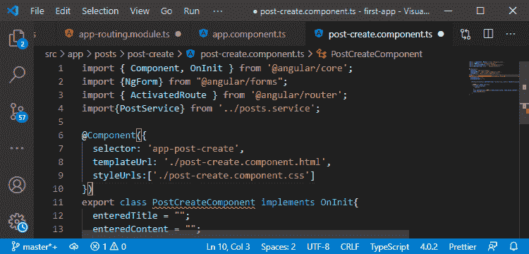

5)我们将添加 ngOnInit()方法，在这个方法中，我们将找出我们是否有 post id 参数。我们将通过访问**activateoute**来提取这个，在这里我们有参数映射对象或属性。参数映射是可观察的，我们可以订阅，至于所有内置的观察，我们从来不需要取消订阅。

```

ngOnInit(){
      this.route.paramMap.subscribe();
}

```

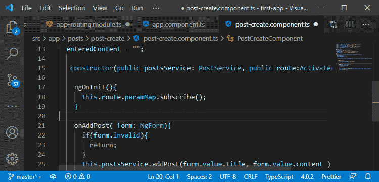

这是可以观察到的，因为当我们在页面上的时候，URL 参数可能会改变，因为我们可以点击一些来加载相同的角度分量，但是发布 id 不同。因此，URL 中的帖子 id 只会改变，组件将保持不变，但是我们在该组件上显示的数据也需要改变。这就是我们被观察到的原因。

6)我们在订阅中的第一次回调中获得了一个 paramMap 对象，只要参数发生变化，就会执行这个对象。我们通过以下方式得到这个对象:

```

ngOnInit(){
      this.route.paramMap.subscribe((paramMap: ParamMap)=>{

      });
}

```

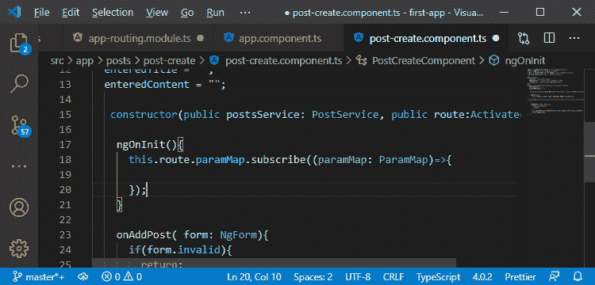

7)现在，我们将查看参数映射并检查某些参数。我们会检查它是否存在。如果这个参数映射有一个位置，那么我们提取它并使用它。如果没有 postId，那么我们就处于创建模式。这将以下列方式编码:

```

private mode= 'create';
private postId: string;
ngOnInit(){
      this.route.paramMap.subscribe((paramMap: ParamMap)=>{
        if(paramMap.has('postId')){
          this.mode='edit';
          this.postId = paramMap.get('postId');
        }else{
          this.mode = 'create';
          this.postId = null;
        }
      });

```

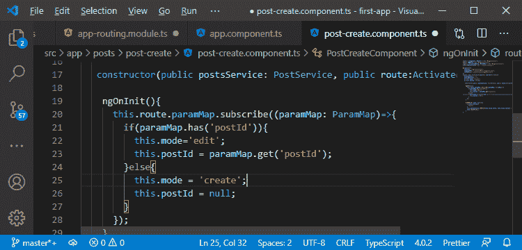

在上面的代码中，我们创建了两个属性，即 mode 和 postId。默认情况下，模式设置为 create，最初，postId 的值是未定义的。

如果参数映射有一个位置，模式值用“编辑”覆盖。否则，它保持不变。同样，如果参数映射有一个 postId，postId 将被提取并存储在 postId 属性中。否则，postId 属性中的空值提要。

8)我们可能想获取我们要编辑的帖子的信息。我们将从我们的邮政服务中获取它，因此我们将返回到我们的 post.service.ts 文件。在这里，我们需要能够从我们的帖子列表中获取一个帖子，为此，我们将添加一个新的方法 **getPost()，**，在这个方法中，我们期望获得一个 id。

```

getPost(id: string){

  }

```

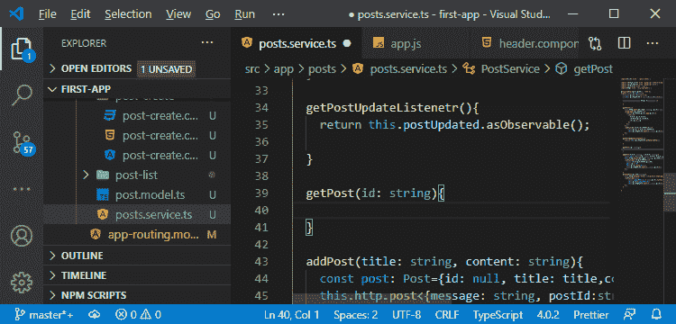

9)在这个方法中，我们将简单地返回一个新的对象，因为我们想要创建一个我们正在返回的对象的克隆。我们将通过以下方式获取帖子:

```

getPost(id: string){
    return {...this.posts.find(p =>p.id ===id)};
  }

```

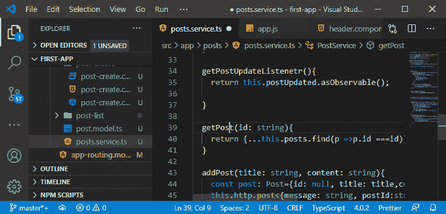

在上面的代码中，我们使用了 spread 运算符(…)来提取对象的所有属性，并将它们添加到一个新对象中。我们使用了这个. postss，因为我们想从 post 数组中获取那个对象。find()方法用于从 post 中获取对象，在这个方法中，我们使用了一个函数作为参数，它将在数组中的每个 post 上执行。如果该函数返回 true，则返回 post 对象。只有当数组中 post 的 id 等于 getPost()方法的 id 参数时，此函数才返回 true。

10)在我们的后期创建组件中，我们已经注入了我们的后期服务，所以我们只需要加载那个帖子并存储它。我们将创建一个类型为 post 的新属性，在 ngOnInit()中，我们以如下方式存储单个 Post:

```

private post: Post;
this.post = this.postsService.getPost(this.postId);

```

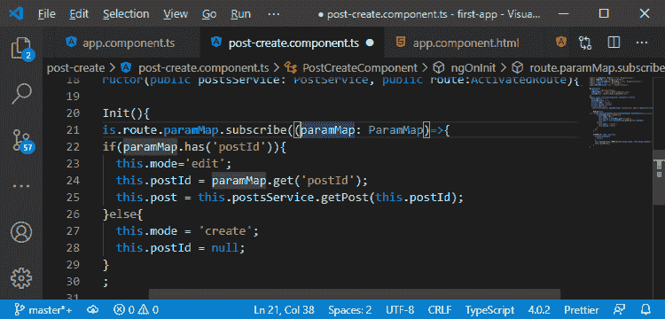

11)现在，唯一剩下要做的事情是，我们实际上用帖子数据填充我们的表单，然后处理提交。我们需要确保我们可以加载这个页面，为此，我们将返回到我们的帖子列表组件。在这里，我们创建了一个编辑帖子的按钮，但是现在我们将它变成一个锚点标签，因为它会有一个链接，如下所示:

```

<a mat-button color="primary" [routerLink] = "['/edit',post.id]">EDIT</a>

```

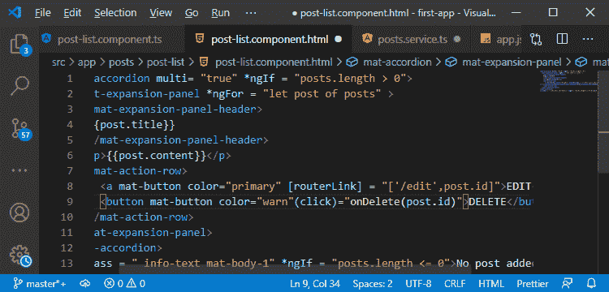

12)现在，我们需要用该帖子的值预先填充我们的表单。我们将回到我们的 post-creare.component.html 文件，在这里，我们使用了模板驱动的方法。这意味着我们必须在输入字段中对 ngModel 进行单向绑定。使用 ngModel 将它注册为控件是不够的。我们需要为 angular 提供我们想要使用的默认值的额外信息，这可以通过简单地用方括号将 ngModel 包装起来来实现，如下所示:

```

[ngModel] = "post.title"
[ngModel] = "post.content"

```

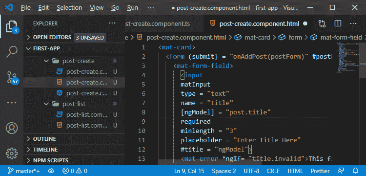

现在，如果我们保存这个并返回到我们的 angular 应用程序，我们将在其中看到以下变化:

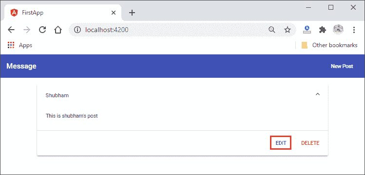
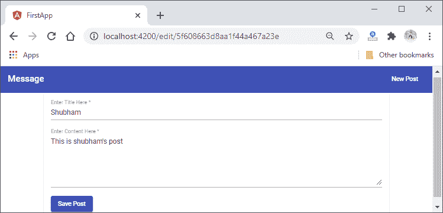

13)现在，我们希望确保在提交帖子时更新，而不是添加。为此，我们将返回到我们的 post.service.ts 文件，并且我们将添加一个更新我们的帖子的新方法。在这种方法中，我们希望获得一个 id 和帖子数据，并使用这些数据以下列方式创建一个新帖子:

```

updatePost( id: string, title:string, content:string){
    const post: Post = {id:id, title:title, content:content};
  }

```

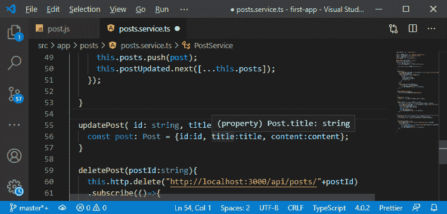

14)我们需要一个后端路由来发送这个请求，所以我们将返回到我们的 app.js 文件。为了更新内容，我们可以使用 **put** 请求来放置新的资源，并用它完全替换旧的资源，或者我们可以使用**补丁**请求来仅用新值更新资源。我们将以下列方式使用 put 请求:

```

app.put("/api/posts/:id", (req, res, next)=>{

});

```

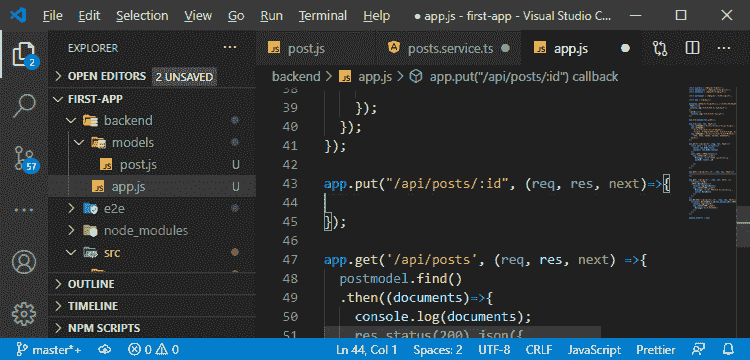

15)现在，我们需要使用猫鼬来更新一个资源，为此，我们将使用 **Post** 模型并使用 updateOne()方法。在这个方法中，我们将 URL 中的 id 作为一个对象传递，并传递我们想要存储的新对象，即新帖子。因此，首先，我们将创建具有相同 id 的帖子，然后通过以下方式将其传递给方法:

```

app.put("/api/posts/:id", (req, res, next)=>{
  const post = new post({
    _id: req.body.id,
    title: req.body.title,
    content: req.body.content
  });
  postmodel.updateOne({_id:req.params.id}, post);
});

```

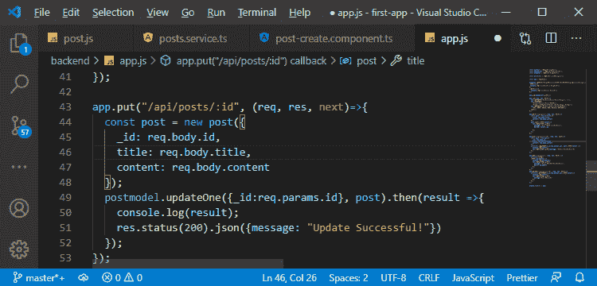

16)我们还需要连锁**然后**区块来处理成功案例。在获得结果的回调中，我们将对结果进行控制台处理，并以如下方式发送带有 json 数据的响应:

```

postmodel.updateOne({_id:req.params.id}, post).then(result =>{
    console.log(result);
    res.status(200).json({message: "Update Successful!"})
  });

```

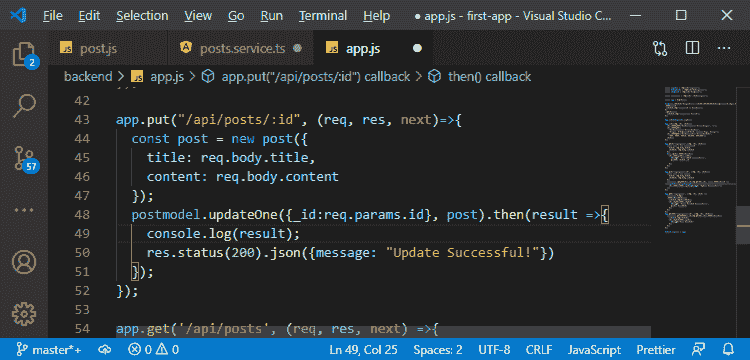

17)现在，我们将返回到我们的 **service.ts** 文件，在 updatePost()方法中，我们将使用本地 http 服务通过以下方式向 URL 发送 put 请求:

```

this.http.put("http://localhost:3000/api/posts"+id,post);

```

我们还需要订阅 put 请求，然后我们将返回我们的响应，现在，我们将简单地控制台记录该响应。这意味着我们还不会在本地更新帖子。

```

.subscribe(response =>console.log(response));

```

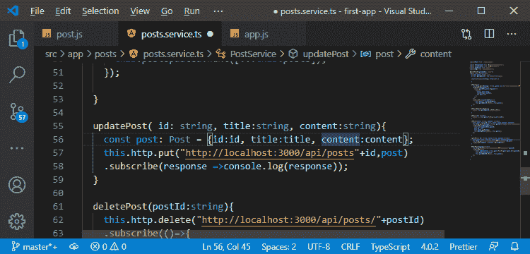

#### 注意:如果您得到一个错误，即此时没有找到属性标题，您可以忽略它。我们将在下一节稍后修复它。

如果我们回到我们的应用程序，在对其进行一些更改后，点击编辑并点击保存帖子，它将被添加为未更新的新帖子。

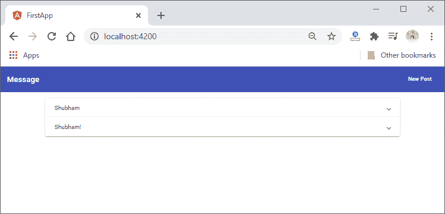

18)引发此错误是因为我们没有使用 updatePost()方法。我们仍然在 **post-create.component.ts** 中添加帖子，因此，我们将到达 **onAddPost()** 方法，在该方法中，我们将在表单验证后检查模式。如果模式是**“创建”**，那么帖子将被添加，否则帖子将以以下方式更新:

```

onAddPost( form: NgForm){
      if(form.invalid){
        return;
      }
      if(this.mode==="create"){
        this.postsService.addPost(form.value.title, form.value.content );
      }else{
        this.postsService.updatePost(
          this.postId,
          form.value.title,
          form.value.content
        );
      }
      form.resetForm();
    }

```

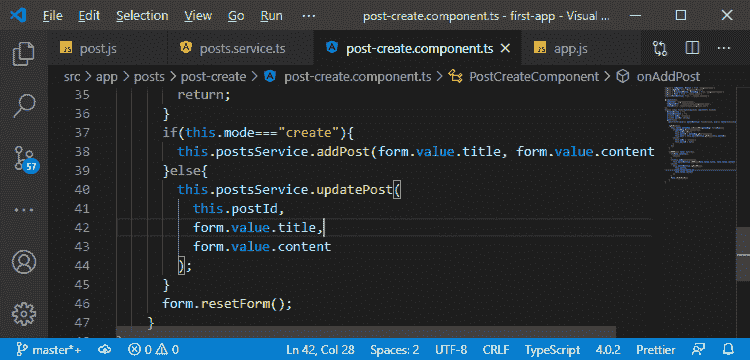

如果我们回到我们的应用程序，并试图编辑一篇文章，我们会得到以下 CORS 错误。

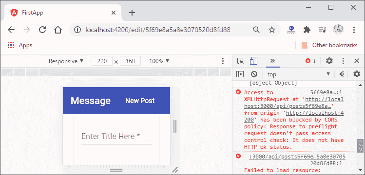

19)现在，这个错误将通过转到我们的 app.js 文件来消除。在这个文件中，我们允许**“访问控制-允许-方法”**中的放入请求

```

res.setHeader("Access-Control-Allow-Methods",
    "GET, POST, PATCH, PUT, DELETE, OPTIONS");

```

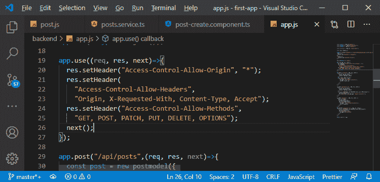

现在，我们将再次尝试编辑帖子。

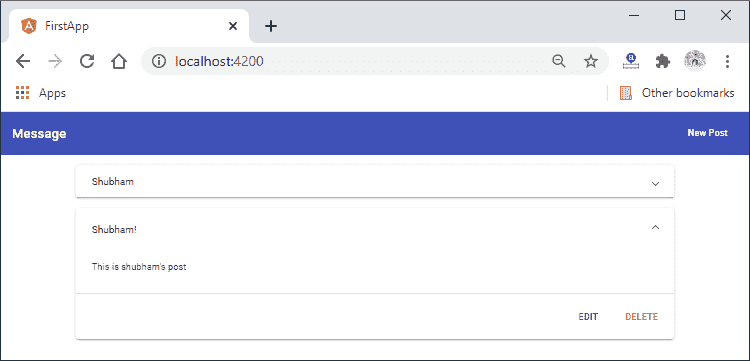
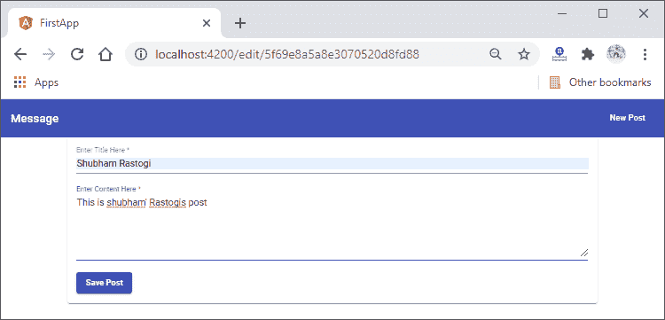
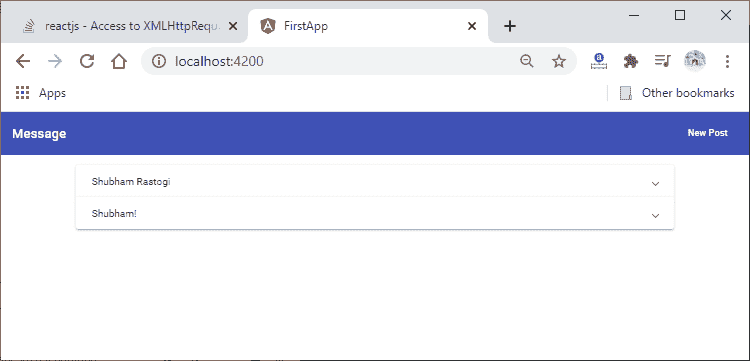

一切都很好，但是这里缺少了两件事，即我们还没有立即更新本地数组中的帖子。我们将在下一节中这样做，我们将立即重新加载页面，因为帖子的 id 在网址上是可见的。

* * *