# MEAN 栈中后端路由的分组

> 原文：<https://www.javatpoint.com/grouping-the-backend-routes-in-mean-stack>

在我们前面的部分中，更新和获取帖子工作得很好。那里仍然缺少身份验证。现在，我们正在整理 app.js 文件中的所有内容。这个文件仍然不大，在本节中，我们将以不同的方式组织我们的路由，因为我们稍后将添加更多路由进行身份验证。如果我们把他们分组就好了。我们将使用以下步骤对它们进行分组:

1)因此，由于我们在前端有一个文件夹和文件结构，我们希望在后端有一个。除了我们的“模型”文件夹之外，我们还会添加另一个文件夹，并将其命名为**路线**。在这方面，我们将为我们的后援组织我们的路线。在这个文件夹中，我们还将创建一个 javascript 文件，并将其命名为**帖子**，如下所示:

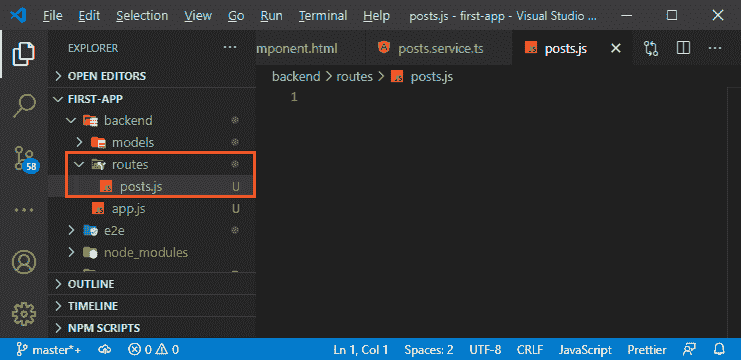

2)在这个文件中，我们将使用 [javascript](https://www.javatpoint.com/javascript-tutorial) 语法导入 express，然后我们将通过以下方式创建一个新常数来设置 express 路由器:

```

const express = require("express");

const router = express.Router();

```

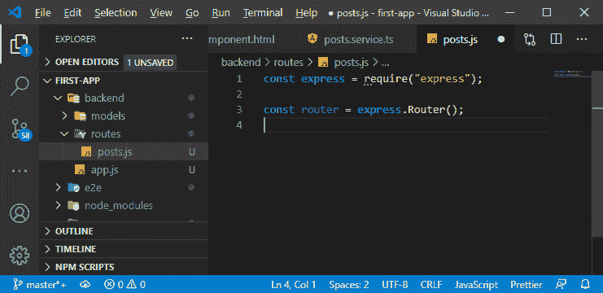

3)我们将定义我们的路由，就像我们使用 **js** 文件中的**应用程序**一样，我们可以通过以下方式使用 **router.get()** :

```

router.get();

```

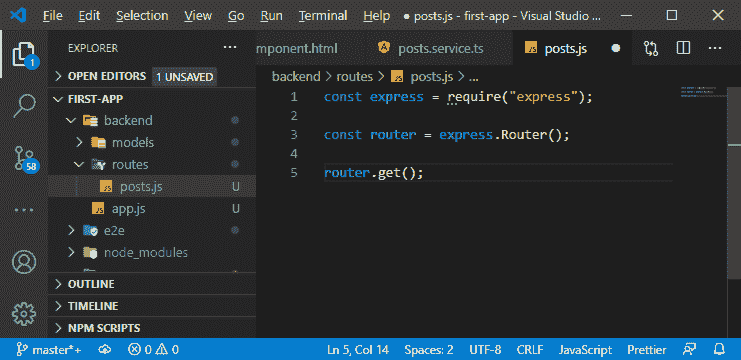

这与**应用程序**之前的工作方式相同。在这种情况下，我们可以通过抓取其网址来复制路由。我们将[网址](https://www.javatpoint.com/url-full-form)作为第一个参数，将函数作为第二个参数。我们还可以抓取 app.js 文件中的所有路线。

4)因此，我们将从 **js** 文件中剪切所有路由，并将其添加到**post . js**文件中，我们还将以以下方式用**路由器**替换 **app** :

```

router.post("/api/posts",(req, res, next)=>{
  const post = new postmodel({
    title: req.body.title,
    content: req.body.content
  });
  post.save().then(result=>{
    res.status(201).json({
      message: 'Post added successfully',
      postId: result._id

    });
  });
});

router.put("/api/posts/:id", (req, res, next)=>{
  const post = new postmodel({
    _id: req.body.id,
    title: req.body.title,
    content: req.body.content
  });
  postmodel.updateOne({_id:req.params.id}, post).then(result =>{
    console.log(result);
    res.status(200).json({message: "Update Successful!"})
  });
});

router.get('/api/posts', (req, res, next) =>{
  postmodel.find()
  .then((documents)=>{
    console.log(documents);
    res.status(200).json({
      message: 'Posts Fetched Successfully',
      posts: documents
    });
  });
});

router.get("/api/posts/:id",(req, res, next)=>{
  postmodel.findById(req.params.id).then(post =>{
    if(post){
      res.status(200).json(post);
    }else{
      res.status(484).json({message: 'Post not Found!'});
    }
  });
});

router.delete("/api/posts/:id", (req, res, next)=>{
  postmodel.deleteOne({_id:req.params.id}).then(result=>{
    console.log(result);
    res.status(200).json({
      message:"Post deleted!"
    });
  });
});

```

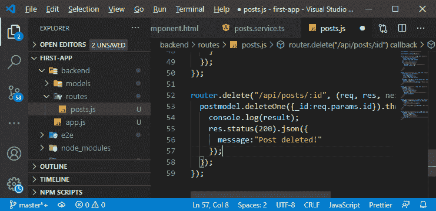

5)现在，我们需要导出此路由器以使 express 意识到它，为此，我们将使用模块。

```

module.exports = router;

```

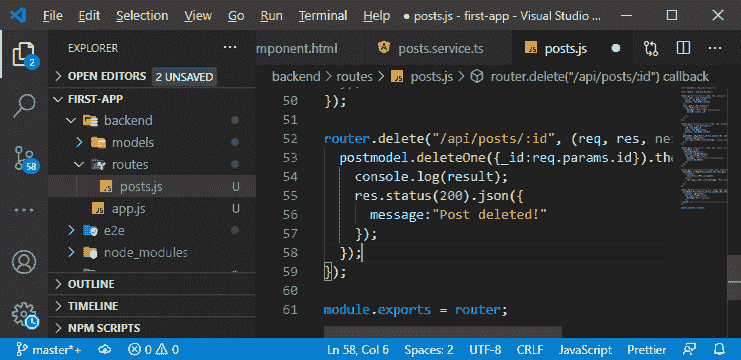

6)我们需要将其导入到我们的 **app.js** 文件中，这样我们就可以再次让我们的主快递 app 知道这些额外的路由，因为如果我们不导入路由器，那么我们所有的路由都将失败。因此，我们将以以下方式导入路线:

```

const postroutes = require('./routes/posts');

```

导入路由对象后，我们需要让 express 知道它，这将通过以下方式完成:

```

app.use(postroutes);

```

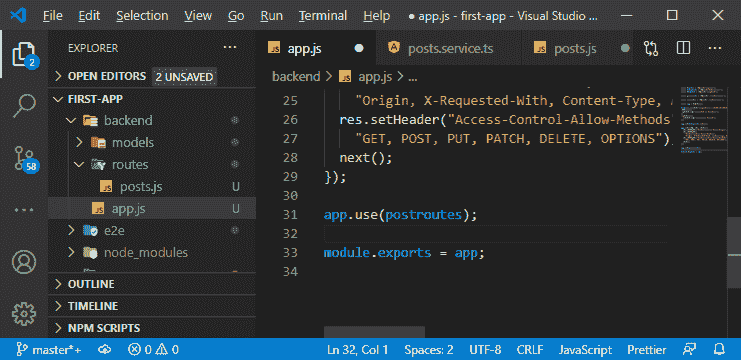

7)app . js 文件中没有使用 postmodel，因为我们在路线中使用了我们的模型。因此，我们将从 app.js 文件中删除它，并将我们的 postmodel 导入到我们的 posts.js 文件中。

```

const postmodel = require('./models/post');

```

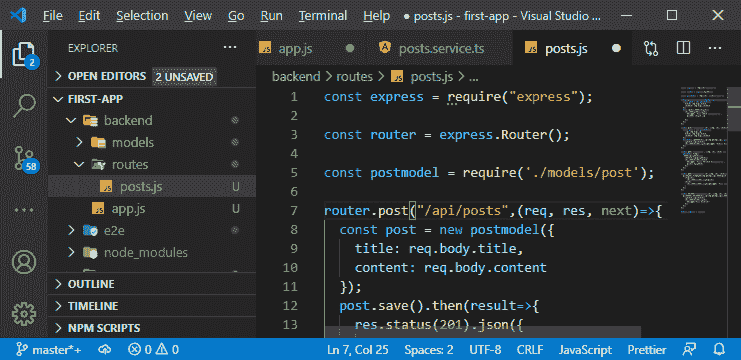

8)我们可以改进**的使用(后置路由)。**稍后，我们将有多个路由文件，我们的 posts.js 文件应该只处理到达/API . post/nothing 或斜杠类似 id 的路由。我们从我们的帖子请求中删除了/API/post，并假设到达该文件的任何路由或请求都已被过滤。为此，我们将在 app.js 文件中添加/API/post 作为 **app.use()** 方法的第一个参数，如下所示:

```

app.use("/api/posts", postroutes);

```

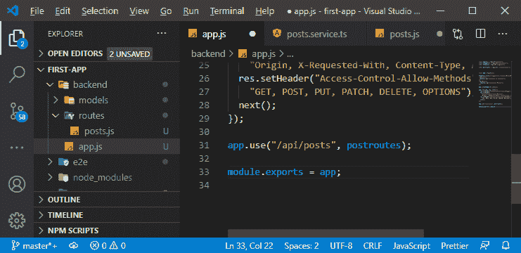

通过添加这一行代码，我们过滤了去往 API 帖子的请求，只有 URL 或 URL 路径以**/API/帖子**开头的请求才会被转发到帖子路由文件和路由设置中。

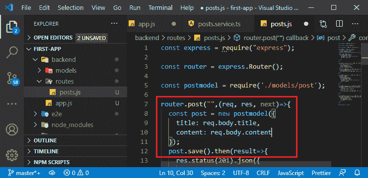

9)现在，我们还需要为 put 请求、get 请求和 delete 请求移除**/API/post**。

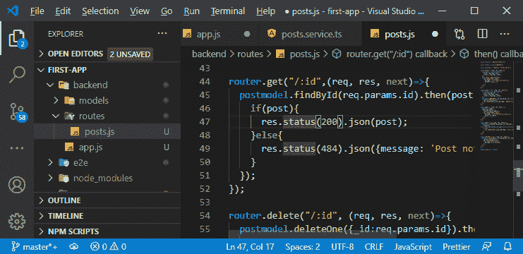

我们应该还是像以前一样有一个工作的应用程序，我们将通过添加或删除帖子来测试这一点。所以，我们将回到我们的 angular app，尝试添加和删除一个帖子。

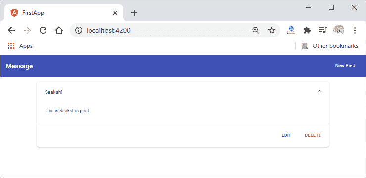

将路由分组到一个新文件后，一切都运行良好。在下一节中，我们将学习如何将加载微调器添加到我们的应用程序中。

**下载完整项目(分组路线. zip)**

* * *