# 在MEAN 栈中加载微调器

> 原文：<https://www.javatpoint.com/loading-spinner-in-mean-stack>

在前一节中，我们学习了如何将后端路由分组到一个单独的文件中，并将其连接到后端。以前一切都很顺利。这一部分将使我们了解装载微调器，以及如何将其添加到我们的 angular 应用程序中。我们将在这里添加两件事，即导航用户并显示微调器。我们将使用以下步骤来添加它们:

导航用户非常简单。我们将返回到我们的创建后组件文件，并使用 onAddPost()方法。我们想导航用户一旦我们完成了添加文章或更新文章。为此，我们在 post.service.ts 文件中做了一些更改，在那里我们得到了成功响应。

1)我们将在后期服务中注入一些东西，这有助于导航，这是一个角度路由器，因为我们不能像添加新帖子一样通过添加链接来更改页面。我们将通过编程实现这一点，为此，我们在构造函数中注入 router，如下所示:

```

import {Router} from '@angular/router';
constructor(private http: HttpClient, private router: Router){}

```


2)现在，我们将回到我们的 addPost()方法，在订阅中，我们将联系我们的路由器，并以以下方式调用导航方法:

```

this.router.navigate();

```

在这个导航方法()中，我们需要传递一个段数组，就像我们在路由器链路上传递的那样，当我们想要传递的不仅仅是一个普通的字符串时。所以，第一段是斜线。这条斜线将始终引导我们找到根路径。

```

this.router.navigate(["/"]);

```

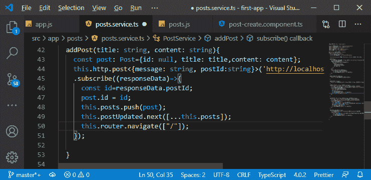

3)我们将以下列方式在 updatePost()方法中做同样的事情:

```

this.router.navigate(["/"]);

```

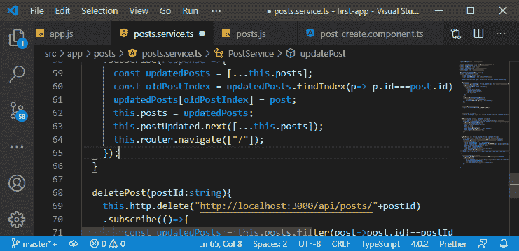

现在，添加或更新帖子后，我们将导航到路线页面，如下所示:

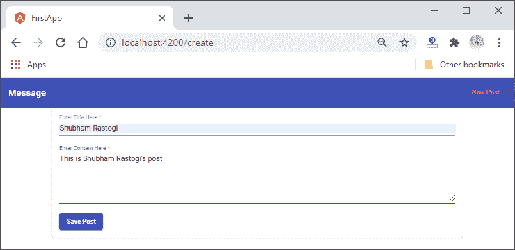
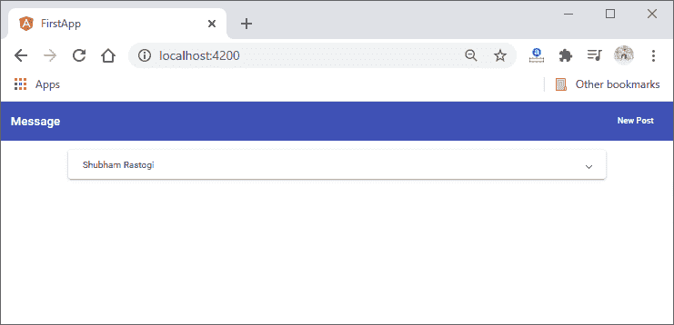

4)现在，使用加载微调器，angular 为我们提供了**进度微调器**。所以，要使用它，我们需要解锁它。我们将回到我们的**模块. ts** 文件，这里我们将添加一个新的模块，即 **MatProgressSpinnerModule** ，方式如下:

```

import { MatProgressSpinnerModule } from '@angular/material';
imports: [
    …
    …
    MatProgressSpinnerModule,
    …
    … 
],

```

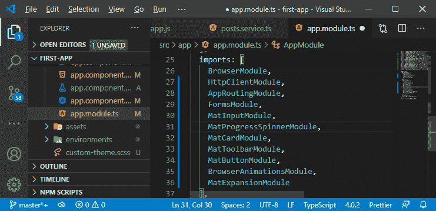

5)现在，我们将在加载帖子时在我们的 **post-create.component.ts** 文件中使用它。在**的 ngOnInit()** 方法中，我们在哪里取帖子，我们就会显示出来。因此，我们将创建一个新的属性，即**加载，**，并且我们将初始设置为 false，在此处，在 ngOnInit()方法中开始提取帖子。我们将此属性设置为 true，当帖子的提取完成时，我们将通过以下方式再次将此属性设置为 false:

```

Loading = false	//This is property
this.Loading = true;
          this.postsService.getPost(this.postId).subscribe(postData=>{
            this.Loading = false;
            this.post = {id: postData._id, title: postData.title, content: postData.content}
});

```

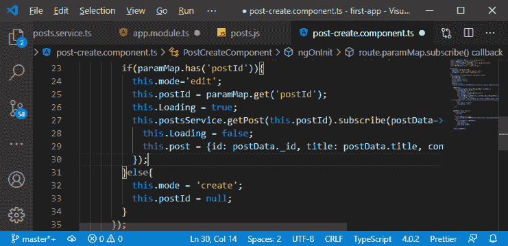

6)现在，我们使用“Loading”属性来隐藏我们的后期创建组件的整个表单，并且只要我们正在加载就显示一个微调器。为此，我们将使用带有*ngIf =“加载”的 **<垫旋转器></垫旋转器>** ，并且我们使用*ngIf =“！在我们的**中加载<表单></表单>** 的方式如下:

```

<mat-spinner *ngIf = "Loading"></mat-spinner>
  <form (submit) = "onAddPost(postForm)" #postForm = "ngForm" *ngIf = "!Loading">

```

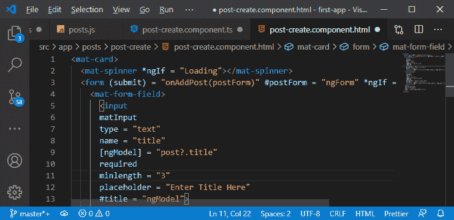

现在，如果我们保存这个并尝试编辑一篇文章，我们将在屏幕的左侧看到一会儿微调器。

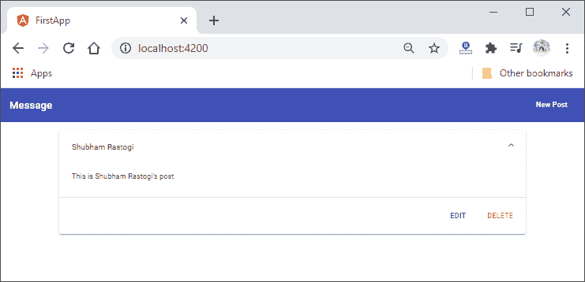
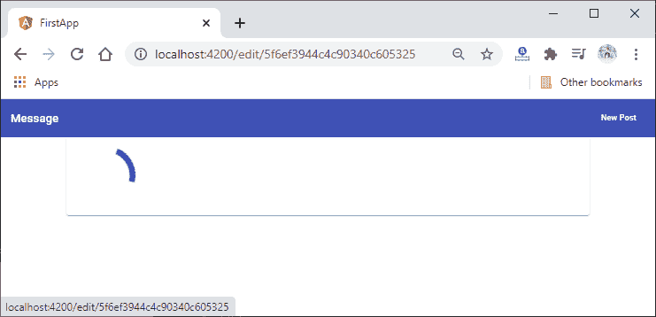

7)我们将添加样式来居中这个微调器。我们将返回到我们的后期创建组件的 [CSS](https://www.javatpoint.com/css-tutorial) 文件，并按照以下方式编写样式规则:

```

mat-spinner{
  margin: auto;
}

```

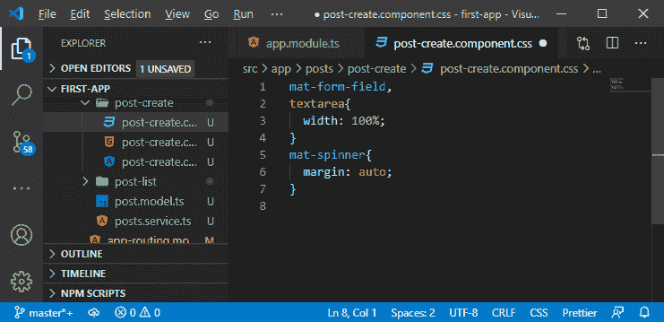

这将像这样进入微调器:

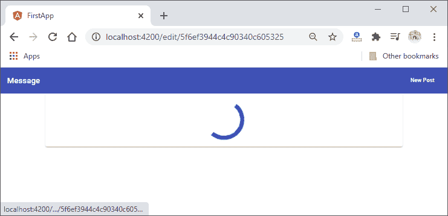

8)现在，我们还将在保存帖子时添加一个微调器。因此，我们将返回到我们的 post-create.component.ts 文件，并使用 onAddPost()方法。在这个方法中，我们将把 Loading 属性设置为 true，在这里我们开始创建帖子。我们不需要将其重置为 false，因为我们将在保存帖子后离开此页面。

```

onAddPost( form: NgForm){
      …
      …
      this.Loading = true;
      if(this.mode==="create"){
        …
        …
       }
    }
    }

```


现在，如果我们保存一篇文章，我们还会看到这样一个旋转器:

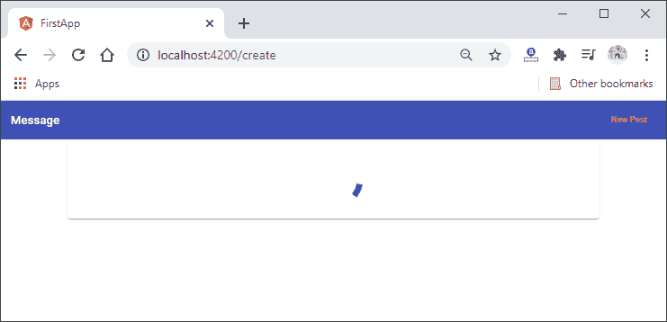

9)我们还将向消息列表页面添加微调器。我们将通过添加 **<微调器></微调器>** 以与我们在后期创建组件中所做的相同的方式来完成。我们将通过以下方式添加<垫旋转器>:

```

<mat-spinner *ngIf = "Loading"></mat-spinner>
<mat-accordion multi= "true" *ngIf = "posts.length > 0 && !Loading">

```

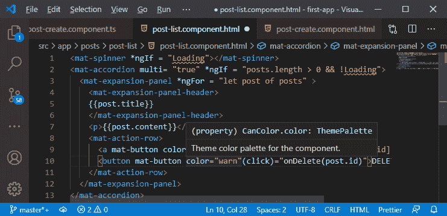

10)现在，我们需要在 **post-list.component.ts** 文件中定义 Loading 属性，最初我们会将该属性设置为 false。在 ngOnInit()方法中，我们将在调用 getPosts()方法之前将“Loading”属性设置为 true，之后，我们将在通过以下方式获得更新后立即将该属性设置为 false:

```

Loading = false;	//This is a property
ngOnInit(){
    this.Loading = true;
    this.postsService.getPosts();
    this.PostSub=this.postsService.getPostUpdateListenetr().
    subscribe((posts: Post[])=>{
      this.Loading = false;
      this.posts = posts;
    });
  }

```

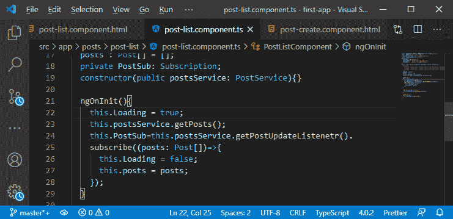

11)现在，我们将编写 CSS 代码来设置微调器的样式，就像我们在 post create 组件中所做的那样，如下所示:

```

mat-spinner{
  margin: auto;
}

```

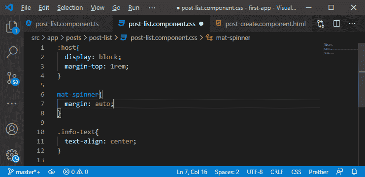

现在，如果我们回到我们的 angular 应用程序，我们会看到一个旋转器，如:

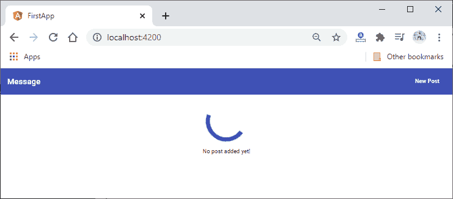

一切都很好，从下一节开始，我们将开始我们的 [MEAN Stack 教程](https://www.javatpoint.com/mean-stack)的新模块。在本模块中，我们将学习图像、用于图像上传的角度材料以及更多关于图像上传的概念。

**下载完整项目(加载 spinner.zip)**

* * *