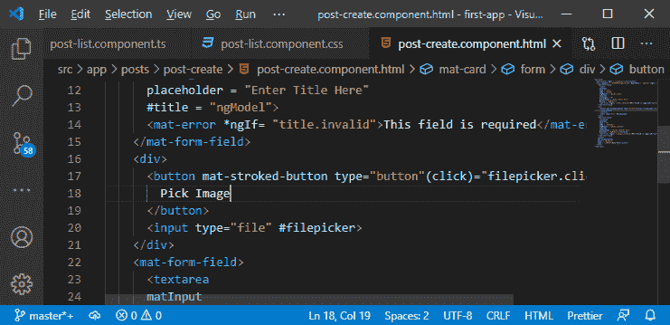

# 在平MEAN 栈中添加文件输入按钮

> 原文：<https://www.javatpoint.com/adding-the-file-input-button-in-mean-stack>

在图像上传模块的这一部分，我们将学习**文件输入按钮**。当我们点击**文件输入按钮**时，将会打开一个文件选择器，我们将从该文件选择器中选择一个图像文件。我们将使用以下步骤添加文件输入按钮:

1)我们将转到我们的**post-create.component.html**文件，这里我们将添加一个新按钮。我们将在文章标题下面添加这个按钮。我们将使用[**<></div>**](https://www.javatpoint.com/html-div-tag)在这里，我们将创建 [**<按钮></按钮>**](https://www.javatpoint.com/html-button-tag) 与**垫-按钮**指令，该指令将以以下方式将按钮变成有角度的材料按钮:

```

<div>
      <button mat-button>
        Pick Image
      </button>
    </div>

```


现在，如果我们回到我们的 angular app，点击 **Pick Image** 按钮，我们会得到验证错误，因为默认情况下，该按钮会尝试提交表单。


2)我们将通过以下方式将此按钮的类型设置为按钮来更改:

```

<button mat-button type="button">
        Pick Image
      </button>

```


我们将改变这个按钮的外观。我们将使用**垫击按钮**而不是使用**垫击按钮**，如下所示:

```

<button mat-mat-stroked-button type="button">

```


按钮应该是这样的:


3)现在，我们需要添加打开文件选择器对话框的功能。我们有一个默认输入，可以使用类型文件。当我们添加此内容时，我们将获得如下所示的文件选择器对话框:

```

<input type="file">

```


4)这个拾音器真的很丑，没有默认的材质造型。因此，我们必须隐藏这个选取器，而不是将其从 DOM 中移除。它应该在那里，只是被隐藏起来。当我们点击该按钮时，我们希望在该选择器上模拟一个点击事件。因此，我们将使用默认的点击功能，并将拾取的文件存储在该输入中。但是我们没有看到那个丑陋的界面。

现在，为了做到这一点，我们将隐藏输入，我们将在这个组件的 CSS 文件中这样做。我们将像这样编写 CSS 代码:

```

input[type='file']{
  visibility: hidden;
}

```


写完 [CSS](https://www.javatpoint.com/css-tutorial) 代码后，文件选择器就没了，它还是 DOM 的一部分。


5)现在，我们将通过给输入一个带有标签的本地引用来将按钮点击代理到这个输入上，在按钮点击上，我们将执行文件选择器，如下所示:

```

<button mat-stroked-button type="button"(click)="filepicker.click()">
        Pick Image
      </button>

```



现在，如果单击按钮，我们将看到文件选择器，如下所示:


现在，我们需要将这个输入注册为我们表单的输入，并且我们将通过切换到创建和处理该表单的反应式方法来实现。它给了我们更多的能力，更多的特性。我们还想添加我们自己的验证器来验证我们只上传图像文件。如果我们使用反应式表单方法，这是一个非常容易实现的高级功能。

在下一节中，我们将学习如何将表单从模板驱动的方法转换为反应式方法。

* * *