# Mime 类型验证器

> 原文：<https://www.javatpoint.com/mime-type-validator-in-mean-stack>

在前面的部分中，我们成功地添加了图像控件来存储图像，并向用户预览了图像。一切都很好，但如果我们也能验证它有一个有效的图像，那就更好了。没有内置的验证器可以帮助我们，所以我们将编写自己的验证器。我们将按照以下方式在一个单独的文件中编写验证器:

1)我们将在我们的后期创建组件中创建新的[类型脚本](https://www.javatpoint.com/typescript-tutorial)文件，并将其命名为 **mime-type.validator.ts** 。

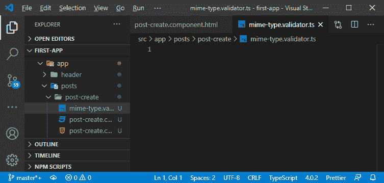

mime 类型验证器的任务是获取控件的值，它将是一个文件。之后，它会再次使用该文件读取器读取该文件，然后检查该文件的 mime 类型。我们会一起写这个的逻辑，所以会稍微复杂一点，高级一点 [JavaScript](https://www.javatpoint.com/javascript-tutorial) 。

2)所有的验证器都只是读入控制值并返回信息的函数，不管是否有效。因此，我们将使用 export 关键字创建一个函数。为了更好的理解，我们将它命名为 mime-type。你可以给它起任何名字。

```

export const mimetype = () => {

};

```

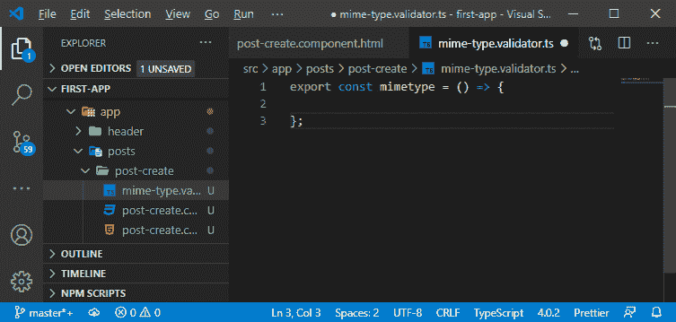

3)现在，我们需要通过争论。我们将抽象控件类型的控件作为参数传递，如下所示:

```

import { AbstractControl } from '@angular/forms';

export const mimetype = (control: AbstractControl) => {

};

```

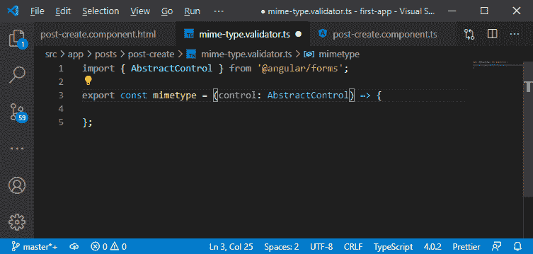

4)我们还需要返回一些东西，这将是一个异步验证器，因为用文件读取器读取那个文件是一个异步任务。普通的同步验证器会简单地返回一个 JavaScript 对象，其中我们有一个带有自己的错误代码的键值对，然后是该错误代码的值或 null。如果验证器返回 null，该值将被视为有效，否则，它将无效或失败。现在，对于异步验证器来说，它几乎是一样的，但是带有错误代码的 [JavaScript 对象](https://www.javatpoint.com/javascript-objects)被一个可观察到的或者承诺所包装。所以，我们要么返回一个承诺，要么返回一个可观察的。

```

import { Observable } from 'rxjs';
export const mimetype = (control: AbstractControl): Promise | Observable => {

};

```

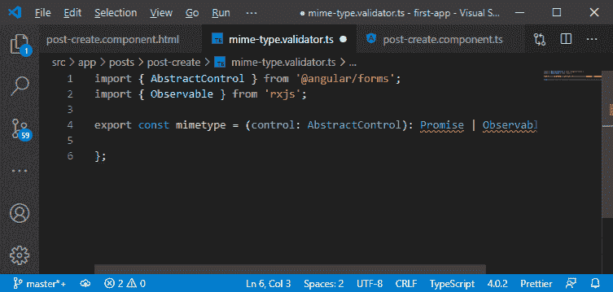

5)承诺和可观察都是通用的，这意味着很清楚它们最终会产生什么价值。对于承诺，那将是那个 JavaScript 对象，在这个对象中，我们有任何属性，我们不关心名字。我们只是想说它应该有一个属性，我们用这样的方括号来表示:

```

export const mimetype = (control: AbstractControl): Promise | Observable => {
};

```

[key: string]表示这个返回类型将有一个可以解释为字符串的属性，我们不关心名称。方括号不表示数组。它表示这是一个动态属性名。

现在，该属性的值可以是任何值，因此，我们可以为该错误代码传递任何我们想要的值。

```

export const mimetype = (control: AbstractControl): Promise | Observable => {

};

```

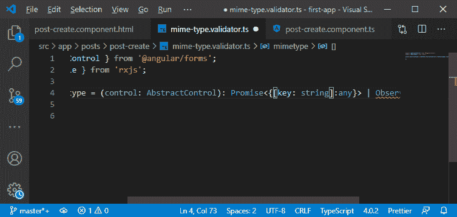

6)我们用于承诺的泛型类型对于可观察的是相同的。这将是我们的函数定义，所以我们会得到一个错误，因为我们现在没有实现它。我们没有回报一个承诺或一个可观察到的。

```

export const mimetype = (control: AbstractControl): Promise | Observable => {
};

```

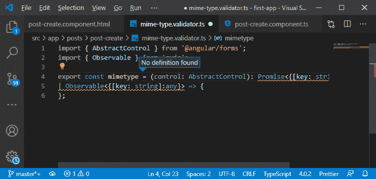

7)在函数体中，我们将按照以下方式提取文件:

```

const file = control.value as File;

```

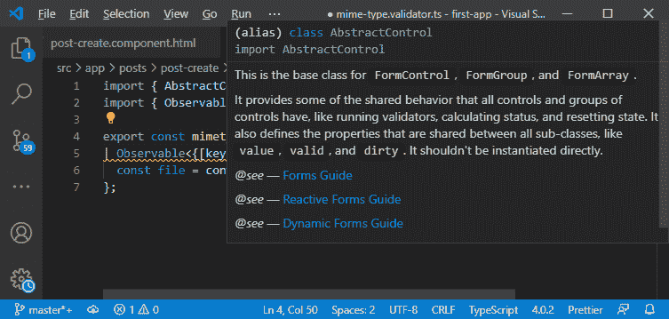

在上面的代码行中，我们将创建一个新的常量并存储控件的值。我们使用**“as File”**来告诉 typescript，控件的值将是一个文件。

8)我们将使用文件阅读器，因此我们将创建一个新的文件阅读器对象，如下所示:

```

const filereader = new FileReader();

```

现在，我们可以使用 filereader 读入该文件的值。以前，我们使用 **filereader.onload** ，但是现在我们需要 **onloadend** 这并不能真正起作用，因为在这个函数中，我们需要返回一个承诺或者一个可观察的结果，而 **filereader.onloadend** 两者都不是。这是只注册一个函数的同步代码。

9)[**rxjs**](https://www.javatpoint.com/rxjs)给了我们一些东西，让我们可以把**“file reader . onloadend =()=>{ }”**转换成一个可观察的，也就是我们可以创造自己的可观察的。为此，我们将为 file reader observable 创建一个新的常量，并通过调用 observable 创建我们自己的 observable，并且有一个静态 create()方法。

```

const FRObs = Observable.create();

```

使用 **create()** 方法，我们可以从头开始创建自己的可观察对象。

10)现在，我们将传递一个函数给可观察对象作为参数。话说回来，这个函数自动得到一个**rjs**传入的观察者，它是观察者类型。

```

const FRObs = Observable.create((observer:Observer)=>{

  });

```

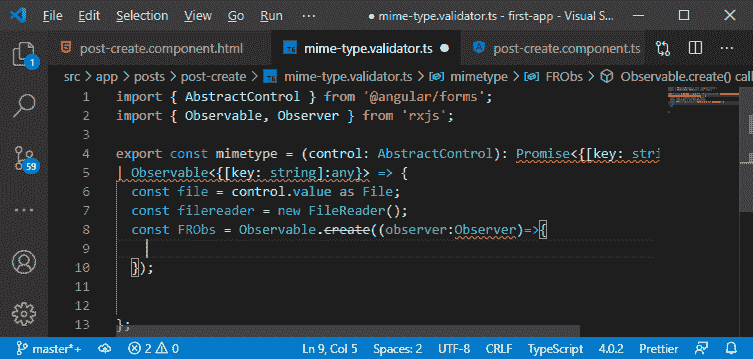

11)我们在 Observer 中得到一个错误，因为它原来是一个泛型类型，该类型将是我们的整个验证器最终将发出的相同的 JavaScript 对象。

```

const FRObs = Observable.create((observer:Observer)=>{

  });

```

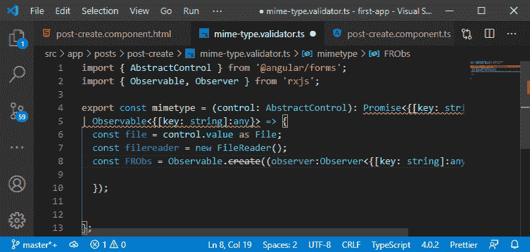

12)在这个可观察到的例子中，我们将获取我们的 filereader，并向其中添加 loadend 事件侦听器。loadend 事件完成后，将执行另一个函数。

```

filereader.addEventListener("loadend", () =>{

});

```

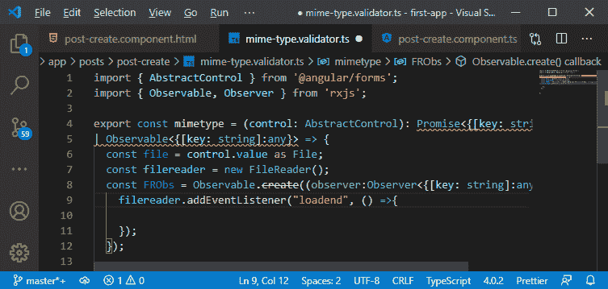

13)现在，我们有了 loadend 事件，在这里，我们希望发出一个新的值，该值包含知道这是否是一个有效文件的信息。由于这些额外的信息，我们将在这个事件侦听器中完成这项工作。在实现之前，我们将转到监听器后面的行，这里我们将通过读入文件作为数组缓冲区来开始这个过程:

```

filereader.readAsArrayBuffer(file);

```

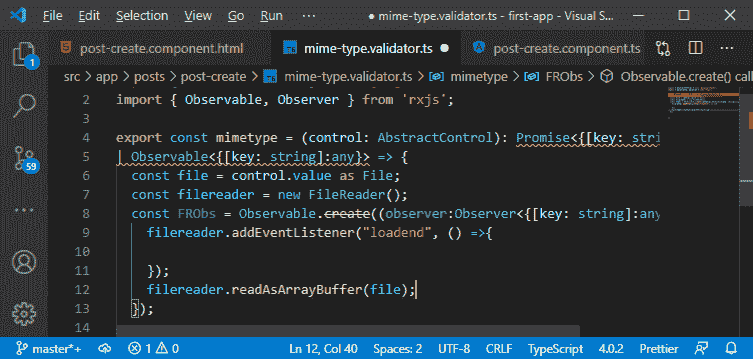

它允许我们访问 mime 类型。完成后，addEventListener loadend 将调用事件侦听器中传递的函数。

14)现在，我们需要实现事件侦听器中传递的函数。我们将在这里进行 mime 类型验证。我们将使用 Uint8Array 以下列方式创建一个 8 位无符号整数的新数组:

```

const arr = new Uint8Array(filereader.result as ArrayBuffer).subarray(0, 4);

```

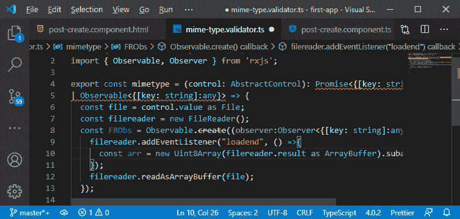

在上面的代码中，我们使用子阵列(0，4)来访问从 0 到 4 的子阵列。它是允许我们得到那种地雷类型的部分。

15)现在，我们需要读取某个模式来获得该文件类型，并且该模式是用“的**读入的。在这个循环中，我们将遍历数组并从中提取一些信息。**

```

for(let i=0; i
```

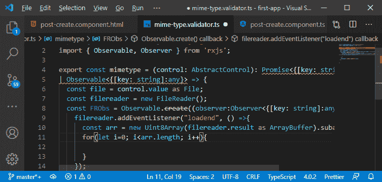

16)现在，为了从那里提取信息，我们将创建一个新的变量头，它最初将是一个空字符串，然后在表单循环中，我们将在字符串中附加一些东西，这将是我们当前在循环中寻找的元素。

```

let header = "";
header+= arr[i].toString(16);

```

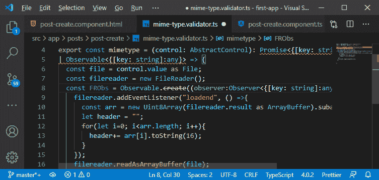

在上面的代码中，我们使用 toString(16)将数组元素转换为十六进制字符串。

17)在获得一个十六进制字符串后，我们可以切换那个头，因为我们将有一个为不同文件类型明确定义模式的字符串。

```

let isValid = false;
switch(header){
          case "89504e47":
            isValid = true;
            break;
          case "ffd8ffe0":
          case "ffd8ffe1":
          case "ffd8ffe2":
          case "ffd8ffe3":
          case "ffd8ffe8":
            isValid = true;
            break;
          default:
            isValid = false; // Or you can use the blob.type as fallback
            break
        }

```

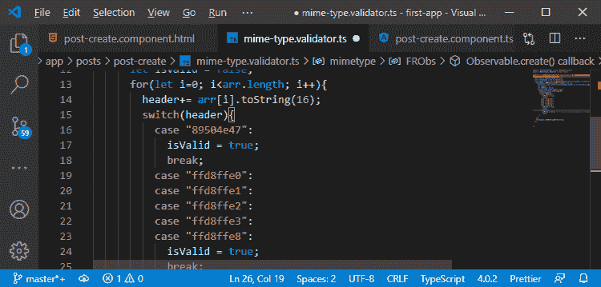

在上面的代码中，每种情况都有一个代表某些文件类型的模式，如 jpeg 和 png。

18)我们有了 isValid 变量，现在我们需要使用 Observer 来控制可观测值。因此，我们将检查 isValid 属性是否为真。如果是真的，它将调用 Observer 的下一个函数来发出一个新的值，这个值将为 null，因为我们必须返回 null。如果不是真的，我们会发出一个不同的值，它是一个 JavaScript 对象，如下所示:

```

if(isValid){
          observer.next(null);
        }else{
          observer.next({invalidMimeType: true});
}

```

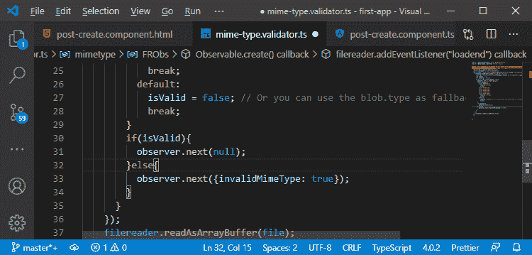

19)我们将调用观察者的完整功能，让任何订阅者知道我们已经完成了。

```

observer.complete();

```

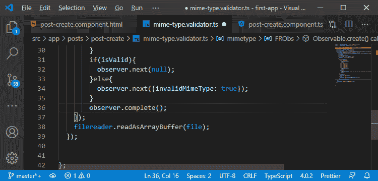

20)我们需要做的唯一一件事是，我们需要通过简单地添加下面一行代码来返回可观察值:

```

return FRObs;

```

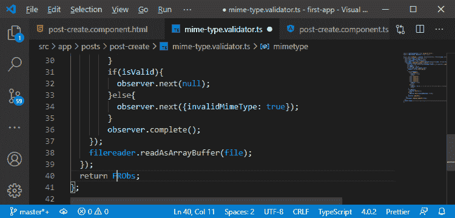

添加这一行代码后，我们将拥有一个有效的文件类型验证器。

21)我们现在将它与我们的表单一起附加，因此我们将返回到我们的创建后组件。我们通过以下方式导入 mime 类型验证器:

```

import {mimetype} from "./mime-type.validator";

```

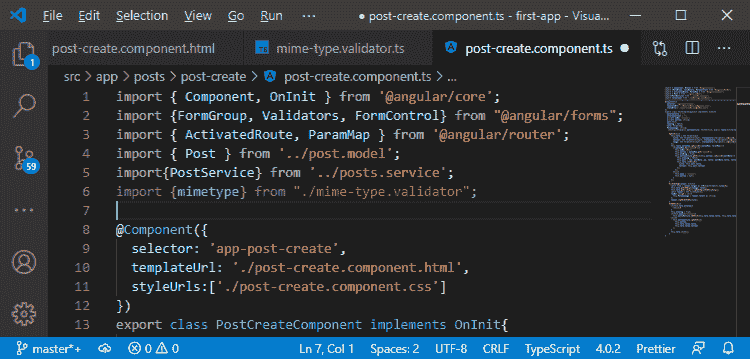

22)我们将在图像控件中添加它，但不是作为验证器，而是作为异步验证器，方式如下:

```

image: new FormControl(null, {
          validators:[Validators.required],
          asyncValidators: [mimetype]
})

```

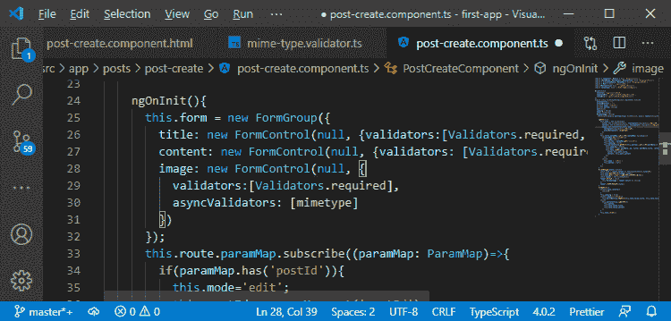

现在，我们正在以一种只接受图像的方式初始化图像。

23)现在，我们将返回到我们的 post-create.component.html 文件，并确保我们的预览不仅会在我们获得有效的图像预览值时显示，而且我们还希望检查图像验证，如下所示:

```

<div class = "image-preview" *ngIf = "Pickedimage !== '' && Pickedimage && form.get('image').valid">

```

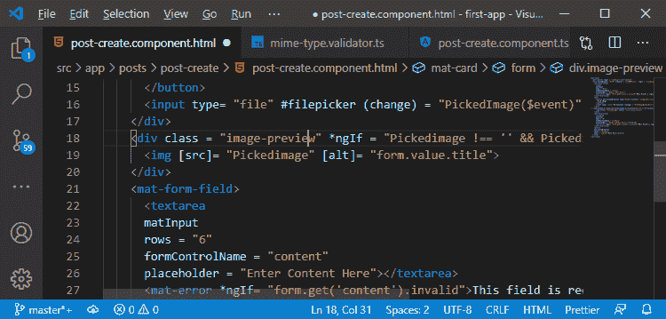

我们保存所有文件，回到我们的 angular 应用程序，并加载图像和视频。

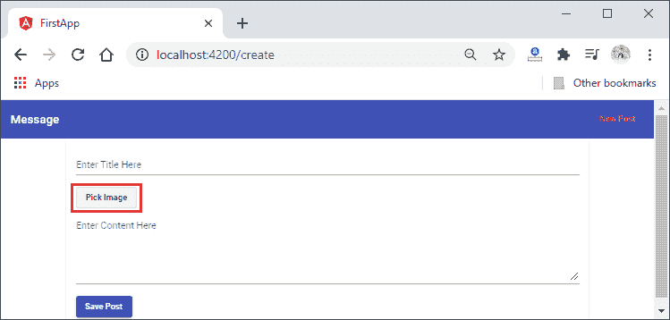
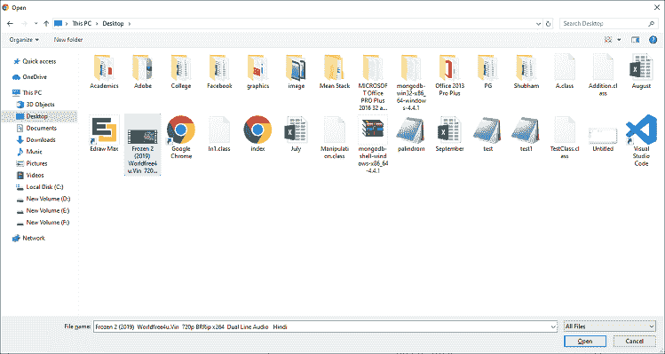
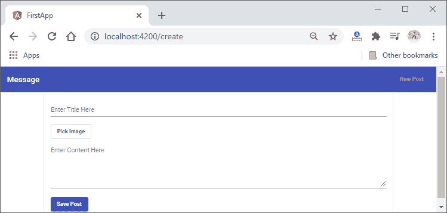

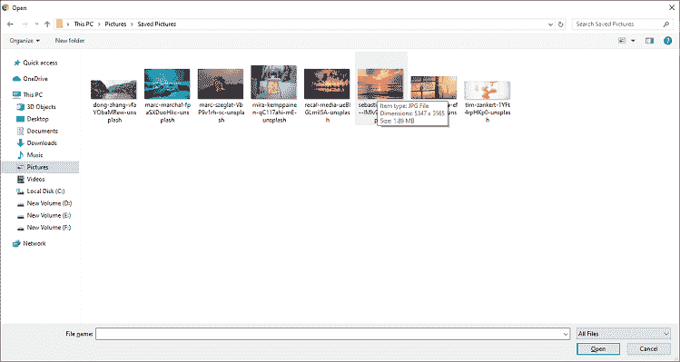
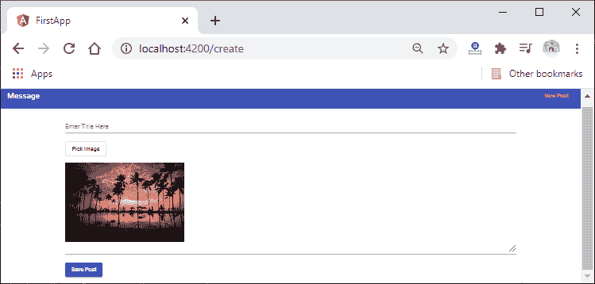

所以，这里一切都很顺利。在下一节中，我们将了解服务器端上传。

**下载完整项目(Mime 类型验证器. zip)**

* * *