# 使用MEAN 栈中的文件网址

> 原文：<https://www.javatpoint.com/working-with-file-url-in-mean-stack>

在前面的部分，我们成功地将上传功能添加到了 angular 中。文件上传工作正常，但我们还有很多工作要做。在 posts.js 中的服务器端代码上，我们有我们的 multer 代码。但是我们没有使用我们存储的文件，也没有对该文件做任何事情。我们没有将路径存储在数据库中，也没有将路径传递回用户。

为了做到这一点，我们可以利用 multer 为我们做的事情。它为我们提供了关于文件的信息，该文件存储在我们的处理函数的请求体中。

1)因此，当我们创建一个新帖子并希望存储在数据库中时，我们也可以存储一个图像路径。这个图像路径是我们的模型所没有预料到的。所以，我们将回到我们的帖子模型，并在其中添加一个新的字段。我们将添加 imagePath 字段，该字段是必需的字符串类型。

```

imagePath: { type: String, required: true}

```

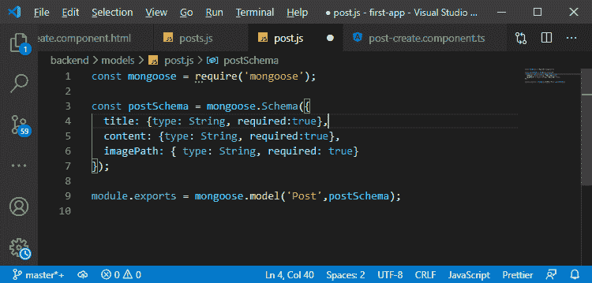

这将是我们后端文件的路径。

2)将 imagePath 字段添加到帖子模型后，我们将返回到我们的帖子路线，在那里我们正在创建帖子。我们将添加另一个字段，即 imagePath，它应该是我们想要存储的那个文件的 [URL](https://www.javatpoint.com/url-full-form) 。

我们将获取我们服务器的网址，并将其存储在一个网址常量中，用于构建该网址。我们可以从请求中得到，有一个协议属性返回我们是用 [HTTP 还是 HTTPS](https://www.javatpoint.com/http-vs-https) 访问服务器，然后我们将添加“://”来创建一个完整的 URL，然后我们可以通过以下方式得到我们当前的主机:

```

const url = req.protocol + '://'+ req.get("host");

```

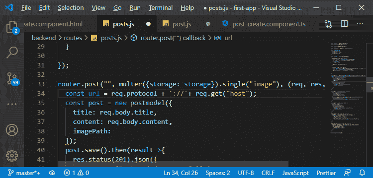

3)这构建了我们服务器的 URL，我们希望拥有这个，因为我们的 **imagePath** 将是我们的 URL，然后是 **"/images/"**

```

imagePath: url + "/images"

```

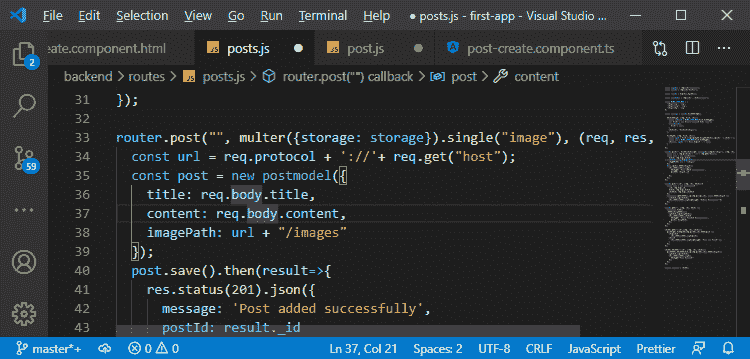

**"/images"** 是我们存储文件的地方。我们将其存储在后端映像中，但是我们将配置该文件夹，以便在我们的域之后可以直接访问。

4)因此，我们只想能够输入我们的**“域/图像”**，然后我们添加文件名，这是 multer 为我们做的部分。

```

imagePath: url + "/images"+req.file.filename

```

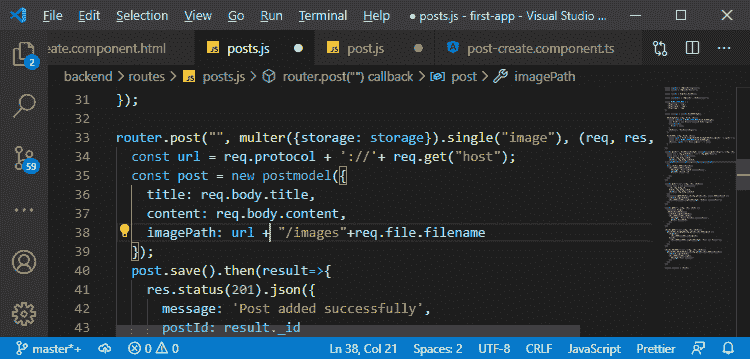

这是我们希望存储在数据库中的图像路径。

5)我们返回一个响应，在那里，我们不只是想返回帖子 ID。我们想退回全部邮件。因此，我们将创建一个帖子，该帖子是以以下方式返回的 JavaScript 对象:

```

post: {
        id: result._id,
        title: result.title,
        content: result.content,
        imagePath: result.imagePath
}

```

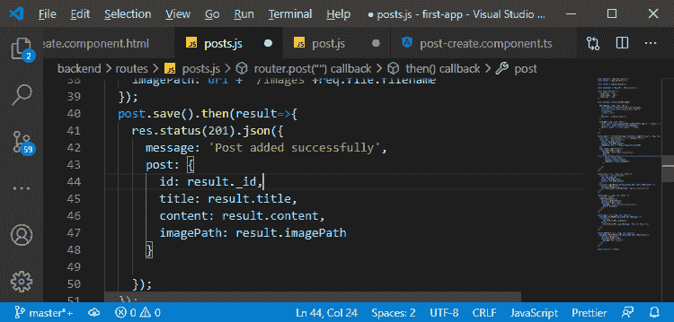

最简单的方法之一是使用下一代 [JavaScript](https://www.javatpoint.com/javascript-tutorial) 特性来创建一个新对象。然后，我们使用 spread 运算符复制另一个对象的所有属性，然后简单地添加或覆盖一些选定的属性，如下所示:

```

post: {
        ...result,
        id: result._id,
      }

```

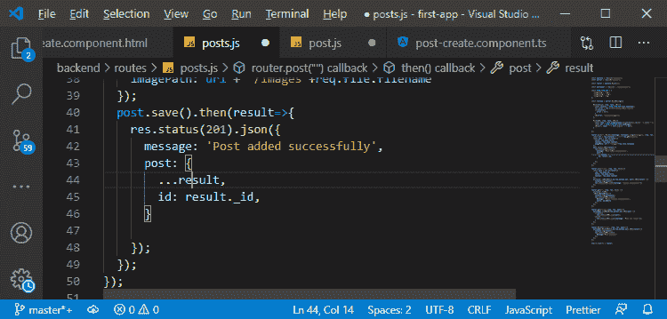

6)现在，我们将在 post.service.ts 文件中的客户端上使用它。我们将接触到 addpost()，这里我们得到的数据将是一个 Post 类型的 Post 属性。之后，我们提取帖子的 id、标题和内容，如下所示:

```

this.http.post(
        'http://localhost:3000/api/posts',
        postData
      )
    .subscribe((responseData)=>{
      const post: Post = {
        id:responseData.post.id, 
        title: title, 
        content: content
      };

```

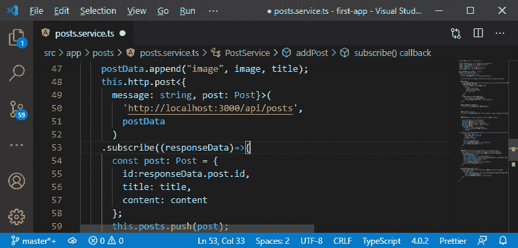

imagePath 是我们的前端模型没有反映的东西。因此，我们将转到 post.model.ts 文件，并将 imagePath 添加到这里，如下所示:

```

export interface Post{
  id: string;
  title: string;
  content: string;
  imagePath: string;
}

```

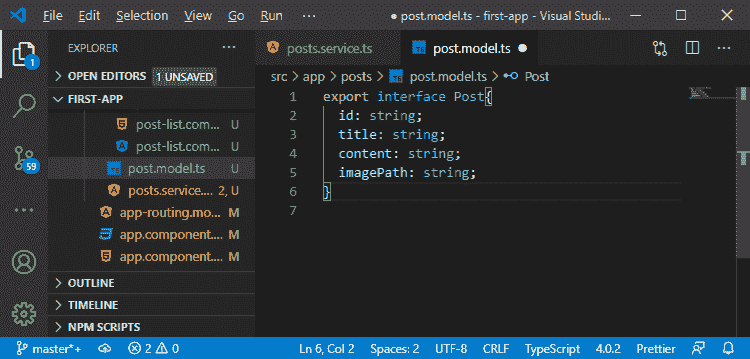

8)现在，当我们在 posts.service.ts 文件中创建新帖子时，我们必须使用它。在这里，我们将 imagePath 设置为 responseData.post.imagePath，如下所示:

```

imagePath: responseData.post.imagePath

```

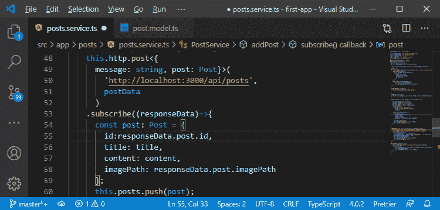

9)我们将在 updarePost()方法中得到一个错误，这里我们还没有 imagePath，所以我们现在将它设置为 null。

```

const post: Post = {id:id, title:title, content:content, imagePath: null};

```

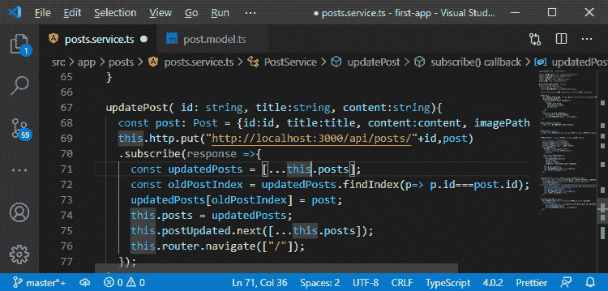

10)同样，我们也会在我们的后 create.component.ts 文件中得到一个错误。在这里，我们也将把 imagePath 属性设置为 null。

```

this.post = {
              id: postData._id,
              title: postData.title, 
              content: postData.content, 
              imagePath: null
},

```


现在，我们正在取回帖子信息，并使用它存储在新创建的帖子的前端。

11)现在，当我们访问我们的消息页面时收到帖子时，我们也会转换帖子。我们还将 imagePath 属性设置为:

```

imagePath: post.imagePath

```

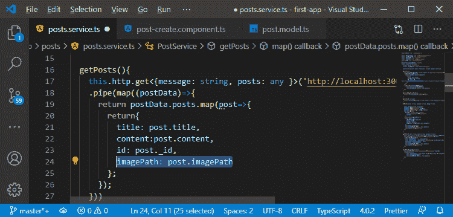

所以，现在我们也在前端添加了这个 imagePath，我们从后端返回数据。在下一节中，我们将确保在屏幕上或前端呈现此内容。

* * *