# 在平均值堆栈中添加角度上传功能

> 原文：<https://www.javatpoint.com/adding-upload-functionality-in-angular-in-mean-stack>

在我们前面的部分中，我们成功地在服务器上添加了上传功能，但是我们没有测试它，因为要测试我们的服务器端上传功能，我们需要在 angular 上添加上传功能。因此，在这一部分，我们将把上传功能添加到我们的前端或 angular。我们将使用以下步骤来做到这一点:

1)我们将返回到我们的 post . service . ts 文件，在这里，当我们添加帖子时，我们现在必须上传我们的文件。我们想发送一个请求，包括我们的正常数据和文件。之前，我们使用了 post 方法，并附加了 post，即 object，这将自动将其作为 [JSON](https://www.javatpoint.com/json-tutorial) 发送到后端。我们知道 JSON 不能包含文件，所以我们将发送表单数据，而不是发送 JSON 数据。我们将删除 post 类型的 Post 属性，而不是创建一个新的常量，即 postData。这个常数将是一个新的 FormData 对象。

```

const postData = new FormData();

```

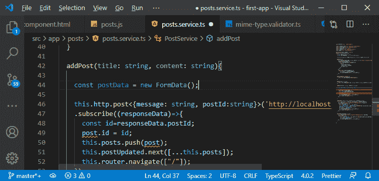

2)这是 [JavaScript](https://www.javatpoint.com/javascript-tutorial) 提供的一个对象，FormData 基本上是一种允许我们组合文本值和 blobs 或者文件值的数据格式。我们通过访问 postData 来使用它，并通过使用**追加()**向它追加字段。我们将使用 append()函数以以下方式添加标题和内容字段:

```

postData.append("title",title);
postData.append("content",content);

```

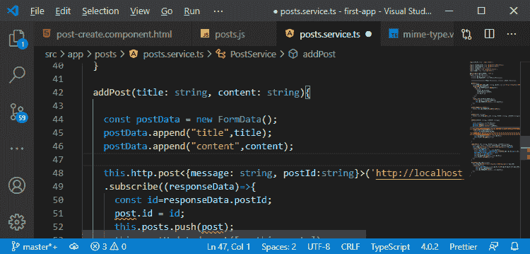

3)现在，我们需要追加我们的图像。我们将使用 append()函数，并给它取一个名字，即 image。这个“图像”是我们将尝试在后端访问的属性。为了传递图像，我们需要在 addPost()函数中添加一个额外的参数，即 File 类型的图像来获取我们的图像，并传递 append()函数，如下所示:

```

addPost(title: string, content: string, image: File){
postData.append("image", image);

```

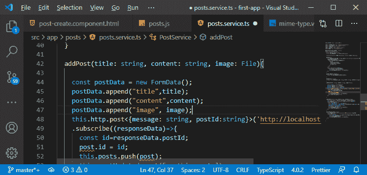

4)我们需要在这个 append()函数中传递一个额外的参数，这就是我们提供给后端的文件名。我们希望使用用户为文章输入的标题，并记住，这将是文件名的一部分，因为它保存在后端，所以它不是无关紧要的。

```

postData.append("image", image, title);

```

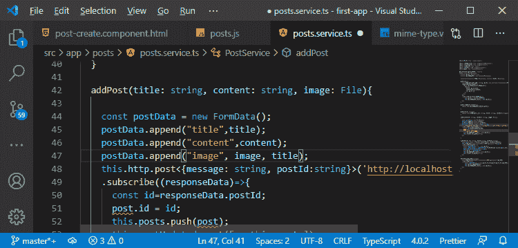

5)我们将简单地在 angular http 请求中传递 postData，angular 将自动设置正确的头，检测到我们得到了非 JSON 数据，angular [HTTP](https://www.javatpoint.com/computer-network-http) 客户端将处理所有这些。

```

this.http.post(
        'http://localhost:3000/api/posts',
        postData
)

```

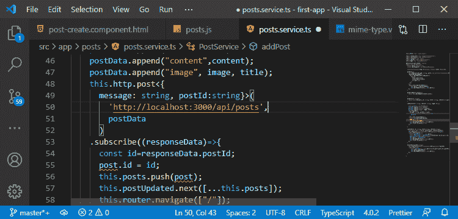

6)现在，在订阅上，我们需要确保我们仍然保存帖子。为此，我们将通过创建一个类型为 post 的新帖子属性来创建我们的帖子，并分配 id、标题和内容，如:

```

const post: Post = {id:responseData.postId, title: title, content: content};

```

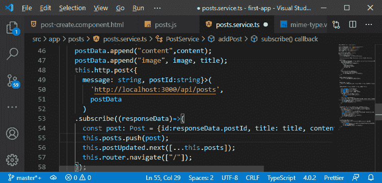

7)现在，这里缺少“this”，我们没有将图像传递给 addPost()方法。因此，我们将回到我们的后 create.component.ts，我们在那里调用这个函数。我们通过如下方式访问 this.form.value.image 来转发此内容:

```

this.postsService.addPost(
          this.form.value.title, 
          this.form.value.content,
          this.form.value.image 
);

```

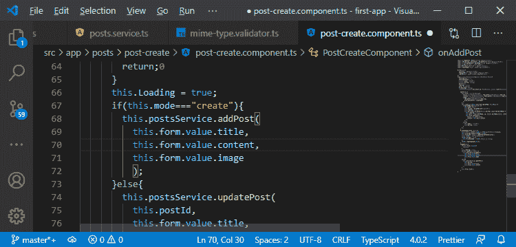

如果我们尝试上传文件并保存帖子，帖子将成功保存，但图像不会添加到 images 文件夹中。

8)在 **js** 文件中，通过改变将存储传递到 multer 函数的方式来保存这个问题。我们需要在 multer()函数中传递 JavaScript 对象。这个对象有一个存储属性，它应该得到我们这样的存储配置:

```

router.post("", multer({storage: storage}).single("image"), (req, res, next)=>{

```

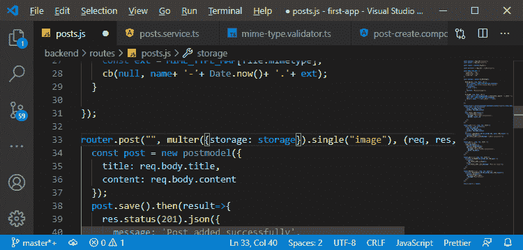

现在，我们将尝试上传文件并保存帖子。

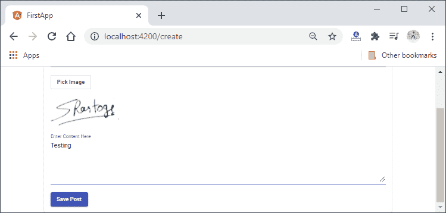
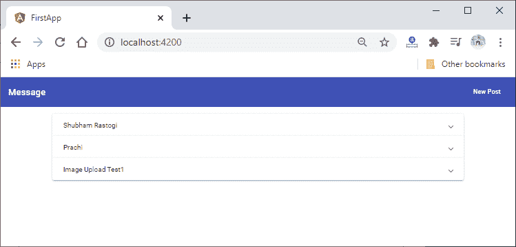
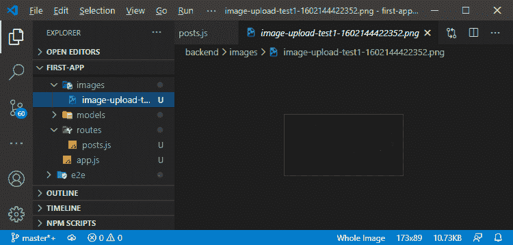

现在一切都很好，但是我们仍然缺少一些东西。我们没有告诉客户端这个存储在哪里，因为我们需要返回这个，我们还想检查我们是否能够上传无效的数据。

9)在我们的 post-create.component.ts 文件中，我们暂时禁用了前端验证，以提交我们忽略 mime 类型验证结果的任何文件。

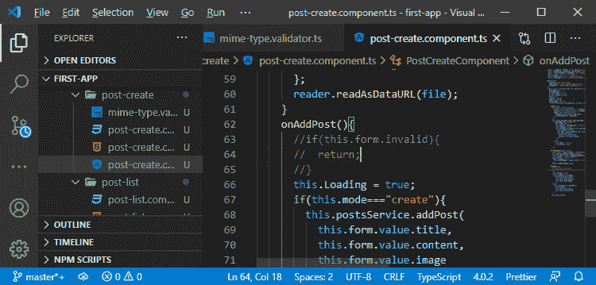

现在，如果我们保存这个，并在上传文件后尝试添加新帖子，我们将会得到一个大错误。

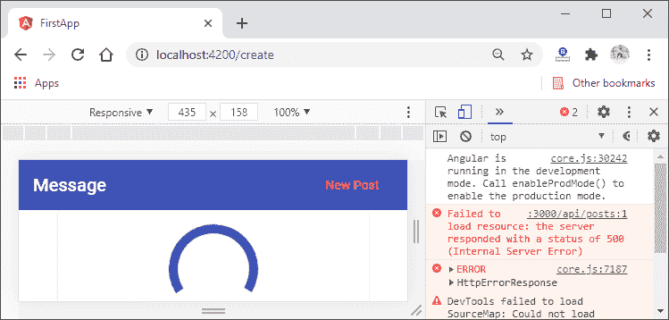
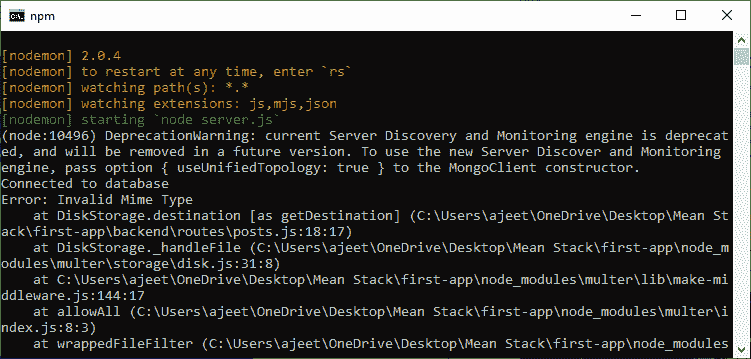

我们得到了无效的 mime 类型错误，因此验证工作正常。我们并没有在客户机上很好地处理这个错误，我们将在以后这样做。我们从前端验证中删除了注释，但这表明验证是在客户端的服务器上进行的，并且我们能够上传文件。

在下一节中，我们将确保我们也将该文件信息传递回客户端，以便我们可以使用它。

* * *