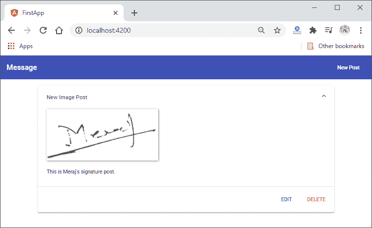

# 在 MEAN 栈的前端获取图像

> 原文：<https://www.javatpoint.com/fetching-image-on-frontend-in-mean-stack>

在前面的部分中，我们处理了文件 url，并且成功提取了 imagePath。现在，我们要显示图像路径所指示的图像。因此，在本节中，我们将学习如何在前端获取图像。我们将使用以下步骤在前端显示图像:

1)我们将返回到我们的 post-list.component.html 文件。这里，我们只输出标题，然后在帖子的扩展框中，只输出内容。现在，我们也想拥有自己的形象，我们可以随心所欲地设计。我们将在标题和内容之间添加一个 div，在这种情况下，我们将设置一个由您决定的类名。在这个 [div](https://www.javatpoint.com/html-div-tag) 中，我们有了自己的形象。我们将再次通过以下方式将 alt 标签绑定到 post.title，将 src 绑定到 post.imagePath:

```

<div class= "post-image">
      
    </div>

```


如果我们保存它并回到我们的角度，我们会得到一个错误，我们将在任何地方都看不到图像。


这不起作用，因为我们请求的图像路径无效。我们没有旧帖子的图片路径。我们将转到“网络”选项卡，检查我们从哪里获得帖子的请求。在响应的预览中，我们有我们的帖子数组，实际上在数据库中，图像路径丢失了。

图像路径没有保存，因为我们没有创建一个帖子，因为我们添加了该功能。因此，我们将删除所有帖子，添加一个新帖子，并检查图像。


2)错误仍然存在，因为我们无法获取该图像。原因是我们没有授权访问后端的 images 文件夹。默认情况下，我们所有的文件都是不可访问的。我们控制我们的路线，告诉什么可以访问。我们不允许在任何地方访问图像文件夹。为此，我们将转到我们的 app.js 文件，并在这里添加一些内容。

我们希望使图像文件夹可以静态访问，这意味着任何针对该文件夹的请求都应该被转发或允许继续。在我们的 bodyparser 中间件之后，我们调用另一个中间件。这个中间件将以如下方式编码:

```

const path = require("path");
app.use("/images", express.static(path.join("backend/images")));

```


这个中间件内置在一个 express 中。该中间件将应用于任何包含/image 的请求。如果是这种情况，我们想要添加的中间件是快递附带的，静态中间件。所以，我们用了快递。静态()。

**app.use("/images "，express.static())** 表示任何以/images 为目标的请求将被允许继续，并从那里获取它们的文件。但是， **app.use("/images "，express.static())** ，不会起作用，因为/images 实际上是不正确的。它隐藏在后端文件夹下。为了映射这一点，我们导入了一个随 [NodeJS](https://www.javatpoint.com/nodejs-tutorial) 一起发送的路径包，并使用 **path.join()** 方法构建了备份映像文件夹的路径。

现在，我们将保存所有文件，回到我们的角度，看到图像。


3)一切看起来都很好，我们可以看到图像。现在，我们将通过转到前端代码来修复样式。我们将按照以下方式为后期图像类编写 [CSS](https://www.javatpoint.com/css-tutorial) 代码:

```

.post-image{
  width: 100;
}

.post-image img{
  width: 100;
  box-shadow: 1px 1px 5px rgba(0,0,0,0.5);

}

```

现在，我们回到我们的 angular 应用程序来看看这些变化。



现在，我们从后端加载图像，由应用程序上传。在下一节中，我们将学习如何更新这些帖子。

**下载完整项目(图片上传. zip)**

* * *