# 用均值堆栈中的图像更新数据

> 原文：<https://www.javatpoint.com/updating-data-with-image-in-mean-stack>

在我们之前的部分，我们成功地上传了图像并返回到前端。现在，如果我们试图更新一篇文章，它会给我们一个错误，因为没有 imagePath。为了更新帖子，我们将使用以下步骤:

1)我们将返回到我们的后期创建组件的[类型脚本](https://www.javatpoint.com/typescript-tutorial)文件。在这里，我们没有任何地方可以编辑现有的图像。当我们创建新表单时，我们总是将 null 作为图像的起始值。当我们添加图像时，我们希望使用我们的 imagepath。因此，我们将按以下方式设置图像的值:

```

image: this.post.imagePath

```

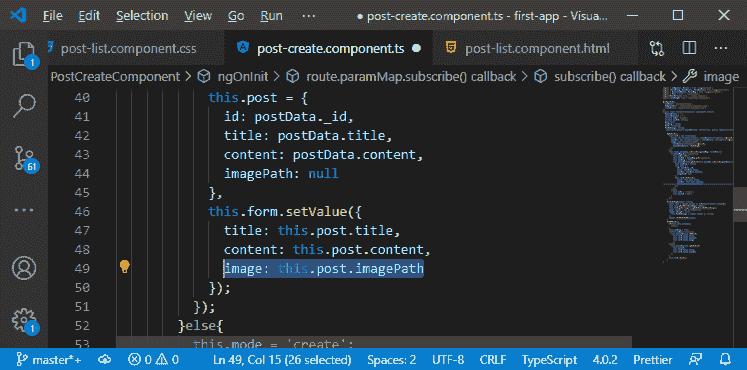

现在，如果我们提交这个，将执行 updatePost()方法。在这种方法中，我们必须区分两种情况，我们是否有“字符串图像”？因为如果我们得到一个“字符串图像”，我们只想发送一个 [JSON](https://www.javatpoint.com/json-tutorial) 请求，如果我们得到一个对象或者文件，我们想把这个作为表单数据上传。这将是 put 请求，但有效负载完全不同。

2)在 updatePost()方法中，我们期望该函数将获得我们的图像，因此我们需要将图像作为参数传递，该参数可以是 File 类型或字符串类型，如下所示:

```

updatePost( id: string, title:string, content:string, image: File|string)

```

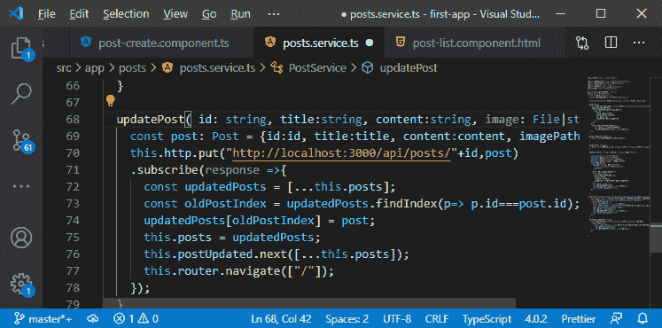

3)现在，我们将删除 post 常量并检查它是什么。在此之前，我们将返回到 post create 组件的 typescript 文件，并将图像传递给 updatePost 方法，如下所示:

```

this.postsService.updatePost(
          this.postId,
          this.form.value.title,
          this.form.value.content,
          this.form.value.image
);

```

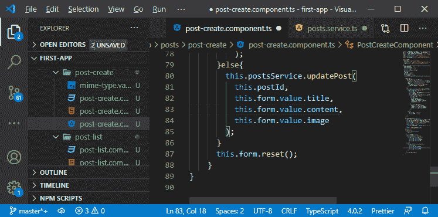

4)现在，我们将通过以下方式使用的**类型检查图像的类型:**

```

updatePost( id: string, title:string, content:string, image: File|string){
    if(typeof(image) == 'object'){

    }else{

    }

```

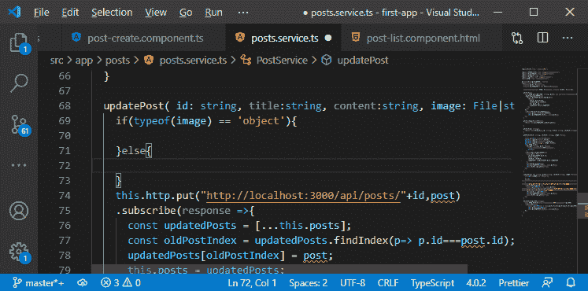

5)因此，如果我们有一个对象，我们将使用 FormData()对象创建新的 postData，并使用 append()函数以下列方式添加字段:

```

const postData = new FormData();
postData.append("title", title);
postData.append("content", content);
postData.append("image", image, title);

```

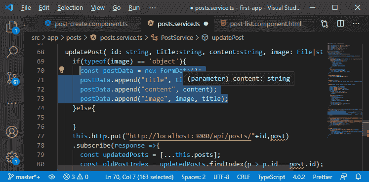

6)当我们的图像是字符串类型时，将执行 else 部分。我们将创建一个新的 postData 类型的 post，它只是一个 JavaScript 对象，其中我们有标题、内容、id 和 imagePath 属性，如下所示:

```

const postData: Post = {
        id: id,
        title: title,
        content: content,
        imagePath: image
      }

```

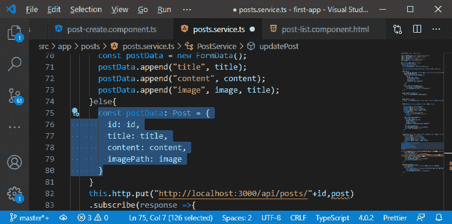

7)我们将把 postData 初始化为变量，而不是常数，这样 typescript 就可以理解为:

```

let postData: Post|FormData;

```

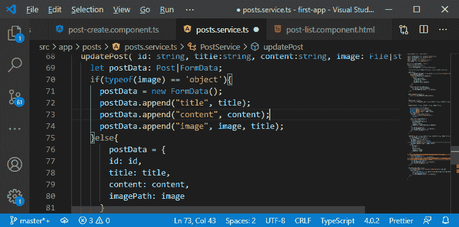

8)在 http 请求中，我们使用 postData 代替 post，对于 id，我们将简单地使用 id 而不是 post.id，并且我们想要存储为更新后的帖子的帖子将是我们必须创建的帖子。

```

this.http.put("http://localhost:3000/api/posts/"+id,postData)
    .subscribe(response =>{
      const updatedPosts = [...this.posts];
      const oldPostIndex = updatedPosts.findIndex(p=> p.id===id);
      const post: Post ={
        id: id,
        title: title,
        content: content,
        imagePath: response.imagePath
      }
      updatedPosts[oldPostIndex] = post;

```

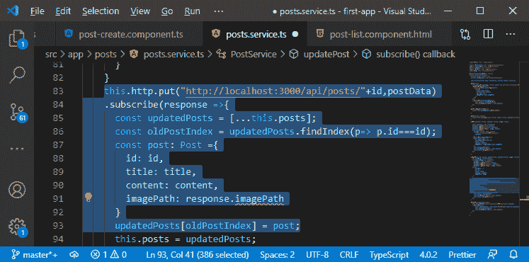

9)在上面的代码中，我们可以看到 imagePath 有一个错误。我们也需要在端点上做一些工作。因此，我们将返回到我们的**post . js**文件，并处理那个 put 端点。我们在 post 端点中使用了 multer，所以我们将简单地从这里复制逻辑，并将其添加到 put 端点，以在那里提取文件。

```

multer({storage: storage}).single("image"),

```

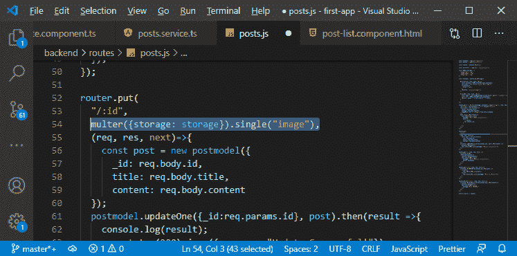

10)现在，在我们的函数中，我们想要存储我们上传的文件，但是现在这取决于我们是得到一个新文件还是仅仅得到一个字符串。首先，我们将回到我们的 mime 类型验证器，在它的开始，我们将添加一个检查。我们将检查**值**的类型。如果它是字符串类型，我们需要返回一个可观察的。我们将从 [rxjs](https://www.javatpoint.com/rxjs) 中导入的**，它们可以快速轻松地添加或创建一个可观察的对象，该对象将立即发出数据。这里，我们将简单地返回(null)如下:**

```

if(typeof(control.value)== 'string'){
    return of(null);
}

```

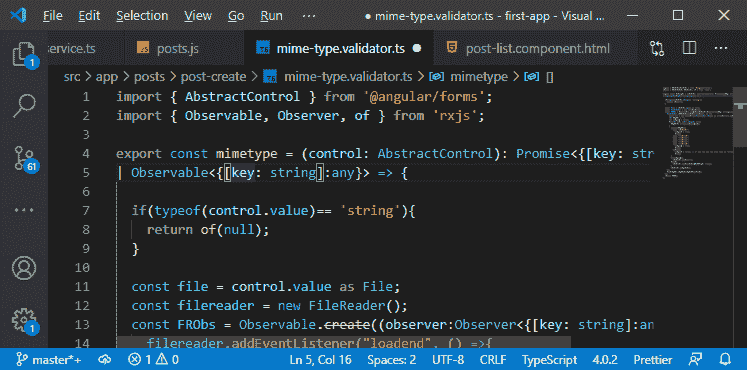

11)当我们在 ngOnInit 中初始化 post 时，我们会在服务中联系 getPost()。在 getPost()中，我们向给定帖子的网址发送了一个获取请求，但是我们没有获得图像路径。我们操纵 http get 请求，并期望 imagePath 是如下的字符串类型:

```

getPost(id: string){
    return this.http.get(
      "http://localhost:3000/api/posts/"+id);
}

```

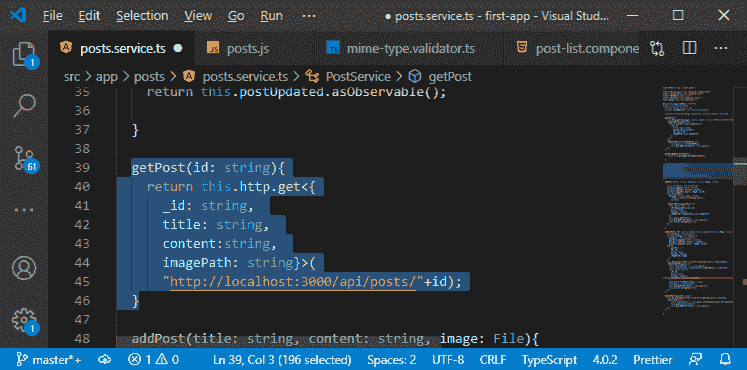

12)现在，我们将转到我们的 post.js 文件，在这里，在我们对该单个帖子的 get 请求中，我们需要进行一些更改，因为它将包含我们从数据库中获取的图像路径。因此，图像路径将是响应的一部分，但是我们随后在后期服务中返回它，并且我们没有在我们的后期创建组件中处理它。以前，我们将 imagePath 设置为空，因此我们将使用 postData.imagePath 进行更改，如下所示:

```

imagePath: postData.imagePath

```

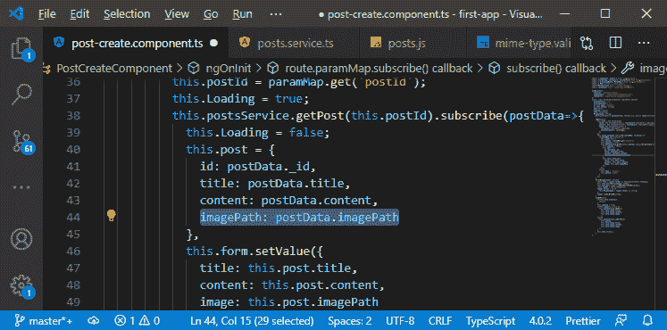

13)现在，我们回到我们的 post.js 文件，找到我们的 put 路线。在这个函数中，我们将检查 request.file。如果文件在那里，我们就知道上传了一个新的文件。因此，这里我们将使用我们在 post 路由中使用的逻辑，如下所示:

```

let imagePath;
    if(req.file){
      const url = req.protocol + '://'+ req.get("host");
      imagePath = url + "/images/"+req.file.filename
}

```

imagePath 的默认值将从正文中获取。

```

let imagePath = req.body.imagePath;

```

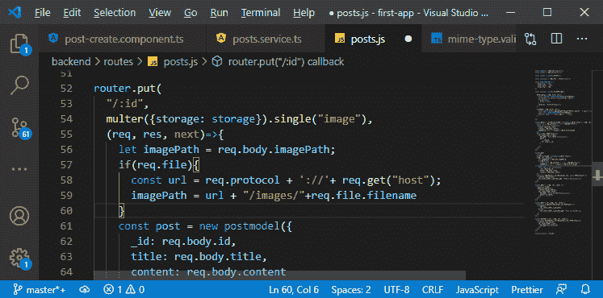

14)我们在创建新帖子时也使用了 imagePath，如下所示:

```

const post = new postmodel({
      _id: req.body.id,
      title: req.body.title,
      content: req.body.content,
      imagePath: imagePath
});

```

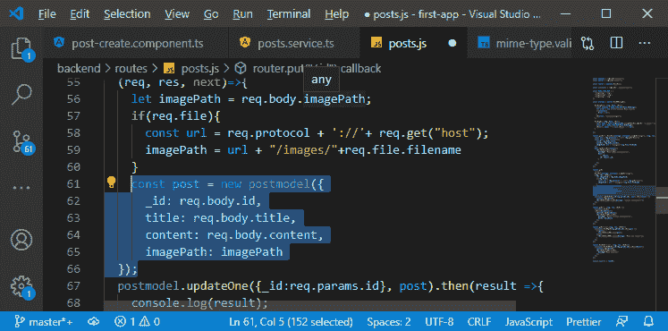

一切都结束了。我们现在将尝试通过选择一个新文件来编辑帖子，而不选择新文件。

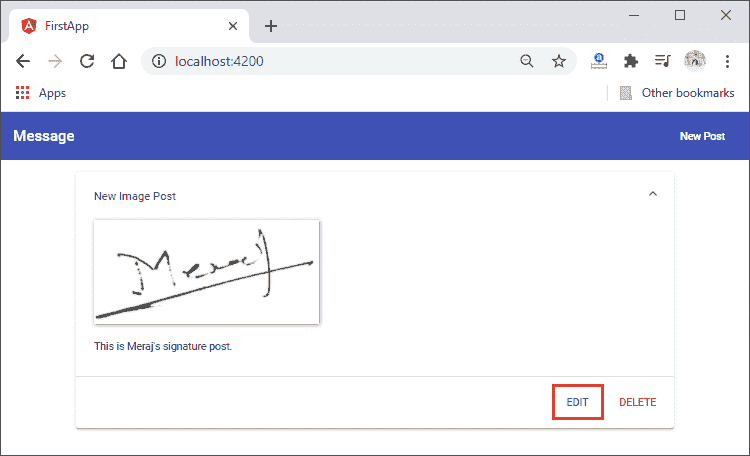
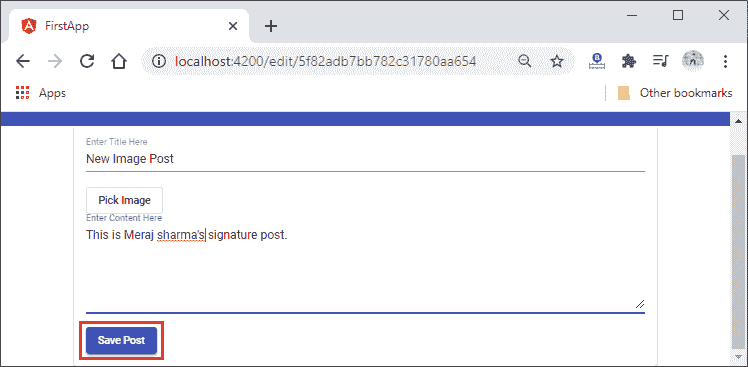
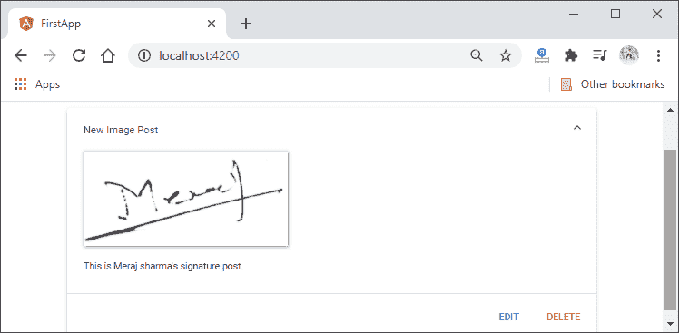

现在，我们将尝试通过选择一个新图像来更新这个新图像帖子。

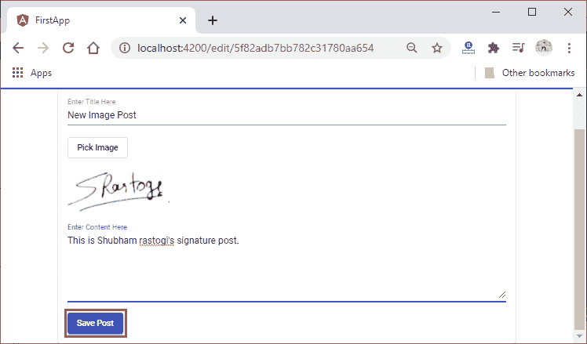

当我们点击保存帖子按钮时，我们将得到以下错误:

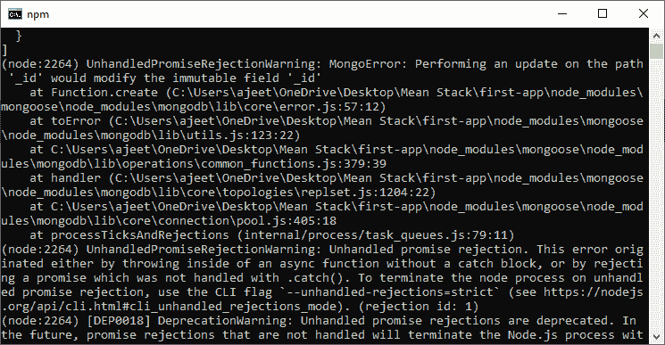

为了解决这个错误，我们需要回到我们的**post . service . ts**文件，在这里我们创建了 updatePost()方法。这里，我们还需要在我们的 postData 中附加 id。因此，我们将把 id 附加到 postData，保存所有文件，然后再次尝试更新帖子。

```

postData.append("id", id);

```

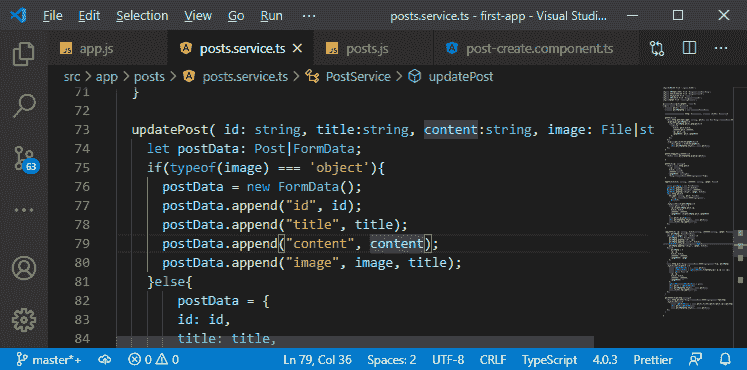

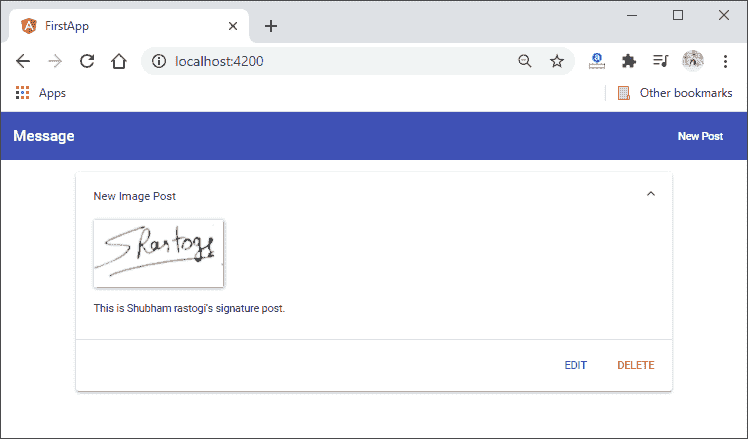

从下一节开始，我们将开始一个新模块。在本模块中，我们将学习分页及其概念。

**下载完整项目(用 image.zip 更新数据)**

* * *