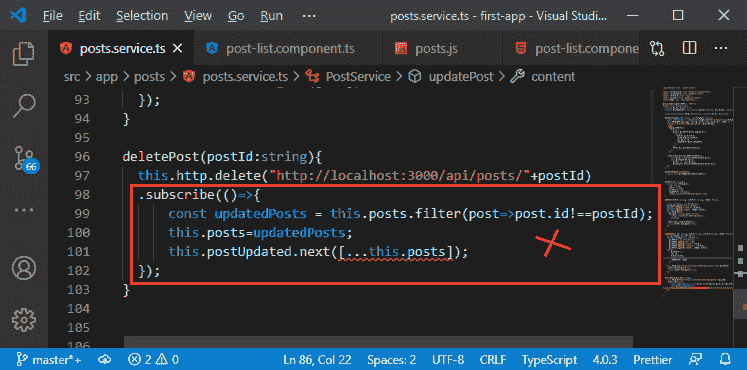

# 将角度分页器连接到平均值堆栈中的后端

> 原文：<https://www.javatpoint.com/connecting-angular-paginator-to-the-backend-in-mean-stack>

在前一节中，我们成功地实现了角分页器的后端代码。我们的后端代码运行良好，现在，在本节中，我们将学习如何将角分页器连接到之前创建的后端。我们将使用以下步骤来做到这一点:

1)我们将转到我们的 **service.ts** 文件中的 getPosts()方法。这里，在 http 请求中，我们需要将查询参数附加到 URL。我们在 **getPosts()** 方法中获得这些查询参数作为如下的参数:

```

getPosts(pagesize: number, currentpage: number){

}

```


2)我们现在将创建一个新的常量 **queryParams** ，并将其转换为一个带有两个倒勾(``)的模板表达式。这是一个特殊的 [JavaScript](https://www.javatpoint.com/javascript-tutorial) 特性，允许动态添加值到一个正常的字符串中。因此，在这两个倒勾之间，我们通过首先添加问号来创建我们的查询参数，问号将另一个[网址](https://www.javatpoint.com/url-full-form)从我们的查询参数中分离出来，然后是我们想要传递到后端的查询参数。我们将使用带有两个大括号的美元符号($)来使用这些参数，如下所示:

```

const queryParams = `?pagesize=${pagesize}&currentpage=${currentpage}`;

```


3)现在，我们将使用加号添加带有网址的查询参数，如下所示:

```

this.http.get
    ('http://localhost:3000/api/posts'+ queryParams)

```


现在，我们发送一个更新的请求。

4)现在，我们需要从我们的后列表组件中发送正确的数据。因此，我们将返回到我们的 post-list.component.ts 文件，在 getPost()方法调用中，我们将传递 postperpage 作为第一个参数，传递一个作为第二个参数，因为我们想从第 1 页开始。

```

this.postsService.getPosts(this.postperpage, 1);

```


现在，如果我们保存这个并返回到我们的 angular 应用程序，我们将在那里只看到两个帖子。


5)在 post-list.component.ts 文件中，我们将创建 currentpage 属性，并将 1 设置为默认值。现在，我们将使用 ngOnInit()中的当前页面，如下所示:

```

currentpage= 1;
this.postsService.getPosts(this.postperpage, this.currentpage);

```


6)现在，如果我们改变分页，我们需要重新获取帖子。因此，如果我们转到第二页，我们需要再次调用 getPosts()方法，但这一次我们需要用从页面数据中获得的值替换参数值。准确地说，我们将页面数据存储在组件的属性中。因此，我们将使用从页面数据中获得的值覆盖当前页面值，如下所示:

```

onChangedPage(pageData: PageEvent){
    this.currentpage = pageData.pageIndex+1;
    this.postsService.getPosts(this.postperpage, this.currentpage);
  }

```


在上面的代码中，我们将向 pageIndex 添加 1，因为这个索引从零开始，但是在我们的后端，我们使用 1、2 等等。

7)我们还需要用从页面数据中获取的值覆盖页面后值，如下所示:

```

this.postperpage = pageData.pageSize;

```


现在，我们将保存它，并返回到我们的应用程序，检查它是否正常工作:


它看起来不错，但是如果我们试图删除一篇文章，它会被删除，但是我们的分页不会被正确更新。

8)那么，让我们继续在前端实现分页。我们需要改进几件事，我们首先要改进的一件事是，每当我们改变页面时，我们都要显示一个微调器。我们将简单地将 Loading 属性设置为 true，因为我们之前已经创建了这个属性。

```

this.Loading = true;

```


9)现在，我们还想确保只有当我们显示手风琴时才会显示分页器，因为如果我们没有帖子，就没有理由显示分页器。不过，我们也想在加载时显示它，所以我们将把 **mat-accordion** 的 ngIf 子句复制到 **mat-paginator** 中。我们将删除“加载”条件，因为我们想一直显示它。

```

<mat-paginator [length]= "totalposts" [pageSize]= "postperpage"
[pageSizeOptions]= "pageSizeOption" (page)= "onChangedPage($event)" *ngIf = "posts.length > 0">
</mat-paginator>

```


现在，如果我们切换页面，我们会看到这样的微调器:


10)我们还想知道我们总共有多少个帖子。这是我们可以在后端找到的东西。所以，我们将回到我们的 **js** 文件，在那里我们获取所有的帖子，并找到我们的帖子数量。为此，我们将组合多个不同的查询。到目前为止，我们有一个查询，我们缩小了范围。我们还不想做出回应。相反，我们将返回另一个查询，它将被执行。我们将像这样返回**邮政模型计数()**:

```

return postmodel.count();

```


**postmodel.count()** 将只计算帖子并返回该数字。如果我们也在一个然后块中返回它，我们不需要用计数链然后块。它基本上会创造一个新的承诺，并自动听取其结果。

11)我们将使用**后查询**链接然后阻塞，并且我们可以在查询中添加多个然后阻塞。在该块中，我们将获得计数，然后创建如下响应:

```

postquery
  .then((documents)=>{
    return postmodel.count();
  }).then(count => {
    res.status(200).json({
      message: "Posts fetched successfully",
      posts: documents
    });
  });

```


所以，首先，我们获取所有的帖子，然后我们发出另一个查询，在那里我们得到计数。

12)我们不能在响应中使用文档，因为 documents 属性是在另一个 then 块中创建的。因此，我们首先将它存储到一个变量中，并在响应中使用它。在响应中，我们还将计数作为 JSON 数据返回，如

```

let documents;
postquery
  .then((documents)=>{
    this.documents= documents; 
    return postmodel.count();
  }).then(count => {
    res.status(200).json({
      message: "Posts fetched successfully",
      posts: documents,
      maxPosts: count
    });
  });

```


13)现在，我们将返回到我们的 **service.ts** 文件，并在这里使用它。在 getPosts()方法中，我们将更新我们的 http get 请求。我们不仅会得到消息和帖子属性，还会得到 maxPosts 属性。因此，我们将把它添加到 get 请求中，如下所示:

```

this.http.get
```


14)现在，我们必须调整转换帖子的逻辑。我们不只是想传递转换后的数组。相反，我们希望传递一个对象，该对象既包含更新后的帖子数组，其中所有帖子都有不带下划线的标识，也包含帖子的最大数量。因此，在地图中，我们将返回一个 [JavaScript 对象](https://www.javatpoint.com/javascript-objects)，它有一个 post 属性，但是除了 post 属性之外，它还有一个 maxPosts 属性，它只是从 postData 中获取数据。

```

.pipe(
      map(postData=>{
        return {
          posts: postData.posts.map(post=>{
            return{
              title: post.title,
              content:post.content,
              id: post._id,
              imagePath: post.imagePath
            };
          }), 
          maxPosts: postData.maxPosts
        };
      })
    )

```


15)现在，在 subscribe 方法中，我们不再获得 transformedPost，而是我们可以说的 thransformedPostsData，并且该对象将有一个保存 Post 的 post 属性。

```

.subscribe((transformedPostsData)=>{
        this.posts = transformedPostsData.posts;
        this.postUpdated.next([...this.posts]);
    });

```


16)该对象还将保存一些关于我们的最大帖子数量的信息，我们也想使用这些信息。在我们发出数据的地方，我们不再只想传递一个帖子数组，所以我们将更改主题的泛型类型，因为它现在应该是一个 JavaScript 对象，它有一个帖子属性，这是一个帖子数组。但是我们也希望有第二个属性，即计数，它是一个数字。

```

private postUpdated = new Subject();

```


17)为了让我们的主题产生更新后的数据，我们将进入下一个调用的地方，我们将传递一个保存帖子副本的 JavaScript 对象，它将有一个保存我们的 transformedPostsData.maxPosts 值的 postCount 属性。

```

.subscribe((transformedPostsData)=>{
        this.posts = transformedPostsData.posts;
        this.postUpdated.next({
          posts: [...this.posts], 
          postCount: transformedPostsData.maxPosts});
    });

```


18)我们得到一些错误，因为我们在我们的后期服务中得到其他部分，我们实际上试图将这个更新的帖子数组传递回我们的组件。现在，我们不需要使用这几行代码，我们已经在下面强调了这几行。


因为我们从另一个组件导航到我们的发布列表组件，我们保证重新加载那个发布列表组件。因此，无论如何，ngOnInit()都将执行并获取新帖子。


我们将在 updatePosts()方法中做同样的事情。


19)在删除帖子的情况下，就有点不一样了。我们从帖子列表中这样做，因此，我们实际上将删除我们刚刚看到的帖子。因此，我们肯定需要在这里重新获取数据，最优雅的方法是完全删除这里的 subscribe 方法，只需返回 [HTTP](https://www.javatpoint.com/http-tutorial) 调用，然后订阅 post list 组件。



```

deletePost(postId:string){
    return this.http.delete("http://localhost:3000/api/posts/"+postId);
  }

```


现在，在 post-list.component.ts 文件的 onDelete()方法中订阅如下:

```

onDelete(postId: string){
    this.postsService.deletePost(postId)
      .subscribe(()=>{
        this.postsService.getPosts(this.postperpage, this.currentpage);
      });
  }

```

一旦我们开始这个删除过程，我们还想显示加载微调器。因此，我们将把 Loading 属性设置为 true。

```

this.Loading = true;

```


20)我们在 ngOnInit()中也得到一个错误，我们确实订阅了我们的主题，在这里，我们仍然在等待数据，这是一个帖子的数组。但是因为我们刚刚更新了主题。我们现在得到一个 JavaScript 对象，它有一个 post 属性和一个 postCount 属性。因此，在 post-list 组件中，我们将参数重命名为 postData，因为这现在看起来更合适，类型将是一个 JavaScript 对象，它具有 post 属性和 postCount 属性，如下所示:

```

subscribe((postData:{posts: Post[], postCount:number})=>{

```

为了存储数据，我们将像这样使用 postData。

```

this.posts = postData.posts;

```


21)现在，我们将使用邮政账号，为此，我们拥有 totalposts 属性。我们最初将此属性设置为 0，然后将其设置为邮政帐户，如下所示:

```

totalposts= 0;
this.totalposts = postData.postCount;

```


现在，一切都好了；让我们转到我们的 angular app，尝试删除帖子。


所以，一切都很顺利。我们将在下一节开始一个新模块。我们将向我们的项目添加用户身份验证。

**下载完整项目(将 angular 连接到后端)**

* * *