# 在平 MEAN 栈中添加登录输入字段

> 原文：<https://www.javatpoint.com/adding-login-input-fields-in-mean-stack>

在前面的模块中，我们在项目中成功实现了**分页**，并且已经构建了一个不错的应用程序。但是这里缺了一点，那就是**认证**。现在，我们没有用户，匿名用户创建我们的帖子。这意味着任何人都可以创建帖子、删除帖子和更新帖子。我们现在将限制访问，并确保每个人都可以阅读帖子，但不是每个人都可以创建或删除它们。只有帖子的创建者才能删除它们。我们将一步一步地进行，因此首先，我们将创建一个用于注册和登录的身份验证表单。我们将使用以下步骤在应用程序中添加注册和登录表单:

1)我们将在 app 文件夹中创建新文件夹，并将其命名为身份验证。在该文件夹中，我们将执行所有与身份验证相关的操作。

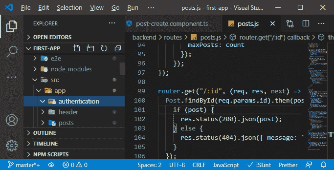

2)在这个**认证**文件夹中，我们会创建两个子文件夹，即注册和登录。在登录文件夹中，我们将创建[TypeScript](https://www.javatpoint.com/typescript-tutorial)、 [HTML](https://www.javatpoint.com/html-tutorial) 和 [CSS](https://www.javatpoint.com/css-tutorial) 文件。

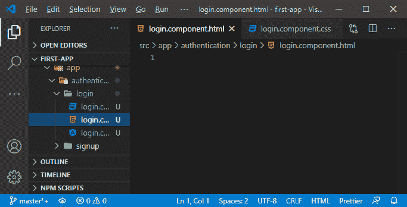

3)我们将像之前创建的那样导出一个类名 logincomponent，并通过添加 **@Component()** 将这个类变成一个组件，我们将通过路由加载这个组件，所以我们不需要向这个组件添加选择器。我们需要添加的是模板 URL，如下所示:

```

import { Component } from '@angular/core';

@Component({
  templateUrl: './login.component.html'
})
export class logincomponent{

}

```

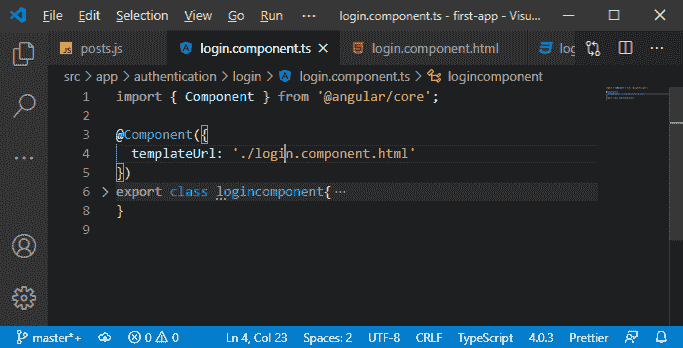

4)为了使用它，我们将注册它，我们将通过转到我们的**模块. ts** 文件来完成。在这个文件中，我们将这样声明 logincomponent:

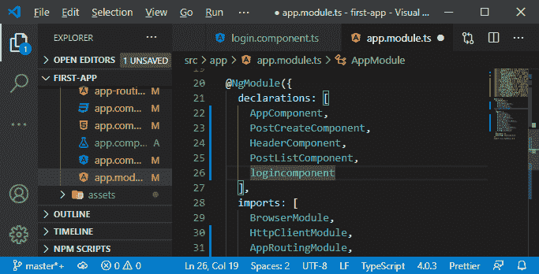

5)现在，我们将创建一个模板或登录表单。我们将创建一个带有电子邮件字段和密码字段的登录表单。我们将从**post-list.component.html**文件中复制代码，并将代码粘贴到**component.html**文件中。我们将对此代码进行一些更改，以使此表单对登录有效。


我们将对代码进行以下更改:

一、我们将旋转器留在<ma-card>中，因为我们想要有那张卡片的外观，我们也想要在登录用户时显示一个旋转器。</ma-card>

二.我们将删除 formGroup，因为我们将回到使用模板驱动的方法。我们将更改我们的提交侦听器，所以我们现在将删除调用函数。

```

<form (submit) = ""  *ngIf = "!Loading">

```

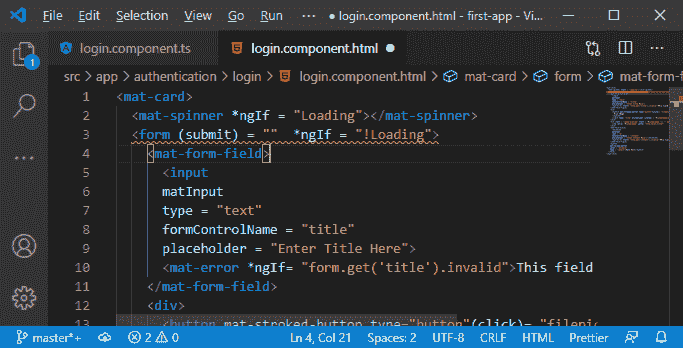

三.**垫形场**可以，**日场**可以，但是类型不行。我们将设置类型为**电子邮件**。我们将删除**表单控件名称**，因为我们不会使用反应式表单方法。**占位符**值将是电子邮件标识，而不是“输入文章标题”。

```

<mat-form-field>
      <input
      matInput
      type = "email"
      placeholder = "Email Id">

```

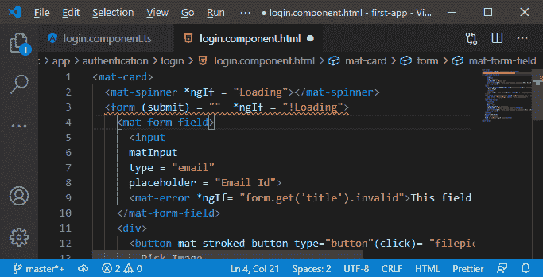

四.错误应该是“请输入有效的电子邮件 id”，在这种情况下，条件将被更改，这将在稍后设置。

```

<mat-error *ngIf= "">Please enter a valid emnail id</mat-error>

```

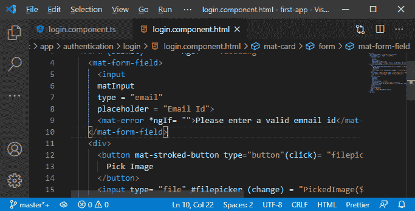

动词 （verb 的缩写）我们将删除按钮的 div，图像上传预览和第二个 mat-form 字段，我们将保留它。但是我们将删除 textarea，而不是这个，我们将添加一个输入字段，它是密码类型的，因为我们想要隐藏字符。我们将添加 mat-input 指令，将其转换为由 Angular 材质处理的输入。我们还将添加一个占位符，这是一个密码，因为它也将作为一个标签。

```

<input type="password" matInput placeholder="Password">

```


不及物动词现在，在 mat-error 字段中，需要重新访问 ngIf，所以我们将在稍后进行。我们将在 <mat-error></mat-error> 标签之间设置的错误将是**“请输入有效密码”**。在按钮中，按钮标题将替换为**登录。**

```

<mat-form-field>
      <input type="password" matInput placeholder="Password">
      <mat-error *ngIf= "">Please enter a valid password</mat-error>
    </mat-form-field>
    <button
    mat-raised-button
    color = "primary"
    type = "submit">Login</button>
  </form>

```

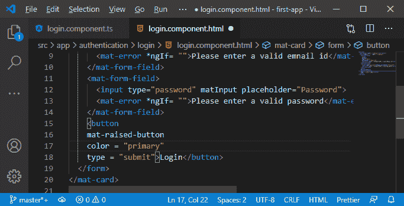

6)现在，我们将致力于功能。我们将返回到我们的**组件文件，并为我们的微调器添加功能。在此之前，我们将通过在 **app.module.ts** 文件中添加 FormsModule 来提供模板驱动的方法。**

```

import {ReactiveFormsModule, FormsModule} from '@angular/forms';

```

7)现在，我们想通过路由加载它。因此，我们将转到我们的 app-routing.module.ts 文件，在那里，我们将添加一个新路径。当我们访问/登录时，应该加载路径，我们希望在那里加载我们的 logincomponent。

```

{path:'/login',component:logincomponent}

```

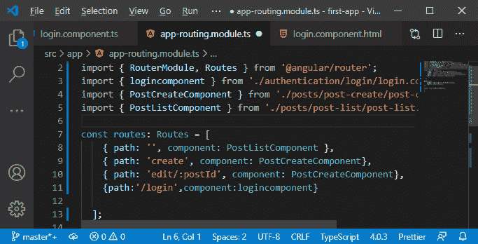

8)设置好了，我们进入**/登录**的时候应该可以访问这个，但是手动打字不是我们想要做的。因此，我们将转到标题组件，简单地添加一个新链接或一个带有锚标签的新列表项，该标签有一个 mat-button 指令，然后我们转到 **/login，**，标题将是 login:

```

<li>
      <a mat-button routerLink = "login" 
      routerLinkActive = "mat-accent"> Login</a>
    </li>

```

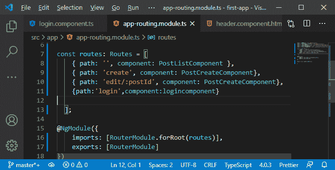

9)现在，我们将确保这些链接在标题组件中对齐，我们将转到**组件. css** 文件并为此编写 css 代码。

```

ul{
  display: flex;
}

```

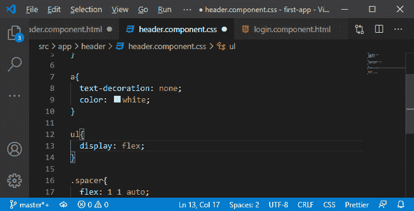

如果我们回到我们的 angular app，我们会看到新帖子旁边的登录按钮。

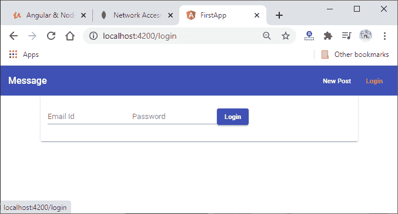

10)我们需要改变表单的样式。因此，我们将创建**组件. css** 文件，这里，我们将为我们的 mat-form-field 编写 css 代码。

```

mat-form-field{
  width: 100%;
}

mat-spinner{
  margin: auto;
}

```

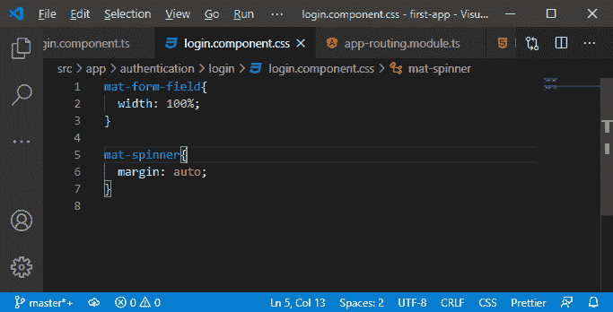

11)我们将返回到我们的 **component.ts** 文件，在这里，我们将通过添加样式 URL 来包含新添加的样式文件。

```

styleUrls: ['./login.component.css']

```

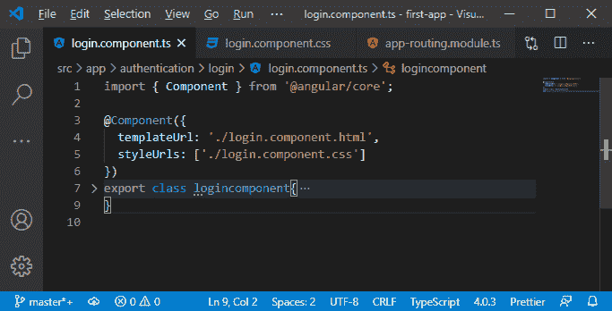

现在，如果我们回到我们的 angular app，我们的登录表单看起来会好得多。

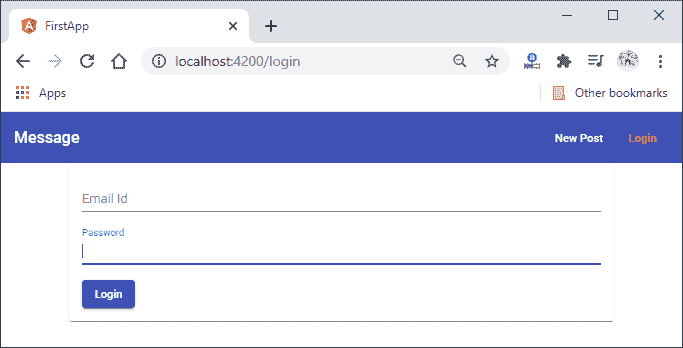

现在，我们的登录表单已经设计好了，但是它还没有做任何事情，因为我们没有处理用户输入。我们将在下一节稍后进行。

* * *