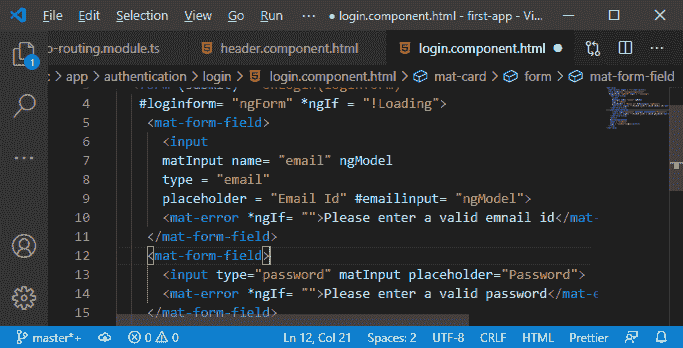

# 在均值堆栈中处理用户输入

> 原文：<https://www.javatpoint.com/handling-user-input-in-mean-stack>

在前面的部分，我们成功地实现了我们的登录表单。以前，我们的表单没有做任何事情，因为我们没有在那里处理用户输入。因此，在本节中，我们将实现表单的功能并处理用户输入。我们将使用以下步骤来处理用户输入:

1)在我们实现表单的 login.component.html 文件中，我们仍然监听提交事件并调用 onlogin()方法。但是在那里，我们需要手动提交对由 angular 管理的表单对象的引用。我们将通过添加本地引用并将其设置为 ngForm 来实现这一点，然后我们将登录表单传递给 onlogin()方法，如下所示:

```

<form (submit)= "onLogin(loginform)" #loginform= "ngForm" *ngIf = "!Loading">

```


2)我们还想给我们的输入添加本地引用，比如电子邮件输入，这样我们就可以在 ngIf 中使用这些。我们需要给引用赋值，这就是 ngModel。我们首先需要在输入中添加一个名称属性和一个 ngModel。

```

<input
      matInput name= "email" ngModel
      type = "email"
      placeholder = "Email Id" #emailinput= "ngModel">

```



3)现在，输入可以获得对 angular 控制的底层对象的访问，我们可以使用 ngIf 检查电子邮件输入是否有效。如果无效，将显示错误。我们还将向输入中添加所需的电子邮件验证器。

```

<mat-form-field>
      <input
      matInput name= "email" ngModel
      type = "email"
      placeholder = "Email Id" #emailInput= "ngModel"
      required email>
      <mat-error *ngIf= "emailInput.invalid">Please enter a valid emnail id</mat-error>
    </mat-form-field>

```


4)同样，我们将为密码输入字段做所有的事情。我们使用引用来检查密码是否有效。

```

<mat-form-field>
      <input type="password" name= "password"
      matInput placeholder="Password"
      #passwordInput= "ngModel" required>
      <mat-error *ngIf= "passwordInput.invalid">Please enter a valid password</mat-error>
    </mat-form-field>

```


现在，如果我们回到我们的 angular app，验证器将被附加，如果我们输入类似测试的东西，它将显示**请输入有效的电子邮件**错误。


5)现在，我们将在 **component.ts** 文件中创建 onlogin()方法，这里我们将获取 form 对象作为参数，它的类型是 NgForm。在这个方法中，我们将简单地对表单值进行 console.log，以确保一切正常。

```

onlogin(form: NgForm){
    console.log(form.value);
  }

```


现在，我们保存这个，回到我们的 angular 应用程序。如果我们尝试提交表单，我们将在控制台上获得这些值。


* * *