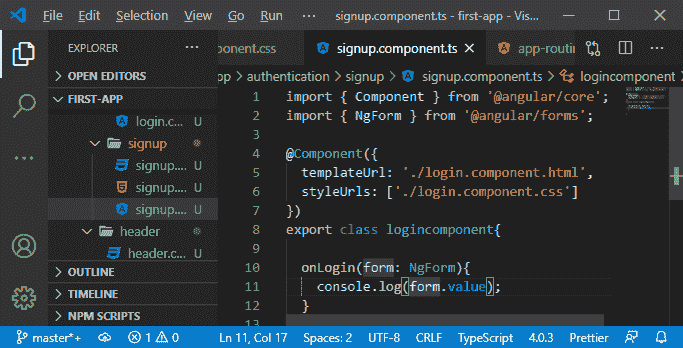
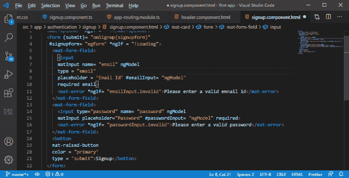
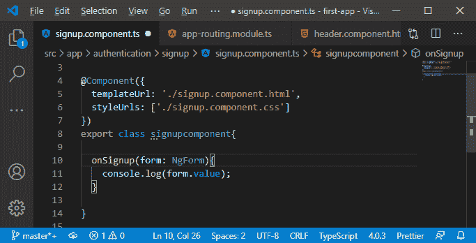
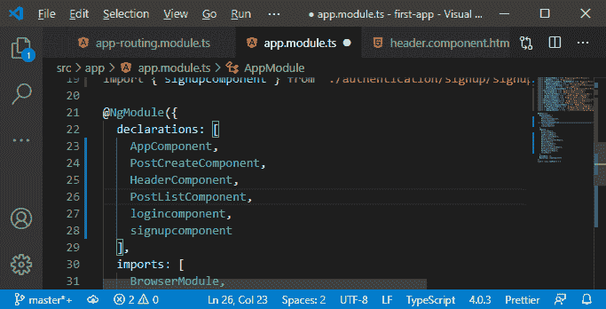
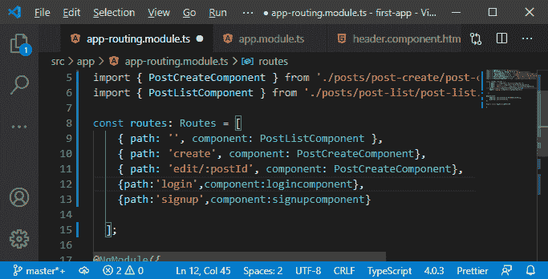
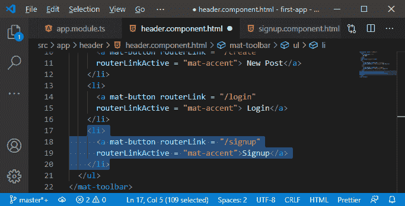
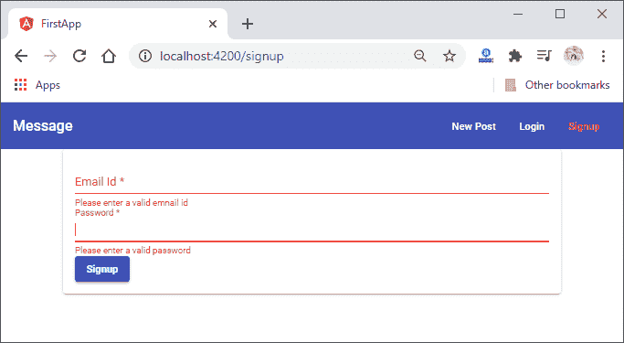

# 在MEAN 栈中添加注册表单

> 原文：<https://www.javatpoint.com/adding-signup-form-in-mean-stack>

在前一节中，我们设计了处理用户输入的登录表单。我们有我们的登录表单，现在，我们需要添加或设计我们的注册表单。我们使用以下步骤来添加或设计注册页面:

1)我们的注册表单看起来很像登录表单。因此，在我们的注册文件夹中，我们将粘贴所有三个登录文件并重命名它们。

2)在 the signup.component.ts 文件中，我们将用 signupForm 重命名本地引用，用 onSignup()重命名调用函数名，用“registration”重命名按钮的标题。

3)我们将返回到我们的 typescript 文件，在那里我们将使用注册组件重命名类名。我们还将在这里更改方法名称，因为此时它将是 onSignup。我们将更改 templateUrl 和 styleUrls，因为这里我们要加载注册组件的 html 和 CSS 文件。

4)我们将返回到我们的**模块。ts** 文件来注册注册组件。我们将以注册登录组件的相同方式注册注册组件。

5)我们将转到我们的 **app-routing.module.ts** 文件，并为我们的注册组件注册一个路由，就像我们为登录组件所做的那样。

6)现在，我们需要更新标题，这样我们就有了一个指向注册组件的链接。我们将在这里复制列表项，转到/注册，并用注册替换标题。

现在，如果我们回到我们的 angular 应用程序，我们将看到注册按钮和表单。

我们有我们的登录和注册表单，现在我们需要为这个和那个创建后端，我们将创建允许我们这样做的路线。我们还将使用 Mongoose 处理新用户，并将他们存储在数据库中。我们将在下一节稍后做所有这些事情。

* * *