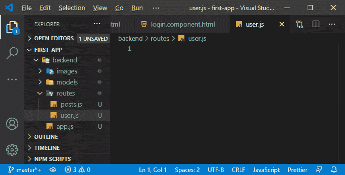
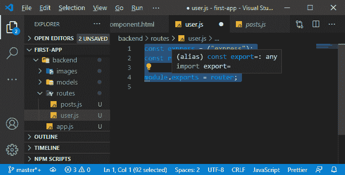
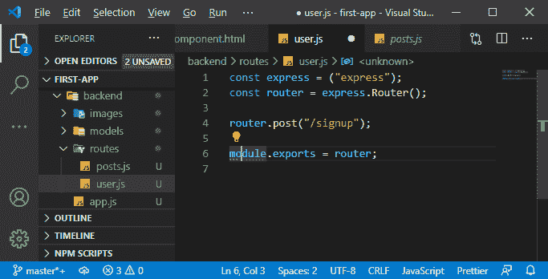
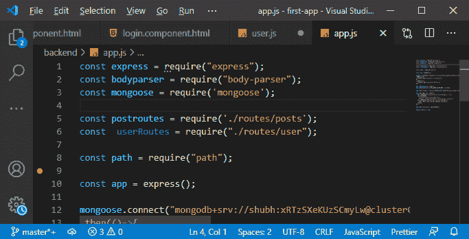
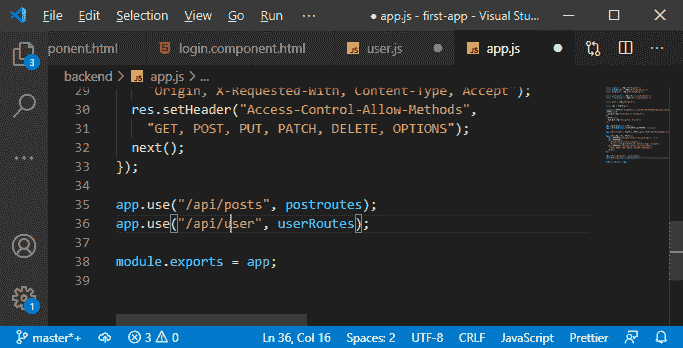
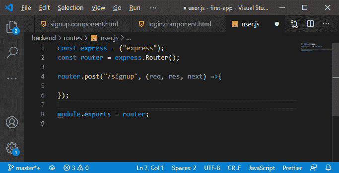
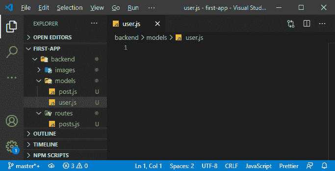
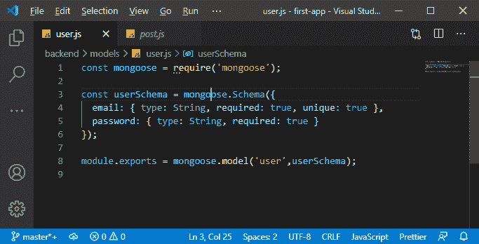
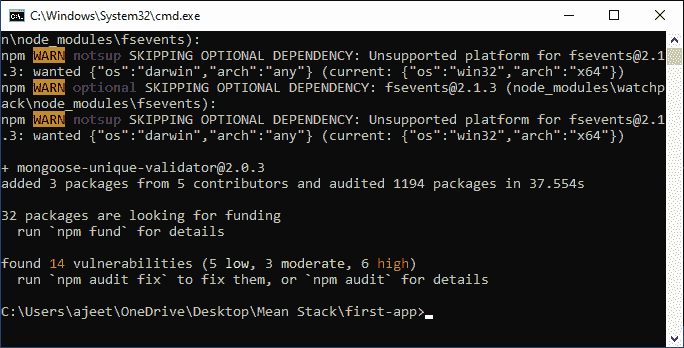
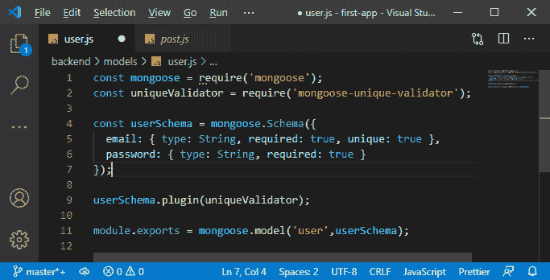

# 在平均栈中为登录和注册创建后端路由和用户模型

> 原文：<https://www.javatpoint.com/creating-backend-routes-and-user-model-for-login-and-signup-in-mean-stack>

我们前面的部分成功地设计了登录和注册页面，但是我们没有为它们都实现后端。因此，在本节中，我们将实现创建用户或登录用户的后端。下面是我们将用来创建后端的步骤。

1)我们在路由文件夹中有我们的帖子的 **js** 文件。因此，我们将为我们的用户创建另一个 [javascript](https://www.javatpoint.com/javascript-tutorial) 文件，并将其命名为 **user.js** 。



2)我们将导入我们的 express，并以与我们在 **js** 文件中实现的相同方式创建路由器。创建路由器后，我们还将在代码的最底部导出如下内容:

```

const express = ("express");
const router = express.Router();

module.exports = router;

```



3)现在，我们将注册路线，我们希望现在有两条路线，或者准确地说是两条邮政路线。我们的第一条发布路线将处理所有去往**API/用户/注册**的请求。

```

router.post("/signup");

```



在我们的帖子路由中，我们只通过了“**/注册”**，为了确保前面有 **api/user** ，我们将转到 app.js 文件，在那里我们导入了我们的帖子路由，并实现了我们的用户路由，如下所示:

```

 const  userRoutes = require("./routes/user");

```



4)我们将进入 **js** 文件的底部，在那里我们设置我们的 post routes，并将针对**/API/post/某物**的请求转发到 post 路线。我们将对目标为**API/用户/某物**的请求执行相同的操作，并将它们转发给用户路由:

```

app.use("/api/user", userRoutes);

```



因此，路径以/api/user 开头的任何请求都将进入我们的 **user.js** 文件，然后有/注册的任何请求都将到达这条路径。

5)b)在我们的 user.js 文件的 post 路由中，我们将拥有众所周知的带有请求、响应和 next 的函数，在这里我们可以处理传入的请求。

```

router.post("/signup", (req, res, next) =>{

});

```



6)在这个函数中，我们希望创建一个新用户，并将其存储在数据库中。为此，我们需要一个新的[猫鼬](https://www.javatpoint.com/adding-mongoose-in-mean-stack)模型，因为我们现在得到了一种新的数据类型。因此，在 models 文件夹中，我们将创建一个新的 javascript 文件，并将其命名为 **js。**



7)在这个文件中，我们将导入我们的猫鼬，并为此创建一个新的模式。我们将创建一个模式名**用户模式**。在我们的模式中，我们将有一封字符串类型的电子邮件和一个密码，也是字符串类型的。在代码的底部，我们将导出我们的猫鼬模型，这样我们就可以使用它。

```

const mongoose = require('mongoose');

const userSchema = mongoose.Schema({
  email: { type: String, required: true, unique: true },
  password: { type: String, required: true }
});

module.exports = mongoose.model('user',userSchema);

```



在上面的代码中，我们使用了**唯一的**。它不充当验证器，这意味着如果我们试图添加一个已经存在的电子邮件地址的新条目，它不会自动抛出错误。它最终会导致问题，但是当我们试图保存它时，我们不能依赖这种验证数据。Unique 允许 mongoose 和 mongodb 从性能角度进行一些内部优化。与必需的不同，它不是用来验证输入的，如果我们不提供电子邮件，它会抛出一个错误。

8)现在，我们希望确保不会两次保存用户数据或同一用户 id 的用户。为此，有一个第三方包，即 mongose-unique-validator，它将为我们添加这个验证逻辑。我们将运行以下命令来安装此软件包:

```

npm install --save mongoose-unique-validator

```



9)不过，我们不会自动添加；我们必须将它连接到我们想要验证的模式。为此，我们需要导入**猫鼬唯一验证器**包，然后我们将它用作插件，如下所示:

```

const uniqueValidator = require('mongoose-unique-validator');
userSchema.plugin(uniqueValidator);

```



我们的猫鼬模型是为我们的用户设计的，现在每当我们收到发送到我们新路线的请求时，我们都会保存我们的用户。我们将在下一节中这样做。

* * *