# 连接角度登录和注册形式与后端在MEAN 栈

> 原文：<https://www.javatpoint.com/connecting-angular-login-and-signup-form-with-backend-in-mean-stack>

在前面的部分中，我们根据请求成功地创建了用户。现在，我们需要将我们的[角形](https://www.javatpoint.com/angularjs-forms)与后端路线连接起来。我们将使用以下步骤将表单与后端连接起来:

1)我们将回到我们的注册组件，现在我们想向后端发送一个创建新用户的请求。为此，我们将在 auth 文件夹中创建一个单独的 **service.ts** 文件。

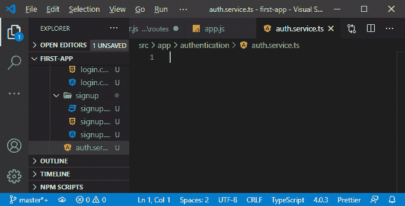

2)在这个文件中，我们将导出一个类，即 **AuthService，**，在此之前，我们将添加**@可注射的**，这是我们必须从 [angular](https://www.javatpoint.com/angularjs-tutorial) 包中导入的。在这个@ Injectable 中，我们将把中的**providen 设置为 true，就像我们在 **service.ts** 文件中所做的那样。**

```

import { Injectable } from '@angular/core';

@Injectable({providedIn: "root"})
export class AuthService{

}

```

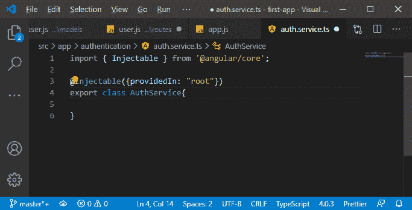

3)在 AuthService 类中，我们将创建一个新的方法，即 **CreateUser** 。这个方法将接受一封电子邮件，它将是一个字符串和一个密码，也将是一个字符串。

```

CreateUser(email: string, password: string){

}

```

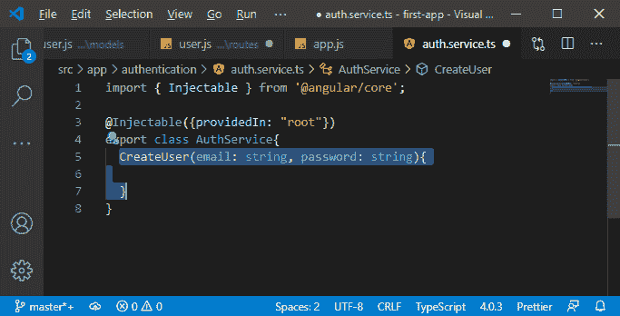

4)在这种方法中，我们将发送一个 [HTTP](https://www.javatpoint.com/computer-network-http) 请求，为此，我们需要使用客户端注入我们的 HTTP 客户端，就像我们对帖子所做的那样。

```

import { HttpClient } from "@angular/common/http";
constructor(private http: HttpClient){}

```

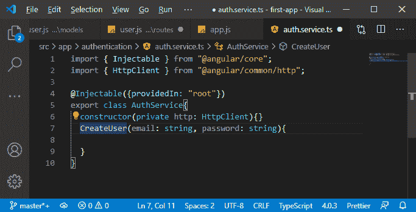

5)我们成功注入了 [http](https://www.javatpoint.com/http) 客户端，现在在 CreateUser()方法中，我们将发送请求。我们将使用 http 客户端发送一个发布请求，因为我们在后端接受发布请求。

```

this.http.post("http://localhost:3000/api/user/signup");

```

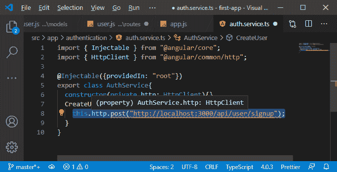

6)我们还需要向该请求添加一些数据。为此，我们将创建一个新模型，因此我们将创建一个新文件 **auth-data.model.ts**

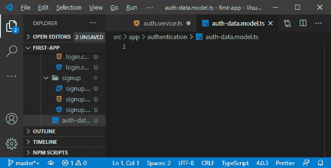

7)在这个文件中，我们将导出一个接口来定义我们的身份验证数据应该是什么样子。我们将这个界面命名为**身份验证数据，**，我们的身份验证数据将是一封电子邮件，类型为字符串和密码，也将是字符串。

```

export interface AuthData{
    email: string;
    password: string;
}

```

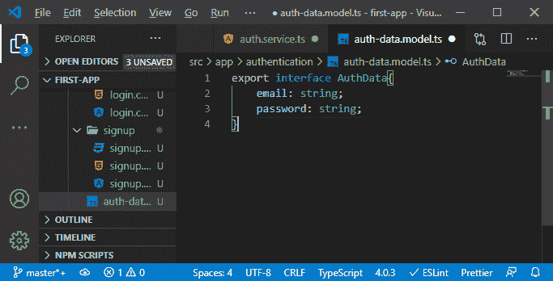

我们也可以创建一个用户模型，但是用户不应该在前端一直附加密码。我们不想在前端的任何地方存储密码太久。因此，我们将使用该身份验证数据向后端提交数据，如果我们以后需要一个用户，我们将添加一个单独的模型。

8)对于身份验证服务，我们现在可以基于该身份验证数据模型创建一个新对象。因此，我们将创建一个新的常量，AuthData，它将是 authData 类型，并创建一个新的对象，该对象需要有一个电子邮件和密码。现在，我们将身份验证数据附加到请求中。

```

const authData: AuthData = {email: email, password: password}
this.http.post("http://localhost:3000/api/user/signup",authData);

```

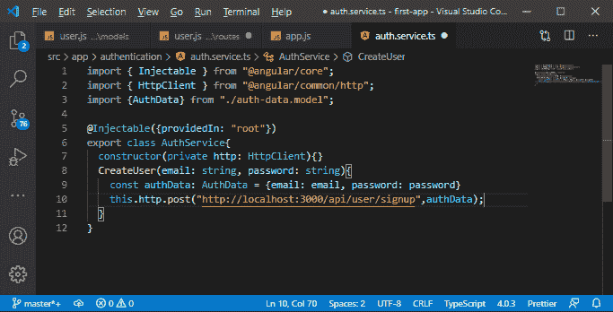

9)现在，我们也将回到结果或响应。我们将通过以下方式发回响应:

```

.subscribe(response =>{
        console.log(response);
    })

```

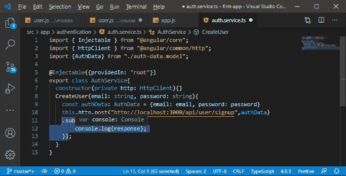

10)现在，最后一件事是将身份验证服务连接到我们的注册组件。我们已经在根级别提供了它，所以剩下要做的就是在这里注入它。我们将向注册组件添加构造函数，将其绑定到 AuthService 类型的公共属性 authService。

```

import {AuthService} from "../auth.service";
  constructor(public authService: AuthService){}

```

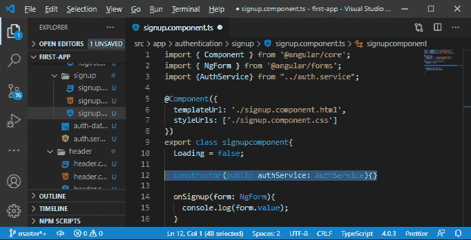

11)现在，在 onSignup()方法中，我们将发送该请求。首先，我们要确保我们得到了电子邮件和密码，所以如果表单无效，我们会简单地写下返回语句；否则，我们将运行 authService 类的 CreateUser()方法，并将电子邮件和密码值传递给如下函数:

```

onSignup(form: NgForm){
    if(form.invalid){
      return;
    }
    this.authService.CreateUser(form.value.email, form.value.password);
  }

```

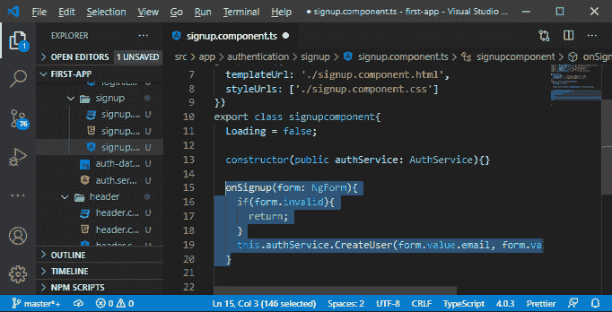

现在，我们将保存所有文件并返回到我们的 angular 应用程序。如果我们尝试注册用户，我们将在控制台中看到电子邮件和哈希密码。

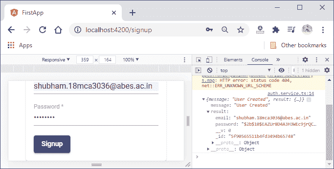

一切都很顺利。现在，我们有了一种创建新用户的方法，下一步是利用这一点，能够让用户登录并创建帖子，另一方面，我们希望确保他们不能删除不是由该用户创建的帖子。我们将在下一部分做所有的事情。

* * *